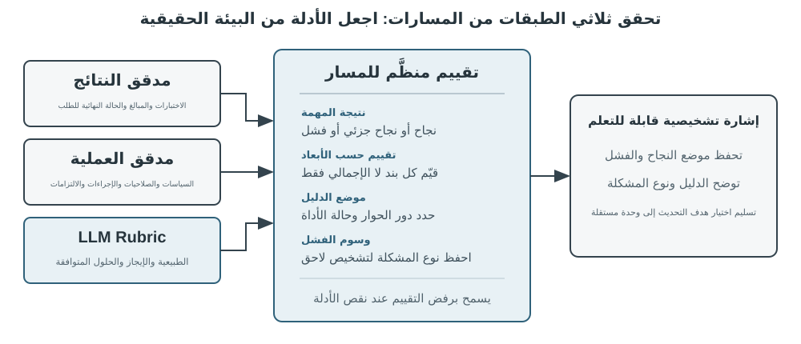
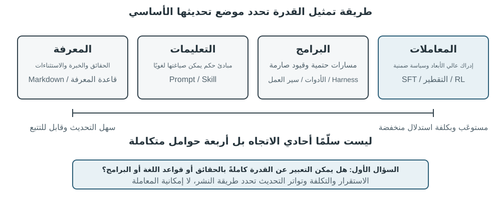

# تعدد الوسائط والتفاعل الآني

بحثت الفصول السابقة في عمل الوكلاء داخل عالم نصي، وتفاعلهم مع الأنظمة الرقمية عبر السياق والأدوات والشفرة. لكن عالم الوكيل أوسع من النص وواجهات API؛ فعندما يحتاج إلى فهم أمر منطوق، أو العثور على الزر الصحيح في الشاشة والنقر عليه، أو توجيه ذراع روبوتية لالتقاط جسم، يدخل مجالًا جديدًا هو **التفاعل الآني متعدد الوسائط**. والانتقال من مدخلات نصية ومخرجات نصية إلى **إدراك متعدد الوسائط واستجابة آنية** هو الخطوة التي تخرج الوكيل من حدود مربع الحوار. ويعني تعدد الوسائط هنا التعامل مع النص والكلام والصور والفيديو والأفعال معًا، لا مع النص وحده.

لنحدد أولًا نطاق الفصل. فقد أصبح فهم الصور الثابتة والوثائق، كفحص لقطة شاشة أو قراءة مخطط أو تحليل PDF، جزءًا عاديًا من سير عمل الوكيل. وهذه المهام ذات المدخل الواحد ناضجة نسبيًا في النماذج متعددة الوسائط ولا تحتاج إلى بنية خاصة. أما هذا الفصل فيتناول ثلاثة سيناريوهات تجعلها **قيود الزمن الحقيقي** أصعب بكثير: الحوار الصوتي، وتشغيل الواجهات الرسومية، والتحكم في الروبوت. ففيها تتدفق المدخلات باستمرار، ويجب أن تستوفي المخرجات مهلة زمنية صارمة، مما يغير البنية من أساسها. ولا يزال الفهم الآني لتدفقات الفيديو مشكلة مفتوحة للوكلاء وقت كتابة هذا الكتاب. أما **توليد الوسائط**، كالصور والفيديو، فيعامله الكتاب بوصفه استدعاءً عاديًا لأداة خارجية، ولذلك يبقى خارج محور الفصل.

قد تبدو المحادثة الصوتية واستخدام الحاسوب وتشغيل الروبوت مجالات متباعدة، لكنها تواجه مشكلة مشتركة: معالجة عدة وسائط في وقت واحد مع حساسية شديدة لزمن الاستجابة. فتوقف يتجاوز ثانيتين في حوار صوتي يربك المتحدث، واضطراب لا يتجاوز أجزاء من الألف من الثانية في التحكم الروبوتي قد يسبب تصادمًا. وتدفع هذه القيود السيناريوهات الثلاثة بعيدًا عن **خط المعالجة المتسلسل**، الذي لا تبدأ فيه خطوة حتى تنتهي سابقتها، ونحو **النموذج المتكامل** الذي ينتقل مباشرة من المدخل إلى المخرج ويقلل عمليات التسليم الوسيطة.

ويأتي هذا الفصل على السطور التالية:
1. **النماذج الثلاثة لبنية الصوت**: المسار المتسلسل (VAD → ASR → LLM → TTS)، والنموذج المتكامل متعدد الوسائط (Omnimodal / Omni)، والنموذج ثنائي الاتجاه التفاعلي (Full-Duplex). ونقارن زمن الاستجابة والمفاضلات المعمارية لكل منها بدراسة مدى تجاوز كل نموذج لافتراض الأدوار المنفصلة.
2. **التوافق بين سرعة التفاعل والتفكير العميق**: موازاة المسارين السريع والبطيء، والنموذج المنفصل حيث يعمل نموذج التفكير الخلفي كاستراتيجي (مثل GPT-Live وPine AI)، وصولاً إلى التفكير المستبطن في النموذج الواحد (مثل Step-Audio R1).
3. **تحسين تركيب الكلام الطبيعي**: الارتقاء بطبقة التنفيذ لتوليد نبرة صوتية وظيفية تحاكي البشر.
4. **الامتداد إلى استخدام الحاسوب والروبوتات**: توسيع المنظور ليشمل تشغيل الواجهات الرسومية (GUI Computer Use) والتحكم الروبوتي، مع إبراز قيود الاستجابة الفعلية وتعدد الوسائط عبر هذه السيناريوهات.
هناك موضوعان نظريان آخران يحملان هذه السيناريوهات ويستحقان اهتمامًا خاصًا: **بنية التفكير** (مدى تعاون التفكير السريع والبطيء) و**الواجهة السريعة والبطيئة** التي تتبعها (**الجسر الكامن** — ما يمكن للنماذج السريعة والبطيئة أن تتبادله إلى جانب النص). وعلى الرغم من تقديمها في سياق الصوت، إلا أن هذه الأفكار لا تقتصر عليه. يواجه قسما استخدام الكمبيوتر والروبوتات نفس السؤال حول متى يجب استشارة خبير استراتيجي بطيء، لذا ضع كلا الموضوعين في الاعتبار.

## الصوت: الواجهة الأكثر طبيعية بين الإنسان والآلة

الصوت ليس نصًا تحوّل إلى صوت فحسب. فسرعة الكلام تقارب أربعة أضعاف سرعة الكتابة، كما أنه يترك اليدين والعينين حرتين؛ لذلك يضع الوكيل في حلقة إدخال وإخراج مستمرة يمكن للمستخدم مقاطعتها في أي لحظة. يحوّل الإملاء الكلام إلى نص، أما وكيل الصوت فيتيح التعاون معه مباشرة، وكلاهما يدعم أسلوب «البرمجة بالهمس» الذي عُرض سابقًا.

يغطي هذا القسم اتجاهين: أن يتحدث المستخدم إلى الوكيل، وأن يتحدث الوكيل إلى العالم الخارجي نيابةً عن المستخدم. يحدد نموذج الصوت ما يستطيع الوكيل الإجابة عنه، بينما تحدد بنية التفاعل قدرته على السماع بوضوح، والرد في الوقت المناسب، وتسليم الدور طبيعيًا، وإتمام التأكيدات واستدعاءات الأدوات أثناء المكالمة.

### توقيت التفاعل: من التسلسل إلى الازدواج الكامل

تصف مقدمة GPT-Live من OpenAI ثلاثة نماذج للتفاعل الصوتي: التسلسلي، والقائم على الأدوار، والازدواج الكامل[^ch9-12]. ليست هذه مراحل تستبدل إحداها الأخرى ببساطة؛ فهي مقايضات مختلفة بين زمن الاستجابة والكلفة وقابلية المراقبة:

| النموذج | البنية الأساسية | الميزة الرئيسية | القيد الرئيسي |
| --- | --- | --- | --- |
| التسلسلي | VAD → ASR → LLM → TTS | وحدات واضحة يسهل استبدالها وتصحيحها | تتراكم الاستجابة وتضيع الإشارات غير اللفظية عند الحدود |
| Omni من طرف إلى طرف | نموذج واحد يسمع ويفكر ويتكلم | استجابة أسرع وحفظ أفضل للنبرة والعاطفة والصوت المحيط | لا يزال قائمًا على الأدوار؛ التدريب والتصحيح أعلى كلفة |
| الازدواج الكامل | يستمع ويتكلم ويقرر باستمرار | تداخل الكلام والمقاطعة الطبيعية وتدفق مستمر | التدريب والتحكم والتقييم أكثر تعقيدًا |

الخيط المشترك هو التخلص من افتراض أن الناس يتحدثون واحدًا بعد الآخر، ومن تخمين VAD لمن يملك الدور. ما زالت الأنظمة التسلسلية وOmni تقسم التفاعل إلى أدوار، أما الازدواج الكامل فيجعل امتلاك الدور قرارًا مستمرًا للنموذج.

[^ch9-12]: OpenAI، *Introducing GPT-Live*، 2026-07-08. https://openai.com/index/introducing-gpt-live/ يأتي تصنيف التسلسلي/القائم على الأدوار/الازدواج الكامل من ملخص المقال للأجيال الثلاثة من ChatGPT Voice؛ ويقابل مصطلح «Omni متعدد الوسائط من طرف إلى طرف» فئة «نماذج الصوت القائمة على الأدوار».

### النموذج الأول · خط أنابيب تسلسلي

لا تزال معظم المساعدات الصوتية التجارية تستخدم خطًا تسلسليًا (الشكل 9-1): يقرر VAD انتهاء كلام المستخدم، ويحوّل ASR الصوت إلى نص، ويفهم LLM الطلب وينشئ الرد، ثم ينطقه TTS. تتيح الوحدات المستقلة تحسين كل جزء، لكن كل حدّ يضيف وقت انتظار.


| الوحدة | الدور | عنق الزجاجة المعتاد |
| --- | --- | --- |
| VAD | تحديد انتهاء الكلام | عتبة الصمت تؤخر الرد وقد تقطع الدور خطأً |
| ASR | تحويل الصوت إلى نص | زمن التعرف وفقدان السياق |
| LLM | الفهم والاستدلال والتوليد | زمن أول رمز؛ والاستدلال يضيف انتظارًا |
| TTS | تحويل النص إلى كلام | توليد الحزمة الأولى وتخزين التشغيل المؤقت |

في رد قصير بلا استدلال تتراكم أزمنة انتظار VAD وASR وLLM وTTS (الشكل 9-2)، وتختلف القيم الفعلية باختلاف طول الإدخال والنموذج والعتاد والشبكة والحمل. ويزيد انتظار الطوابير في الإنتاج من الخمول (الشكل 9-3).





> **التجربة 9-1 ★: بناء وكيل صوتي تقليدي**
>
> صِل الميكروفون وSilero VAD وWhisper محليًا ونموذج LLM متدفقًا وFish S1 TTS عبر WebSocket لبناء خط أساس تسلسلي. يثبت الدليل الحقيقي لجولة واحدة أن سلسلة الوسائط والنماذج عملت من البداية إلى النهاية، لكنه ليس معيارًا للتزامن أو حمل الإنتاج. يوجد الكود وسجل القبول في [chapter9/live-audio](../chapter9/live-audio/).

> **إضافة: بناء وكيل صوتي عبر WebRTC «يتصل بالمستخدم»**
>
> لا يحتاج وكيل الهاتف إلى PSTN. يستطيع WebRTC في المتصفح إعادة إنتاج حلقة فتح الجلسة، وطلب المعلومات الناقصة، وتكرارها للتأكيد، وحفظ النتيجة المنظمة. وعند ضرورة الاتصال بمؤسسة خارجية يُستبدل عقد الأداة نفسه بمزوّد PSTN/SIP ملتزم. المسار الإعلامي الكامل ومقارنة Direct/ReAct وأدلة القبول في [chapter9/phone-agent](../chapter9/phone-agent/). تحتفظ التجربة بمعرّفات التشغيل التاريخية \`exp9-2\`، لكنها لم تعد تجربة مرقمة في المخطوط.

#### من التسلسل إلى الإدراك المتدفق

يمكن لـASR المتدفق إصدار نص مؤقت أثناء كلام المستخدم، ويمكن لـLLM إرسال أول جملة قابلة للنطق إلى TTS، ويمكن لـTTS إعادة كتل صوتية تتداخل مع التوليد والتشغيل. لا يجعل ذلك المراحل متوازية بالكامل: إذا تغير النص الجزئي وجب إلغاء التوليد أو إعادة تشغيله أو تصحيحه، ولا يكفي تفعيل خيار \`stream\` وحده.

ولا يزيل التدفق العادي انتظار صمت VAD. فواجهة VAD + ASR تعاني من ثلاثة عيوب: تراكم زمن الانتظار حتى تأكيد النهاية، فقدان التردد والعاطفة والردود القصيرة والصوت المحيط، وانقسام الأسماء وعناوين البريد بين المقاطع. يحتاج النموذج المتدفق الحقيقي إلى مُرمّز سببي أو مقطّع وفك ترميز تزايدي؛ أما Whisper فمُرمّزه يتوقع مقطعًا صوتيًا كاملًا، لذلك لا ينبغي تسميته نموذجًا سببيًا متدفقًا. يستطيع نموذج صوتي مبني على LLM إصدار النص وأحداثًا دلالية من الصوت المستمر، لكن محاكاة المقاطع لا تضمن أداء نموذج سببي.

يمكن أن تتضمن السلسلة علامات \`speak_start/end\` و\`interrupt\` لحدود الكلام والمقاطعة، و\`emotion\` للعاطفة والتردد، و\`laugh\` و\`sigh\` و\`noise\` للأصوات غير اللفظية والبيئية. هكذا لا تُضغط كل الإشارات الصوتية في نص عادي.

[^ch9-11]: لتشخيص دمج قرار الدور في المتعرّف ومشكلة الملصقات التي تستخدم معلومات لاحقة، انظر Bojie Li وNoah Shi، *The Trade-off Was in the Labels: Causal Supervision for Turn-Aware Streaming ASR*، 2026 (قيد النشر).

> **التجربة 9-2 ★: محاكاة الإدراك الصوتي المتدفق باستخدام Qwen2-Audio**
>
> Qwen2-Audio ليس نموذجًا متدفقًا بحد ذاته. تحاكي التجربة الإدراك المستمر ببادئات صوتية متزايدة وتقارنه مع VAD بزمن 600 مللي ثانية وWhisper. اجتاز التشغيل المرجعي بوابات التنفيذ وإثبات المصدر لكنه أعاد سلوكين فقط من أصل 6؛ استغرقت الاستدعاءات 8.4–11.3 ثانية، وفاتت عينة التوقف \`silence\`، وصنّفت عينة الضجيج \`cough/laughter\` خطأً. هذه نتيجة سلبية لاختبار الآلية، وليست دليلًا على إدراك متدفق حقيقي بزمن 100–200 مللي ثانية. السجل الكامل في [chapter9/streaming-speech](../chapter9/streaming-speech/).

### النموذج الثاني · نماذج Omni متعددة الوسائط من طرف إلى طرف

حتى مع الإدراك المتدفق، تمرر السلسلة السماع والتفكير والكلام عبر واجهات منفصلة، وقد تضيع العاطفة والتنغيم والصوت المحيط عند تحويل الصوت إلى نص. يستمع Omni ويولد الرد وينطقه بنموذج واحد، مع كلفة تدريب وتصحيح واستبدال أعلى (الشكل 9-4). ميزته الأساسية هي زمن الاستجابة وحفظ المعلومات غير النصية، لا دقة أعلى بالضرورة: قد تصحح السلسلة الذاتية خطأً إدراكيًا عندما يكفي النص، لكنها تفقد الدليل نهائيًا إذا اعتمدت الإجابة على سرعة الكلام أو عاطفته أو البيئة[^ch9-13].

لا يزال Omni يفترض تبادل الأدوار ويستخدم VAD أو تحديد النهاية الدلالي. لذلك يمكن أن تُفسر وقفة قصيرة في سلسلة أرقام على أنها نهاية الكلام؛ يحسن الإدراك المتدفق الحكم لكنه لا يلغي الأدوار.

[^ch9-13]: لقياس متى تنعكس أفضلية الدقة بين السلسلة والطرف إلى الطرف، انظر Li, Bojie وNoah Shi، *The Cascade Gap: When and Why Self-Cascades Help Multimodal Agents*، 2026 (قيد النشر).


تقع واجهات الصوت الآنية بين السلسلة وOmni: يتعامل النموذج مع الصوت مباشرة، لكن التحكم بالتفاعل ما زال يعتمد على VAD والمقاطعة واستدعاءات الأدوات غير المتزامنة. تُظهر مسارات Qwen3-Omni Thinker-Talker وMiniCPM-o المحلية إمكان الجمع بين التفكير والتعبير والإدخال متعدد الوسائط؛ المقارنة المفيدة هي اختلاف حالات الفشل حسب المهمة، لا جدول ترتيب.

> **التجربة 9-3 ★★: تشغيل MiniCPM-o 4.5 محليًا — من طرف إلى طرف مقابل التسلسل الذاتي**
>
> ثبّت إصدارًا محليًا واحدًا من MiniCPM-o 4.5، وعطّل وضع التفكير، وقارن الإجابة المباشرة من الصوت مع التسلسل الذاتي (التفريغ أولًا ثم الإجابة من النص). تقيس التجربة حفظ المعلومات الصوتية، لا قدرة «التفكير أثناء الكلام» اللاحقة.
>
> | نوع المهمة | من طرف إلى طرف | التسلسل الذاتي | الملاحظة |
> | --- | ---: | ---: | --- |
> | حساب دلالي (2) | 1/2 | 2/2 | صحح التسلسل الذاتي خطأ تفريغ واحدًا |
> | سرعة الكلام غير اللفظية (2) | 2/2 | 1/2 | محا النص الفرق بين السرعة والبُطء |
> | المجموع | 3/4 | 3/4 | مجموع متساوٍ وفشلان متكاملان |
>
> العينة صغيرة ولا تثبت أي المسارين أدق أو أسرع عمومًا. العتاد والإصدارات والمخرجات الخام ودليل الصوت الحقيقي في [chapter9/end-to-end-speech](../chapter9/end-to-end-speech/).

يوضح Step-Audio 2 مسارًا طرفيًا يعالج الصوت الخام ويصدر نصًا وكلامًا، مع اهتمام بالعاطفة والسرعة والتنغيم والصوت المحيط. ويمد Step-Audio R1 هذا المسار بإدخال الاستدلال داخل النموذج الصوتي، وسيكون مثال «التفكير أثناء الكلام».

### النموذج الثالث · نماذج تفاعلية كاملة الازدواج

يقسم Omni المحادثة إلى «المستخدم يتكلم» و«النموذج يتكلم»، بينما تتطلب الترجمة الفورية تداخلًا. لذلك يستمع النموذج كامل الازدواج ويتكلم باستمرار، ويقرر مرارًا هل يواصل أو يتوقف أو يقاطع أو يستدعي أداة. كان Moshi من Kyutai مثالًا بحثيًا مبكرًا؛ ويطلق Thinking Machines Lab على هذا النهج **نموذج التفاعل**[^ch9-14]، حيث تُبنى قواعد التفاعل داخل النموذج بدل تجميعها حول VAD. ويقدم GPT-Live النهج على نطاق إنتاجي مع تفويض الأعمال المعقدة إلى نموذج تفكير في الخلفية مع إبقاء المحادثة حية.

[^ch9-14]: Thinking Machines Lab، “Interaction Models: A Scalable Approach to Human-AI Collaboration”، 2026-05. https://thinkingmachines.ai/blog/interaction-models/

المسار واضح: تخمّن السلاسل الأدوار من عتبات الصمت، ويرفع الإدراك المتدفق الحكم إلى المستوى الدلالي، ويحوّل الازدواج الكامل تبديل الدور نفسه إلى قرار مستمر.

### التوقيت المعرفي: التفاعل الآني والتفكير العميق

يجب على النموذج الأمامي الرد قبل أن يفقد المستخدم اهتمامه، بينما يستطيع نموذج الخلفية التفكير مدة أطول. هذه تصاميم بديلة لا تدرّج خطي بينها:

| التصميم | النموذج الأمامي | نموذج الخلفية | الخطر |
| --- | --- | --- | --- |
| حشو سريع وتصحيح بطيء | رد فوري | إعادة التفكير والإكمال | التناقض |
| تفاعل سريع ونصيحة بطيئة | إبقاء الحوار واختيار الصياغة | نصيحة أو نتائج أدوات | واجهة محدودة |
| توحيد التفكير والتعبير | التفكير والتكلم معًا | مشاركة حالة النموذج | كلفة تدريب واستبدال مرتفعة |

الحل الأول قد يعالج السؤال مرتين ويناقض نفسه. الحل الثاني أكثر استقرارًا: يرسل نموذج الخلفية النصيحة عبر شريط حالة، لكن النموذج الأمامي لا يرى استدلاله الوسيط ولا يستطيع التفكير أثناء الكلام. الحل الثالث يدمج التفكير والتعبير. في Step-Audio R1 تربط MGRD الاستدلال بالسمات الصوتية، وتتيح بنية MPS ذات الدماغين التخطيط والتعبير بالتوازي (الشكلان 9-5 و9-6). النموذج الموحد أكثر طبيعية، أما التصميم المفصول فيتيح تبديل نموذج الخلفية؛ إنها مقايضات وليست بدائل مطلقة.

### تركيب كلام أكثر شبهًا بالبشر

يكشف TTS التقليدي هويته الآلية عندما يكون سلسًا أكثر من اللازم ولا يترك فواصل. يمكن لـLLM إصدار علامات تحكم مثل \`THINKING\` و\`EMO:happy\` و\`SPEED:0.8x\` مع النص، ويحوّلها TTS إلى توقفات وتنغيم وسرعة وضحك وتنهدات. يمكن تدريب TTS على هذه العلامات أو استخدام استنساخ الصوت بمقاطع مرجعية متعددة.

> **التجربة 9-4 ★★: تركيب TTS بعلامات تحكم باستخدام Fish Audio**
>
> استخدم Fish Audio S1 لبناء مكتبة صوتية متعددة المراجع وقارن: بلا علامات، ومرجع واحد، ومراجع متعددة. تختار طبقة التنفيذ العاطفة والسرعة والأسلوب المناسبين للعلامات. حقق إعداد المراجع المتعددة أعلى نتيجة في ثلاث جولات استماع عمياء متوازنة (4.67/5 في شبه موظف خدمة عملاء بشري)، لكن لم يظهر الترتيب المخطط كاملًا لأن إعداد بلا علامات تفوق على المرجع المفرد. توحي النتيجة بأن التحكم التعبيري مفيد، لكنها ليست حكمًا عامًا من دراسة استماع صغيرة. المكتبة الكاملة ذات المراجع الأربعة والعشرين ووسائط A/B/C وسجل القبول في [chapter9/controllable-tts](../chapter9/controllable-tts/).
## استخدام الكمبيوتر: وكلاء أتمتة واجهة المستخدم الرسومية

ربما لاحظت الآن أن هذا الفصل يخصص مساحة أكبر بكثير للتعبير عن السيناريوهين التاليين. هذا متعمد. ومن بين الأنظمة متعددة الوسائط في الوقت الحقيقي، حققت التكنولوجيا الصوتية تقدمًا كبيرًا، وبالتالي توفر أفضل نقطة مرجعية. لقد تتبعت المنحنى الكامل من المشكلة الأصلية - الكمون المفرط في خطوط الأنابيب التسلسلية - من خلال نماذج نهاية إلى نهاية، والتفاعل المزدوج الكامل، والتفكير أثناء التحدث، إلى التصميمات الناضجة نسبيًا اليوم. ولهذا السبب روينا قصتها كاملة. أثناء قراءتك لأقسام استخدام الكمبيوتر والروبوتات، قارنها بهذا المسار: إلى أي مدى تقدم كل مجال، وأين بقي كل مجال عالقًا؟

تبدو هذه السيناريوهات الثلاثة مختلفة ولكنها تواجه نفس التحديات الأساسية: الإدراك في الوقت الفعلي، واتخاذ القرار بزمن وصول منخفض، والتفاعل المستمر. بعد ذلك، ننتقل إلى التفاعل البصري، أو استخدام الكمبيوتر، لتوسيع المنظور من الطريقة السمعية إلى الطريقة البصرية: ماذا لو لم يتمكن الوكيل من فهم الكلام فحسب، بل يمكنه أيضًا "رؤية" الشاشة وتشغيل واجهتها الرسومية؟

يسمح استخدام الكمبيوتر، المعروف أيضًا باسم أتمتة واجهة المستخدم الرسومية، للذكاء الاصطناعي باستخدام البرامج مثل الإنسان من خلال مراقبة الشاشة وتشغيل الماوس ولوحة المفاتيح - على سبيل المثال، فتح متصفح للبحث عن المعلومات، أو ملء البيانات في تطبيق جدول بيانات، أو ضبط التكوينات في إعدادات النظام. جوهرها هو حلقة **الإدراك والتفكير والفعل** (الشكل 9-7):

1.  يأخذ الوكيل لقطة شاشة للشاشة الحالية.
2.  يتلقى النموذج متعدد الوسائط لقطة الشاشة وتعليمات المهمة، ويخرج فكرة وإجراءًا محددًا.
3.  تنفذ طبقة التنفيذ الإجراء في البيئة الحقيقية (تحريك الماوس، والنقر، وكتابة النص، وما إلى ذلك).
4.  وينتظر استجابة الواجهة، ويأخذ لقطة شاشة أخرى، ويدخل في تكرار الحلقة التالية.


هناك ثلاثة أبعاد تصميم رئيسية في هذه الحلقة: **مساحة العمل** (ما هي العمليات التي يمكن للوكيل تنفيذها)، و**الأساس المرئي** (كيفية العثور على العنصر المستهدف في لقطة الشاشة)، و**هندسة النموذج** (كيفية إنشاء الإجراء الصحيح من لقطة الشاشة).

### تصميم مساحة العمل

يحدد Anthropic ثلاثة أنواع من الأدوات التي تشكل قدرة تفاعل كاملة (الشكل 9-8):


**أداة تشغيل واجهة المستخدم الرسومية** (أداة `computer`): تتضمن عمليات الماوس النقل (`mouse_move`)، والنقر باليسار/اليمين/الوسطى، والنقر المزدوج أو النقر الثلاثي، والسحب (`left_click_drag`)، وإجراءات الضغط/التحرير الأكثر دقة (`left_mouse_down` و`left_mouse_up`). يدعم التمرير (`scroll`) أربعة اتجاهات ويمكن دمجه مع مفاتيح التعديل. تتضمن عمليات لوحة المفاتيح كتابة حرف بحرف (`type`، مع فاصل زمني قدره 12 مللي ثانية بين الأحرف لمحاكاة الكتابة الحقيقية)، ومجموعات المفاتيح (`key`، على سبيل المثال، `Ctrl+C`)، والإمساك بالمفتاح (`hold_key`). تتضمن إجراءات الإدراك التقاط لقطة شاشة واسترداد موضع المؤشر (`cursor_position`) والانتظار (`wait`).

**أداة تنفيذ الأوامر** (أداة bash): توفر جلسة طرفية bash مستمرة مع مهلة مدتها 120 ثانية. يستخدم سلسلة خافرة للكشف عن اكتمال الأمر ويحافظ على حالة البيئة عبر استدعاءات متعددة (على سبيل المثال، بعد `cd` إلى دليل، يبقى الاستدعاء التالي في هذا الدليل).

**أداة تحرير الملفات** (`str_replace_editor`): تتيح التحرير الآمن من خلال مطابقة السلسلة وتدعم عمليات العرض والإنشاء والاستبدال والإدراج والتراجع. إنه أكثر دقة من الكتابة فوق ملف بأكمله وأقل احتمالية لتعديل محتوى غير ذي صلة عن طريق الخطأ.

> **التجربة 9-5 ★: تشغيل Computer Use (مسار Anthropic المرجعي أو مسار النموذج المفتوح)**
>
> يستخدم المسار A عرض Anthropic Computer Use Demo. تجمع الحاوية بيئة سطح مكتب Ubuntu كاملة، تشمل المتصفح والطرفية وغيرهما من الأدوات الشائعة. تستقبل الواجهة الأمامية المهمة، بينما ترسل الواجهة الخلفية التعليمات ولقطات الشاشة إلى Claude، ثم تنفذ إجراءات الماوس أو لوحة المفاتيح أو الطرفية أو التحرير التي يعيدها النموذج. يهدف هذا المسار إلى فهم بروتوكول أداة `computer` الأصلي، ولا يشترط أن يمتلك جميع القراء وصولًا إلى Anthropic API.
>
> يستخدم المسار B المشروع المرافق للكتاب [`chapter9/computer-use-open-model`](../chapter9/computer-use-open-model/). وهو يشغّل browser-use افتراضيًا بالنموذج مفتوح الأوزان Qwen3-VL 32B Instruct، إما عبر API المستضاف في OpenRouter، أو بتوجيه `OPEN_MODEL_BASE_URL` إلى vLLM/SGLang مستضاف ذاتيًا أو إلى نقطة نهاية متوافقة أخرى. يجب أن تقبل نقطة النهاية لقطات الشاشة وأن تدعم JSON Schema الأصلي؛ وإذا كانت تدعم JSON العادي فقط، فيمكن تفعيل وضع التوافق schema-in-prompt صراحةً.
>
> يستخدم المساران المهمة نفسها المخصصة للقراءة فقط وعقد القبول نفسه: 25 خطوة كحد أقصى، وإجراء واحد فقط في كل خطوة، مع الاحتفاظ بهوية النموذج/نقطة النهاية، واستجابات المزوّد الخام، ولقطات الشاشة لكل خطوة، وتسلسل الإجراءات، والإجابة النهائية، وسبب التوقف. يجب الإبلاغ عن النماذج المختلفة بوصفها أذرعًا تجريبية منفصلة؛ فلا يجوز تقديم نتيجة نموذج مفتوح على أنها إعادة إنتاج لـ Claude، ولا اعتبار «بدء الحاوية بنجاح» إتمامًا للمهمة. فالفاصل بين الإجراءات وجودة التخطيط نتائج تُقاس، وليسا افتراضًا مسبقًا بفاصل 2–5 ثوانٍ أو بتفوق حتمي على النماذج الأخرى.
>

### تحديد الموقع البصري (Visual Grounding)

في كل تكرار للحلقة، يحتاج النموذج إلى تحديد موقع العنصر المستهدف بدقة في لقطة الشاشة - "أين يوجد مربع البحث؟" "ما هي إحداثيات زر الإرسال؟" هذه هي مشكلة الإرساء البصري. يوجد حاليًا **طريقتان رئيسيتان**: أحدهما هو تحويل تحديد الموقع إلى **مشكلة الاختيار من متعدد** — أولاً قم بإضافة تعليقات توضيحية لعناصر الواجهة بالأرقام، ويحتاج النموذج فقط إلى تحديد عنصر واحد؛ والآخر هو **التنبؤ بالإحداثيات النقية** — السماح للنموذج "بالنظر" إلى لقطة الشاشة والإبلاغ عن الإحداثيات مباشرة، تمامًا مثل الإنسان. يتضمن نهج الاختيار المتعدد طريقتين للتنفيذ: **تعليق توضيحي مرئي خالص** (مجموعة العلامات الأصلية، باستخدام نموذج تجزئة لتقسيم المناطق المرشحة في الصورة) و **فهرسة العناصر المنظمة** (DOM/شجرة إمكانية الوصول، قراءة البنية المتأصلة للواجهة مباشرة). الميزة الشائعة لمنهج الاختيار المتعدد هي أنه يحول المشكلة المفتوحة المتمثلة في "العثور على الزر في لقطة الشاشة والتنبؤ بإحداثياته" إلى مشكلة مغلقة تتمثل في "اختر واحدًا من العناصر المشروحة بالفعل" - تمامًا كما أن الإجابة على أسئلة الاختيار المتعدد أسهل بشكل صحيح من أسئلة ملء الفراغات في الاختبار، يحتاج النموذج فقط إلى قول "انقر فوق [123]" بدلاً من "انقر فوق الزر الأزرق على بعد 200 بكسل تقريبًا على يمين الصفحة". الزاوية العلوية اليسرى من الشاشة."

**مجموعة العلامات: طريقة التعليق التوضيحي المرئي.**

تم اقتراح مجموعة العلامات الأصلية (SoM) بواسطة Microsoft Research في عام 2023، في البداية لفتح إمكانيات الإرساء البصري لـ GPT-4V. إنها طريقة **مرئية بحتة**: تستخدم نماذج تجزئة الصور (SAM، SEEM، وما إلى ذلك) لتقسيم المناطق المرشحة تلقائيًا في لقطة الشاشة، وتراكب علامة مرقمة في كل منطقة، ويرى النموذج صورة بها أرقام. يحتاج النموذج فقط إلى الإبلاغ عن الرقم، ويقوم النظام بتحويله إلى الإحداثيات المركزية للمنطقة المقابلة. لا تتطلب العملية برمتها DOM أو أي بنية واجهة داخلية، لذا فهي قابلة للتطبيق بشكل متساوٍ على برامج سطح المكتب الأصلية وواجهات الألعاب - طالما أن نموذج التجزئة يمكنه تحديد المناطق المرشحة.

**فهرسة العناصر المنظمة: تنفيذ منظم لفكرة SoM على الويب.**

عندما توفر الواجهة نفسها معلومات منظمة، يمكن أن تكون التعليقات التوضيحية أكثر دقة. قبل العرض، تحدد صفحات الويب الحديثة بنية عنصر كاملة (شجرة DOM) والأدوار الدلالية التي تحدد الأزرار وحقول الإدخال وعناصر التحكم الأخرى. توفر أشجار إمكانية الوصول معلومات مماثلة للعديد من تطبيقات سطح المكتب. بدلاً من مطالبة نموذج التجزئة بتخمين المنطقة التي تمثل زرًا من وحدات البكسل وحدها، يمكن للنظام الاستعلام عن الواجهة مباشرةً بحثًا عن عناصرها القابلة للنقر. تقوم أنظمة وكيل الويب مثل `browser-use` بهذا بالضبط: فهي تقوم بتعداد وترقيم العناصر التفاعلية من DOM. هذا تنفيذ منظم لفكرة SoM للويب (الشكل 9-9). تتكون العملية من أربع خطوات:

1. الحصول على التمثيل المنظم (شجرة DOM) ومعلومات إمكانية الوصول للصفحة من خلال واجهة تصحيح الأخطاء في المتصفح (CDP، بروتوكول Chrome DevTools)
2. اكتشاف العناصر التفاعلية تلقائيًا (الأزرار، ومربعات الإدخال، والروابط، وما إلى ذلك)
3. قم بتعليق كل عنصر تفاعلي بمعرف فريد وارسم المربعات المحيطة في لقطة الشاشة
4. قم بإنشاء قائمة نصية في نفس الوقت تصف العنصر المقابل لكل معرف

```text
Screenshot: [Key elements in the image are annotated with IDs like [1], [2], [3], [4]]

Elements:
[1] <input type="text" placeholder="Search" aria-label="Search" />
[2] <button id="submit-btn" aria-label="Submit form" />
[3] <input type="text" placeholder="Enter your name" value="" />
[4] <a href="/docs" aria-label="Documentation" />
```

يحتاج النموذج فقط إلى إخراج معرف، ويقوم النظام تلقائيًا بالنقر فوق مركز العنصر المقابل. لا يحفظ هذا النهج الرموز المميزة لأنه لا يزال يتعين إرسال جميع بيانات التعليقات التوضيحية إلى النموذج، ولكنه يوفر توطينًا دقيقًا ومستقرًا مع تجنب الاكتشافات المفقودة والإيجابيات الخاطئة التي يمكن أن تقدمها نماذج التجزئة.


**توقع الإحداثيات النقية.**

يتخطى المسار الثالث التعليق التوضيحي ويطلب من النموذج إخراج الإحداثيات مباشرة. تعتمد أنظمة مثل **SeeClick** وClaude على نماذج الرؤية المدربة على مجموعات بيانات ضخمة من لقطات شاشة واجهة المستخدم الرسومية المقترنة بمواضع العناصر. تتعلم هذه النماذج كيفية تعيين أوصاف اللغة الطبيعية (على سبيل المثال، "انقر فوق زر الإرسال") مباشرة إلى إحداثيات لقطة الشاشة الدقيقة، بالاعتماد على الإدراك البصري مثلما يفعل المستخدم البشري.

في مخططات التنبؤ بالإحداثيات، يعتمد فهم النموذج للإحداثيات بشكل كبير على الدقة المستخدمة أثناء التدريب (الشكل 9-10). تم تدريب Claude باستخدام XGA (1024×768)، WXGA (1280×800)، وFWXGA (1366×768). إذا لم تتطابق دقة لقطة الشاشة المدخلة، فستتغير الإحداثيات المتوقعة للنموذج بشكل منهجي - مثل قياس المسافة على خريطة صغيرة ثم تطبيقها مباشرة على خريطة كبيرة. لذلك، يجب تنفيذ آلية قياس إحداثيات ثنائية الاتجاه في طبقة الأداة، ويجب تحديد دقة الهدف **بناءً على نسبة العرض إلى الارتفاع** لتجنب التمدد غير المنتظم الذي يشوه الصورة وبالتالي يؤدي إلى تحيز الحكم المنسق. على سبيل المثال، إذا كانت دقة الشاشة الفعلية هي 2560×1440 (16:9)، فإن الهدف الأكثر ملاءمة بين الخيارات الثلاثة المدعومة لـ Claude هو FWXGA (1366×768)، الذي يتمتع بنسبة عرض إلى ارتفاع أقرب إلى 16:9. تم تغيير حجم لقطة الشاشة بشكل متناسب إلى 1366 × 768 وإدخالها في النموذج؛ بعد أن يقوم النموذج بإخراج إحداثيات النقر (683، 384)، يتم تعيينها عكسيًا للإحداثيات الحقيقية (683×2560/1366، 384×1440/768) ≈ (1280، 720). على العكس من ذلك، إذا تم تمديد صورة 16:9 بالقوة إلى 1024×768 4:3، فسيتم ضغط الصورة أفقيًا، مما يتسبب في تحول الإحداثيات المتوقعة للنموذج بشكل منهجي.


يمكن تلخيص الاختيار من بين المسارات الثلاثة على النحو التالي: **عند توفر المعلومات المنظمة، قم بإعطاء الأولوية لفهرسة DOM/accessibility-tree** للحصول على أدق تحديد للموقع وأكثره ثباتًا. **عندما لا يكون متاحًا**—في برامج سطح المكتب الأصلية مثل Photoshop أو الواجهات المعروضة على قماش/WebGL أو الألعاب —**استخدم إما التعليقات التوضيحية المرئية (مسار SoM الأصلي) أو التنبؤ الإحداثي**. يعمل التعليق التوضيحي المرئي على تحويل تحديد الموقع إلى مشكلة متعددة الاختيارات، مما يجعلها أكثر ملاءمة للنماذج ذات الأغراض العامة دون تدريب متخصص. يلغي التنبؤ الإحداثي خطوة التعليق التوضيحي ويكون أكثر مباشرة للنماذج المدربة خصيصًا على توطين واجهة المستخدم الرسومية. لا يزال كلا النهجين يواجهان صعوبة في التعامل مع العناصر الصغيرة والواجهات الكثيفة.

> **التجربة 9-6 ★: استخدام استخدام المتصفح لتنفيذ عمليات المتصفح الآلية**
>
> ادمج Playwright، وهو إطار لأتمتة المتصفح، مع نموذج متعدد الوسائط لتنفيذ عمليات متصفح تقودها اللغة الطبيعية. فعّل عرض SoM واحفظ قبل كل قرار لقطة شاشة ذات مربعات حدود مشروحة. لا تقتصر واجهة النموذج على OpenAI أو Anthropic؛ فالكتاب يوفر إعداد API للنموذج المفتوح Qwen3-VL، ويحتفظ بعنوان base URL عام متوافق مع OpenAI لخدمات الاستضافة الأخرى أو للاستدلال المستضاف ذاتيًا.
>
> مهمة الاختبار «افتح Google وابحث عن طقس سان فرانسيسكو»: بعد التشغيل تعرض لقطة الشاشة صفحة بحث Google بعناصر تفاعلية مرقمة. يختار النموذج مربع البحث، ويدخل "San Francisco weather today"، ويرسل البحث، ثم يستخرج درجة الحرارة وحالة الطقس من صفحة النتائج. عند القبول، تحقّق من الإجابة والمسار بصورة مستقلة وسجّل عدد الخطوات والوقت الفعليين كما هما. لا يجوز أن تكون عبارة «5 خطوات ونحو 20 ثانية» إلا ملاحظة من تشغيل واحد، لا نتيجة ثابتة تُذكر من دون إيصال تنفيذ.
>
> استخدم التشغيل الرسمي المحفوظ للنموذج المفتوح في الكتاب `qwen/qwen3-vl-32b-instruct` على OpenRouter. عندما واجه النموذج CAPTCHA في بحث Google عند الخطوة 4، لم يدّع النجاح، بل انتقل إلى weather.com، وفي الخطوة 16 قرأ من صفحة Today لسان فرانسيسكو: 64°F، وSunny، والمحسوسة 62°F، والعظمى 74°F، والصغرى 55°F. أبلغت استجابات API الست عشرة كلها عن نموذج Qwen3-VL المطلوب، واجتازت 15 لقطة شاشة صالحة للخطوات مع مسار الإجراءات المخصص للقراءة فقط قبولًا حتميًا مستقلًا. تثبت هذه النتيجة أن مسار API للنموذج المفتوح قابل للتشغيل؛ ولا تعني أن ذراع أداة `computer` الأصلية من Anthropic قد أُعيد إنتاجه.

### وكيل استخدام الكمبيوتر الذي يمكنه مشاهدة الرسوم المتحركة وسماع الصوت

حتى الآن، يقوم تصور استخدام الحاسوب على افتراض ضمني مفاده أن **الشاشة ثابتة**: يلتقط الوكيل لقطة شاشة، ويستدل على الخطوة التالية، ثم ينقر ويلتقط لقطة جديدة. لكن الشاشات الحقيقية تعرض مقاطع فيديو وإشعارات خاطفة تختفي خلال ثوانٍ، كما تنقل أصوات الاجتماعات. والوكيل الذي لا «يفتح عينيه» إلا مرة كل ثلاث إلى خمس ثوانٍ ولا يسمع شيئًا، يظل أعمى وأصم عن كل ما يحدث بين إطارين. لذلك تظل مهام يومية كاملة بعيدة عن متناول وكلاء استخدام الحاسوب الحاليين، مثل متابعة تسجيل للشاشة، والانضمام إلى اجتماع، واتباع توجيه صوتي، والتقاط مربع حوار قبل اختفائه.

ما يحتاج حقًا إلى إعادة تصميم هنا ليس "واجهة الإجراء"، بل "**واجهة المراقبة**"[^ch9-9]. الفكرة الأساسية هي فصل **الملاحظة** (المستمرة والتكيفية ومتعددة الوسائط) عن **الإجراء** (المنفصل)، وإنشاء طبقة برمجية وسيطة إدراكية تقع بين البيئة وأي نموذج جاهز لاستخدام الكمبيوتر دون الحاجة إلى إعادة التدريب. يمكننا أن نسمي ذلك واجهة مراقبة الوكيل والكمبيوتر (AOI). لديها ثلاثة مكونات "بوابة": أولاً، **التقاط الإطارات الرئيسية بين الإطارات**—استخدم بوابة بكسل رخيصة جدًا لتخطي الإطارات التي لم تتغير تقريبًا، ثم استخدم نموذجًا صغيرًا لتحديد ما إذا كان قد حدث تغيير ذو معنى، مع التقاط إطار فقط عند حدوث تغيير، مما يؤدي إلى تكلفة قريبة من الصفر للشاشات الثابتة؛ ثانيًا، **نسخ الكلام حسب مستوى الصوت** - لا يتم استدعاء التعرف على الكلام إلا عندما يكون هناك صوت، مما يمنح الوكيل "آذانًا" لأول مرة؛ ثالثًا، والأكثر أهمية، **تحويل الملاحظات إلى أوصاف نصية ثابتة** — اجعل النموذج يصف الإطار الملتقط في جملة واحدة (على سبيل المثال، "أفادت النافذة المنبثقة للتو أنه تم تغيير تاريخ الإصدار إلى 28 أبريل")، و **حتى إذا تم مسح الصورة الأصلية لاحقًا من السياق، فسيظل هذا النص في الذاكرة**، حاملاً المعلومات الديناميكية إلى الأمام في شكل نصي.

النتيجة غير المتوقعة هي أن العامل الحاسم ليس اختيار الإطارات بقدر ما هو تحويل الإطارات المختارة إلى نص ثابت، لأن النص هو الصيغة التي تتعامل معها الوكلاء اللغوية بأعلى موثوقية. وعبر ثمانية نماذج، من فئة 7B إلى النماذج المتقدمة، حققت هذه البرمجيات الوسيطة مكاسب تراوحت بين 17 و48 نقطة مئوية من دون إعادة تدريب. وكانت الفجوة أوضح في المهام الصوتية: فبعد إضافة طبقة الإدراك، استطاع الوكيل أخيرًا إكمال مهام كان يسمعها من قبل ولا يستطيع تنفيذها. ومع ذلك، لا توجد تهيئة واحدة تناسب الجميع؛ ففي بعض النماذج الحديثة، يؤدي إدخال عدد مفرط من رموز الصورة إلى مزاحمة التفكير من السياق وخفض الأداء. لذلك يجب اختيار المكونات بما يلائم **النموذج**، لا تشغيلها كلها دفعة واحدة. وهذا هو درس المفاضلة نفسه بين التنبؤ بمجموعة العلامات والتنبؤ بالإحداثيات: لا حل سحريًا في تصميم الإدراك، بل تهيئة تناسب خصائص كل نموذج.

[^ch9-9]: للحصول على الآلية الكاملة والاستئصال لكل نموذج للمكونات الثلاثة - الإطارات الرئيسية المسورة، والنسخ حسب الطلب، وإطارات السرد إلى نص ثابت - راجع Bojie Li وNoah Shi. *واجهات مراقبة الوكيل والكمبيوتر تتيح الاستخدام الديناميكي للكمبيوتر.* arXiv:2606.29472, 2026.

### الهاتف المحمول: حواجز النظام البيئي أصعب من التكنولوجيا
### نماذج العالم في Computer Use

تجيب واجهة الملاحظة عن سؤال «ماذا حدث بين لقطتي شاشة؟» بإيصال التغييرات الديناميكية وحفظها، لكنها لا تلغي عبء التخطيط؛ فقد يظل الوكيل يكرر حلقة «لقطة، تفكير، نقرة» ويعيد النظر بعد كل فعل. وتوضح دراسة OSWorld-Human أن دقة بمستوى الإنسان قد تترافق مع خطوات وانتظار أكثر بكثير مما يحتاجه الإنسان.

يعمل الإنسان على سطح المكتب بطريقة تنبؤية: يتوقع أثر الفعل، وإذا وافقت الحالة المرصودة توقعه يواصل الخطة من دون إعادة تخطيط، ولا يعود إلى المراقبة والتخطيط إلا عند ظهور انحراف. هذا هو التنفيذ التخميني، ونموذج العالم يتيحه للوكيل. **نموذج العالم يحل النصف الآخر من المشكلة** لأنه يتنبأ بالحالة التالية؛ فيواصل الوكيل عند تطابق الواقع، ويعيد التخطيط أو يتوقف عند عدم التطابق.

يتوسع استخدام الكمبيوتر أيضًا ليشمل الأجهزة المحمولة. تختلف أنظمة الهاتف المحمول وسطح المكتب من الناحية الفنية: فبدلاً من الاعتماد على إحداثيات الماوس وإدخال لوحة المفاتيح، تستخدم مساحة الإجراء المحمول عادةً خدمة إمكانية الوصول للنظام API (على سبيل المثال، `AccessibilityService` لنظام Android) لقراءة عناصر الواجهة وإصدار النقرات أو إدخال النص. ويتحول التفاعل أيضًا من مؤشر الماوس إلى إيماءات اللمس، مما يغير معنى الإحداثيات. قد يشير نفس موضع `(x, y)` إلى النقر، أو الضغط لفترة طويلة، أو نقطة البداية للتمرير، لذلك يجب أن يحدد الإجراء أيضًا نوع الإيماءة. تعمل معايير الهاتف المحمول مثل AndroidWorld، التي تم تقديمها في الفصل السادس، على تقييم قدرة الوكيل على إكمال المهام في التطبيقات الحقيقية ضمن مساحة العمل هذه.

ومع ذلك، فإن ما يعيق حقًا استخدام الكمبيوتر المحمول ليس في كثير من الأحيان هذه الاختلافات التقنية، بل حواجز النظام البيئي. حاولت بعض الشركات المصنعة للهواتف دمج مساعدي الذكاء الاصطناعي في الهواتف المخصصة للمستهلكين حتى يتمكن المساعدون من تشغيل التطبيقات اليومية تلقائيًا مثل WeChat وTaobao وAlipay، لكنهم واجهوا بسرعة قيودًا على النظام الأساسي.

يكشف هذا عن تحدي فريد لاستخدام الكمبيوتر: **حواجز النظام البيئي**. السبب الأساسي وراء هذه القيود هو تضارب نماذج الأعمال. المنطق الأساسي لتحقيق الدخل لتطبيقات الإنترنت التقليدية هو **حركة المرور والاهتمام**: يرى المستخدمون الإعلانات أثناء التمرير عبر الخلاصات، ويتم توجيههم بواسطة خوارزميات التوصية عند البحث عن المنتجات، ويقومون بعمليات شراء دافعة أثناء تصفح الصفحات. عندما يعمل الوكيل نيابة عن المستخدم، يتم تجاوز سلسلة تحقيق الدخل هذه بالكامل: يتجاهل الذكاء الاصطناعي الإعلانات، ولا يقوم بأي عمليات شراء دافعة، ويتجه مباشرة نحو الهدف، وينهي المهمة، ويغادر. بالنسبة للمنصات التي تعتمد على الإعلانات وحركة المرور، تؤدي كل عملية وكيل إلى تآكل أساس نموذج العمل.

وهذا يعني أن استخدام الكمبيوتر لا يواجه إجراءات فنية مضادة مثل اختبارات CAPTCHA فحسب، بل يواجه أيضًا **تضاربًا هيكليًا في المصالح**. سيكون من الصعب حل هذا الصراع على المدى القصير ويشكل عائقًا أكبر أمام اعتماد المستهلك من المشاكل التقنية البحتة.

### الأداء الآني: التحدي الأساسي الذي لم يتم حله

**OSWorld**، الذي تم وصف منهجية التقييم الخاصة به في الفصل 6، هو معيار يستخدم على نطاق واسع لاستخدام الكمبيوتر ويختبر قدرة الوكيل على إكمال المهام عبر التطبيقات في بيئات Ubuntu/Windows/macOS الحقيقية. حققت النماذج المبكرة ذات الأغراض العامة نسبة نجاح تبلغ حوالي 20% فقط وفقًا لهذا المعيار. وقد أدت النماذج المتخصصة اللاحقة ونماذج الأغراض العامة الأكثر قوة إلى دفع معدل النجاح إلى أعلى بشكل مستمر، وتقترب تدريجيًا من الأداء على المستوى البشري حتى كتابة هذه السطور. ومع ذلك، فإن معدل النجاح لا يزال بعيدًا عن خط النهاية، فقد تحول عنق الزجاجة الحقيقي من "هل يمكن القيام بذلك بشكل صحيح؟" إلى "هل يمكن أن تفعل ذلك بسرعة؟"

تسفر دراسة كفاءة **OSWorld-Human** عن نتيجة مثيرة للقلق: حتى عندما تنجح المهمة في نهاية المطاف، يحتاج الوكيل إلى خطوات أكثر بشكل ملحوظ من الإنسان، ويستمر زمن الوصول للاستدلال لكل خطوة في النمو مع تقدم المهمة - كلما طال السياق، كلما كان اتخاذ النموذج أبطأ، لذلك غالبًا ما تستغرق الخطوات المتأخرة وقتًا أطول بكثير من الخطوات المبكرة. إن تعديل تنسيق المستند الذي يستغرق الإنسان عشرات الثواني قد يستغرق الوكيل عدة دقائق حتى يكتمل. **الدقة على المستوى البشري ليست مثل سهولة الاستخدام العملي؛ الكفاءة هي عنق الزجاجة الحقيقي.**

يعكس السبب الجذري سيناريو الكلام: في الحلقة التسلسلية "لقطة الشاشة، فكر في النقر"، حتى مع تحسين كل مرحلة إلى أقصى حد، يظل تراكم التأخير خطوة بخطوة غير مقبول. المشكلة الأعمق هي أن استخدام الكمبيوتر اليوم لا يمكنه التفكير في المستقبل على الإطلاق. إذا تمكن الوكيل من التنبؤ بخطوته التالية أثناء تنفيذ الخطوة الحالية - معرفة مكان النقر التالي بينما لا تزال الصفحة قيد التحميل - فيمكن أن يتداخل التفكير مع التنفيذ ويخفض زمن الاستجابة الإجمالي بشكل حاد (نفس الطلب الذي طلبه التفكير أثناء التحدث سابقًا في هذا الفصل والوكيل غير المتزامن "التفكير المستمر" في الفصل 4، والذي أعيد صياغته هنا على أنه تفكير أثناء التشغيل).

على عكس مجال الكلام، لا يوجد حاليًا حل منهجي لتحسين الأداء في الوقت الفعلي لاستخدام الكمبيوتر نفسه - مما يجعل حلقة "لقطة الشاشة - فكر في النقر" أسرع - وتظل عالقة في حلقة منفصلة من لقطات الشاشة إطارًا تلو الآخر. ومع ذلك، فقد ثبت بالفعل أن الحل البديل فعال، باستخدام الفصل السريع والبطيء الذي يظهر بشكل متكرر في هذا الفصل: نظرًا لأنه من الصعب جعل وكيل استخدام الكمبيوتر البطيء أسرع، **لا تجعل المستخدم ينتظره**. استخدم نموذجين بشكل متزامن: نموذج سريع للكلام ونموذج بطيء لتشغيل الكمبيوتر[^ch9-10]. يتعامل النموذج السريع مع المحادثة الصوتية في الوقت الفعلي، بينما يعمل VLM المتطور خطوة بخطوة في المتصفح. يتواصل الاثنان فقط من خلال "عقد نص عادي" بسيط: في كل مرة يقوم فيها الوكيل البطيء بإجراء ما، يقوم بتحديث ملخص الحالة المتداول ("ملء النموذج، لا تزال بحاجة إلى تاريخ ميلادك"). يستخدم الوكيل السريع هذا للرد على المستخدم في الوقت الفعلي وينقل أي معلومات جديدة يقدمها المستخدم شفهيًا إلى الوكيل البطيء. والأهم من ذلك، **يجب ألا يقول الوكيل السريع مطلقًا كلمة "تم" حتى يؤكد ملخص الحالة الاكتمال**. هذا هو سيناريو "التحدث على الهاتف مع ترك الكمبيوتر يعمل بنفسه." وفي التجارب، أدى هذا الفصل إلى جعل الاستجابات الصوتية أسرع بنحو 15 مرة من النموذج الواحد الذي يعمل ويتحدث في الوقت نفسه (متوسط ​​زمن الوصول 0.58 ثانية مقابل 8.64 ثانية)، دون أي خسارة في معدل نجاح المهمة. قم بإزالة القناة النصية بين السريع والبطيء، وسينهار النجاح إلى الصفر - لم يعد بإمكان المعلومات الأساسية التي يقدمها المستخدمون شفهيًا الوصول إلى المتصفح. هذه هي نفس فكرة الجسر الكامن سابقًا والتفكير أثناء التحدث في سيناريو الكلام: عندما يكون أحد المكونات بطيئًا بطبيعته، دع مكونًا سريعًا يملأ وقت انتظار المستخدم - وهذا "العقد النصي العادي" هو، في الأساس، مفهوم شريط حالة الوكيل الذي تم تقديمه في الفصل الثاني. قد يكون تسريع حلقة استخدام الكمبيوتر بحد ذاته هو الاتجاه البحثي المهم التالي، ولكن إخفاء البطء وراء الفصل السريع والبطيء هو بالفعل إجابة عملية.

[^ch9-10]: يمكن العثور على التصميم الكامل للفصل السريع والبطيء لعملية الكلام و"عقد النص العادي" في Bojie Li وNoah Shi. *التحدث أثناء التمثيل: الصوت في الوقت الحقيقي لوكلاء استخدام الكمبيوتر البطيئين.* 2026 (قريبًا).

## التحكم في الروبوت: من التحكم الآني إلى التدريب والتعميم

> **تستخدم التجارب الخمسة في هذا القسم المهمة نفسها: ضع الكوب الأحمر في الصينية، والورقة الصفراء في صندوق القمامة، ثم أعد الملاحظة وتحقق من حالة سطح المكتب. تفصل التقارير بين الذراع الحقيقي والمحاكاة، لكن معنى الأفعال وشروط النجاح متطابقة.**
>
يحارب وكلاء الصوت الكمون في الطريقة السمعية؛ استخدام الكمبيوتر يفعل ذلك في الطريقة البصرية. عندما يتعين على الوكيل التحكم في روبوت في العالم المادي، يكون زمن الوصول وتعدد الوسائط أكثر صعوبة - فالإجراءات لها عواقب لا رجعة فيها، ويمكن أن يؤدي تصادم واحد إلى إتلاف الكائن أو الروبوت نفسه. يوضح هذا القسم أولاً كيف تقوم الروبوتات بترويض مشكلة التحكم في الوقت الفعلي من خلال بنية مكونة من طبقتين وتقطيع الإجراءات، ثم ينتقل إلى المشكلة الأصعب التي يواجهونها اليوم - التدريب والتعميم: من أين تأتي البيانات، وكيف تنتقل النماذج عبر المهام والمنصات.

### الأجهزة ليست عنق الزجاجة. الخوارزميات هي

لماذا لم يتم اعتماد الروبوتات على نطاق واسع في البيئات المفتوحة ذات الأغراض العامة؟ هل عنق الزجاجة هو الأجهزة أم الخوارزميات؟ يقدم مشروع XleRobot مثالا مضادا مقنعا: عندما يتم التحكم فيه عن بعد من قبل الإنسان من خلال سماعة الواقع الافتراضي، فإن الروبوت ثنائي الذراع الذي يتكلف أقل من 1000 دولار يمكنه بالفعل أداء مجموعة واسعة من المهام المنزلية بسلاسة. يمكن لروبوتات Unitree أيضًا التعامل مع المهام المنزلية الأكثر تعقيدًا التي تتطلب أيديًا ماهرة عندما يقوم الإنسان بتشغيلها. يتراوح زمن الوصول للعمليات عن بعد حوالي 100-200 مللي ثانية، وهو قريب من وقت الاستجابة المطلوب للتفاعل الجسدي. وفي منصات اليوم المنخفضة التكلفة، أصبحت دقة أجهزة الاستشعار، ودقة المشغل، وتردد التحكم - عدد المرات في الثانية التي يقوم فيها الروبوت بتحديث أوامر العمل الخاصة به - كافية بالفعل للمهام العملية. تنتج ترددات التحكم المنخفضة حركة أقل سلاسة وتزيد من الارتعاش أو الانحراف عن المسار المستهدف.

يحتاج هذا الادعاء إلى حدود واضحة: يوضح مثال التشغيل عن بعد فقط أن الأجهزة الحالية منخفضة التكلفة، جنبًا إلى جنب مع الذكاء البشري، كافية **لمهام المعالجة المنزلية التي تعتمد بشكل أساسي على التعليقات المرئية**. وهذا لا يعني أن الأجهزة كافية من جميع النواحي. ويظل غياب الاستشعار عن طريق اللمس وتكلفة وموثوقية الأيدي الحاذقة من القيود المعروفة. بالنسبة للمهام التي تعتمد بشكل كبير على التحكم الدقيق في القوة والتغذية المرتدة عن طريق اللمس، قد تكون الأجهزة بالفعل هي عنق الزجاجة. ولذلك فإن عبارة "الأجهزة ليست عنق الزجاجة" تقتصر على فئة المهام التي تمت مناقشتها في هذا القسم.

بالنسبة لهذه المهام، تكمن الفجوة الحقيقية في الطبقة الخوارزمية، والتي تم تفصيلها في القسمين الفرعيين التاليين.

> **التجربة 9-7 ★: تشغيل XLeRobot عن بُعد لترتيب سطح المكتب**
>
> **الهدف:** في XLeRobot حقيقي، ينفذ المشغّل عن بُعد المهمة نفسها: ضع الكوب الأحمر في الصينية، والورقة الصفراء في صندوق القمامة، ثم أعد الملاحظة وتحقق من حالة سطح المكتب.
>
> **المبدأ:** يثبت هذا المثال أن ذراعًا تكلف بضع مئات من الدولارات يستطيع، بذكاء الإنسان عبر التشغيل عن بُعد، إنجاز مهمة مكتبية متعددة الخطوات؛ في هذه المهمة لا يكون جسم العتاد عنق الزجاجة، بل الإدراك والتخطيط والتحكم المغلق واستعادة الفشل.
>
### العمارة ذات الطبقتين: فصل التخطيط والتحكم

تحتاج الروبوتات إلى اتخاذ القرارات على نطاقين زمنيين مختلفين لإكمال المهام المنزلية المعقدة. الطبقة الأولى أبطأ **التخطيط طويل المدى**: حيث يتم تحليل تعليمات عالية المستوى مثل "تنظيف سطح المكتب" إلى سلسلة من الأهداف الفرعية (تنظيف سطح العمل، تحميل غسالة الأطباق، مسح الأسطح). يتطلب هذا فهم الدلالات البيئية، والتفكير في تبعيات المهام، والتخطيط لتسلسلات عمل متعددة الخطوات - على غرار الطريقة التي يفكر بها الشخص في "ما يجب فعله أولاً وما يجب فعله بعد ذلك" قبل البدء. الطبقة الثانية أسرع **تحكم VLA** (نموذج الرؤية-اللغة-الإجراء): تنفيذ كل عملية محددة ("المشي إلى الحوض"، "التقاط القماش"، "مسح سطح العمل")، وإخراج إشارات التحكم بشكل مستمر بناءً على المدخلات المرئية الحالية وتعليمات اللغة لضمان حركة الروبوت السلسة والمتماسكة.

تفصل هذه البنية المكونة من طبقتين بين المسؤوليات بشكل فعال: فالتخطيط طويل الأفق يتعامل مع "ما يجب القيام به"، بينما يتعامل التحكم VLA مع "كيفية القيام بذلك". إن الجمع بين اتخاذ القرار البطيء عالي المستوى والتنفيذ السريع على المستوى المنخفض يتوازى بشكل وثيق مع البنية السريعة والبطيئة الموصوفة سابقًا للكلام: كلاهما يخصص تفكيرًا معقدًا واستجابة في الوقت الفعلي لوحدات مختلفة. ومع ذلك، فإن تقسيم التخطيط/التحكم يتوافق مع التفكير العميق البطيء مقابل الاستجابة السريعة في الوقت الفعلي، وليس مع انقسام التفكير/التعبير بين دماغ الصياغة والدماغ المفصلي في MPS في الحل 3. MPS يفصل التفكير عن التحدث. تفصل بنية الروبوتات بين التخطيط العالمي والتنفيذ في الوقت الفعلي. وبالتالي فإن المعماريين يقسمان العمل على أبعاد مختلفة.

ولم تختف قيود الوقت الحقيقي؛ لقد تم دفعها إلى طبقة التحكم VLA، حيث يساعد **Action Chunking** على تخفيفها (راجع القسم الفرعي "VLA Control" أدناه). يقوم النموذج بإنشاء تسلسل قصير من الإجراءات المستقبلية في استدلال واحد، ويقوم خيط التحكم بإعادة تشغيلها بتردد عالٍ، مما يؤدي إلى إطفاء زمن انتقال الاستدلال على تنفيذ التسلسل بأكمله. يؤدي هذا إلى إنشاء مقايضة لا مفر منها بين السلاسة والاستجابة: تعمل الأجزاء الأطول على توزيع زمن الوصول على المزيد من الإجراءات وتنتج حركة أكثر سلاسة، لكن النموذج لا يتلقى أي مدخلات مرئية جديدة خلال تلك الفترة وبالتالي يتفاعل بشكل أبطأ مع التغييرات المفاجئة، مثل تحريك جسم ما أو يد تسد الطريق. إن البنية المكونة من طبقتين لا تقضي على هذا التوتر؛ إنه ينقله فقط.

يتحول تركيز الفصل الآن: في مجال الروبوتات، تم تخفيف التوتر في الوقت الفعلي جزئيًا من خلال الفصل بين طبقتين وتقسيم العمل، في حين أصبح **التدريب والتعميم** - كيفية الحصول على ما يكفي من البيانات التوضيحية وجعل النماذج معممة عبر المهام والمنصات - الاهتمامات الرئيسية. تعمل الأقسام الفرعية التالية على توسيع موضوعات بيئات المحاكاة في الفصل السادس والتعلم المعزز في الفصل السابع إلى العالم المادي.

يقع هذا التحدي الجديد بشكل رئيسي على طبقة التحكم VLA. فكر في VLA على أنها "VLM + مخرجات الإجراء": يتعامل **VLM** (نموذج الرؤية واللغة - وهو نموذج كبير يفهم كلاً من الصور والنصوص) مع الإدراك والتفكير، في حين يجب أن يعمل VLA أيضًا - والفعل هو حيث تكمن الصعوبة الحقيقية. اليوم، يتم تدريب طبقة التحكم VLA بشكل أساسي من خلال التعلم بالتقليد، أو **استنساخ السلوك**، الذي يتعلم التعيينات من الملاحظات إلى الإجراءات باستخدام مجموعات كبيرة من العروض التوضيحية البشرية. تندرج كل من OpenVLA وRT-2 وπ₀ ضمن هذه الفئة. لقد ظهر التعلم المعزز مؤخرًا كأسلوب تكميلي. على الرغم من أن VLAs المدربة بواسطة RL يمكن أن تؤدي أداءً جيدًا في المهام الفردية، إلا أنها غالبًا ما تكون معممة بشكل سيئ. على سبيل المثال، يقدم SimpleVLA-RL من الفصل السابع نتائج قوية لمهمة واحدة على LIBERO، ولكن يتم تدريبه بشكل منفصل لكل مهمة بدلاً من نموذج واحد موحد يعمم الصفر عبر جميع المهام. يعني نمط التدريب الواحد لكل مهمة أن كل مهمة جديدة تتطلب جمع بيانات جديدة وإعادة التدريب.

يتعمق القسمان التاليان في الحلول التقنية المحددة للتخطيط طويل المدى والتحكم في VLA، على التوالي.

### التخطيط طويل الأفق: من VLM إلى نماذج الاستدلال المجسدة المتخصصة

تمتلك VLMs للأغراض العامة بالفعل قدرات تفكير مجسدة لائقة. تم تحسين **Gemini Robotics-ER 1.5** من Google DeepMind خصيصًا للاستدلال المجسد (فهم موضع الأشياء وحركتها وعلاقاتها السببية في العالم المادي). وحقق متوسط ​​62.8% عبر 15 معيارًا أكاديميًا (Point-Bench، وRefSpatial، وRoboSpatial، وBLINK، وما إلى ذلك)، متجاوزًا GPT-4o (60.6%) وGemini 2.5 Pro (59.3%). تشمل المزايا الرئيسية ما يلي: الفهم المكاني المتقدم وتوطين الكائنات، والتفكير الزمني (التنبؤ بعواقب الفعل مثل "ماذا يحدث إذا دفعت هذا الكأس")، وتسلسل المهام (تحليل التعليمات عالية المستوى إلى خطوات أصغر)، والدعم الأصلي لآليات التفكير واستدعاءات الأدوات.[^ch9-2]

[^ch9-2]: جوجل ديب مايند، "Gemini Robotics-ER 1.5." https://deepmind.google/models/gemini-robotics/gemini-robotics-er/

> **التجربة 9-8 ★: قياس الحد الأعلى للتحكم المثالي للمهمة نفسها في المحاكاة**
>
> **الهدف:** نفّذ المهمة ذاتها في محاكاة سطح مكتب بمتحكم مثالي لا يخطئ في الإدراك أو اختيار الفعل، لتكوين حد أعلى قابل للتكرار.
>
> **المبدأ:** يحدد هذا الخط المرجعي ما يمكن إنجازه عندما تكون القرارات صحيحة دائمًا؛ وهو ليس دليلًا على أن الذراع الحقيقي قد شغّل المهمة.
>

> **التجربة 9-9 ★★: تحكم Gemini Robotics-ER 1.5 ذاتيًا في XLeRobot الحقيقي**
>
> **الهدف:** استبدل المشغّل البشري بوكيل يلاحظ السطح ويستدعي مهارات محدودة للالتقاط والوضع والتحقق، مع إبقاء XLeRobot الحقيقي والمهمة وشروط النجاح كما هي في التجربة 9-7.
>
> **المبدأ:** تكشف المقارنة المباشرة الفجوة بين الإحساس والتخطيط وتوقيت الأفعال واستعادة الفشل لدى الوكيل، لا فجوة قدرة ميكانيكية جديدة.
>

### التحكم في VLA: من بيانات العرض التوضيحي إلى تعميم التجسيد المتقاطع

في طبقة التنفيذ للبنية المكونة من طبقتين، تركز ثلاثة نماذج تمثيلية — RT-2، وOpenVLA، وπ₀ — على التحكم في VLA، أي إخراج إجراءات الروبوت في الوقت الفعلي استنادًا إلى صور الكاميرا وتعليمات اللغة (الشكل 9-11). إنهم يتبعون طريقتين مختلفتين لتمثيل العمل: رموز العمل المنفصلة وتوليد المسار المستمر.


**RT-2 وOpenVLA: مسار رمز الإجراء المنفصل.**

كان **RT-2** رائدًا في هذا الطريق: فهو يضبط بشكل مباشر نموذج لغة الرؤية واسع النطاق، ويفصل تصرفات الروبوت المستمرة إلى رموز مميزة ويخرجها بشكل انحداري واحدًا تلو الآخر، مثل إنشاء نص. إنه يعزز قدرة التعميم للنموذج المُدرب مسبقًا لتحسين النقل من دون أمثلة إلى كائنات وتعليمات جديدة. **OpenVLA** يتبع مخطط تمثيل الإجراء الخاص بـ RT-2، مما يوحد نموذج اللغة ومشفر الرؤية في بنية واحدة. يأخذ الصور والتعليمات النصية كرموز عمل للإدخال والمخرجات. يتم التدريب على مرحلتين: أولاً، التدريب المسبق على مجموعة البيانات واسعة النطاق عبر الأنظمة الأساسية Open X-Embodiment (التي تغطي عروض التلاعب في العالم الحقيقي من أكثر من 20 منصة روبوت) لتعلم المعرفة العامة بالتلاعب (أنماط الحركة مثل "الفهم" و"المكان" شائعة عبر الروبوتات المختلفة)؛ ثانيًا، الضبط الدقيق باستخدام كمية صغيرة من البيانات لمنصة معينة. ولأن تمثيلات أفعالهم متشابهة، فإن الاختلاف العملي الذي تم التأكيد عليه هنا يكمن في الانفتاح والاختيارات الهندسية: يعد RT-2 وبياناته التدريبية داخلية بالنسبة إلى Google، في حين أن OpenVLA مفتوح المصدر بالكامل - وهو نموذج أساسي مفتوح المصدر (Llama 2 بالإضافة إلى أداة تشفير الرؤية) مقترنًا بمجموعات البيانات العامة، مما يجعل حزمة OpenVLA قابلة للتكرار والتوسيع من قبل المجتمع الأوسع.

**تقنية تقطيع الإجراءات (Action Chunking): موازنة التردد بين النماذج والتحكم الروبوتي.**

نظرًا لأن الاستدلال في النماذج الكبيرة بطيء، فإن VLAs تعمل على الاستدلال بترددات أقل بكثير من تلك التي تعمل بها وحدات التحكم الروبوتية التقليدية. يعمل التحكم التقليدي عادةً عند تردد يتراوح بين 50 إلى 1000 هرتز، في حين يعمل استدلال VLA عادةً عند حوالي 1 إلى 10 هرتز فقط - وهي فجوة يمكن أن تتراوح من واحد إلى ثلاثة أوامر من حيث الحجم. يوضح OpenVLA الأصلي هذه المشكلة: فهو يُخرج إجراءً واحدًا فقط لكل استدلال، بمعدل 6 هرتز تقريبًا باستخدام تنبؤ الانحدار الذاتي أحادي الخطوة، كما أن حركته المتشنجة هي واحدة من أكثر عيوبه تعرضًا للانتقاد. **تقطيع الإجراء** هو أسلوب عام لسد هذه الفجوة. تم اقتراحه لأول مرة بواسطة ACT (Zhao et al., 2023) ثم تم اعتماده لاحقًا بواسطة π₀ وOpenVLA-OFT وآخرين، حيث يقوم النموذج بإنشاء تسلسل قصير من الإجراءات المستقبلية في كل استنتاج بدلاً من إجراء واحد. في التكوين النموذجي π₀، على سبيل المثال، يقوم النموذج بإنشاء مقطع مدته 0.5-1 ثانية يحتوي على 25-50 إجراء بتردد تحكم 50 هرتز. يقوم خيط التحكم بتنفيذ هذه الإجراءات بشكل تسلسلي بتردد عالٍ بينما يقوم النموذج بإنشاء الدفعة التالية بشكل غير متزامن في الخلفية. وطالما أن الاستدلال ينتهي قبل انتهاء تنفيذ مجموعة الإجراء الحالية، يمكن للروبوت الحفاظ على حركة مستمرة وسلسة - مثلما يمنع التخزين المؤقت للفيديو التشغيل من التأتأة عن طريق تحميل المحتوى مسبقًا.

**π₀: مسار إنشاء المسار المستمر.**

الانقسام الحقيقي في تمثيل الإجراء ليس بين RT-2 وOpenVLA، ولكن بين **الرموز المنفصلة وتوليد المسار المستمر**. **π₀** يتبع المسار الأخير: بدلاً من التنبؤ برموز العمل المنفصلة واحدة تلو الأخرى، فإنه يستخدم مطابقة التدفق، وهي طريقة توليد مستمرة تتعلق بنماذج الانتشار، للبدء بالضوضاء العشوائية و"تقليل الضوضاء" بشكل متكرر إلى مسار عمل سلس ومستمر. يقترن هذا التمثيل بشكل طبيعي مع تقطيع الحركة ويؤدي بشكل أفضل في مهام مثل التلاعب الحاذق الذي يتطلب حركة سلسة ودقيقة. على سبيل القياس، يشبه أسلوب الرمز المنفصل اختيار أوامر مثل "5 درجات لليسار" و"3 سم للأمام" واحدًا تلو الآخر من القائمة. إن توليد المسار المستمر يشبه إلى حد كبير فنانًا يرسم المنحنى بأكمله ثم يقوم بتحسينه خطوة تلو الأخرى.

### نقل Sim2Real: الفجوة من المحاكاة إلى الواقع

لقد أوضح قسم المحاكاة في الفصل السادس بالفعل من أين تأتي فجوة المحاكاة إلى الحقيقية وكيف تتصدى لها التوزيع العشوائي للنطاق، لذلك لن نكرر ذلك هنا. باختصار: لا يمكن للمحاكاة أبدًا إعادة إنتاج فيزياء العالم الحقيقي، والمرئيات، والأجهزة بشكل مثالي، لذا فإن التدريب يقوم بترتيب هذه المعلمات بشكل عشوائي على نطاق واسع، مما يجبر السياسة على تعلم تمثيل قوي لتلك الاختلافات (الشكل 9-11). ما يلي هو كيف يستقر هذا المبدأ على ذراع آلية حقيقية.


وقد حقق هذا النهج العديد من النجاحات الملحوظة. حقق مشروع Dactyl الخاص بـ OpenAI إعادة توجيه المكعب باليد، واستخدم العمل اللاحق التوزيع العشوائي للمجال التلقائي (ADR) لحل مكعب روبيك بيد واحدة. أظهر ANYmal رباعي الأرجل من ETH Zurich حركة قوية على التضاريس الخارجية الصعبة مثل الثلج والحصى.

ما يضيفه هذا الفصل هما الخطوتان الهندسيتان اللتان لا يمكنك تخطيهما عند نقل التوزيع العشوائي للمجال إلى روبوت حقيقي. الأول هو **معايرة نطاق التوزيع العشوائي**: لا يمكن ضبط النطاق بناءً على حدس. ضيقة جدًا، وتفتقد التنوع في العالم الحقيقي؛ على نطاق أوسع مما ينبغي، ويصبح التدريب أكثر صعوبة وينتج سياسة دون المستوى الأمثل "تتعامل مع كل شيء، ولا تتقن أي شيء". من الناحية العملية، يتم أولاً قياس توزيع المعلمات الرئيسية (معامل الاحتكاك، وتأخير استجابة المحرك) ومعايرتها من بيانات واقعية وأخذ عينات منها ضمن هذا النطاق؛ إذا انخفض أداء سياسة المحاكاة المدربة بشكل ملحوظ على الروبوت الحقيقي، فسيتم توسيع النطاق خطوة بخطوة حتى تتقارب فجوة المحاكاة إلى الواقع إلى شيء مقبول. والثاني هو **المحاذاة المرئية**: معايرة وضعية الكاميرا بدقة بين المحاكاة والواقع (محاذاة البيئة)، وربط صور خلفية العالم الحقيقي بشكل عشوائي في العرض المحاكى (استبدال خلفية الشاشة الخضراء) بحيث تبدو المحاكاة قدر الإمكان مثل ما يراه الروبوت الحقيقي. توضح التجربة 9-9 كلتا الخطوتين.

> **التجربة 9-10 ★★: مقارنة التنفيذ المفتوح والفحص التدريجي والتنفيذ التنبؤي في المحاكاة**
>
> **الهدف:** استخدم المهمة والأدوات نفسيهما في المحاكاة وقارن خطة مفتوحة، وفحصًا بعد كل مهارة، وحلقة مغلقة تستعمل تنبؤًا قصير الأفق.
>
> **المبدأ:** الفحص يسمح بالتعافي من فشل محلي، ونموذج العالم يساعد على مواصلة الخطة عندما يطابق الواقع التنبؤ وعلى إعادة التخطيط عند الانحراف؛ النتيجة النهائية لا يثبتها إلا رصد جديد.
>

> **التجربة 9-11 ★★★: اختبار RGB للمهمة نفسها عبر بيئات مختلفة**
>
> **الهدف:** غيّر الخلفية ومظهر الأشياء والإضاءة والضجيج البصري، واختبر هل تتكيف السياسة البصرية المتعلمة في المحاكاة مع صور جديدة للمهمة نفسها.
>
> **المبدأ:** تحسين التنوع البصري قد يرفع المتانة عبر البيئات، لكنه لا يساوي معايرة العتاد الحقيقي أو حلقة الأمان الكاملة.
>

+## تحديث 2026: التخطيط المتدفق ونماذج العالم

لا ينبغي أن يتوقف قسم الروبوتات عند عبارة «يكتب VLM خطة وينفذها VLA». لنأخذ مهمة **ترتيب المكتب**. يبني المخطط طويل الأفق قائمة بالحالة: كوب نصف ممتلئ، أوراق مهملة، ثلاثة كتب، حاسوب محمول مفتوح، سلة مهملات وصندوق تخزين؛ ثم يرسل أوامر لها شروط مسبقة ومعايير نجاح:

1. «تحرك إلى المكتب وتوقف على بعد 30 سم من الحافة».
2. «ضع الورقتين في السلة، وتحقق من عدم بقاء أوراق».
3. «أبقِ الكوب قائماً وضعه على الصينية، وأبطئ الحركة إذا تحرك السائل».
4. «أغلق الحاسوب وانقله إلى الخلف يساراً، ولا تسحب سلك الطاقة».
5. «رتب الكتب حسب الحجم وضع الأقلام في صندوق التخزين».
6. «بعد إبعاد الأشياء القابلة للكسر والأجهزة الموصولة بالكهرباء فقط، امسح سطح المكتب».
7. «تراجع خطوة، راقب من جديد، وتحقق من الحالة النهائية».

هذه خريطة اعتماد وليست فقرة إنشائية. إذا قال المستخدم «ضع الحاسوب بعيداً أولاً» تتغير أولوية الهدف. وإذا انقلب الكوب، يتوقف الروبوت عند نقطة آمنة، ويسجل cup.orientation=fallen وlaptop.at_risk=true، ويلغي ذيل الخطة القديم ويعيد التخطيط: حماية الحاسوب، احتواء السائل، المراقبة من جديد، ثم استئناف المهام غير المتأثرة فقط. لا تُكرر الأفعال التي تم التحقق منها؛ الأحداث الطارئة تلغي المقطع الحالي، أما التحديثات العادية فتنتظر نقطة الأمان التالية.

### التنفيذ المتدفق

يمكن أن يتداخل التخطيط والتنفيذ. بعد تأكيد بادئة آمنة، يرسل المخطط أمراً كاملاً إلى المنفذ بينما يواصل تخطيط الذيل:

~~~json
{"type":"command.commit","seq":12,"command_id":"desk-02","command":"put paper in bin","preconditions":["paper.visible","bin.reachable"],"success":"paper_count=0","cancel_at":"before_grasp"}
~~~

يعيد المنفذ حالات started أو succeeded أو cancelled أو failed. يستخدم المخطط هذه الملاحظات لتحديث الاعتماديات ويفرض backpressure عندما تصبح الطوابير ممتلئة أو قديمة. يقلل التنفيذ المتدفق زمن الوصول إلى أول فعل آمن، لكنه لا يسمح بتنفيذ JSON ناقص أو أفكار نموذج لم يتم التحقق منها.

### لماذا يضعف تعميم VLA الحالي

لم يُدرّب OpenVLA حرفياً بتحديث projector وحده؛ فالعمل الأصلي يدرس أيضاً الضبط الكامل، وتجميد المشفر البصري، وضبط الطبقة الأخيرة وLoRA. لكن النقد البنيوي يبقى صحيحاً: تُوصل مجموعة ضخمة من النصوص والصور بمجموعة أصغر بكثير من بيانات الروبوت عبر قناة تكييف ضيقة، وغالباً ما تتركز السلوكيات الجديدة في projector أو وحدات LoRA أو رأس الأفعال. يتعلم تقليد السلوك «الملاحظة + التعليمات → مقطع أفعال»، لا النتائج الفيزيائية المضادة للواقع. كما أن فضاء الأفعال الخاص بكل جسم روبوتي ومقاطع الأفعال القديمة يحدان من النقل.

### نماذج العالم

يتعلم نموذج العالم انتقالاً قابلاً للفعل: الحالة + فعل مرشح → حالة مستقبلية متوقعة → اختيار فعل والتحقق منه. وهو أوسع من V-JEPA وحده: يشمل النماذج التنبؤية الكامنة (V-JEPA 2)، والنماذج التوليدية التفاعلية (Genie 3 وCosmos)، وWorld-Action Models (GeniWorld وRobust-WAM)، وتعلم الأفعال الكامنة من الفيديو غير الموسوم (LAWM-3D)، والتعلم المعزز القائم على النموذج (Dreamer وMuZero). القيمة هي التعلم من الملاحظة على نطاق واسع، وتجربة الأفعال المضادة قبل تنفيذها، وفصل الديناميكيات المشتركة عن التحكم الخاص بالروبوت، وإعادة التخطيط عندما تختلف النتيجة المتوقعة عن الواقع.

تستكشف أبحاث 2026 التمهيدات الديناميكية المشتركة ورؤوس الأفعال الخاصة بالجسم (DyPES-VLA)، والأفعال البصرية للتلاعب المغلق خارج التوزيع (GeniWorld)، والأفعال الكامنة ثلاثية الأبعاد من فيديو البشر (LAWM-3D)، ومحاذاة الاستشراف الدلالي (Robust-WAM)، والنشر غير المتزامن في الزمن الحقيقي. هذه نتائج بحثية واعدة وليست حلاً نهائياً للتعميم.

## ملخص الفصل

قد تبدو السيناريوهات الثلاثة متباعدة جدًا، لكن عقبتَي زمن الاستجابة وتعدد الوسائط تخيّمان عليها جميعًا. فقد تطور الوكلاء الصوتيون من خطوط معالجة تسلسلية إلى أنظمة شاملة مزدوجة الاتجاه، ومن فصل التفكير السريع عن البطيء إلى التفكير أثناء الكلام. ويقترب استخدام الحاسوب اليوم من الدقة البشرية في معايير مثل OSWorld، لكنه يحتاج إلى خطوات أكثر بكثير مما يحتاج إليه الإنسان، كما تطول مدة كل خطوة مع تقدم المهمة؛ وهي فجوة في الكفاءة لم يظهر لها حل منهجي بعد. أما في الروبوتات التي تنفذ مهام معالجة موجّهة بصريًا، فقد انتقل عنق الزجاجة من العتاد إلى قدرة طبقة التحكم VLA على التعميم عبر المهام، وإن ظل الاستشعار اللمسي والأيدي الماهرة من قيود العتاد غير المحسومة. وينتقل الفصل التالي إلى التعاون بين عدة وكلاء، وهو تحدٍّ من بُعد مختلف.

## أسئلة للتأمل

1. ★★ يدمج النموذج الشامل لوكلاء الصوت ASR-LLM-TTS في نموذج واحد، مما يقلل زمن الوصول ولكنه يفقد النمطية. إذا حدث خطأ في النموذج الشامل في مرحلة معينة (على سبيل المثال، التعرف على الكلام)، فإن تصحيح الأخطاء وإصلاحها يكون أصعب بكثير من خط أنابيب تسلسلي. كيف يمكنك تصميم نظام مراقبة لوكيل صوتي شامل؟
2. ★ يحقق Step-Audio R1 "التفكير أثناء التحدث" من خلال بنية MPS ثنائية الدماغ. ومع ذلك، فإن البشر، عندما "يفكرون أثناء التحدث"، غالبًا ما يقولون أشياء قبل أن يفكروا فيها بشكل كامل، أو يصححون أنفسهم، أو يستخدمون كلمات حشو. هل يجب على "تفكير الوكيل أثناء التحدث" أن يحاكي هذه الخصائص البشرية؟
3. ★★ تعمل SoM (مجموعة العلامات) ومتغيراتها المنظمة (فهرسة عناصر DOM) على تحويل تحديد الموقع البصري لاستخدام الكمبيوتر من توقع الإحداثيات المفتوحة إلى تحديد معرف المجموعة المغلقة، ولكنها جميعًا تتطلب اكتشاف عناصر واجهة المستخدم والتعليق عليها أولاً - سواء عبر نموذج التجزئة أو DOM. إذا كانت الواجهة تحتوي على عناصر تحكم غير قياسية أو عناصر متغيرة ديناميكيًا، فقد تكون التعليقات التوضيحية غير كاملة أو غير دقيقة. في مثل هذه الحالات، هل يجب أن نعود إلى تنسيق التنبؤ؟
4. ★★ منصات الروبوت التي تبلغ قيمتها ألف دولار مثل XleRobot تجعل جمع بيانات التشغيل عن بعد غير مكلف. ومع ذلك، فإن جودة بيانات التشغيل عن بعد تعتمد بشكل كبير على مهارة المشغل. كيف ستؤثر البيانات منخفضة الجودة الواردة من مشغل غير ماهر على تدريب نموذج VLA؟ كيف يمكن تصفية البيانات منخفضة الجودة تلقائيًا أثناء مرحلة جمع البيانات؟
5. ★★★ يغطي هذا الفصل ثلاث طرق للتفاعل: الصوت، واستخدام الكمبيوتر، والروبوتات. الاتجاه الشائع عبر هذه الطرائق هو التطور من خطوط الأنابيب التسلسلية إلى النماذج الشاملة. إذا استمر هذا الاتجاه، كيف يمكن أن تبدو طبقة تفاعل الوكيل بعد خمس سنوات؟
6. ★★★ يعمل استخدام الكمبيوتر الحالي في حلقة منفصلة "لقطة شاشة → إجراء → لقطة شاشة"، حيث تكون كل ملاحظة عبارة عن إطار ثابت. لكن الإدراك البشري للشاشة مستمر، فنحن نرى الرسوم المتحركة قيد التشغيل، ونلاحظ تقدم التحميل، ونفهم محتوى الفيديو. وهذا يعني أن استخدام الكمبيوتر اليوم لا يمكنه التعامل مع المهام التي تتطلب فهمًا بصريًا مؤقتًا. كيف يمكنك إعادة تصميم طبقة الإدراك لدعم فهم التدفقات المرئية المستمرة؟
7. ★★ تعمل فهرسة عناصر DOM/Accessibility Tree بشكل جيد على تطبيقات الويب القياسية، ولكن عددًا متزايدًا من واجهات البرامج (عرض Canvas/WebGL، وعناصر التحكم المرسومة حسب الطلب عبر الأنظمة الأساسية) لا توفر معلومات منظمة يمكن الوصول إليها، وتعتمد فقط على التعليقات التوضيحية المرئية أو توقع الإحداثيات. هل تعتقد أن استخدام الكمبيوتر يجب أن يراهن على نهج مرئي بحت، أو يحافظ على المسارات المنظمة والمرئية؟ ما هي تكاليف وفوائد الحفاظ على كلا المسارين؟
8. ★★ تستخدم نماذج VLA تقسيم الإجراء - كما هو مذكور في النص، فإن التكوين النموذجي لـ π₀ يولد 25-50 إجراءً مستقبليًا عند 50 هرتز - لإخفاء زمن الوصول للاستدلال خلال وقت التنفيذ. ومع ذلك، إذا تغيرت البيئة فجأة أثناء التنفيذ (على سبيل المثال، تم نقل كائن)، يصبح تسلسل الإجراء الذي تم إنشاؤه مسبقًا غير صالح. كيف يمكننا الموازنة بين ميزة الكفاءة في تقسيم العمل والحاجة إلى الاستجابة للتغيرات البيئية؟
9. ★★★ تواجه جميع السيناريوهات الثلاثة في هذا الفصل (الصوت، واستخدام الكمبيوتر، والروبوتات) مشكلة زمن الوصول لحلقة "الإدراك والتفكير والفعل" وتتطور نحو التفكير السريع والبطيء المتوازي. ويتجلى ذلك في الصوت على أنه "التصحيح بعد الخطأ في الكلام". في استخدام الكمبيوتر، مثل "النقر أولاً، ثم البحث"؛ في علم الروبوتات، مثل "الخطوة ثم النظر". كيف يمكننا التأكد من أن هذه الإجراءات المبنية على التفكير السريع لا تؤدي إلى عواقب لا رجعة فيها؟
