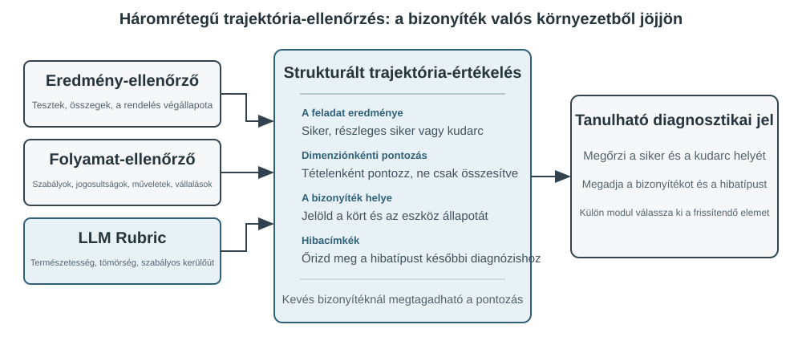
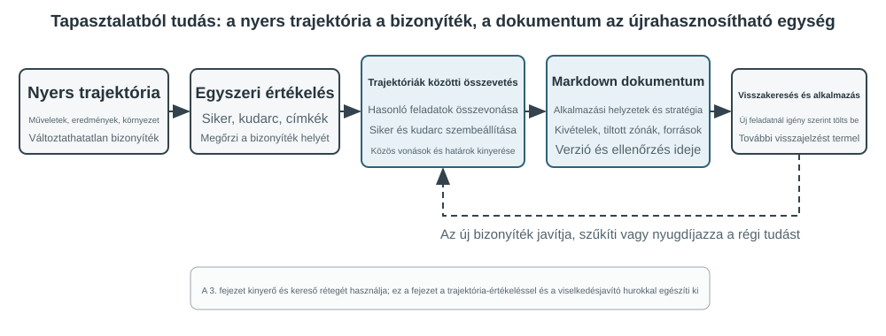

# Multimodalitás és valós idejű interakció

Az előző fejezetekben azt vizsgáltuk, hogyan működnek az ügynökök egy szövegalapú világban, kontextuson, eszközökön és kódon keresztül kommunikálva a digitális rendszerekkel. De egy ügynök világa túlmutat a szövegen és az API-kon. Amint meg kell értenie egy kimondott parancsot, meg kell találnia és kattintania kell a megfelelő gombra a képernyőn, vagy egy robotkart kell irányítania egy tárgy megragadásához, új területre lép: a "multimodális valós idejű interakció" területére. Ez az elmozdulás a tiszta szöveges bemenettől és kimenettől a "multimodális érzékelés és valós idejű válaszadás" felé az a döntő lépés, amely az ügynököt a "párbeszédablakon" túlra repíti. A "multimodális" egyszerűen azt jelenti, hogy egyszerre több információformát kezelünk — szöveget, beszédet, képeket, videót és cselekvéseket — ahelyett, hogy csak szöveggel dolgoznánk.

Először is határozzuk meg e fejezet hatókörét. A statikus képek és dokumentumok értelmezése — egy képernyőkép vizsgálata, egy diagram olvasása, egy PDF feldolgozása — már az előző fejezetek ügynök-munkafolyamatainak természetes részévé vált. A mai multimodális LLM-ek számára ezek az egybemenetes megértési feladatok viszonylag érettek, és nem igényelnek különleges architektúrát. Ez a fejezet egy más problémacsoporttal foglalkozik: három olyan forgatókönyvvel, ahol a **valós idejű korlátok teszik nehézzé a multimodális problémákat** — hangalapú párbeszéd, grafikus felület (GUI) kezelés és robotvezérlés. Ezekben a beállításokban a bemenet folyamatosan érkezik, a kimenetnek pedig szigorú időkeretet kell teljesítenie, ami alapvetően megváltoztatja az architektúrát. A folyamatos vizuális streamek, vagyis a videó valós idejű megértése a cikk írásakor még nyitott probléma az ügynökök számára. Visszatérünk rá, amikor a Computer Use szakasz a képkockánkénti képernyőképek korlátait vizsgálja, majd ismét a fejezet végi kérdésekben. Még egy határvonal: e könyv keretrendszerében a multimodális "generálás" (kép- vagy videógenerálás) csupán egy szokványos eszközhívás, ahogyan azt az 5. fejezet a Multimédiás Generálásról tárgyalta. Az ügynök külső eszközként használja, így nem veti fel az itt tárgyalt valós idejű interakciós kihívásokat, és a fejezet fő vonalán kívül marad.

A hangalapú interakció, a Computer Use és a robotkezelés három teljesen különböző területnek tűnhet, de mindhárom rendszerében feltűnően hasonló problémákba ütközik: egyszerre több modalitást kell feldolgozniuk, és rendkívül érzékenyek a késleltetésre. Egy kétszekundumosnál hosszabb szünet a hangalapú beszélgetésben nyugtalanná teszi az embereket; ezredmásodperces kilengés a robotvezérlésben ütközést okozhat. Ezek a korlátok együtt mindhárom forgatókönyvet ugyanabba az építészeti irányba terelik: el a "soros csővezetéktől" (mint egy gyári futószalag, ahol az egyik lépésnek be kell fejeződnie, mielőtt a következő elkezdődhet) és a "végponttól végpontig tartó modell" felé (egy egységes modell, amely közvetlenül a bemenettől a kimenetig halad, kiküszöbölve a köztes átadásokat).

Ez a fejezet a következő vonalak mentén bontakozik ki:

1.  Először három hangarchitektúra paradigmát használunk keretrendszerként: a kaszkádolt (VAD-ASR-LLM-TTS csővezeték), a végponttól végpontig tartó omnimodális (Omni, egyetlen modell, amely azonban továbbra is a társalgási fordulókra támaszkodik), és a teljes duplex (Moshi és GPT-Live, amelyek egyszerre hallgatnak és beszélnek). Összehasonlítjuk késleltetésüket és kompromisszumaikat aszerint, hogy az egyes paradigmák mennyire lépnek túl a VAD diszkrét fordulókról alkotott feltételezésén. A kaszkádolt szakasz a VAD + ASR lecserélését is tárgyalja streaming hangérzékelésre.
2.  Ezután megvizsgáljuk, hogy a gondolkodási architektúra hogyan egyezteti össze a "valós idejű válaszadás" és a "mély gondolkodás" közötti konfliktust: az egyszerű gyors-lassú párhuzamosítástól a szétválasztott megközelítésig, ahol egy háttérben futó érvelő modell "stratégaként" működik (GPT-Live delegálás, Pine AI stb.), egészen a Step-Audio R1 "internalizációjáig", ahol a gondolkodás egyetlen modellbe épül, amely "gondolkodva beszél".
3.  Majd tárgyaljuk, hogy az emberibb beszédszintézis hogyan optimalizálja a végrehajtási réteget.
4.  Végül kiterjesztjük a perspektívát a Computer Use-re (amely lehetővé teszi a mesterséges intelligencia számára, hogy a számítógép képernyőjét úgy kezelje, mint egy ember) és a robotkezelésre, megfigyelve, hogy ugyanazok a késleltetési és multimodalitási problémák hogyan jelentkeznek ebben a két forgatókönyvben.

Két további elméleti téma átível ezeken a forgatókönyveken, és külön figyelmet érdemel: a "gondolkodási architektúra" (hogyan működik együtt a gyors és a lassú gondolkodás) és az ebből következő "gyors-lassú interfész" (a "Latens Híd" — mit cserélhetnek egymás között a gyors és lassú modellek a szövegen túl). Bár a hang kontextusában vezetjük be ezeket, a gondolatok nem korlátozódnak arra. A Computer Use és a robotika szakaszok ugyanazzal a kérdéssel találkoznak, hogy mikor érdemes lassú stratégát bevonni, ezért tartsuk észben mindkét témát.

## Hang: A legtermészetesebb ember-gép interfész

A hang nem pusztán a szöveg hanggá alakítása. A beszéd körülbelül négyszer gyorsabb a gépelésnél, és szabadon hagyja a kezet és a tekintetet, ezért természetesen illeszti az Agentet egy folyamatos, bármikor megszakítható ki- és bemeneti hurokba. A hangbevitel szöveggé alakítja a diktálást; a hangügynök közvetlen együttműködést tesz lehetővé. Mindkettő támogatja a bevezetőben említett whisper codingot.

A szakasz két irányt tárgyal: a felhasználó az Agenthez beszél, illetve az Agent a felhasználó nevében a külvilághoz beszél. A hangmodell azt határozza meg, mire tud válaszolni; az interakciós architektúra azt, hogy jól hall-e, időben válaszol-e, természetesen adja-e át a szót, és hívás közben elvégzi-e a megerősítéseket és eszközhívásokat.

### Interakciós időzítés: a kaszkádtól a teljes duplexig

Az OpenAI GPT-Live bemutatója három paradigmát különböztet meg: kaszkád, köralapú és teljes duplex[^ch9-12]. Ezek eltérő kompromisszumok a késleltetés, a költség és a megfigyelhetőség között, nem lineáris fejlődési lépések.

| Paradigma | Szerkezet | Előny | Korlát |
| --- | --- | --- | --- |
| Kaszkád | VAD → ASR → LLM → TTS | Átlátható, cserélhető, hibakereshető modulok | Késleltetés halmozódik, a paralingvisztikai jel elveszik |
| Végponttól végpontig Omni | Egy modell hallgat, gondolkodik és beszél | Kisebb késleltetés, jobb hangszín- és környezethang-megőrzés | Továbbra is köralapú, drága a tanítás és a hibakeresés |
| Teljes duplex | Folyamatosan hallgat, beszél és dönt | Átfedő beszéd és természetes megszakítás | Bonyolultabb tanítás, vezérlés és értékelés |

A közös cél az „egymás után beszélünk” feltételezés és a VAD szólójoggal kapcsolatos találgatásának meghaladása. A kaszkád és az Omni még körökre bont; a teljes duplexben a modell folyamatosan dönti el, ki beszél.

[^ch9-12]: OpenAI. *Introducing GPT-Live.* 2026-07-08. https://openai.com/index/introducing-gpt-live/. A háromosztatú besorolás a ChatGPT Voice három generációjának összefoglalásából származik; az Omni a „turn-based voice models” kategóriának felel meg.

### Paradigma 1 · Kaszkádolt csővezeték

A legtöbb kereskedelmi hangasszisztens soros csővezetéket használ (9-1. ábra): a VAD érzékeli a végét, az ASR szöveggé alakítja a hangot, az LLM megérti és megfogalmazza a választ, a TTS pedig kimondja. A modularitás megkönnyíti az egyes részek optimalizálását, de minden határ várakozást ad hozzá.


| Modul | Feladat | Tipikus szűk keresztmetszet |
| --- | --- | --- |
| VAD | A beszéd végének eldöntése | Csendküszöb, várakozás és hibás szegmentálás |
| ASR | Hangból szöveg | Felismerési késleltetés és kontextusvesztés |
| LLM | Megértés, gondolkodás és generálás | Első token késleltetése, reasoning miatti várakozás |
| TTS | Szövegből hang | Első csomag szintézise és lejátszási puffer |

Rövid válasznál is sorosan összeadódik a VAD, ASR, LLM és TTS várakozása (9-2. ábra). Éles rendszerben a sorban állás tovább növeli az üresjárati késleltetést (9-3. ábra).




> **9-1. kísérlet ★: Hagyományos hangügynök építése**
>
> WebSocketen keresztül kapcsoljuk össze a mikrofont, a Silero VAD-ot, a helyi Whisper-t, a streaming LLM-et és a Fish S1 TTS-t. A megőrzött valódi egyfordulós bizonyíték a teljes lánc futását mutatja, nem párhuzamossági vagy éles terhelési benchmark. Kód és elfogadási rekord: [chapter9/live-audio](../chapter9/live-audio/).

> **Kiegészítő projekt: WebRTC-hangügynök, amely „felhívja a felhasználót”**
>
> PSTN nem szükséges: a böngészős WebRTC megnyitja a munkamenetet, bekéri a hiányzó adatokat, visszamondja azokat megerősítésre, majd strukturált eredményt ment. Külső szervezethez ugyanazt a szerződést megfelelő PSTN/SIP-szolgáltatóra cseréljük. A projekt történeti exp9-2 azonosítókat őriz, de nem foglal számozott helyet a kéziratban. Lásd [chapter9/phone-agent](../chapter9/phone-agent/).

#### A sorostól a streaming észlelésig

Az ASR beszéd közben ideiglenes átiratot adhat, az LLM az első felolvasható mondatot átadhatja a TTS-nek, a TTS pedig hangblokkokat küldhet. Ettől a három szakasz nem lesz teljesen párhuzamos; előreindításkor a későbbi átirat változását törléssel, újraindítással vagy visszagörgetéssel kell kezelni.

A VAD + ASR front-end három gondja a csend miatti **késleltetés**, a hezitálás, érzelem és környezeti hang elvesztése, valamint az e-mail-címek és tulajdonnevek **kontextustörése**. A valódi streaminghez kauzális vagy darabolt kódoló és inkrementális dekódolás kell; a Whisper teljes hangszegmenst vár. Az LLM-alapú hallási modell szöveget és szemantikai eseményeket adhat ki.

A végpont eldöntése beépíthető a streaming felismerőbe, de a címkék csak a döntéskor látható információt használhatják[^ch9-11]. A speak_start/end, interrupt, emotion, laugh, sigh és noise jelölők megőrzik a nem szöveges jeleket.

[^ch9-11]: A végpontítélet felismerőbe építéséről és az utólagos címkékről lásd Li, Bojie és Noah Shi. *The Trade-off Was in the Labels: Causal Supervision for Turn-Aware Streaming ASR.* 2026 (megjelenés alatt).

> **9-2. kísérlet ★: Streaming hangészlelés szimulációja Qwen2-Audio-val**
>
> A Qwen2-Audio nem streaming modell. Növekvő hangprefixekkel szimuláljuk a folyamatos észlelést, és 600 ms VAD + Whisper kontrollal hasonlítjuk össze. A canonical run csak 2/6 várt viselkedést reprodukált, 8,4–11,3 másodpercig tartott, a pause mintán kihagyta a silence-t, a noise mintát cough/laughter-ként tévesztette. Ez mechanizmus- és hibamód-vizsgálat, nem 100–200 ms-os streaming ígéret. Lásd [chapter9/streaming-speech](../chapter9/streaming-speech/).

### Paradigma 2 · Végponttól végpontig tartó omnimodális modellek (Omni)

A kaszkád szöveges határa elveszítheti az érzelmet, intonációt és környezeti hangot. Az Omni egy modellben hallgat, válaszol és beszél, de drágább tanítani, hibakeresni és cserélni. Előnye főként a késleltetés és a nem szöveges információ, nem szükségszerűen a pontosság. Az önkaszkád akkor javíthat felismerési hibát, ha a szöveg elég; beszédsebesség vagy érzelem esetén a szöveges szűk keresztmetszet bizonyítékot veszít[^ch9-13].

[^ch9-13]: A kaszkád és a végponttól végpontig tartó út pontossági előnyeinek mérését lásd Li, Bojie és Noah Shi. *The Cascade Gap: When and Why Self-Cascades Help Multimodal Agents.* 2026 (megjelenés alatt).



A valós idejű hang API-k köztes megoldások: natívan kezelik a hangot, de VAD-ra, megszakításra és aszinkron eszközhívásra támaszkodnak. A feladatfüggő hibák fontosabbak, mint a ranglista.

> **9-3. kísérlet ★★: MiniCPM-o 4.5 helyi futtatása — end-to-end és önkaszkád**
>
> Rögzítsünk egy revíziót, kapcsoljuk ki a thinking mode-ot, és hasonlítsuk össze a közvetlen hangválaszt a transzkripció utáni válasszal. Ez az audio-információ megőrzését méri, nem a későbbi „gondolkodás beszéd közben” képességét.
>
> | Feladat | End-to-end | Önkaskád | Megfigyelés |
> | --- | ---: | ---: | --- |
> | Szemantikus számtan (2) | 1/2 | 2/2 | Egy átírási hibát kijavít |
> | Paralingvisztikai beszédtempó (2) | 2/2 | 1/2 | A szöveg eltörli a gyors/lassú különbséget |
> | Összesen | 3/4 | 3/4 | Azonos összeg, kiegészítő hibák |
>
> A minta kicsi; nem bizonyít általános pontossági vagy sebességi sorrendet. Teljes bizonyíték: [chapter9/end-to-end-speech](../chapter9/end-to-end-speech/).

Step-Audio 2 nyers hangból szöveget és hangot állít elő; a Step-Audio R1 a következtetést is a hangmodellbe építi.

### Paradigma 3 · Teljes duplex interaktív modellek

Az Omni a „felhasználó beszél” és a „modell beszél” időszakára osztja a párbeszédet, de a szinkrontolmácsolás átfedést igényel. A teljes duplex folyamatosan hallgat és beszél, és eldönti, folytatja-e, szünetel-e, megszakít-e vagy eszközt hív. A Kyutai Moshi korai példa; a Thinking Machines Lab Interaction Modelnek[^ch9-14] nevezi a modellbe épített interakciót. A GPT-Live ezt termelési méretre viszi.

[^ch9-14]: Thinking Machines Lab, “Interaction Models: A Scalable Approach to Human-AI Collaboration,” 2026-05. https://thinkingmachines.ai/blog/interaction-models/

A történet: a kaszkád csendküszöbbel tippeli a fordulót, a streaming szemantikai szintre emeli a döntést, a teljes duplex pedig folytonos döntéssé alakítja az átváltást.

### Kognitív időzítés: valós idejű interakció és mély gondolkodás

Az előtérmodell addig válaszol, amíg a felhasználó jelen van; a háttérmodell tovább gondolkodhat. A három terv kompromisszum:

| Terv | Előtér | Háttér | Kockázat |
| --- | --- | --- | --- |
| Gyors válasz, lassú javítás | Azonnali válasz | Újragondolás és kiegészítés | Ellentmondás |
| Gyors interakció, lassú tanács | Beszélgetés és megfogalmazás | Tanács vagy eszközeredmény | Korlátozott interfész |
| Egyesített gondolkodás és kifejezés | Gondolkodás közben beszél | Közös állapot | Magas újratanítási költség |

Az első terv megkettőzi a munkát, a második közvetett kapcsolatot használ, a harmadik egyesíti a gondolkodást és a beszédet. A Step-Audio R1 MGRD-vel az akusztikai jellemzőkhöz köti a gondolkodást, az MPS kettős aggyal pedig párhuzamosítja a tervezést és a kifejezést (9-5 és 9-6. ábra). Az egyesített modell természetesebb, a leválasztott háttéragy könnyebben cserélhető.

### Emberibb beszédszintézis

A túl sima, szünet nélküli TTS gépiesnek hat. Az LLM THINKING, EMO:happy és SPEED:0.8x vezérlőjeleket adhat, a TTS pedig szünetté, prozódiává, tempóvá, nevetéssé vagy sóhajjá alakíthatja. Fish Audio S1 alatt a több referenciás beállítás kapta a legjobb pontszámot három kiegyensúlyozott vakhallgatásban (4,67/5), de a jelölés nélküli csoport megelőzte az egyreferenciásat, ezért a teljes tervezett sorrend nem ismétlődött meg.

> **9-4. kísérlet ★★: Vezérlőtokenes TTS Fish Audióval**
>
> Hasonlítsuk össze a jelölés nélküli, az egyreferenciás és a több referenciás hangkönyvtárat. A 24 referencia, az A/B/C média és az elfogadási rekord itt található: [chapter9/controllable-tts](../chapter9/controllable-tts/).

## Computer Use: Grafikus Felület Automatizálási Ügynökök

Mire mostanra észrevehették, hogy ez a fejezet sokkal több teret szentel a hangnak, mint a következő két forgatókönyvnek. Ez szándékos. A valós idejű multimodális rendszerek közül a hangtechnológia haladt a legmesszebbre, ezért nyújtja a legjobb referenciát. Végigjárta a teljes ívet az eredeti problémától — a soros csővezetékek túlzott késleltetése — a végponti modelleken, a teljes duplex interakción és a gondolkodva beszélésen át a mai viszonylag érett tervekig. Ezért meséltük el a történetét teljes egészében. Ahogy olvassák a Computer Use és a robotika szakaszokat, hasonlítsák össze ezzel a pályával: az egyes területek milyen messzire jutottak, és hol maradtak meg?

Ez a három forgatókönyv különbözőnek tűnik, de ugyanazokkal a magkihívásokkal néz szembe: valós idejű érzékelés, alacsony késleltetésű döntéshozatal és folyamatos interakció. Ezután a vizuális interakcióra, vagyis a Computer Use-re térünk, kiterjesztve a perspektívát a hallásiról a vizuális modalitásra: mi lenne, ha egy ügynök nemcsak a beszédet értené, hanem "látná" is a képernyőt, és kezelné a grafikus felületet?

A Computer Use, más néven GUI automatizálás, lehetővé teszi a mesterséges intelligencia számára, hogy úgy használja a szoftvereket, mint egy ember, a képernyő megfigyelésével és az egér és billentyűzet kezelésével — például böngésző megnyitása információk kereséséhez, adatok beírása egy táblázatkezelő alkalmazásba, vagy beállítások módosítása a rendszer beállításaiban. Magja egy "Perceive-Think-Act" (Érzékel-Gondolkodj-Cselekedj) ciklus (9-6. ábra):

1.  Az ügynök képernyőképet készít az aktuális képernyőről.
2.  Egy multimodális modell megkapja a képernyőképet és a feladatutasítást, és kiad egy gondolatot és egy konkrét cselekvést.
3.  A végrehajtási réteg végrehajtja a cselekvést a valós környezetben (egér mozgatása, kattintás, szöveg beírása stb.).
4.  Megvárja a felület válaszát, újabb képernyőképet készít, és belép a ciklus következő iterációjába.


Ebben a ciklusban három kulcsfontosságú tervezési dimenzió van: "Cselekvési Tér" (milyen műveleteket végezhet az ügynök), "Vizuális Helymeghatározás" (hogyan találja meg a cél elemet a képernyőképen), és "Modell Architektúra" (hogyan generálja a helyes cselekvést a képernyőképből).

### Cselekvési Tér Tervezése

Az Anthropic három eszköztípust határoz meg, amelyek teljes interakciós képességet alkotnak (9-7. ábra):


"GUI Kezelő Eszköz" (`computer` eszköz): Egérműveletek: mozgatás (`mouse_move`), bal/jobb/középső kattintás, dupla- vagy háromszoros kattintás, húzás (`left_click_drag`), és pontosabb lenyomás/elengedés műveletek (`left_mouse_down` és `left_mouse_up`). Görgetés (`scroll`) négy irányt támogat, és kombinálható módosító billentyűkkel. Billentyűzetműveletek: karakterenkénti gépelés (`type`, 12 ms intervallummal a karakterek között a valódi gépelés szimulálására), billentyűkombinációk (`key`, pl. `Ctrl+C`), és billentyű lenyomva tartása (`hold_key`). Érzékelési műveletek: képernyőkép készítése, kurzorpozíció lekérése (`cursor_position`), várakozás (`wait`).

"Parancsvégrehajtási Eszköz" (bash eszköz): Perzisztens bash terminál munkamenetet biztosít 120 másodperces időkorláttal. Egy őrszöveges karakterláncot használ a parancs befejeződésének érzékelésére, és megtartja a környezeti állapotot több hívás között (pl. egy könyvtárba `cd` után a következő hívás abban a könyvtárban marad).

"Fájlszerkesztő Eszköz" (`str_replace_editor`): Biztonságos szerkesztést tesz lehetővé karakterlánc-illesztésen keresztül, támogatva a megtekintést, létrehozást, cserét, beszúrást és visszavonást. Pontosabb, mint a teljes fájl felülírása, és kisebb a valószínűsége, hogy véletlenül más tartalmat módosít.

> **9-5. kísérlet ★: Computer Use futtatása (Anthropic referenciaútvonal vagy nyílt modell útvonala)**
>
> Az A útvonal az Anthropic Computer Use Demót használja. A konténere teljes Ubuntu asztali környezetet csomagol böngészővel, terminállal és más gyakori eszközökkel. A front-end fogadja a feladatot, a back-end elküldi az utasításokat és a képernyőképeket a Claude-nak, majd végrehajtja a modell által visszaadott egér-, billentyűzet-, terminál- vagy szerkesztési műveleteket. Ez az útvonal a natív `computer` eszközprotokoll megértésére szolgál; nem követeli meg, hogy minden olvasó hozzáférjen az Anthropic API-jához.
>
> A B útvonal a könyv [`chapter9/computer-use-open-model`](../chapter9/computer-use-open-model/) kísérőprojektjét használja. Alapértelmezésben a nyílt súlyú Qwen3-VL 32B Instruct modellel vezérli a browser-use-t, az OpenRouter hosztolt API-ján keresztül, vagy úgy, hogy az `OPEN_MODEL_BASE_URL` értékét saját üzemeltetésű vLLM/SGLang vagy más kompatibilis végpontra állítja. A végpontnak képernyőképeket kell fogadnia és natív JSON Schema-t kell támogatnia; ha csak hagyományos JSON-t támogat, a schema-in-prompt kompatibilitási mód külön engedélyezhető.
>
> Mindkét útvonal ugyanazt a csak olvasható feladatot és ugyanazt az elfogadási szerződést használja: legfeljebb 25 lépés, lépésenként egyetlen művelet, továbbá a modell/végpont azonosítójának, a szolgáltató nyers válaszainak, a lépésenkénti képernyőképeknek, a műveletsornak, a végső válasznak és a leállás okának megőrzése. Az eltérő modelleket külön kísérleti ágként kell jelenteni; nyílt modell eredménye nem tüntethető fel Claude-reprodukcióként, és a „konténer sikeresen elindult” sem tekinthető a feladat teljesítésének. A műveletek közötti idő és a tervezés minősége mérési eredmény, nem előzetes 2–5 másodperces feltételezés vagy más modellekkel szembeni szükségszerű fölény.
>

### Vizuális Helymeghatározás

A ciklus minden iterációjában a modellnek pontosan meg kell találnia a cél elemet a képernyőképen — "Hol van a keresőmező?" "Mik a beküldő gomb koordinátái?" Ez a vizuális helymeghatározás problémája. Jelenleg "két fő megközelítés" létezik: az egyik a lokalizációt "többválasztásos problémává" alakítja — először számokkal annotáljuk a felületi elemeket, a modellnek csak ki kell választania egyet; a másik a "tiszta koordináta előrejelzés" — hagyjuk, hogy a modell "nézze" a képernyőképet, és közvetlenül adjon meg koordinátákat, akár egy ember. A többválasztásos megközelítésnek két implementációs módja van: "tiszta vizuális annotáció" (az eredeti Set-of-Mark, egy szegmentációs modell használatával a képen lévő jelölt régiók szegmentálására) és "strukturált elemindexálás" (DOM/Accessibility Tree, a felület eredeti struktúrájának közvetlen olvasása). A többválasztásos megközelítés közös előnye, hogy a "keresd meg a gombot a képernyőképen és jelezd előre a koordinátáit" nyílt végű problémát egy "válassz egyet a már annotált elemek közül" zárt végű problémává alakítja — ahogy a többválasztásos kérdésekre könnyebb helyesen válaszolni, mint a kitöltendő kérdésekre egy vizsgán, a modellnek csak annyit kell mondania, hogy "kattints [123]-ra" ahelyett, hogy "kattints a kék gombra, körülbelül 200 pixellel a képernyő bal felső sarkától jobbra".

"Set-of-Mark: Vizuális Annotációs Módszer."

Az eredeti Set-of-Mark (SoM) a Microsoft Research által 2023-ban javasolt, kezdetben a GPT-4V vizuális helymeghatározási képességeinek felszabadítására. Ez egy "tisztán vizuális" módszer: képszegmentációs modelleket (SAM, SEEM stb.) használ a képernyőképen lévő jelölt régiók automatikus szegmentálására, számozott markert helyez minden régióra, és a modell számokkal ellátott képet lát. A modellnek csak a számot kell jelentenie, a rendszer pedig átalakítja a megfelelő régió középponti koordinátáivá. A teljes folyamat nem igényel DOM-ot vagy belső felületi struktúrát, így egyaránt alkalmazható natív asztali szoftverekre és játékfelületekre — amíg a szegmentációs modell azonosítani tudja a jelölt régiókat.

**Strukturált Elemindexálás: Az SoM-ötlet strukturált implementációja a weben.**

Amikor a felület maga biztosít strukturált információt, az annotáció pontosabb lehet. A modern weboldalak a renderelés előtt meghatároznak egy teljes elemstruktúrát (a DOM fát) és szemantikus szerepeket, amelyek azonosítják a gombokat, beviteli mezőket és más vezérlőket. Az akadálymentesítési fák hasonló információt nyújtanak sok asztali alkalmazáshoz. Ahelyett, hogy egy szegmentációs modellt kérnénk meg, hogy pixel alapján találja ki, melyik régió egy gomb, a rendszer közvetlenül lekérdezheti a felületről a kattintható elemeket. A webes ügynökrendszerek, mint a `browser-use`, pontosan ezt teszik: felsorolják és számozzák az interaktív elemeket a DOM-ból. Ez az SoM-ötlet strukturált implementációja a web számára (9-8. ábra). A folyamat négy lépésből áll:

1. A strukturált reprezentáció (DOM fa) és akadálymentesítési információk lekérése a böngésző hibakereső felületén keresztül (CDP, Chrome DevTools Protocol)
2. Automatikusan érzékelni, hogy mely elemek interaktívak (gombok, beviteli mezők, linkek stb.)
3. Minden interaktív elemet egyedi azonosítóval annotálni és határoló kereteket rajzolni a képernyőképen
4. Egyidejűleg egy szöveges listát generálni, amely leírja az egyes azonosítókhoz tartozó elemet

```text
Képernyőkép: [A képen a kulcselemek [1], [2], [3], [4] azonosítókkal vannak annotálva]

Elemek:
[1] <input type="text" placeholder="Keresés" aria-label="Keresés" />
[2] <button id="submit-btn" aria-label="Űrlap beküldése" />
[3] <input type="text" placeholder="Adja meg a nevét" value="" />
[4] <a href="/docs" aria-label="Dokumentáció" />
```

A modellnek csak egy azonosítót kell kiadnia, és a rendszer automatikusan rákattint a megfelelő elem középpontjára. Ez a megközelítés nem takarít meg tokeneket, mert minden annotációs adatot el kell küldeni a modellnek, de pontos, stabil lokalizációt biztosít, elkerülve a szegmentációs modellek által bevezethető kihagyásokat és téves pozitívumokat.


"Tiszta Koordináta Előrejelzés."

A harmadik út kihagyja az annotációt, és megkéri a modellt, hogy közvetlenül adjon meg koordinátákat. Az olyan rendszerek, mint a "SeeClick" és a Claude computer use, olyan látásmodellekre támaszkodnak, amelyeket GUI képernyőképek és elempozíciók hatalmas adatkészletein tanítottak. Ezek a modellek megtanulják a természetes nyelvű leírásokat (pl. "kattints a beküldő gombra") közvetlenül pontos képernyőkoordinátákra leképezni, vizuális érzékelésre támaszkodva, mint egy emberi felhasználó.

A koordináta-előrejelzési sémákban a modell koordináta-megértése nagymértékben függ a tanítás során használt felbontástól (9-9. ábra). A Claude-ot XGA (1024×768), WXGA (1280×800) és FWXGA (1366×768) felbontásokon tanították. Ha a bemeneti képernyőkép felbontása nem egyezik, a modell által előrejelzett koordináták szisztematikusan eltolódnak — mintha egy távolságot egy kis térképen mérnénk meg, majd közvetlenül egy nagy térképre alkalmaznánk. Ezért egy kétirányú koordináta-skálázó mechanizmust kell implementálni az eszköz rétegben, és a célfelbontást "a képarány alapján kell kiválasztani", hogy elkerüljük az egyenlőtlen nyújtást, amely torzítja a képet, és ezáltal torzítja a koordináta-ítéletet. Például, ha a tényleges képernyőfelbontás 2560×1440 (16:9), a Claude három támogatott opciója közül a legmegfelelőbb cél az FWXGA (1366×768), amelynek képaránya a legközelebb van a 16:9-hez. A képernyőképet arányosan 1366×768-ra skálázzák és táplálják a modellbe; miután a modell kiadja a kattintási koordinátákat (683, 384), azokat visszafejtik a valós koordinátákra (683×2560/1366, 384×1440/768) ≈ (1280, 720). Ezzel szemben, ha egy 16:9-es képet erőszakosan 4:3-as 1024×768-ra nyújtanak, a kép vízszintesen összenyomódik, ami a modell által előrejelzett koordináták szisztematikus eltolódását okozza.


A három út közötti választás a következőképpen foglalható össze: **ha strukturált információ áll rendelkezésre, részesítsük előnyben a DOM/akadálymentesítési fa indexálást** a legpontosabb és legstabilabb lokalizáció érdekében. "Ha nem áll rendelkezésre" — natív asztali szoftverekben, például Photoshop, canvas/WebGL renderelt felületek vagy játékok esetén — **használjunk vizuális annotációt (az eredeti SoM utat) vagy koordináta előrejelzést**. A vizuális annotáció többválasztásos problémává alakítja a lokalizációt, ami barátságosabbá teszi az általános célú modellek számára specializált tanítás nélkül. A koordináta előrejelzés kiküszöböli az annotációs lépést, és közvetlenebb a kifejezetten GUI lokalizációra tanított modellek számára. Mindkét megközelítés továbbra is küzd a kis elemekkel és a sűrű felületekkel.

> **9-6. kísérlet ★: A browser-use használata automatizált böngészőműveletekhez**
>
> A Playwright böngésző-automatizálási keretrendszert multimodális modellel kombinálva természetes nyelvvel vezérelt böngészőműveleteket valósítunk meg. Engedélyezzük az SoM-vizualizációt, és minden döntés előtt elmentjük a jelölt határolókereteket tartalmazó képernyőképet. A modellinterfész nem korlátozódik az OpenAI-ra vagy az Anthropicra; a könyv API-konfigurációt ad a nyílt Qwen3-VL modellhez, és általános, OpenAI-kompatibilis base URL-t tart fenn más hosztolt szolgáltatásokhoz vagy saját üzemeltetésű következtetéshez.
>
> Tesztfeladat: „Nyisd meg a Google-t, és keresd meg San Francisco időjárását.” Indítás után a képernyőkép a Google keresőoldalt mutatja számozott interaktív elemekkel. A modell kiválasztja a keresőmezőt, beírja a „San Francisco weather today” szöveget, elküldi a keresést, majd kinyeri a hőmérsékletet és az időjárási viszonyokat az eredményoldalról. Az átvétel során függetlenül ellenőrizni kell a választ és a műveletsort, valamint a tényleges lépésszámot és eltelt időt kell rögzíteni. Az „5 lépés, körülbelül 20 másodperc” csak egy adott futás megfigyelése lehet, végrehajtási bizonylat nélkül nem rögzített eredmény.
>
> A könyvben megőrzött hivatalos nyíltmodelles futás az OpenRouter `qwen/qwen3-vl-32b-instruct` modelljét használta. Amikor a modell a Google-keresés 4. lépésében CAPTCHA-val találkozott, nem állította, hogy sikerrel járt, hanem átváltott a weather.com oldalra. Végül a 16. lépésben San Francisco Today oldaláról a következőket olvasta ki: 64°F, Sunny, 62°F hőérzet, 74°F maximum és 55°F minimum. Mind a 16 API-válasz a kért Qwen3-VL modellt jelezte, a 15 érvényes lépésképernyőkép és a csak olvasható műveletsor pedig átment a független, determinisztikus átvételen. Ez az eredmény bizonyítja, hogy a nyíltmodell-API útvonala működik; nem jelenti az Anthropic natív `computer` eszközét használó kísérleti ág reprodukálását.

### Egy Computer Use ügynök, aki animációkat nézhet és hangot hallhat

Eddig a Computer Use érzékelés egy implicit feltételezésen nyugodott: "a képernyő statikus" — készítsünk egy képernyőképet, gondolkodjunk a következő lépésről, kattintsunk, és készítsük a következő képernyőképet. A valódi képernyők videókat játszanak le, másodpercek alatt eltűnő értesítéseket villantanak fel, és hangot játszanak le értekezletekről. Egy ügynök, aki csak 3-5 másodpercenként nyitja ki a szemét, és nincs füle, vak és süket mindenre, ami két képkocka között történik. Képernyőfelvétel nézése, értekezlethez csatlakozás, hangutasítás követése, egy párbeszédablak elkapása, mielőtt eltűnik — a mindennapi számítógépes munka egész kategóriája gyakorlatilag elérhetetlen a mai Computer Use ügynök számára.

Amit itt valóban újra kell tervezni, az nem a "cselekvési interfész", hanem az „észlelési interfész”[^ch9-9]. A magötlet az "észlelés" (folyamatos, adaptív, multimodális) leválasztása a "cselekvésről" (diszkrét), létrehozva egy perceptuális köztes réteget, amely a környezet és bármely polcról beszerezhető Computer Use modell közé ül anélkül, hogy újratanítást igényelne. Nevezzük ezt Ügynök-Számítógép Észlelési Interfésznek (AOI). Három "kapuzott" komponense van: Először is, "képkockák közötti kulcskocka rögzítés" — használjunk egy nagyon olcsó pixel-kaput a szinte változatlan képkockák kihagyására, majd egy kis modellt annak meghatározására, hogy történt-e értelmes változás, rögzítve egy képkockát csak akkor, ha van változás, ami közel nulla költséget eredményez a statikus képernyőkhöz; Másodszor, "hangerő-kapuzott beszédátírás" — csak akkor hívjuk a beszédfelismerést, ha van hang, először adva "füleket" az ügynöknek; Harmadszor, és ami a legkritikusabb, "az észlelések átalakítása perzisztens szöveges leírásokká" — kérjük meg a modellt, hogy egyetlen mondatban írja le a rögzített képkockát (pl. "A felugró ablak éppen azt mondta, hogy a kiadási dátumot április 28-ra módosították"), és **még ha az eredeti kép később el is távolításra kerül a kontextusból, ez a szöveg megmarad a memóriában**, továbbvíve a dinamikus információt szöveges formában.

A nem intuitív megállapítás az, hogy ami igazán számít, az nem a képkocka kiválasztása, hanem a kiválasztott képkockák átalakítása perzisztens szöveggé, mert a szöveg az a modalitás, amelyet az LLM-ügynökök a legjobban kezelnek. Nyolc modellen keresztül, a 7B paraméteres modellektől a frontvonalbeli rendszerekig, ez a köztes réteg +17 és +48 százalékpont közötti nyereséget biztosított minden újratanítás nélkül, a legnagyobb különbséggel a hangfeladatoknál: az észlelési réteggel az ügynök végre el tudta végezni azokat a hangfeladatokat, amelyek korábban "hallhatók, de nem végrehajthatók" voltak. Azonban nem egy mindenre egyformán jó konfigurációról van szó — néhány újabb modellen a túl sok képkocka token beszúrása kiszorítja az érvelést, és rontja a teljesítményt. Ezért a komponenseket "modellenként kell kiválasztani", nem egyszerre bekapcsolni. Ugyanaz a lecke, mint a Set-of-Mark versus koordináta előrejelzés kompromisszuma: nincs ezüstgolyó az észlelési sémákban; konfigurálni kell őket a modell természetéhez.

[^ch9-9]: A három komponens — kapuzott kulcskockák, igény szerinti átírás, képkockák narrálása perzisztens szöveggé — teljes mechanizmusáért és modellenkénti ablációjáért lásd Bojie Li és Noah Shi. *Agent-Computer Observation Interfaces Enable Dynamic Computer Use.* arXiv:2606.29472, 2026.

### Mobil: Az ökoszisztéma akadályok keményebbek, mint a technológia

A Computer Use a mobileszközökre is kiterjed. A mobil és asztali rendszerek technikailag különböznek: az egérkoordináták és billentyűzetbemenet helyett a mobil cselekvési tér jellemzően a rendszer akadálymentesítési szolgáltatás API-ját (pl. Android `AccessibilityService`) használja a felületi elemek olvasására és kattintások vagy szövegbevitel kiadására. Az interakció is az egérmutatóról érintési gesztusokra vált, megváltoztatva a koordináták jelentését. Ugyanaz az `(x, y)` pozíció jelenthet érintést, hosszú lenyomást vagy egy húzás kezdőpontját, ezért a cselekvésnek meg kell adnia a gesztus típusát is. A mobil benchmarkok, mint a 6. fejezetben bemutatott AndroidWorld, ebben a cselekvési térben értékelik az ügynök képességét a valós alkalmazásokban végzett feladatok elvégzésére.

Azonban ami valóban akadályozza a mobil Computer Use-t, az gyakran nem ezek a technikai különbségek, hanem az ökoszisztéma akadályok. Egyes telefon gyártók megkíséreltek MI asszisztenseket integrálni fogyasztói telefonokba, hogy az asszisztensek automatikusan kezelhessék a mindennapi alkalmazásokat, mint a WeChat, Taobao és Alipay, de gyorsan platformkorlátozásokba ütköztek.

Ez felfedi a Computer Use egyedi kihívását: "ökoszisztéma akadályok". E korlátozások mögött üzleti modell konfliktus áll. A hagyományos internetes alkalmazások magjának monetizációs logikája a "forgalom és a figyelem": a felhasználók hirdetéseket látnak a hírfolyam görgetése közben, ajánló algoritmusok irányítják őket a termékek keresésekor, és impulzusvásárlásokat hajtanak végre az oldalak böngészése közben. Amikor egy ügynök a felhasználó nevében működik, ez a monetizációs lánc teljesen megkerül: a MI figyelmen kívül hagyja a hirdetéseket, nem végez impulzusvásárlásokat, egyenesen a cél felé halad, befejezi a feladatot, és távozik. Azok számára a platformok számára, amelyek a reklámból és a forgalomból élnek, minden ügynöki művelet aláássa az üzleti modell alapját.

Ez azt jelenti, hogy a Computer Use nemcsak technikai ellenintézkedésekkel (mint a CAPTCHA) néz szembe, hanem egy "strukturális érdekellentéttel is". Ezt a konfliktust rövid távon nehéz lesz feloldani, és nagyobb akadályt jelent a fogyasztói elterjedésben, mint a tisztán technikai problémák.

### Valós Idejű Teljesítmény: A Megoldatlan Magkihívás

Az "OSWorld", amelynek értékelési módszertanát a 6. fejezet írja le, egy széles körben használt benchmark a Computer Use számára, amely az ügynök képességét teszteli a feladatok elvégzésére valós Ubuntu/Windows/macOS környezetekben, alkalmazásokon átívelően. A korai általános célú modellek csak körülbelül 20%-os sikerességi arányt értek el ezen a benchmarkon. A későbbi specializált modellek és erősebb általános célú modellek folyamatosan emelték a sikerességi arányt, fokozatosan megközelítve az emberi szintű teljesítményt a cikk írásakor. Azonban a sikerességi arány messze van a céltól — a valódi szűk keresztmetszet a "helyesen tudja csinálni?"-ról a "gyorsan tudja csinálni?"-ra tolódott.

Az "OSWorld-Human" hatékonysági tanulmány elgondolkodtató megállapítást hoz: még ha a feladat végül sikeres is, az ügynöknek észrevehetően több lépésre van szüksége, mint egy embernek, és a lépésenkénti inferencia késleltetés folyamatosan nő a feladat előrehaladtával — minél hosszabb a kontextus, annál lassabban dönt a modell, így a késői lépések gyakran sokkal tovább tartanak, mint a koraiak. Egy olyan dokumentum-formázási módosítás, amely egy embernek több tíz másodpercig tart, egy ügynöknek több percet is igénybe vehet. **Az emberi szintű pontosság nem azonos a gyakorlati használhatósággal; a hatékonyság az igazi szűk keresztmetszet.**

A kiváltó ok visszaköszön a beszéd forgatókönyvből: a soros "képernyőkép-gondolkodj-kattints" ciklusban, még ha minden szakaszt a végsőkig optimalizálunk is, a lépésenkénti késleltetés felhalmozódása elfogadhatatlan marad. A mélyebb probléma az, hogy a mai Computer Use egyáltalán nem tud előre gondolkodni. Ha egy ügynök előre tudná jelezni a következő lépést, miközben az aktuálisat hajtja végre — kitalálná, hova kell következőnek kattintani, amíg az oldal még tölt —, átfedésbe hozhatná a gondolkodást a végrehajtással, és drasztikusan csökkenthetné a teljes késleltetést (ugyanaz a követelmény, mint a gondolkodva beszélés korábban e fejezetben, és a 4. fejezet "folyamatos gondolkodású" aszinkron ügynöke, itt gondolkodva operálásként újrafogalmazva).

A beszéddoménnel ellentétben jelenleg nincs szisztematikus megoldás a Computer Use saját valós idejű teljesítményének javítására — gyorsabbá tenni a "képernyőkép-gondolkodj-kattints" ciklust —, és az továbbra is egy diszkrét, képkockánkénti képernyőkép-ciklusban ragadt. Azonban egy kerülő út már bizonyítottan hatékony, a gyors-lassú szétválasztást használva, amely újra és újra megjelenik ebben a fejezetben: mivel nehéz egy lassú Computer Use ügynököt gyorsabbá tenni, "ne várakoztassuk a felhasználót". Használjunk két modellt párhuzamosan: egy gyors modellt a beszédhez és egy lassú modellt a számítógép-kezeléshez[^ch9-10]. A gyors modell kezeli a valós idejű hangalapú beszélgetést, míg a csúcskategóriás VLM lépésről lépésre működik a böngészőben. A kettő csak egy minimális "egyszerű szöveges szerződésen" keresztül kommunikál: minden alkalommal, amikor a lassú ügynök végrehajt egy műveletet, frissít egy gördülő állapot-összefoglalót ("Kitöltöm az űrlapot, még szükség van a születési dátumára"). A gyors ügynök ezt használja a felhasználó valós idejű megválaszolására, és továbbítja a felhasználó által szóban adott új információkat a lassú ügynöknek. Kritikus, hogy **a gyors ügynök soha ne mondja, hogy "kész", amíg az állapot-összefoglaló meg nem erősíti a befejezést**. Ez a "telefonon beszélni, miközben hagyja, hogy a számítógép magától működjön" forgatókönyv. Kísérletekben ez a szétválasztás körülbelül 15-ször gyorsabbá tette a hangválaszokat, mint egyetlen, egyszerre operáló és beszélő modell (medián késleltetés 0,58 másodperc vs. 8,64 másodperc), a feladat sikerességi arányának csökkenése nélkül. A gyors és lassú közötti szöveges csatorna eltávolításával a siker nullára csökken — a felhasználók által szóban adott kulcsinformációk többé nem érik el a böngészőt. Ez ugyanaz az ötlet, mint a korábbi Latens Híd és a gondolkodva beszélés a beszéd forgatókönyvben: amikor az egyik komponens eredendően lassú, hagyjon egy gyorsat kitölteni a felhasználó várakozási idejét — és ez az "egyszerű szöveges szerződés" alapvetően a 2. fejezetben bevezetett Ügynök Állapotsor koncepció. Magának a Computer Use ciklusnak a felgyorsítása lehet a következő fontos kutatási irány, de a lassúság elrejtése a gyors-lassú szétválasztás mögött már most is működőképes válasz.

[^ch9-10]: A beszéd-operáció gyors-lassú szétválasztásának és az "egyszerű szöveges szerződésnek" a teljes terve megtalálható Bojie Li és Noah Shi. *Talking While Acting: Real-Time Voice for Slow Computer-Use Agents.* 2026 (megjelenés alatt).

## Robot Manipuláció: Valós idejű vezérléstől a tanításig és általánosításig

> **A szakasz mind az öt kísérlete ugyanazt a feladatot használja: a piros bögrét a tálcára, a sárga papírt a hulladékgyűjtőbe kell tenni, majd újra megfigyelni és ellenőrizni az asztal állapotát. A valódi kar és a szimulátor külön jelenik meg, de az akciók jelentése és a sikerfeltételek azonosak.**
>
A hangügynökök a hallási modalitásban küzdenek a késleltetéssel; a Computer Use a vizuális modalitásban teszi ugyanezt. Amikor egy ügynöknek egy robotot kell irányítania a fizikai világban, a késleltetés és a multimodalitás még keményebben harap — a cselekvések visszafordíthatatlan következményekkel járnak, és egyetlen ütközés károsíthatja a tárgyat vagy magát a robotot. Ez a szakasz először bemutatja, hogyan szelídítik meg a robotok a valós idejű vezérlési problémát egy kétrétegű architektúrával és cselekvés-darabolással, majd rátér a ma előttük álló nehezebb problémára — a tanításra és általánosításra: honnan származnak az adatok, és hogyan váltanak át a modellek feladatok és platformok között.

### A Hardver Nem a Szűk Keresztmetszet; Az Algoritmusok Azok

Miért nem terjedtek el a robotok széles körben nyitott végű, általános célú környezetekben? A szűk keresztmetszet a hardver vagy az algoritmusok? Az XLeRobot projekt egy meggyőző ellenpéldát szolgáltat: amikor egy ember VR headseten keresztül távirányítja, egy 1000 dollárnál olcsóbb kétkarú kerekes robot már számos háztartási feladatot képes simán elvégezni. A Unitree robotok ügyes kezeket igénylő, összetettebb háztartási feladatokat is képesek kezelni, ha ember irányítja őket. A távirányítás késleltetése körülbelül 100-200 ms, közel a fizikai interakcióhoz szükséges válaszidőhöz. A mai alacsony költségű platformokon az érzékelő felbontás, a működtető pontosság és a vezérlési frekvencia — ahányszor másodpercenként a robot frissíti a cselekvési parancsokat — már elegendő a gyakorlati feladatokhoz. Az alacsonyabb vezérlési frekvenciák kevésbé folyékony mozgást és nagyobb kilengést vagy eltérést eredményeznek a célpályától.

Ennek az állításnak világos határt kell szabni: a távirányítási példa csak azt mutatja be, hogy a meglévő olcsó hardver, emberi intelligenciával kombinálva, elegendő az **elsősorban vizuális visszacsatolásra támaszkodó háztartási manipulációs feladatokhoz**. Nem jelenti azt, hogy a hardver minden tekintetben megfelelő. A tapintási érzékelés hiánya, valamint az ügyes kezek költsége és megbízhatósága jól ismert korlátozások maradnak. Azoknál a feladatoknál, amelyek nagymértékben függnek a precíz erőszabályozástól és a tapintási visszacsatolástól, a hardver valóban szűk keresztmetszet lehet. A "hardver nem a szűk keresztmetszet" állítás ezért csak az ebben a szakaszban tárgyalt feladatok osztályára korlátozódik.

Ezeknél a feladatoknál a valódi hiányosság az algoritmikus rétegben van, amelyet a következő két alszakasz fejt ki.

> "9-7. kísérlet ★: XLeRobot távirányítási élmény"
>
> Az XLeRobot több távirányítási módszert támogat, beleértve a billentyűzetet, Xbox kontrollert, Nintendo Switch Joy-Con-t és VR headsetet. Kézzel irányítsuk a robotot, amint tárgyakat vesz fel és helyez el, vagy felületeket töröl le, és figyeljük meg a válasz késleltetését, a mozgás pontosságát és a feladat-végrehajtás minőségét. Ez a gyakorlati tapasztalat intuitív megértést épít a hardver képességeiről: emberi irányítás alatt a robot a vártnál tágabb feladatkört képes ellátni, ami arra utal, hogy az algoritmusok, nem a hardver jelentik a jelenlegi szűk keresztmetszetet.[^ch9-1]
>
> [^ch9-1]: XLeRobot, "Teleop Documentation." https://xlerobot.readthedocs.io/en/latest/software/getting_started/XLeRobot_teleop.html

### Kétrétegű Architektúra: Tervezés és Vezérlés Szétválasztása

A robotoknak két különböző időskálán kell döntéseket hozniuk az összetett háztartási feladatok elvégzéséhez. Az első réteg a lassabb "hosszú távú tervezés": egy magas szintű utasítás, például "takarítsd ki a asztalt" lebontása részcélok sorozatára (pakold le a pultot, töltsd be a mosogatógépet, töröld le a felületeket). Ez megköveteli a környezeti szemantika megértését, a feladatfüggőségek feletti érvelést és a többlépcsős cselekvési sorozatok tervezését — hasonlóan ahhoz, ahogy egy ember gondolkodik arról, hogy "mit csináljak először és mit azután" a kezdés előtt. A második réteg a gyorsabb "VLA vezérlés" (Vision-Language-Action modell): minden egyes konkrét művelet végrehajtása ("sétálj a mosogatóhoz", "vedd fel a rongyot", "töröld le a pultot"), folyamatosan vezérlőjeleket adva az aktuális vizuális bemenet és nyelvi utasítás alapján a sima és összefüggő robotmozgás biztosításához.

Ez a kétrétegű architektúra hatékonyan osztja szét a felelősségeket: a hosszú távú tervezés kezeli a "mit csináljunk", míg a VLA vezérlés kezeli a "hogyan csináljuk". A lassú magas szintű döntéshozatal és a gyors alacsony szintű végrehajtás kombinációja szorosan párhuzamba állítható a korábban a beszédnél leírt gyors-lassú architektúrával: mindkettő komplex érvelést és valós idejű válaszadást rendel különböző modulokhoz. A tervezés/vezérlés felosztás azonban a lassú mély érvelés versus a gyors valós idejű válaszadásnak felel meg, nem pedig az MPS Formuláló Agya és Artikulációs Agya közötti gondolkodás/kifejezés felosztásnak a 3. megoldásban. Az MPS a gondolkodást választja el a beszédtől; a robotika architektúra a globális tervezést választja el a valós idejű végrehajtástól. A két architektúra tehát a munkát különböző dimenziók mentén osztja fel.

A valós idejű korlátok nem tűntek el; leszorultak a VLA vezérlési rétegbe, ahol a "Cselekvés Darabolás" (Action Chunking) segít enyhíteni őket (lásd a "VLA Vezérlés" alszakaszt alább). A modell egyetlen inferencia során egy rövid jövőbeli cselekvéssorozatot generál, és a vezérlő szál nagy frekvencián játssza le őket, amortizálva az inferencia késleltetését a teljes sorozat végrehajtása alatt. Ez elkerülhetetlen kompromisszumot teremt a simaság és a reagálóképesség között: a hosszabb darabok szétterítik a késleltetést több cselekvésre, és simább mozgást eredményeznek, de a modell ezalatt nem kap új vizuális bemenetet, így lassabban reagál a hirtelen változásokra, például ha egy tárgyat elmozdítanak, vagy egy kéz elzárja az utat. A kétrétegű architektúra nem szünteti meg ezt a feszültséget; csupán áthelyezi.

A fejezet fókusza most eltolódik: a robotikában a valós idejű feszültséget részben enyhítette a kétrétegű szétválasztás és a cselekvés darabolás, míg a "tanítás és általánosítás" — hogyan szerezzünk elég demonstrációs adatot, és hogyan általánosítsanak a modellek feladatok és platformok között — vált a központi aggodalommá. A következő alszakaszok a 6. fejezet szimulációs környezeteinek és a 7. fejezet megerősítéses tanulásának témáit terjesztik ki a fizikai világba.

Ez az új kihívás elsősorban a VLA vezérlési rétegre hárul. Gondoljunk a VLA-ra mint "VLM + cselekvési kimenet": a "VLM" (Vision-Language Model — egy nagy modell, amely képeket és szövegeket is ért) kezeli az érzékelést és az érvelést, míg a VLA-nak cselekednie is kell — és a cselekvés az, ahol a valódi nehézség van. Ma a VLA vezérlési réteget elsősorban utánzó tanítás (imitation learning), vagyis "viselkedés klónozás" (behavior cloning) útján tanítják, amely emberi demonstrációk nagy gyűjteményeit használva tanulja meg az észlelések cselekvésekre való leképezését. Az OpenVLA, RT-2 és π₀ mind ebbe a kategóriába tartoznak. A megerősítéses tanulás (reinforcement learning) újabban jelent meg kiegészítő technikaként. Bár az RL-lel tanított VLA-k jól teljesíthetnek egyedi feladatokon, gyakran gyengén általánosítanak. Például a 7. fejezetben szereplő SimpleVLA-RL erős egyfeladatos eredményeket jelent a LIBERO-n, de minden feladathoz külön van tanítva, nem pedig egy egységes modellként, amely nullszorosan általánosít az összes feladaton. Ez az egy tanítási futtatás feladatonként minta azt jelenti, hogy minden új feladathoz friss adatgyűjtés és újratanítás szükséges.

A következő két szakasz a hosszú távú tervezés és a VLA vezérlés specifikus technikai megoldásaiba merül el.

### Hosszú Távú Tervezés: A VLM-től a Specializált Megtestesült Érvelési Modellekig

Az általános célú VLM-ek már rendelkeznek elfogadható megtestesült érvelési (embodied reasoning) képességekkel. A Google DeepMind "Gemini Robotics-ER 1.5" kifejezetten a Megtestesült Érvelésre van optimalizálva (a fizikai világban lévő tárgyak pozíciójának, mozgásának és ok-okozati összefüggéseinek megértése). 62,8%-os átlagot ér el 15 akadémiai benchmarkon (Point-Bench, RefSpatial, RoboSpatial, BLINK stb.), felülmúlva a GPT-4o-t (60,6%) és a Gemini 2.5 Pro-t (59,3%). A fő előnyök közé tartozik: fejlett térbeli megértés és tárgy lokalizáció, időbeli érvelés (cselekvések következményeinek előrejelzése, mint "mi történik, ha meglököm ezt a csészét"), feladatsorrendezés (magas szintű utasítások lebontása kisebb lépésekre), valamint natív támogatás a gondolkodási mechanizmusokhoz és eszközhívásokhoz.[^ch9-2]

[^ch9-2]: Google DeepMind, "Gemini Robotics-ER 1.5." https://deepmind.google/models/gemini-robotics/gemini-robotics-er/

> **9-8. kísérlet ★: Az ideális vezérlés felső korlátjának mérése szimulációban**
>
> **Cél:** Ugyanezt a feladatot hibátlan érzékelésű és döntésű ideális vezérlővel futtassuk.
>
> **Elvi tanulság:** Ez a hibátlan döntések referenciája, nem a valódi kar futásának bizonyítéka.
>

> **9-9. kísérlet ★★: Gemini Robotics-ER 1.5 vezérli önállóan a valódi XLeRobotot**
>
> **Cél:** Az embert egy, a felületet figyelő és korlátozott pick, place, verify készségeket hívó Agenttel váltsuk fel, azonos feladattal és sikerfeltételekkel.
>
> **Elvi tanulság:** A különbség az érzékelésben, tervezésben, időzítésben, zárt hurkú vezérlésben és helyreállításban van, nem új mechanikai korlátban.
>

[^ch9-1]: XLeRobot, „Teleop Documentation”. https://xlerobot.readthedocs.io/en/latest/software/getting_started/XLeRobot_teleop.html

### VLA Vezérlés: A Demonstrációs Adatoktól a Platformokon Átívelő Általánosításig

A kétrétegű architektúra végrehajtási rétegében három reprezentatív modell — RT-2, OpenVLA és π₀ — mind a VLA vezérlésre összpontosít, azaz robotcselekvések valós idejű kiadására kamera képek és nyelvi utasítások alapján (9-10. ábra). Két különböző megközelítést követnek a cselekvés reprezentációjában: diszkrét cselekvési tokenek és folytonos pályagenerálás.


**RT-2 és OpenVLA: A Diszkrét Cselekvési Token Út.**

Az "RT-2" volt az úttörő ezen az úton: közvetlenül finomhangol egy nagyméretű látás-nyelvi modellt, a robot folytonos cselekvéseit tokenekké diszkretizálva, és autoregresszíven, egyenként adva ki őket, mint a szöveggenerálásnál. Kihasználja az előtanított modell általánosítási képességét a nullszoros átvitel javítására új tárgyakra és utasításokra. Az "OpenVLA" az RT-2 cselekvés-reprezentációs sémáját követi, egyesítve a nyelvi modellt és a látás kódolót egyetlen architektúrában. Képeket és szöveges utasításokat vesz bemenetként, és cselekvési tokeneket ad ki. A tanítás két szakaszban történik: először előtanítás a nagyméretű, platformokon átívelő Open X-Embodiment adatkészleten (amely több mint 20 robotplatform valós manipulációs demonstrációit fedi le) az általános manipulációs tudás megtanulására (a "megfogás" és "elhelyezés" akcióminták közösek a különböző robotoknál); másodszor, finomhangolás egy kis mennyiségű adattal egy adott platformhoz. Mivel cselekvés-reprezentációik hasonlóak, a gyakorlati különbség, amelyet itt hangsúlyoznunk kell, a nyitottságban és a mérnöki döntésekben rejlik: az RT-2 és tanítási adatai a Google belső anyagai, míg az OpenVLA teljesen nyílt forráskódú — egy nyílt forráskódú törzsmodell (Llama 2 plusz egy látás kódoló) nyilvános adatkészletekkel párosítva, így az OpenVLA verem reprodukálható és bővíthető a szélesebb közösség által.

**Cselekvés Darabolás: Univerzális Frekvenciakompenzációs Technika a VLA Doménben.**

Mivel a nagymodell inferencia lassú, a VLA-k sokkal alacsonyabb frekvencián futtatnak inferenciát, mint a hagyományos robotvezérlők működnek. A hagyományos vezérlés jellemzően 50-1000 Hz-en fut, míg a VLA inferencia általában csak körülbelül 1-10 Hz-en fut — egy egy-három nagyságrend közötti különbség. Az eredeti OpenVLA jól illusztrálja ezt a problémát: csak egy cselekvést ad ki inferenciánként, körülbelül 6 Hz-en, egy lépéses autoregresszív előrejelzést használva, és rángatózó mozgása az egyik legkritizáltabb hiányossága. A "Cselekvés Darabolás" egy általános technika ennek a különbségnek az áthidalására. Először az ACT (Zhao et al., 2023) javasolta, később a π₀, OpenVLA-OFT és mások átvették: a modell minden egyes inferencia során egy rövid jövőbeli cselekvéssorozatot generál egyetlen cselekvés helyett. Egy tipikus π₀ konfigurációban például a modell egy 0,5-1 másodperces darabot generál, amely 25-50 cselekvést tartalmaz 50 Hz-es vezérlési frekvencián. A vezérlő szál ezeket a cselekvéseket egymás után, nagy frekvencián hajtja végre, miközben a modell aszinkron módon, a háttérben generálja a következő adagot. Amíg az inferencia befejeződik, mielőtt az aktuális cselekvési adag végrehajtása befejeződne, a robot folyamatos, sima mozgást tud fenntartani — hasonlóan ahhoz, ahogy a videó pufferelés megakadályozza a lejátszás akadozását a tartalom előzetes betöltésével.

"π₀: A Folytonos Pályagenerálás Útja."

A valódi megosztottság a cselekvés reprezentációjában nem az RT-2 és az OpenVLA között van, hanem a "diszkrét tokenek és a folytonos pályagenerálás" között. A "π₀" az utóbbi utat követi: ahelyett, hogy diszkrét cselekvési tokeneket jósolna egyenként, flow matching-et használ, egy folytonos generálási módszert, amely a diffúziós modellekhez kapcsolódik: véletlenszerű zajjal kezd, és iteratívan "zajtalanítja" azt egy sima, folytonos cselekvési pályává. Ez a reprezentáció természetesen párosul a cselekvés darabolással, és jobban teljesít olyan feladatokon, mint az ügyes manipuláció, amelyek precíz, folyékony mozgást igényelnek. Hasonlatként: a diszkrét token megközelítés olyan, mintha parancsokat, mint "5 fok balra" és "3 cm előre", egyenként választanánk ki egy menüből. A folytonos pályagenerálás inkább olyan, mintha egy művész az egész görbét felvázolná, majd vonásról vonásra finomítaná.

### Sim2Real Átvitel: A Szimuláció és Valóság Közötti Rés

A 6. fejezet szimulációs szakasza már elmagyarázta, honnan származik a szimuláció-valóság (sim-to-real) rés, és hogyan küzd ellene a domén randomizáció, így nem ismételjük meg itt. Röviden: a szimuláció soha nem képes tökéletesen reprodukálni a valós fizikát, vizuális elemeket és hardvert, ezért a tanítás széles tartományban randomizálja ezeket a paramétereket, kényszerítve a politikát, hogy megtanuljon egy, ezekre a változatokra robusztus reprezentációt (9-11. ábra). A következőkben azt nézzük meg, hogy ez az elv hogyan valósul meg egy valódi robotkaron.


Ez a megközelítés számos figyelemre méltó sikert produkált. Az OpenAI Dactyl projektje elérte a kocka kézben történő átforgatását, és egy későbbi munka az Automatikus Domén Randomizációt (ADR) használva egy Rubik-kockát oldott meg egy kézzel. Az ETH Zürich ANYmal négylábúja robusztus járást mutatott be nehéz külső terepen, például havon és kavicson.

Amit ez a fejezet hozzáad, az a két mérnöki lépés, amelyet nem lehet kihagyni a domén randomizáció valódi robotra vitelénél. Az első a "randomizációs tartomány kalibrálása": a tartományt nem lehet tippre beállítani. Túl szűk, és kihagyja a valós változatosságot; túl széles, és a tanítás nehezebbé válik, és egy szuboptimális politikát eredményez, amely "mindent kezel, semmit sem sajátít el". A gyakorlatban a kulcsparaméterek (súrlódási együttható, motor válaszkésleltetés) eloszlását először a valós adatokból "mérik és kalibrálják", és ezen a tartományon belül mintavételeznek; ha a szimulációban tanított politika teljesítménye észrevehetően csökken a valódi roboton, a tartományt lépésről lépésre szélesítik, amíg a sim-to-real rés elfogadhatóvá nem válik. A második a "vizuális illesztés": a kamera pozíciójának pontos kalibrálása a szimuláció és a valóság között (környezeti illesztés), és valós háttérképek véletlenszerű beillesztése a szimulált renderbe (zöldvászon háttércsere), hogy a szimuláció a lehető legjobban hasonlítson arra, amit a valódi robot lát. A 9-9. kísérlet mindkét lépést bemutatja.

> **9-10. kísérlet ★★: Három önálló hurok összehasonlítása szimulációban**
>
> **Cél:** Hasonlítsuk össze a nyílt hurkú, lépésenként ellenőrző és rövid távon előrejelző stratégiát.
>
> **Elvi tanulság:** Az ellenőrzés helyreállítja a helyi hibát; a világmodell egyezéskor folytat, eltéréskor újratervez. A végső állapotot friss megfigyelés igazolja.
>

> **9-11. kísérlet ★★★: RGB-teszt különböző környezetekben**
>
> **Cél:** Változtassuk a hátteret, megjelenést, fényt és zajt, és mérjük a szimulációs vizuális politika alkalmazkodását.
>
> **Elvi tanulság:** A vizuális változatosság növelheti a robusztusságot, de nem helyettesíti a valódi kalibrációt és biztonsági hurkot.
>

### 2026-os frissítés: Folyamatos tervezés és világmodellek

A robotikai résznek nem szabad ott véget érnie, hogy „a VLM megírja a tervet, a VLA pedig végrehajtja”. Vegyük a **„rendezd el az íróasztalt”** példáját. A hosszú horizontú tervező először állapotlistát készít — félig teli csésze, papírfecnik, három könyv, nyitott laptop, szemetes és tárolódoboz —, majd előfeltételeket és sikerességi ellenőrzéseket tartalmazó parancsokat ad ki:

1. „Menj az asztalhoz, és állj meg a szélétől 30 cm-re.”
2. „Tedd a két papírfecnit a szemetesbe; ellenőrizd, hogy nem maradt papír.”
3. „Tartsd függőlegesen a csészét, és tedd a tálcára; lassíts, ha megmozdul a folyadék.”
4. „Csukd be a laptopot, és tedd hátra-balra; ne húzd meg a tápkábelt.”
5. „Rakd egymásra a könyveket méret szerint, a tollakat pedig tedd a tárolódobozba.”
6. „Csak a törékeny és áram alatt lévő tárgyak elpakolása után töröld le az asztalt.”
7. „Lépj hátra, figyeld meg újra a környezetet, és ellenőrizd a végső állapotot.”

Ez függőségi gráf, nem prózai bekezdés. Ha a felhasználó azt mondja, hogy „a laptopot tedd el először”, a rendszer frissíti a cél prioritását. Ha a csésze felborul, a robot biztonságos ponton megáll, olyan tényeket rögzít, mint `cup.orientation=fallen` és `laptop.at_risk=true`, érvényteleníti az elavult tervszeletet, majd újratervez: védd meg a laptopot, határold be a kiömlött folyadékot, figyeld meg újra a helyzetet, és csak a nem érintett feladatokat folytasd. A már befejezett műveleteket nem ismétli meg. A vészhelyzetek megszakítják az aktuális chunkot; a szokásos frissítések a következő biztonságos pontig várnak.

### Folyamatos végrehajtás

A tervezés és a végrehajtás átfedhet. Amint elkészül egy biztonságos előtag, a tervező teljes parancsot továbbít a végrehajtónak, miközben a terv hátralévő részét tovább tervezi. A parancseseménynek teljesnek és auditálhatónak kell lennie:

~~~json
{"type":"command.commit","seq":12,"command_id":"desk-02","command":"put paper in bin","preconditions":["paper.visible","bin.reachable"],"success":"paper_count=0","cancel_at":"before_grasp"}
~~~

A végrehajtó `started`, `succeeded`, `cancelled` vagy `failed` állapotot jelent. A tervező ezek alapján frissíti a függőségeket, és backpressure-t alkalmaz, ha a sor megtelt vagy elavult. A folyamatos végrehajtás lerövidíti az első biztonságos műveletig tartó időt; nem engedi meg hiányos JSON vagy ellenőrizetlen modellgondolatok végrehajtását.

### Miért általánosítanak rosszul a jelenlegi VLA-k?

Az OpenVLA-t nem szó szerint csak a projector frissítésével tanították: az eredeti munka teljes fine-tuningot, befagyasztott vision encodert, csak az utolsó réteg frissítését és LoRA-változatokat is vizsgál. A mélyebb kritika azonban továbbra is érvényes. A hatalmas szöveg-/kép-előtanítási korpuszt egy sokkal kisebb robotikai adathalmazzal szűk adaptációs út köti össze, ezért az olcsó utólagos adaptáció gyakran a projectorban, LoRA-modulokban vagy az action headben koncentrálja az új viselkedést. A behavior cloning a „megfigyelés + utasítás → action chunk” leképezést tanulja, nem a kontrafaktuális fizikai következményeket. A robot-testhez kötött akciótér és az elavult action chunkok szintén korlátozzák az átvitelt. Attól, hogy a nyelvi backbone ismeri a „csésze” szót, még nem tudja, hogyan viselkedik a súrlódás, a folyadék, az érintkezés vagy a tápkábel.

### Világmodellek

Egy világmodell cselekvésre alkalmas átmenetet tanul:

~~~text
állapot + jelölt akció -> előre jelzett jövőbeli állapot -> akció kiválasztása és ellenőrzése
~~~

Ez tágabb fogalom, mint a V-JEPA önmagában. Ide tartoznak a látens prediktív modellek (V-JEPA 2), az interaktív generatív modellek (Genie 3 és Cosmos), a World-Action Modellek (GeniWorld és Robust-WAM), a címkézetlen videóból végzett látensakció-tanulás (LAWM-3D), valamint a modellalapú RL (Dreamer és MuZero). Értékük, hogy nagy léptékben tanulnak megfigyelésekből, végrehajtás előtt kipróbálják a kontrafaktuális akciók következményeit, szétválasztják a közös dinamikát a testfüggő vezérléstől, és újraterveznek, amikor az előrejelzés eltér a valóságtól.

A 2026-os új preprintek közös dinamikai priorokat és testfüggő headeket (DyPES-VLA), eloszláson kívüli zárt hurkú manipulációhoz készült vizuális-akció reprezentációkat (GeniWorld), emberi videóból nyert 3D-tudatos látens akciókat (LAWM-3D), szemantikai előrelátás-illesztést (Robust-WAM) és aszinkron, valós idejű telepítést vizsgálnak. Ezek ígéretes kutatási eredmények, nem pedig a generalizáció végleges megoldásai.

## Fejezet Összefoglaló

A felszínen a három forgatókönyv aligha lehetne különbözőbb, mégis a késleltetés és a multimodalitás kettős akadálya mindegyiket árnyékolja. A hangügynökök a soros csővezetékektől a végponti és teljes duplex rendszerekig, valamint a különálló gyors és lassú gondolkodástól a gondolkodva beszélésig fejlődtek. A Computer Use most megközelíti az emberi pontosságot az olyan benchmarkokon, mint az OSWorld, de sokkal több lépést igényel, mint egy ember, és minden lépés tovább tart a feladat előrehaladtával — egy hatékonysági rés, amelyre még nincs szisztematikus megoldás. A vizuálisan vezérelt manipulációs feladatokat végző robotok esetében a szűk keresztmetszet a hardverről a VLA vezérlési réteg azon képességére tevődött át, hogy általánosítson a feladatok között (a tapintási érzékelés és az ügyes kezek továbbra is megoldatlan hardverkorlátok). A következő fejezet a több ügynök közötti együttműködésre tér át — egy más dimenziójú kihívásra.

## Elgondolkodtató Kérdések

1. ★★ A hangügynökök végponti modellje egyetlen modellbe olvasztja az ASR-LLM-TTS-t, csökkentve a késleltetést, de elveszítve a modularitást. Ha a végponti modell egy adott szakaszban hibázik (pl. beszédfelismerés), a hibakeresés és javítás sokkal nehezebb, mint egy soros csővezetékben. Hogyan tervezne megfigyelhetőségi rendszert egy végponti hangügynök számára?
2. ★ A Step-Audio R1 az MPS kétagyú architektúrán keresztül éri el a "gondolkodva beszélést". Az emberek azonban, amikor "gondolkodva beszélnek", gyakran mondanak dolgokat, mielőtt teljesen átgondolták volna, önjavítanak, vagy töltelékszavakat használnak. Egy ügynök "gondolkodva beszélésének" utánoznia kellene ezeket az emberi jellemzőket?
3. ★★ Az SoM (Set-of-Mark) és strukturált változatai (DOM elem indexálás) a Computer Use vizuális lokalizációját nyílt végű koordináta előrejelzésről zárt halmazú azonosító kiválasztásra alakítják át, de mindegyik megköveteli a felületi elemek előzetes érzékelését és annotálását — akár egy szegmentációs modellen, akár a DOM-on keresztül. Ha a felület nem szabványos vezérlőket vagy dinamikusan változó elemeket tartalmaz, az annotációk hiányosak vagy pontatlanok lehetnek. Ilyen esetben vissza kellene térnünk a koordináta előrejelzéshez?
4. ★★ Az olyan ezer dolláros robotplatformok, mint az XLeRobot, olcsóvá teszik a távirányításos adatgyűjtést. Azonban a távirányításos adatok minősége nagyban függ a kezelő képzettségétől. Hogyan befolyásolná egy képzetlen kezelő alacsony minőségű adata egy VLA modell tanítását? Hogyan lehet az alacsony minőségű adatokat automatikusan kiszűrni az adatgyűjtési fázisban?
5. ★★★ Ez a fejezet három interakciós modalitást fed le: hang, Computer Use és robotika. Ezekben a modalitásokban közös tendencia a soros csővezetékektől a végponti modellek felé való fejlődés. Ha ez a tendencia folytatódik, hogyan nézhet ki az ügynök interakciós rétege öt év múlva?
6. ★★★ A jelenlegi Computer Use egy diszkrét "képernyőkép → cselekvés → képernyőkép" ciklusban működik, ahol minden megfigyelés egy statikus képkocka. De az emberi képernyő-észlelés folyamatos — látjuk az animációk lejátszódását, megfigyeljük a betöltési folyamatot, és megértjük a videótartalmat. Ez azt jelenti, hogy a mai Computer Use nem képes kezelni az időbeli vizuális megértést igénylő feladatokat. Hogyan tervezné újra az észlelési réteget a folyamatos vizuális streamek megértésének támogatására?
7. ★★ A DOM/Accessibility Tree elemindexálás jól működik a szabványos webalkalmazásokon, de egyre több szoftverfelület (Canvas/WebGL renderelés, platformokon átívelő egyedi rajzolt vezérlők) nem biztosít hozzáférhető strukturált információt, kizárólag vizuális annotációra vagy koordináta előrejelzésre támaszkodva. Ön szerint a Computer Use-nek a tisztán vizuális megközelítésre kellene fogadnia, vagy mind a strukturált, mind a vizuális utat fenn kellene tartania? Mik a költségei és előnyei mindkét út fenntartásának?
8. ★★ A VLA modellek cselekvés darabolást használnak — a szövegben említettek szerint π₀ tipikus konfigurációja 25-50 jövőbeli cselekvést generál 50 Hz-en — az inferencia késleltetésének a végrehajtási időn belüli elrejtésére. Ha azonban a környezet hirtelen megváltozik a végrehajtás alatt (pl. egy tárgyat elmozdítanak), az előre generált cselekvési sorozat érvénytelenné válik. Hogyan lehet egyensúlyt teremteni a cselekvés darabolás hatékonysági előnye és a környezeti változásokra való reagálóképesség igénye között?
9. ★★★ A fejezet mindhárom forgatókönyve (hang, Computer Use, robotika) szembesül az "észlelés-gondolkodás-cselekvés" ciklus késleltetési problémájával, és a párhuzamosított gyors és lassú gondolkodás felé fejlődik. A hangban ez a "javítás a félrebeszélés után"; a Computer Use-ben a "kattints először, aztán nézz"; a robotikában a "tegyél egy lépést, aztán nézz" formában nyilvánul meg. Hogyan biztosítható, hogy ezek a gyors gondolkodáson alapuló cselekvések ne vezessenek visszafordíthatatlan következményekhez?
