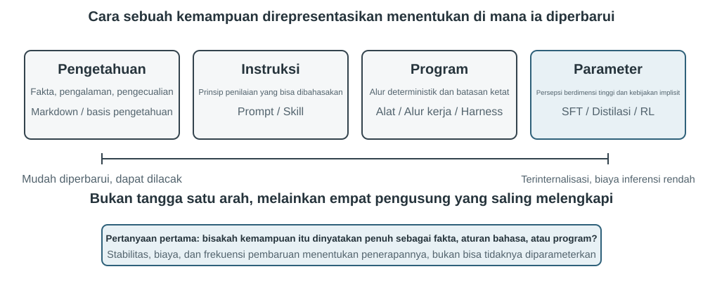
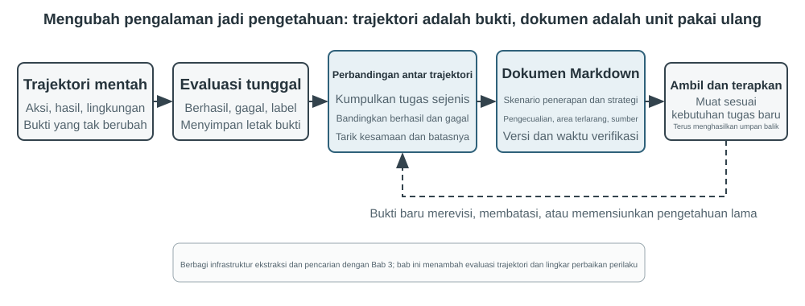

# Multimodalitas dan Interaksi Real-Time

Bab-bab sebelumnya mengeksplorasi bagaimana Agents beroperasi di dunia berbasis teks, berinteraksi dengan sistem digital melalui konteks, alat, dan kode. Namun, dunia Agent melampaui teks dan API. Saat Agent perlu memahami perintah lisan, menemukan dan mengklik tombol yang tepat di layar, atau mengarahkan lengan robot untuk memegang suatu objek, ia memasuki wilayah baru: **interaksi real-time multimodal**. Peralihan dari input dan output murni teks ke **persepsi multimodal dan respons real-time** ini adalah langkah krusial yang membawa Agent melampaui "kotak dialog." "Multimodal" secara sederhana berarti menangani berbagai bentuk informasi sekaligus—teks, ucapan, gambar, video, dan tindakan—daripada hanya teks saja.

Pertama, mari kita tentukan ruang lingkup bab ini. Pemahaman gambar statis dan dokumen—memeriksa tangkapan layar, membaca bagan, atau mem-parsing PDF—telah menjadi bagian alami dari alur kerja Agent di bab-bab sebelumnya. Untuk LLM multimodal saat ini, tugas-tugas pemahaman input-tunggal ini relatif matang dan tidak memerlukan arsitektur khusus. Bab ini mengatasi kelas masalah yang berbeda: tiga skenario di mana **batasan real-time membuat masalah multimodal menjadi sulit**—dialog suara, operasi GUI, dan kontrol robot. Dalam pengaturan ini, input tiba terus-menerus dan output harus memenuhi anggaran waktu yang ketat, yang secara fundamental mengubah arsitektur. Pemahaman real-time dari aliran visual kontinu, atau video, tetap menjadi masalah terbuka bagi Agents pada saat penulisan. Kita akan kembali membahasnya ketika bagian Computer Use menguji batas tangkapan layar frame-by-frame, dan sekali lagi dalam pertanyaan akhir bab. Satu batasan lagi: dalam kerangka buku ini, **pembuatan** multimodal (pembuatan gambar atau video) hanyalah panggilan alat biasa (tool call), sebagaimana dibahas di Bab 5 tentang Pembuatan Multimedia. Agent menggunakannya sebagai alat eksternal, sehingga tidak menimbulkan tantangan interaksi real-time yang dibahas di sini dan tetap berada di luar benang merah bab ini.

Interaksi suara, Computer Use, dan operasi robot mungkin tampak seperti tiga bidang yang sama sekali berbeda, tetapi sistem pada ketiganya menghadapi masalah yang sangat mirip: mereka harus memproses beberapa modalitas sekaligus, dan mereka sangat sensitif terhadap latensi. Jeda lebih dari dua detik dalam percakapan suara membuat orang gelisah; jitter tingkat milidetik dalam kontrol robot dapat menyebabkan tabrakan. Bersama-sama, batasan-batasan ini mendorong ketiga skenario ke arah arsitektur yang sama: menjauh dari **pipeline serial (serial pipeline)** (seperti jalur perakitan pabrik, di mana satu langkah harus selesai sebelum langkah berikutnya dimulai) dan menuju **model end-to-end** (model terpadu yang berjalan langsung dari input ke output, menghilangkan penyerahan perantara).

Bab ini diuraikan sebagai berikut:

1.  Pertama, kita menggunakan tiga paradigma arsitektur suara sebagai kerangka kerja: cascaded (pipeline VAD-ASR-LLM-TTS), omnimodal end-to-end (Omni, model tunggal yang masih mengandalkan pengambilan giliran / turn-taking), dan full-duplex (Moshi dan GPT-Live, yang mendengarkan dan berbicara secara bersamaan). Kita membandingkan latensi dan trade-off mereka dengan menanyakan seberapa jauh setiap paradigma bergerak melampaui asumsi VAD tentang giliran diskrit. Bagian cascaded juga membahas penggantian VAD + ASR dengan persepsi suara streaming.
2.  Selanjutnya, kita memeriksa bagaimana arsitektur pemikiran (thinking architecture) merekonsiliasi konflik antara "respons real-time" dan "pemikiran mendalam" (deep thinking): dari paralelisasi sederhana cepat dan lambat, hingga pendekatan terpisah di mana model penalaran latar belakang bertindak sebagai "ahli strategi" (delegasi GPT-Live, Pine AI, dll.), hingga "internalisasi" pemikiran Step-Audio R1 ke dalam satu model tunggal yang "berpikir sambil berbicara."
3.  Kemudian, kita membahas bagaimana sintesis ucapan yang lebih mirip manusia mengoptimalkan lapisan eksekusi.
4.  Terakhir, kita memperluas perspektif ke Computer Use (memungkinkan AI untuk mengoperasikan layar komputer layaknya manusia) dan operasi robot, mengamati bagaimana masalah latensi dan multimodalitas yang sama bermanifestasi dalam dua skenario ini.

Dua tema teoretis lainnya berlanjut di seluruh skenario ini dan patut mendapat perhatian khusus: **arsitektur pemikiran** (bagaimana pemikiran cepat dan lambat berkolaborasi) dan **antarmuka cepat-lambat (fast-slow interface)** yang mengikutinya (**Latent Bridge**—apa yang dapat dipertukarkan model cepat dan lambat selain teks). Meskipun diperkenalkan dalam konteks suara, ide-ide ini tidak terbatas padanya. Bagian Computer Use dan robotika menghadapi pertanyaan yang sama tentang kapan harus berkonsultasi dengan ahli strategi yang lambat, jadi ingatlah kedua tema ini.

## Suara: Antarmuka Manusia-Mesin yang Paling Alami

Suara bukan sekadar mengubah teks menjadi bunyi. Berbicara kira-kira empat kali lebih cepat daripada mengetik dan tidak menggunakan tangan maupun pandangan, sehingga cocok menempatkan Agent dalam loop input-output kontinu yang dapat disela kapan saja. Input suara mengubah ucapan menjadi teks; voice Agent membuat pengguna dapat bekerja sama langsung dengan Agent. Keduanya mendukung whisper coding dari bagian pendahuluan.

Bagian ini membahas pengguna yang berbicara kepada Agent dan Agent yang berbicara kepada dunia luar atas nama pengguna. Model suara menentukan apa yang dapat dijawab; arsitektur interaksi menentukan apakah Agent mendengar dengan baik, merespons tepat waktu, berganti giliran secara alami, dan menyelesaikan konfirmasi serta pemanggilan alat selama panggilan.

### Waktu interaksi: dari cascade ke full-duplex

Dalam pengantar GPT-Live, OpenAI merangkum tiga paradigma suara: cascade, turn-based, dan full-duplex[^ch9-12]. Ketiganya adalah pertukaran latensi, biaya, dan keteramatan, bukan penggantian linear.

| Paradigma | Struktur | Keunggulan | Batasan |
| --- | --- | --- | --- |
| Cascade | VAD → ASR → LLM → TTS | Modul jelas, mudah diganti dan di-debug | Latensi menumpuk, informasi paralinguistik hilang di batas |
| Omni end-to-end | Satu model mendengar, berpikir, dan berbicara | Latensi lebih rendah, nada, emosi, dan suara lingkungan lebih terjaga | Tetap berbasis giliran; pelatihan dan debugging lebih mahal |
| Full-duplex | Terus mendengar, berbicara, dan memutuskan | Ucapan tumpang tindih dan interupsi alami | Pelatihan, kontrol, dan evaluasi lebih rumit |

Benang merahnya adalah keluar dari asumsi bahwa orang harus berbicara bergantian dan dari tebakan VAD tentang siapa yang memegang giliran. Cascade dan Omni masih membagi percakapan menjadi giliran; full-duplex menjadikan kepemilikan giliran sebagai keputusan model yang terus berjalan.

[^ch9-12]: OpenAI. *Introducing GPT-Live.* 2026-07-08. https://openai.com/index/introducing-gpt-live/. Klasifikasi ini berasal dari rangkuman tiga generasi ChatGPT Voice; Omni end-to-end sesuai dengan kategori “turn-based voice models”.

### Paradigma 1 · Pipeline cascade

Sebagian besar asisten suara komersial masih memakai pipeline serial (Gambar 9-1): VAD menentukan akhir ucapan, ASR mengubah audio menjadi teks, LLM memahami dan menghasilkan jawaban, lalu TTS membacakannya. Modularitas memudahkan optimasi tiap komponen, tetapi setiap batas menambah waktu tunggu.


| Modul | Peran | Hambatan umum |
| --- | --- | --- |
| VAD | Menentukan ucapan selesai | Ambang hening menyebabkan tunggu dan salah segmentasi |
| ASR | Audio ke teks | Latensi pengenalan dan hilangnya konteks |
| LLM | Memahami, berpikir, dan menghasilkan | Latensi token pertama dan tunggu tambahan saat reasoning |
| TTS | Teks ke suara | Sintesis paket pertama dan buffer pemutaran |

Pada jawaban singkat, waktu tunggu VAD, ASR, LLM, dan TTS terakumulasi secara serial (Gambar 9-2). Antrean produksi memperbesar latensi idle (Gambar 9-3).




> **Eksperimen 9-1 ★: Membangun voice Agent tradisional**
>
> Hubungkan mikrofon, Silero VAD, Whisper lokal, LLM streaming, dan Fish S1 TTS melalui WebSocket untuk membuat baseline cascade. Bukti satu giliran yang dipertahankan menunjukkan rantai media dan model berjalan end-to-end, bukan benchmark konkurensi atau beban produksi. Kode dan penerimaan ada di [chapter9/live-audio](../chapter9/live-audio/).

> **Proyek tambahan: voice Agent WebRTC yang “menelepon pengguna”**
>
> PSTN tidak diperlukan. WebRTC browser dapat membuka sesi, menanyakan informasi yang kurang, mengulanginya untuk konfirmasi, dan menyimpan hasil terstruktur. Untuk menghubungi organisasi eksternal, ganti kontrak alat yang sama dengan penyedia PSTN/SIP yang patuh. Proyek ini mempertahankan identitas run historis exp9-2, tetapi tidak lagi menjadi nomor eksperimen di manuskrip. Lihat [chapter9/phone-agent](../chapter9/phone-agent/).

#### Dari serial ke persepsi streaming

ASR dapat menghasilkan transkrip sementara saat pengguna berbicara, LLM mengirim kalimat pertama ke TTS, dan TTS mengembalikan potongan audio. Ketiganya tidak menjadi paralel penuh: generasi lebih awal memerlukan pembatalan, invalidasi, mulai ulang, dan rollback ketika transkrip berubah.

Front-end VAD + ASR menimbulkan akumulasi latensi karena menunggu hening, kehilangan keraguan, emosi, backchannel, dan suara lingkungan, serta memutus konteks nama atau alamat email. Model streaming sejati membutuhkan encoder kausal/ber-chunk dan decoding inkremental; encoder Whisper menunggu segmen audio lengkap. Model audio berbasis LLM dapat mengeluarkan teks dan event semantik, tetapi simulasi prefix bukan jaminan performa kausal. Marker speak_start/end, interrupt, emotion, laugh, sigh, dan noise mempertahankan sinyal nonteks.

[^ch9-11]: Diagnosis penanaman penilaian giliran ke recognizer dan masalah label dengan informasi masa depan lihat Li, Bojie dan Noah Shi. *The Trade-off Was in the Labels: Causal Supervision for Turn-Aware Streaming ASR.* 2026 (akan terbit).

> **Eksperimen 9-2 ★: Mensimulasikan persepsi suara streaming dengan Qwen2-Audio**
>
> Qwen2-Audio bukan model streaming. Gunakan prefix audio yang makin panjang dan bandingkan dengan VAD 600 ms + Whisper. Canonical run melewati semua gate tetapi hanya mereproduksi 2/6 perilaku: panggilan prefix memerlukan 8,4–11,3 detik, sampel pause melewatkan silence, dan sampel noise salah mengklasifikasikan cough/laughter. Ini menguji mekanisme dan mode kegagalan, bukan klaim persepsi streaming 100–200 ms. Catatan lengkap ada di [chapter9/streaming-speech](../chapter9/streaming-speech/).

### Paradigma 2 · Model omnimodal end-to-end (Omni)

Cascade dapat kehilangan emosi, intonasi, dan suara lingkungan ketika audio menjadi teks. Omni mendengar, menjawab, dan berbicara dengan satu model, tetapi lebih mahal untuk dilatih, di-debug, dan diganti. Keunggulannya terutama latensi dan informasi nonteks, bukan akurasi yang pasti lebih tinggi. Self-cascade dapat memperbaiki kesalahan persepsi bila teks cukup; bila jawaban bergantung pada kecepatan, emosi, atau lingkungan, bottleneck teks menghapus bukti[^ch9-13]. Omni tetap mengasumsikan giliran dan dapat mengira jeda di tengah angka sebagai akhir.

[^ch9-13]: Pengukuran lintas-modal lengkap tentang kapan keunggulan akurasi cascade dan end-to-end berbalik: Li, Bojie dan Noah Shi. *The Cascade Gap: When and Why Self-Cascades Help Multimodal Agents.* 2026 (akan terbit).



API suara real-time berada di tengah: audio diproses native, tetapi kontrol masih bergantung pada VAD, interupsi, dan pemanggilan alat asinkron. Bandingkan mode kegagalan per tugas, bukan papan peringkat.

> **Eksperimen 9-3 ★★: Menjalankan MiniCPM-o 4.5 secara lokal, end-to-end versus self-cascade**
>
> Tetapkan satu revision, matikan thinking mode, lalu bandingkan jawaban langsung dari audio dengan transkripsi kemudian jawaban. Ini mengukur pelestarian informasi audio, bukan kemampuan “berpikir sambil berbicara”.
>
> | Tugas | End-to-end | Self-cascade | Pengamatan |
> | --- | ---: | ---: | --- |
> | Aritmetika semantik (2) | 1/2 | 2/2 | Self-cascade memperbaiki satu kesalahan transkripsi |
> | Kecepatan paralinguistik (2) | 2/2 | 1/2 | Transkrip teks menghapus perbedaan cepat/lambat |
> | Total | 3/4 | 3/4 | Total sama, kegagalan saling melengkapi |
>
> Sampel kecil; tidak dapat menetapkan jalur mana yang umumnya lebih akurat atau cepat. Bukti lengkap ada di [chapter9/end-to-end-speech](../chapter9/end-to-end-speech/).

Step-Audio 2 memproses audio mentah dan menghasilkan teks serta suara; Step-Audio R1 menginternalisasi penalaran dalam model audio.

### Paradigma 3 · Model interaktif full-duplex

Omni memisahkan “pengguna berbicara” dan “model berbicara”, tetapi penerjemahan simultan memerlukan tumpang tindih. Full-duplex terus mendengar dan berbicara sambil memutuskan lanjut, berhenti, menyela, atau memanggil alat. Moshi dari Kyutai adalah contoh awal; Thinking Machines Lab menyebut jalur ini Interaction Model[^ch9-14] dan membangun interaksi di dalam model, bukan di sekitar VAD. GPT-Live membawanya ke skala produksi.

[^ch9-14]: Thinking Machines Lab, “Interaction Models: A Scalable Approach to Human-AI Collaboration,” 2026-05. https://thinkingmachines.ai/blog/interaction-models/

Urutannya jelas: cascade menebak giliran dari ambang hening, streaming menaikkan keputusan ke tingkat semantik, dan full-duplex menjadikan pergantian giliran keputusan kontinu.

### Waktu kognitif: interaksi real-time dan pemikiran mendalam

Model latar depan harus menjawab selama pengguna masih aktif; model latar belakang dapat berpikir lebih lama. Tiga desain berikut adalah trade-off.

| Desain | Latar depan | Latar belakang | Risiko |
| --- | --- | --- | --- |
| Jawab cepat, koreksi lambat | Jawaban segera | Pikir ulang dan lengkapi | Kontradiksi |
| Interaksi cepat, nasihat lambat | Menjaga percakapan dan memilih kata | Nasihat atau hasil alat | Antarmuka terbatas |
| Penalaran dan ekspresi terpadu | Berpikir sambil berbicara | Berbagi keadaan model | Biaya pelatihan tinggi |

Desain pertama menggandakan kerja dan dapat bertentangan; desain kedua berkomunikasi secara tidak langsung; desain ketiga menyatukan keduanya. Step-Audio R1 menggunakan MGRD untuk menambatkan penalaran pada ciri akustik dan arsitektur dua otak MPS untuk menghasilkan pikiran dan suara secara paralel (Gambar 9-5 dan 9-6). Model terpadu lebih alami tetapi harus dilatih ulang bersama; desain terpisah lebih mudah mengganti otak latar belakang.

### Sintesis suara yang lebih manusiawi

TTS yang terlalu halus dan tanpa jeda terdengar seperti mesin. LLM dapat mengeluarkan THINKING, EMO:happy, dan SPEED:0.8x; TTS memetakannya ke jeda, prosodi, kecepatan, tawa, dan helaan napas. Pada Fish Audio S1, konfigurasi multi-referensi mendapat nilai tertinggi dalam tiga sesi dengar buta yang seimbang (kemiripan layanan pelanggan manusia 4,67/5), tetapi kelompok tanpa marker mengungguli referensi tunggal sehingga urutan lengkap tidak tereplikasi.

> **Eksperimen 9-4 ★★: TTS berbasis token kontrol dengan Fish Audio**
>
> Bandingkan tanpa marker, satu referensi, dan beberapa referensi; lapisan eksekusi memilih emosi, kecepatan, dan gaya. Pustaka 24 referensi, media A/B/C, dan bukti penerimaan ada di [chapter9/controllable-tts](../chapter9/controllable-tts/).

## Computer Use: Agen Otomatisasi GUI

Sekarang Anda mungkin telah memperhatikan bahwa bab ini mencurahkan lebih banyak ruang untuk suara dibandingkan dengan dua skenario berikutnya. Hal ini disengaja. Di antara sistem multimodal real-time, teknologi suara telah berkembang paling jauh dan karenanya memberikan titik referensi terbaik. Teknologi ini telah menelusuri busur penuh dari masalah aslinya—latensi yang berlebihan dalam pipeline serial—melalui model end-to-end, interaksi full-duplex, dan berpikir sambil berbicara, hingga desain yang relatif matang saat ini. Itulah mengapa kami menceritakan kisahnya secara penuh. Saat Anda membaca bagian Computer Use dan robotika, bandingkan dengan lintasan ini: seberapa jauh masing-masing bidang telah berkembang, dan di mana masing-masing bidang masih terjebak?

Ketiga skenario ini tampak berbeda tetapi menghadapi tantangan inti yang sama: persepsi real-time, pengambilan keputusan dengan latensi rendah, dan interaksi yang berkelanjutan. Selanjutnya, kita beralih ke interaksi visual, atau Computer Use, memperluas perspektif dari modalitas pendengaran ke visual: bagaimana jika sebuah Agent tidak hanya dapat memahami ucapan tetapi juga "melihat" layar dan mengoperasikan antarmuka grafisnya?

Computer Use, juga dikenal sebagai otomatisasi GUI, memungkinkan AI untuk menggunakan perangkat lunak seperti manusia dengan mengamati layar dan mengoperasikan mouse dan keyboard—misalnya, membuka browser untuk mencari informasi, mengisi data dalam aplikasi spreadsheet, atau menyesuaikan konfigurasi dalam pengaturan sistem. Intinya adalah loop **Perceive-Think-Act** (Gambar 9-6):

1.  Agent mengambil tangkapan layar dari layar saat ini.
2.  Model multimodal menerima tangkapan layar dan instruksi tugas, lalu mengeluarkan pemikiran dan tindakan spesifik.
3.  Lapisan eksekusi melakukan tindakan di lingkungan nyata (menggerakkan mouse, mengklik, mengetik teks, dll.).
4.  Menunggu antarmuka merespons, mengambil tangkapan layar lagi, dan memasuki iterasi loop berikutnya.


Ada tiga dimensi desain utama dalam loop ini: **Action Space** (operasi apa yang dapat dilakukan Agent), **Visual Grounding** (bagaimana menemukan elemen target dalam tangkapan layar), dan **Model Architecture** (bagaimana menghasilkan tindakan yang benar dari tangkapan layar).

### Desain Action Space

Anthropic mendefinisikan tiga jenis alat yang membentuk kemampuan interaksi lengkap (Gambar 9-7):


**GUI Operation Tool** (alat `computer`): Operasi mouse mencakup menggerakkan (`mouse_move`), klik kiri/kanan/tengah, klik ganda atau klik tiga kali, menyeret (`left_click_drag`), dan tindakan tekan/lepas yang lebih presisi (`left_mouse_down` dan `left_mouse_up`). Menggulir (`scroll`) mendukung empat arah dan dapat dikombinasikan dengan tombol pengubah. Operasi keyboard mencakup mengetik karakter demi karakter (`type`, dengan interval 12ms antar karakter untuk menyimulasikan pengetikan nyata), kombinasi tombol (`key`, mis., `Ctrl+C`), dan menahan tombol (`hold_key`). Tindakan persepsi mencakup mengambil tangkapan layar, mengambil posisi kursor (`cursor_position`), dan menunggu (`wait`).

**Command Execution Tool** (alat bash): Menyediakan sesi terminal bash persisten dengan batas waktu 120 detik. Alat ini menggunakan string sentinel untuk mendeteksi penyelesaian perintah dan mempertahankan status lingkungan di beberapa pemanggilan (mis., setelah `cd` ke sebuah direktori, panggilan berikutnya tetap berada di direktori tersebut).

**File Editing Tool** (`str_replace_editor`): Memungkinkan pengeditan yang aman melalui pencocokan string dan mendukung operasi lihat, buat, ganti, sisipkan, dan urungkan. Ini lebih presisi daripada menimpa seluruh file dan lebih kecil kemungkinannya untuk memodifikasi konten yang tidak terkait secara tidak sengaja.

> **Eksperimen 9-5 ★: Menjalankan Computer Use (Jalur Referensi Anthropic atau Jalur Model Terbuka)**
>
> Jalur A menggunakan Demo Anthropic Computer Use. Kontainernya mengemas lingkungan desktop Ubuntu lengkap, termasuk browser, terminal, dan tool umum lainnya. Frontend menerima tugas, sedangkan backend mengirim instruksi dan tangkapan layar ke Claude, lalu menjalankan tindakan mouse, keyboard, terminal, atau pengeditan yang dikembalikan model. Jalur ini ditujukan untuk memahami protokol tool `computer` native; tidak semua pembaca diwajibkan memiliki akses ke Anthropic API.
>
> Jalur B menggunakan proyek pendamping buku [`chapter9/computer-use-open-model`](../chapter9/computer-use-open-model/). Secara default, proyek ini menggerakkan browser-use dengan model berbobot terbuka Qwen3-VL 32B Instruct, baik melalui API hosting OpenRouter maupun dengan mengarahkan `OPEN_MODEL_BASE_URL` ke vLLM/SGLang yang di-host sendiri atau endpoint kompatibel lainnya. Endpoint harus menerima tangkapan layar dan mendukung JSON Schema native; jika hanya mendukung JSON biasa, mode kompatibilitas schema-in-prompt dapat diaktifkan secara eksplisit.
>
> Kedua jalur memakai tugas read-only dan kontrak penerimaan yang sama: maksimal 25 langkah, hanya satu tindakan per langkah, serta menyimpan identitas model/endpoint, respons mentah penyedia, tangkapan layar tiap langkah, urutan tindakan, jawaban akhir, dan alasan berhenti. Model yang berbeda harus dilaporkan sebagai lengan eksperimen terpisah; hasil model terbuka tidak boleh disajikan sebagai reproduksi Claude, dan “kontainer berhasil dimulai” tidak boleh dianggap sebagai penyelesaian tugas. Interval tindakan dan kualitas perencanaan adalah hasil yang diukur, bukan asumsi 2–5 detik ataupun kepastian bahwa model tersebut lebih unggul dari model lain.

### Visual Grounding

Dalam setiap iterasi loop, model perlu menemukan elemen target di tangkapan layar secara akurat—"Di mana kotak pencariannya?" "Apa koordinat tombol kirim?" Ini adalah masalah visual grounding. Saat ini, ada **dua pendekatan utama**: yang pertama adalah mengubah pelokalan menjadi **masalah pilihan ganda**—pertama beri anotasi elemen antarmuka dengan angka, dan model hanya perlu memilih satu; yang lainnya adalah **prediksi koordinat murni**—membiarkan model "melihat" tangkapan layar dan melaporkan koordinat secara langsung, persis seperti manusia. Pendekatan pilihan ganda memiliki dua metode implementasi: **anotasi visual murni** (Set-of-Mark asli, menggunakan model segmentasi untuk menyegmentasi wilayah kandidat dalam gambar) dan **pengindeksan elemen terstruktur** (DOM/Accessibility Tree, secara langsung membaca struktur inheren antarmuka). Keuntungan umum dari pendekatan pilihan ganda adalah mengubah masalah terbuka "temukan tombol dalam tangkapan layar dan prediksi koordinatnya" menjadi masalah tertutup "pilih satu dari elemen yang sudah dianotasi"—sama seperti pertanyaan pilihan ganda yang lebih mudah dijawab dengan benar daripada pertanyaan isian dalam ujian, model hanya perlu mengatakan "klik [123]" daripada "klik tombol biru sekitar 200 piksel di sebelah kanan sudut kiri atas layar."

**Set-of-Mark: Metode Anotasi Visual.**

Set-of-Mark (SoM) asli diusulkan oleh Microsoft Research pada tahun 2023, awalnya untuk membuka kemampuan visual grounding dari GPT-4V. Ini adalah metode **visual murni**: menggunakan model segmentasi gambar (SAM, SEEM, dll.) untuk menyegmentasi wilayah kandidat dalam tangkapan layar secara otomatis, menempatkan penanda bernomor pada setiap wilayah, dan model melihat gambar dengan angka-angka. Model hanya perlu melaporkan angka tersebut, dan sistem mengubahnya menjadi koordinat tengah dari wilayah yang sesuai. Seluruh proses tidak memerlukan DOM atau struktur antarmuka internal apa pun, sehingga sama-sama berlaku untuk perangkat lunak desktop asli dan antarmuka game—selama model segmentasi dapat mengidentifikasi wilayah kandidat.

**Pengindeksan Elemen Terstruktur: Implementasi Terstruktur dari Ide SoM di Web.**

Ketika antarmuka itu sendiri menyediakan informasi terstruktur, anotasi dapat menjadi lebih presisi. Sebelum rendering, halaman web modern mendefinisikan struktur elemen lengkap (pohon DOM) dan peran semantik yang mengidentifikasi tombol, bidang input, dan kontrol lainnya. Accessibility tree memberikan informasi serupa untuk banyak aplikasi desktop. Daripada meminta model segmentasi untuk menebak wilayah mana yang merupakan tombol dari piksel saja, sistem dapat menanyakan antarmuka secara langsung untuk elemen yang dapat dikliknya. Sistem Web Agent seperti `browser-use` melakukan hal ini: mereka menghitung dan menomori elemen interaktif dari DOM. Ini adalah implementasi terstruktur dari ide SoM untuk web (Gambar 9-8). Prosesnya memiliki empat langkah:

1. Mendapatkan representasi terstruktur (pohon DOM) dan informasi aksesibilitas untuk halaman tersebut melalui antarmuka debugging browser (CDP, Chrome DevTools Protocol)
2. Mendeteksi elemen mana yang interaktif secara otomatis (tombol, kotak input, tautan, dll.)
3. Menganotasi setiap elemen interaktif dengan ID unik dan menggambar kotak pembatas (bounding box) pada tangkapan layar
4. Secara bersamaan menghasilkan daftar teks yang mendeskripsikan elemen yang sesuai dengan setiap ID

```
Tangkapan layar: [Elemen kunci pada gambar dianotasi dengan ID seperti [1], [2], [3], [4]]

Elemen:
[1] <input type="text" placeholder="Search" aria-label="Search" />
[2] <button id="submit-btn" aria-label="Submit form" />
[3] <input type="text" placeholder="Enter your name" value="" />
[4] <a href="/docs" aria-label="Documentation" />
```

Model hanya perlu menghasilkan ID, dan sistem secara otomatis mengklik bagian tengah elemen yang sesuai. Pendekatan ini tidak menghemat token karena semua data anotasi tetap harus dikirim ke model, tetapi memberikan pelokalan yang akurat dan stabil sembari menghindari deteksi yang terlewat dan positif palsu yang dapat diperkenalkan oleh model segmentasi.


**Prediksi Koordinat Murni.**

Rute ketiga melewatkan anotasi dan meminta model untuk mengeluarkan koordinat secara langsung. Sistem seperti **SeeClick** dan computer use Claude mengandalkan model visi yang dilatih pada dataset besar tangkapan layar GUI yang dipasangkan dengan posisi elemen. Model ini belajar memetakan deskripsi bahasa alami (mis., "klik tombol kirim") secara langsung ke koordinat tangkapan layar yang tepat, mengandalkan persepsi visual seperti pengguna manusia.

Dalam skema prediksi koordinat, pemahaman model tentang koordinat sangat bergantung pada resolusi yang digunakan selama pelatihan (Gambar 9-9). Claude dilatih menggunakan XGA (1024×768), WXGA (1280×800), dan FWXGA (1366×768). Jika resolusi tangkapan layar input tidak cocok, prediksi koordinat model akan bergeser secara sistematis—seperti mengukur jarak di peta kecil dan kemudian menerapkannya secara langsung ke peta besar. Oleh karena itu, mekanisme penskalaan koordinat dua arah harus diimplementasikan pada lapisan alat, dan resolusi target harus **dipilih berdasarkan rasio aspek** untuk menghindari peregangan tidak seragam yang mendistorsi gambar dan akibatnya membiaskan penilaian koordinat. Misalnya, jika resolusi layar sebenarnya adalah 2560×1440 (16:9), target yang paling sesuai di antara tiga opsi yang didukung Claude adalah FWXGA (1366×768), yang memiliki rasio aspek terdekat dengan 16:9. Tangkapan layar diskalakan secara proporsional menjadi 1366×768 dan diumpankan ke model; setelah model mengeluarkan koordinat klik (683, 384), koordinat tersebut dipetakan secara terbalik ke koordinat sebenarnya (683×2560/1366, 384×1440/768) ≈ (1280, 720). Sebaliknya, jika gambar 16:9 diregangkan secara paksa ke 4:3 1024×768, gambar akan dikompresi secara horizontal, menyebabkan prediksi koordinat model bergeser secara sistematis.


Pilihan di antara ketiga rute tersebut dapat diringkas sebagai berikut: **ketika informasi terstruktur tersedia, prioritaskan pengindeksan DOM/accessibility-tree** untuk pelokalan yang paling akurat dan stabil. **Ketika tidak tersedia**—dalam perangkat lunak desktop asli seperti Photoshop, antarmuka yang dirender canvas/WebGL, atau game—**gunakan anotasi visual (rute SoM asli) atau prediksi koordinat**. Anotasi visual mengubah pelokalan menjadi masalah pilihan ganda, membuatnya lebih ramah terhadap model serbaguna tanpa pelatihan khusus. Prediksi koordinat menghilangkan langkah anotasi dan lebih langsung untuk model yang dilatih khusus pada pelokalan GUI. Kedua pendekatan ini masih kesulitan dengan elemen kecil dan antarmuka yang padat.

> **Eksperimen 9-6 ★: Menggunakan browser-use untuk Mengimplementasikan Operasi Browser Otomatis**
>
> Gabungkan Playwright, framework otomatisasi browser, dengan model multimodal untuk mengimplementasikan operasi browser yang digerakkan bahasa alami. Aktifkan visualisasi SoM dan simpan tangkapan layar dengan anotasi bounding box sebelum setiap keputusan. Antarmuka model tidak terbatas pada OpenAI atau Anthropic; buku ini menyediakan konfigurasi API untuk model terbuka Qwen3-VL dan mempertahankan base URL generik yang kompatibel dengan OpenAI untuk layanan hosting lain atau inferensi yang di-host sendiri.
>
> Tugas pengujian “Buka Google dan cari cuaca San Francisco”: setelah startup, tangkapan layar menampilkan halaman pencarian Google dengan elemen interaktif bernomor. Model memilih kotak pencarian, memasukkan “San Francisco weather today”, mengirim pencarian, lalu mengekstrak suhu dan kondisi cuaca dari halaman hasil. Saat penerimaan, verifikasi jawaban dan trajectory secara independen serta catat jumlah langkah dan durasi aktual apa adanya. “5 langkah, sekitar 20 detik” hanya boleh menjadi hasil pengamatan dari satu proses tertentu, bukan hasil tetap tanpa bukti eksekusi.
>
> Proses resmi model terbuka yang disimpan buku menggunakan `qwen/qwen3-vl-32b-instruct` di OpenRouter. Saat menemui CAPTCHA di Google Search pada langkah 4, model tidak mengklaim berhasil; model beralih ke weather.com dan pada langkah 16 membaca 64°F, Sunny, terasa seperti 62°F, tertinggi 74°F, dan terendah 55°F dari halaman Today San Francisco. Seluruh 16 dari 16 respons API melaporkan model Qwen3-VL yang diminta, dan 15 tangkapan layar langkah yang valid beserta trajectory tindakan read-only lolos penerimaan deterministik independen. Hasil ini membuktikan bahwa jalur API model terbuka dapat dijalankan; bukan berarti lengan tool `computer` native Anthropic telah direproduksi.

### Computer Use Agent yang Dapat Menonton Animasi dan Mendengar Suara

Sejauh ini, persepsi Computer Use didasarkan pada asumsi implisit: **layar bersifat statis**—ambil tangkapan layar, pikirkan langkah berikutnya, klik, dan ambil tangkapan layar berikutnya. Layar yang sebenarnya memutar video, menampilkan notifikasi kilat yang menghilang dalam hitungan detik, dan memutar audio dari rapat. Sebuah Agent yang membuka matanya hanya setiap 3–5 detik sekali dan sama sekali tidak memiliki telinga akan buta dan tuli terhadap semua yang terjadi di antara dua frame. Menonton rekaman layar, bergabung ke rapat, mengikuti petunjuk suara, menangkap kotak dialog sebelum menghilang—seluruh kategori pekerjaan komputer sehari-hari ini secara efektif terlarang bagi Computer Use Agent saat ini.

Apa yang benar-benar perlu didesain ulang di sini bukanlah "antarmuka tindakan", melainkan "**antarmuka pengamatan**"[^ch9-9]. Ide intinya adalah memisahkan **pengamatan** (berkelanjutan, adaptif, multimodal) dari **tindakan** (diskrit), menciptakan lapisan middleware perseptual yang berada di antara lingkungan dan model Computer Use mana pun tanpa memerlukan pelatihan ulang. Kita dapat menyebutnya Agent–Computer Observation Interface (AOI). Antarmuka ini memiliki tiga komponen yang "dikendalikan oleh gerbang" (gated): Pertama, **pengambilan keyframe antar-frame**—menggunakan gerbang piksel yang sangat murah untuk melewati frame yang hampir tidak berubah, kemudian menggunakan model kecil untuk menentukan apakah ada perubahan bermakna yang terjadi, mengambil frame hanya saat ada perubahan, menghasilkan biaya yang hampir nol untuk layar statis; Kedua, **transkripsi ucapan dengan gerbang volume**—hanya memanggil pengenalan ucapan saat ada suara, memberi Agent "telinga" untuk pertama kalinya; Ketiga, dan yang paling kritis, **mengubah pengamatan menjadi deskripsi tekstual yang persisten**—meminta model mendeskripsikan frame yang ditangkap dalam satu kalimat (mis., "Munculan tersebut baru saja mengatakan bahwa tanggal rilis telah diubah menjadi 28 April"), dan **bahkan jika gambar asli kemudian dihapus dari konteks, teks ini tetap berada di dalam memori**, meneruskan informasi dinamis tersebut dalam bentuk tekstual.

Temuan yang berlawanan dengan intuisi adalah bahwa hal yang benar-benar penting bukanlah pemilihan frame, melainkan konversi frame yang dipilih menjadi teks yang persisten, karena teks adalah modalitas yang paling baik ditangani oleh LLM Agent. Pada delapan model, mulai dari model berparameter 7B hingga sistem skala perbatasan (frontier-scale), middleware ini memberikan peningkatan +17 hingga +48 poin persentase tanpa pelatihan ulang apa pun, dengan celah terlebar pada tugas-tugas suara: dengan adanya lapisan perseptual ini, Agent akhirnya dapat menyelesaikan tugas-tugas suara yang sebelumnya "dapat didengar tetapi tidak dapat ditindaklanjuti". Namun, ini bukanlah konfigurasi yang berlaku untuk semua—pada beberapa model yang lebih baru, memasukkan terlalu banyak token gambar akan mengganggu proses penalaran dan menurunkan performa. Jadi komponen-komponennya harus **dipilih per model**, tidak dinyalakan secara keseluruhan. Ini adalah pelajaran yang sama dengan trade-off antara Set-of-Mark versus prediksi koordinat: tidak ada solusi instan (silver bullet) dalam skema persepsi; Anda harus mengonfigurasinya agar sesuai dengan temperamen model.

[^ch9-9]: Untuk mekanisme lengkap dan ablasi per model dari ketiga komponen—gated keyframes, on-demand transcription, dan narrating frames into persistent text—lihat Bojie Li dan Noah Shi. *Agent-Computer Observation Interfaces Enable Dynamic Computer Use.* arXiv:2606.29472, 2026.

### Seluler: Hambatan Ekosistem Lebih Sulit Daripada Teknologi
### World model untuk Computer Use

Antarmuka observasi menjawab “apa yang terjadi di antara dua screenshot?” dengan mengirim perubahan dinamis lebih cepat dan menyimpannya dalam memori. Namun antarmuka ini tidak menghapus biaya perencanaan: Agent masih dapat mengulang loop serial “screenshot—berpikir—klik” dan meninjau ulang langkah setelah setiap tindakan. OSWorld-Human menunjukkan bahwa akurasi setara manusia dapat dicapai dengan jauh lebih banyak langkah dan waktu tunggu.

Manusia mengoperasikan desktop secara prediktif: mengantisipasi akibat tindakan, lalu melanjutkan rencana tanpa replanning ketika keadaan yang diamati sesuai prediksi. Hanya penyimpangan yang memicu observasi dan perencanaan ulang. Inilah speculative execution, dan world model membuatnya tersedia bagi Agent. **World model menyelesaikan separuh masalah yang lain**: memprediksi keadaan berikutnya, melanjutkan saat cocok dengan kenyataan, dan melakukan replanning atau berhenti saat tidak cocok.

Computer Use juga berkembang ke perangkat seluler. Sistem seluler dan desktop memang berbeda secara teknis: alih-alih mengandalkan koordinat mouse dan input keyboard, action space seluler biasanya menggunakan API layanan aksesibilitas sistem (mis., `AccessibilityService` di Android) untuk membaca elemen antarmuka dan mengeluarkan klik atau memasukkan teks. Interaksi juga beralih dari penunjuk mouse ke gestur sentuh, sehingga mengubah makna koordinat. Posisi `(x, y)` yang sama dapat menunjukkan ketukan, tekanan lama, atau titik awal dari geseran (swipe), sehingga tindakan tersebut juga harus menentukan jenis gestur. Benchmark seluler seperti AndroidWorld, yang diperkenalkan di Bab 6, mengevaluasi kemampuan Agent untuk menyelesaikan tugas dalam aplikasi nyata di dalam action space ini.

Namun, apa yang benar-benar menghalangi Computer Use di seluler seringkali bukanlah perbedaan teknis ini, melainkan hambatan ekosistem. Beberapa produsen ponsel telah mencoba mengintegrasikan asisten AI ke dalam ponsel tingkat konsumen sehingga asisten tersebut dapat secara otomatis mengoperasikan aplikasi sehari-hari seperti WeChat, Taobao, dan Alipay, tetapi mereka dengan cepat menemui pembatasan platform.

Hal ini mengungkap tantangan unik bagi Computer Use: **ecosystem barriers**. Alasan mendasar di balik pembatasan ini adalah konflik model bisnis. Logika monetisasi inti dari aplikasi internet tradisional adalah **traffic and attention**: pengguna melihat iklan saat menggulir feed, dipandu oleh algoritma rekomendasi saat mencari produk, dan melakukan pembelian impulsif saat menjelajahi halaman. Ketika sebuah Agent beroperasi atas nama pengguna, rantai monetisasi tersebut dilewati sepenuhnya: AI mengabaikan iklan, tidak melakukan pembelian impulsif, langsung menuju tujuan, menyelesaikan tugas, dan pergi. Bagi platform yang hidup dari iklan dan lalu lintas, setiap operasi Agent mengikis fondasi dari model bisnis tersebut.

Ini berarti bahwa Computer Use tidak hanya menghadapi tindakan balasan teknis seperti CAPTCHA, tetapi juga **konflik kepentingan struktural**. Konflik ini akan sulit diselesaikan dalam jangka pendek dan menimbulkan hambatan yang lebih besar untuk adopsi konsumen daripada sekadar masalah teknis.

### Performa Real-Time: Tantangan Inti yang Belum Terpecahkan

**OSWorld**, yang metodologi evaluasinya dijelaskan pada Bab 6, adalah tolok ukur yang banyak digunakan untuk Computer Use yang menguji kemampuan Agent untuk menyelesaikan tugas lintas aplikasi di lingkungan nyata Ubuntu/Windows/macOS. Model general-purpose awal hanya mencapai sekitar 20% tingkat keberhasilan pada tolok ukur ini. Model khusus berikutnya dan model general-purpose yang lebih kuat terus mendorong tingkat keberhasilan menjadi lebih tinggi, secara bertahap mendekati performa tingkat manusia pada saat penulisan ini. Namun, tingkat keberhasilan masih jauh dari garis akhir—bottleneck sebenarnya telah bergeser dari "bisakah ia melakukannya dengan benar?" menjadi "bisakah ia melakukannya dengan cepat?"

Studi efisiensi **OSWorld-Human** menghasilkan temuan yang menyadarkan: bahkan ketika tugas tersebut pada akhirnya berhasil, Agent membutuhkan langkah yang jauh lebih banyak daripada manusia, dan latensi inferensi per langkah terus bertambah seiring berjalannya tugas—semakin panjang konteksnya, semakin lambat model memutuskan, sehingga langkah-langkah akhir sering kali memakan waktu jauh lebih lama daripada langkah-langkah awal. Penyesuaian pemformatan dokumen yang membutuhkan waktu puluhan detik bagi manusia dapat memakan waktu beberapa menit untuk diselesaikan oleh Agent. **Akurasi tingkat manusia tidak sama dengan kepraktisan penggunaan; efisiensi adalah bottleneck yang sebenarnya.**

Akar penyebabnya mencerminkan skenario ucapan (speech): dalam loop serial "screenshot-think-click", bahkan dengan setiap tahapan dioptimalkan hingga maksimal, akumulasi penundaan langkah demi langkah tetap tidak dapat diterima. Masalah yang lebih mendalam adalah Computer Use saat ini sama sekali tidak dapat berpikir ke depan. Jika Agent dapat memprediksi langkah selanjutnya sambil mengeksekusi langkah saat ini—memikirkan di mana harus mengklik selanjutnya sementara halaman masih dimuat—ia dapat melakukan overlap proses berpikir dengan eksekusi dan memotong total latensi secara tajam (tuntutan yang sama seperti thinking-while-speaking di awal bab ini dan asynchronous Agent dengan "continuous thinking" pada Bab 4, yang dibingkai ulang di sini sebagai thinking-while-operating).

Tidak seperti domain speech, saat ini tidak ada solusi sistematis untuk meningkatkan performa real-time dari Computer Use itu sendiri—membuat loop "screenshot-think-click" menjadi lebih cepat—dan ia tetap terjebak dalam loop diskrit berupa tangkapan layar frame-by-frame. Namun, sebuah jalan pintas (workaround) telah terbukti efektif, menggunakan pemisahan (decoupling) fast-slow yang muncul berulang kali dalam bab ini: karena sulit untuk membuat Computer Use agent yang lambat menjadi lebih cepat, **jangan biarkan pengguna menunggunya**. Gunakan dua model secara bersamaan: model cepat untuk speech dan model lambat untuk operasi komputer[^ch9-10]. Model cepat menangani percakapan suara real-time, sementara VLM mutakhir beroperasi langkah demi langkah di dalam browser. Keduanya berkomunikasi hanya melalui "plain text contract" (kontrak teks biasa) minimal: setiap kali Agent yang lambat melakukan sebuah aksi, ia memperbarui ringkasan status bergulir ("Sedang mengisi formulir, masih membutuhkan tanggal lahir Anda"). Agent cepat menggunakan ini untuk menjawab pengguna secara real-time dan meneruskan informasi baru apa pun yang diberikan pengguna secara lisan ke Agent lambat. Yang krusial, **Agent cepat tidak boleh mengatakan "selesai" sampai ringkasan status mengonfirmasi penyelesaian**. Ini adalah skenario "berbicara di telepon sambil membiarkan komputer beroperasi sendiri." Dalam eksperimen, decoupling ini membuat respons suara sekitar 15 kali lebih cepat daripada model tunggal yang beroperasi dan berbicara sekaligus (latensi median 0,58 detik vs 8,64 detik), tanpa penurunan tingkat keberhasilan tugas. Hapus saluran teks antara yang cepat dan yang lambat, dan tingkat keberhasilan runtuh ke angka nol—informasi penting yang diberikan pengguna secara lisan tidak dapat lagi mencapai browser. Ini adalah ide yang sama dengan Latent Bridge sebelumnya dan thinking-while-speaking dalam skenario speech: ketika satu komponen secara inheren lambat, biarkan yang cepat mengisi waktu tunggu pengguna—dan "plain text contract" itu, pada dasarnya, adalah konsep Agent Status Bar yang diperkenalkan di Bab 2. Mempercepat loop Computer Use itu sendiri mungkin akan menjadi arah penelitian penting berikutnya, tetapi menyembunyikan kelambatan di balik decoupling fast-slow sudah menjadi jawaban yang dapat diterapkan.

[^ch9-10]: Desain lengkap dari decoupling fast-slow untuk speech-operation dan "plain text contract" dapat ditemukan di Bojie Li dan Noah Shi. *Talking While Acting: Real-Time Voice for Slow Computer-Use Agents.* 2026 (mendatang).

## Robot Manipulation: Dari Kontrol Real-Time ke Pelatihan dan Generalisasi

> **Kelima eksperimen di bagian ini memakai satu tugas yang sama: masukkan cangkir merah ke baki, masukkan kertas kuning ke tempat sampah, lalu amati ulang dan verifikasi keadaan meja. Robot nyata dan simulator dilaporkan terpisah, tetapi semantik tindakan dan kriteria keberhasilannya sama.**
>
Voice Agent melawan latensi dalam modalitas pendengaran; Computer Use melakukannya dalam modalitas visual. Ketika sebuah Agent harus mengendalikan robot di dunia fisik, latensi dan multimodalitas menjadi semakin menantang—tindakan memiliki konsekuensi yang tidak dapat diubah (irreversible), dan satu tabrakan dapat merusak objek atau robot itu sendiri. Bagian ini pertama-tama menunjukkan bagaimana robot menjinakkan masalah kontrol real-time dengan arsitektur dua lapis dan Action Chunking, lalu beralih ke masalah yang lebih sulit yang mereka hadapi saat ini—pelatihan dan generalisasi: dari mana data berasal, dan bagaimana model ditransfer lintas tugas dan platform.

### Perangkat Keras Bukanlah Bottleneck; Algoritma Adalah Bottleneck-nya

Mengapa robot belum diadopsi secara luas dalam pengaturan open-ended yang general-purpose? Apakah bottleneck-nya ada pada perangkat keras (hardware) atau algoritma? Proyek XLeRobot memberikan contoh tandingan yang kuat: ketika dikendalikan dari jarak jauh oleh manusia melalui headset VR, robot beroda lengan ganda yang berharga kurang dari $1.000 sudah dapat melakukan berbagai tugas rumah tangga dengan lancar. Robot Unitree juga dapat menangani tugas rumah tangga yang lebih kompleks yang membutuhkan tangan cekatan ketika dioperasikan oleh manusia. Latensi teleoperasi (teleoperation) adalah sekitar 100-200ms, dekat dengan waktu respons yang diperlukan untuk interaksi fisik. Pada platform berbiaya rendah saat ini, resolusi sensor, presisi aktuator, dan frekuensi kontrol—berapa kali per detik robot memperbarui perintah tindakannya—sudah cukup untuk tugas-tugas praktis. Frekuensi kontrol yang lebih rendah menghasilkan gerakan yang kurang mulus dan meningkatkan jitter atau penyimpangan dari lintasan target.

Klaim ini membutuhkan batasan yang jelas: contoh teleoperasi hanya menunjukkan bahwa perangkat keras berbiaya rendah yang ada, dikombinasikan dengan kecerdasan manusia, sudah cukup untuk **tugas manipulasi rumah tangga yang bergantung terutama pada umpan balik visual**. Ini tidak berarti bahwa perangkat keras tersebut memadai dalam segala hal. Tidak adanya penginderaan taktil serta biaya dan keandalan tangan yang cekatan (dexterous hands) tetap menjadi batasan yang sudah dikenal. Untuk tugas yang sangat bergantung pada kontrol kekuatan presisi dan umpan balik taktil, perangkat keras mungkin memang menjadi bottleneck-nya. Pernyataan "perangkat keras bukanlah bottleneck" oleh karena itu terbatas pada kelas tugas yang dibahas di bagian ini.

Untuk tugas-tugas ini, kesenjangan sebenarnya terletak pada lapisan algoritmik, yang diuraikan dalam dua subbagian berikut.

> **Eksperimen 9-7 ★: Teleoperasi XLeRobot untuk merapikan meja**
>
> **Tujuan:** Operator mengendalikan XLeRobot nyata dari jarak jauh untuk melakukan tugas yang sama dan memverifikasi keadaan meja.
>
> **Prinsip:** Lengan robot seharga beberapa ratus dolar dapat menyelesaikan tugas multi-langkah ini di bawah kecerdasan manusia melalui teleoperasi; untuk tugas ini badan perangkat keras bukan bottleneck, melainkan persepsi, perencanaan, kontrol closed-loop, dan pemulihan kegagalan.
>
### Arsitektur Dua Lapis: Pemisahan Perencanaan dan Kontrol

Robot perlu membuat keputusan pada dua skala waktu yang berbeda untuk menyelesaikan tugas rumah tangga yang kompleks. Lapisan pertama adalah **long-horizon planning** (perencanaan jangka panjang) yang lebih lambat: menguraikan instruksi tingkat tinggi seperti "bersihkan meja" menjadi urutan sub-tujuan (membersihkan meja, memuat mesin pencuci piring, menyeka permukaan). Ini membutuhkan pemahaman semantik lingkungan, penalaran tentang dependensi tugas, dan perencanaan urutan tindakan multi-langkah—mirip dengan bagaimana seseorang berpikir tentang "apa yang harus dilakukan pertama kali dan apa yang harus dilakukan selanjutnya" sebelum memulai. Lapisan kedua adalah **VLA control** (Vision-Language-Action model) yang lebih cepat: mengeksekusi setiap operasi spesifik ("berjalan ke wastafel," "mengambil kain," "menyeka meja"), terus-menerus mengeluarkan sinyal kontrol berdasarkan masukan visual saat ini dan instruksi bahasa untuk memastikan gerakan robot yang halus dan koheren.

Arsitektur dua lapis ini memisahkan tanggung jawab secara efektif: long-horizon planning menangani "apa yang harus dilakukan," sementara VLA control menangani "bagaimana melakukannya." Kombinasi pengambilan keputusan tingkat tinggi yang lambat dan eksekusi tingkat rendah yang cepat ini sangat mirip dengan arsitektur fast-slow yang dijelaskan sebelumnya untuk speech: keduanya menugaskan penalaran kompleks dan respons real-time ke modul yang berbeda. Namun, pemisahan perencanaan/kontrol (planning/control split) berkaitan dengan penalaran mendalam yang lambat versus respons real-time yang cepat, bukan pemisahan pemikiran/ekspresi antara Formulation Brain dan Articulation Brain milik MPS dalam Solusi 3. MPS memisahkan berpikir dari berbicara; arsitektur robotika memisahkan perencanaan global dari eksekusi real-time. Oleh karena itu, kedua arsitektur tersebut membagi pekerjaan pada dimensi yang berbeda.

Batasan real-time tidak hilang; mereka telah didorong turun ke lapisan VLA control, di mana **Action Chunking** membantu memitigasinya (lihat subbagian "VLA Control" di bawah). Model menghasilkan urutan pendek dari tindakan masa depan dalam satu inferensi tunggal, dan thread kontrol memutarnya kembali (replay) pada frekuensi tinggi, mengamortisasi latensi inferensi di atas eksekusi seluruh urutan tersebut. Ini menciptakan trade-off (kompromi) yang tak terhindarkan antara kehalusan dan daya tanggap (responsiveness): chunk yang lebih panjang menyebarkan latensi pada lebih banyak tindakan dan menghasilkan gerakan yang lebih halus, tetapi model tidak menerima masukan visual baru selama interval tersebut dan oleh karena itu bereaksi lebih lambat terhadap perubahan mendadak, seperti objek yang dipindahkan atau tangan yang menghalangi jalan. Arsitektur dua lapis tidak menghilangkan ketegangan ini; ia hanya memindahkannya.

Fokus bab ini sekarang bergeser: dalam robotika, ketegangan real-time sebagian telah diredakan oleh pemisahan (decoupling) dua lapis dan Action Chunking, sementara **pelatihan dan generalisasi**—bagaimana mendapatkan cukup data demonstrasi dan membuat model menggeneralisasi di berbagai tugas dan platform—telah menjadi perhatian utama. Subbagian berikut memperluas tema lingkungan simulasi dari Bab 6 dan Reinforcement Learning (RL) dari Bab 7 ke dalam dunia fisik.

Tantangan baru ini terutama jatuh pada lapisan VLA control. Pikirkan VLA sebagai "VLM + output tindakan": **VLM** (Vision-Language Model—model besar yang memahami gambar dan teks) menangani persepsi dan penalaran, sementara VLA juga harus bertindak—dan tindakan (action) adalah letak kesulitan sebenarnya. Saat ini, lapisan VLA control dilatih terutama melalui Imitation Learning, atau **Behavior Cloning**, yang mempelajari pemetaan dari observasi ke tindakan menggunakan koleksi besar demonstrasi manusia. OpenVLA, RT-2, dan π₀ semuanya masuk dalam kategori ini. Reinforcement Learning belakangan ini muncul sebagai teknik pelengkap. Meskipun VLA yang dilatih dengan RL dapat berkinerja baik pada tugas-tugas individual, mereka sering kali menggeneralisasi dengan buruk. Misalnya, SimpleVLA-RL dari Bab 7 melaporkan hasil tugas tunggal (single-task) yang kuat pada LIBERO, tetapi ia dilatih secara terpisah untuk setiap tugas daripada sebagai satu model terpadu yang menggeneralisasi secara Zero-Shot di semua tugas. Pola satu kali pelatihan per tugas (one-training-run-per-task) ini berarti bahwa setiap tugas baru membutuhkan pengumpulan data dan pelatihan ulang yang baru.

Dua bagian berikut mendalami solusi teknis spesifik untuk long-horizon planning dan VLA control, secara berurutan.

### Long-Horizon Planning: Dari VLM ke Model Embodied Reasoning Khusus

VLM yang bersifat general-purpose sudah memiliki kemampuan Embodied Reasoning yang layak. **Gemini Robotics-ER 1.5** dari Google DeepMind secara khusus dioptimalkan untuk Embodied Reasoning (memahami posisi, pergerakan, dan hubungan kausal objek di dunia fisik). Model ini mencapai rata-rata 62,8% di 15 tolok ukur akademik (Point-Bench, RefSpatial, RoboSpatial, BLINK, dll.), melampaui GPT-4o (60,6%) dan Gemini 2.5 Pro (59,3%). Keunggulan utamanya meliputi: pemahaman spasial (spatial understanding) dan lokalisasi objek (object localization) tingkat lanjut, penalaran temporal (memprediksi konsekuensi tindakan seperti "apa yang terjadi jika saya mendorong cangkir ini"), pengurutan tugas (menguraikan instruksi tingkat tinggi ke dalam langkah-langkah yang lebih kecil), dan dukungan bawaan (native) untuk mekanisme pemikiran serta pemanggilan alat (Tool Calls).[^ch9-2]

[^ch9-2]: Google DeepMind, "Gemini Robotics-ER 1.5." https://deepmind.google/models/gemini-robotics/gemini-robotics-er/

> **Eksperimen 9-8 ★: Mengukur batas atas kontrol ideal di simulator**
>
> **Tujuan:** Jalankan tugas yang sama dengan pengendali ideal yang tidak salah mempersepsi atau memilih tindakan, sehingga tersedia batas atas yang dapat diulang.
>
> **Prinsip:** Acuan ini mengukur kemampuan ketika keputusan selalu benar; ini bukan bukti bahwa robot nyata telah menjalankan tugas.
>

> **Eksperimen 9-9 ★★: Gemini Robotics-ER 1.5 mengendalikan XLeRobot nyata secara otonom**
>
> **Tujuan:** Gantikan operator manusia dengan Agent yang mengamati meja dan memanggil skill pick, place, serta verify yang dibatasi, dengan robot dan kriteria sukses yang sama seperti Eksperimen 9-7.
>
> **Prinsip:** Perbandingan langsung mengungkap kesenjangan persepsi, perencanaan, pengaturan waktu, kontrol tertutup, dan pemulihan—bukan keterbatasan mekanis baru.
>

### VLA Control: Dari Data Demonstrasi ke Generalisasi Cross-Embodiment

Dalam lapisan eksekusi dari arsitektur dua lapis, tiga model representatif—RT-2, OpenVLA, dan π₀—semuanya fokus pada VLA control, yaitu, mengeluarkan tindakan robot secara real-time berdasarkan gambar kamera dan instruksi bahasa (Gambar 9-10). Mereka mengikuti dua pendekatan berbeda untuk representasi tindakan: discrete action tokens dan continuous trajectory generation.


**RT-2 dan OpenVLA: Rute Discrete Action Token.**

**RT-2** memelopori rute ini: ia secara langsung melakukan fine-tuning pada vision-language model berskala besar, mendiskritisasi (discretizing) tindakan kontinu robot menjadi token dan mengeluarkannya secara autoregresif satu per satu, seperti menghasilkan teks. Ia memanfaatkan kemampuan generalisasi dari model pra-pelatihan (pre-trained model) untuk meningkatkan Zero-Shot transfer ke objek dan instruksi baru. **OpenVLA** mengikuti skema representasi tindakan RT-2, menyatukan language model dan vision encoder dalam arsitektur tunggal. Model ini mengambil gambar dan instruksi teks sebagai input dan mengeluarkan action tokens. Pelatihan dilakukan dalam dua tahap: pertama, pra-pelatihan (pre-training) pada dataset lintas platform (cross-platform) berskala besar yaitu Open X-Embodiment (mencakup demonstrasi manipulasi dunia nyata dari lebih dari 20 platform robot) untuk mempelajari pengetahuan manipulasi umum (pola tindakan seperti "menggenggam" dan "meletakkan" adalah hal umum di berbagai robot); kedua, fine-tuning dengan sejumlah kecil data untuk platform tertentu. Karena representasi tindakan mereka serupa, perbedaan praktis yang ditekankan di sini terletak pada keterbukaan dan pilihan teknik (engineering choices): RT-2 dan data pelatihannya adalah internal Google, sementara OpenVLA sepenuhnya open-source—sebuah model tulang punggung (backbone) open-source (Llama 2 plus vision encoder) yang dipasangkan dengan dataset publik, membuat tumpukan (stack) OpenVLA dapat direproduksi dan diperluas oleh komunitas yang lebih luas.

**Action Chunking: Teknik Kompensasi Frekuensi Universal dalam Domain VLA.**

Karena inferensi model besar berjalan lambat, VLA menjalankan inferensi pada frekuensi yang jauh lebih rendah daripada operasi pengendali (controllers) robot tradisional. Kontrol tradisional biasanya berjalan pada 50-1000Hz, sedangkan inferensi VLA biasanya hanya berjalan pada sekitar 1-10Hz—kesenjangan yang dapat berkisar dari satu hingga tiga urutan besarnya (orders of magnitude). OpenVLA asli menggambarkan masalah ini: ia hanya mengeluarkan satu tindakan per inferensi, pada sekitar 6Hz menggunakan single-step autoregressive prediction, dan gerakannya yang tersentak-sentak (jerky) adalah salah satu kekurangannya yang paling banyak dikritik. **Action Chunking** adalah teknik umum untuk menjembatani kesenjangan ini. Pertama kali diusulkan oleh ACT (Zhao dkk., 2023) dan kemudian diadopsi oleh π₀, OpenVLA-OFT, dan lainnya, teknik ini membuat model menghasilkan urutan pendek tindakan masa depan dalam setiap inferensi alih-alih satu tindakan tunggal. Dalam konfigurasi π₀ yang tipikal, misalnya, model menghasilkan sebuah chunk 0,5-1 detik yang berisi 25-50 tindakan pada frekuensi kontrol 50Hz. Thread kontrol mengeksekusi tindakan tersebut secara berurutan pada frekuensi tinggi sementara model menghasilkan batch berikutnya secara asinkron di latar belakang. Selama inferensi selesai sebelum batch tindakan saat ini selesai dieksekusi, robot dapat mempertahankan gerakan yang kontinu dan halus—mirip seperti penyanggaan (buffering) video yang mencegah pemutaran menjadi tersendat dengan memuat konten terlebih dahulu.

**π₀: Rute Continuous Trajectory Generation.**

Pembagian sebenarnya dalam representasi tindakan bukan antara RT-2 dan OpenVLA, tetapi antara **discrete tokens dan continuous trajectory generation**. **π₀** mengikuti rute yang terakhir: daripada memprediksi discrete action tokens satu per satu, ia menggunakan flow matching, sebuah metode pembuatan kontinu yang terkait dengan diffusion models, untuk memulai dengan random noise (random noise) dan secara iteratif "menghilangkan noise tersebut" (denoise) tersebut menjadi lintasan tindakan kontinu yang halus. Representasi ini berpasangan secara alami dengan Action Chunking dan berkinerja lebih baik pada tugas-tugas seperti manipulasi cekatan (dexterous manipulation) yang menuntut gerakan yang presisi dan mengalir. Sebagai analogi, pendekatan discrete-token menyerupai pemilihan perintah seperti "5 derajat ke kiri" dan "3 cm ke depan" satu per satu dari menu. Continuous trajectory generation lebih seperti seorang seniman yang membuat sketsa seluruh kurva lalu menyempurnakannya goresan demi goresan.

### Transfer Sim2Real: Kesenjangan dari Simulasi ke Realitas

Bagian simulasi Bab 6 telah menjelaskan dari mana kesenjangan sim-to-real (Sim2Real) berasal dan bagaimana Domain Randomization melawannya, jadi kita tidak akan mengulanginya di sini. Singkatnya: simulasi tidak akan pernah bisa mereproduksi secara sempurna fisika, visual, dan perangkat keras dunia nyata, sehingga pelatihan mengacak (randomizes) parameter tersebut dalam rentang yang luas, memaksa kebijakan (policy) untuk mempelajari representasi yang kuat terhadap variasi tersebut (Gambar 9-11). Berikut ini adalah bagaimana prinsip itu mendarat pada lengan robot nyata.


Pendekatan ini telah menghasilkan beberapa keberhasilan yang menonjol. Proyek Dactyl milik OpenAI mencapai reorientasi kubus di dalam tangan, dan pekerjaan selanjutnya menggunakan Automatic Domain Randomization (ADR) untuk memecahkan Kubus Rubik dengan satu tangan. Quadruped ANYmal dari ETH Zurich telah menunjukkan penggerak (locomotion) yang kuat di atas medan luar ruangan yang sulit seperti salju dan kerikil.

Apa yang ditambahkan bab ini adalah dua langkah rekayasa yang tidak dapat Anda lewati saat membawa Domain Randomization ke robot nyata. Yang pertama adalah **mengkalibrasi rentang pengacakan (calibrating the randomization range)**: rentangnya tidak dapat ditetapkan berdasarkan firasat. Terlalu sempit, dan ia melewatkan variasi dunia nyata; terlalu lebar, dan pelatihan menjadi lebih sulit serta menghasilkan kebijakan suboptimal yang "bisa menangani segalanya, tapi tidak menguasai apa pun." Praktiknya, distribusi parameter kunci (koefisien gesekan, penundaan respons motor) terlebih dahulu **diukur dan dikalibrasi** dari data dunia nyata dan disampel di dalam rentang tersebut; jika performa kebijakan yang dilatih dalam simulasi turun secara mencolok pada robot nyata, rentangnya diperlebar selangkah demi selangkah hingga kesenjangan sim-to-real konvergen ke sesuatu yang dapat diterima. Yang kedua adalah **penyelarasan visual (visual alignment)**: secara presisi mengkalibrasi pose kamera antara simulasi dan realitas (environment alignment), dan secara acak menyambungkan (splicing) gambar latar belakang dunia nyata ke dalam render simulasi (greenscreen background replacement) sehingga simulasi terlihat semirip mungkin dengan apa yang dilihat robot nyata. Eksperimen 9-9 mendemonstrasikan kedua langkah tersebut.

> **Eksperimen 9-10 ★★: Membandingkan tiga loop otonom di simulator**
>
> **Tujuan:** Pertahankan tugas dan alat yang sama, lalu bandingkan eksekusi open-loop, pemeriksaan setiap langkah, dan strategi prediktif jangka pendek.
>
> **Prinsip:** Pemeriksaan langkah demi langkah memungkinkan pemulihan dari kegagalan lokal; world model memungkinkan kelanjutan saat prediksi cocok dan replanning saat menyimpang. Keadaan akhir selalu dikonfirmasi lewat observasi baru.
>

> **Eksperimen 9-11 ★★★: Uji RGB lintas lingkungan untuk tugas yang sama**
>
> **Tujuan:** Ubah latar, tampilan objek, pencahayaan, dan noise visual untuk menguji adaptasi kebijakan visual simulator pada gambar baru.
>
> **Prinsip:** Keragaman visual dapat meningkatkan ketahanan lintas lingkungan, tetapi tidak menggantikan kalibrasi robot nyata dan loop keselamatan lengkap.
>

+## Pembaruan 2026: Perencanaan Streaming dan World Model

Bagian robot tidak boleh berhenti pada “VLM menulis rencana dan VLA menjalankannya”. Ambil contoh **“merapikan meja”**. Perencana jangka panjang membuat daftar keadaan—cangkir setengah penuh, kertas bekas, tiga buku, laptop terbuka, tempat sampah, dan kotak penyimpanan—lalu mengirim perintah dengan prasyarat dan pemeriksaan keberhasilan:

1. “Bergerak ke meja dan berhenti 30 cm dari tepinya.”
2. “Masukkan dua kertas ke tempat sampah; pastikan tidak ada kertas tersisa.”
3. “Jaga cangkir tetap tegak dan letakkan di nampan; perlambat jika cairan bergerak.”
4. “Tutup laptop dan pindahkan ke kiri belakang; jangan menarik kabel daya.”
5. “Susun buku berdasarkan ukuran dan masukkan pena ke kotak.”
6. “Setelah benda rapuh dan perangkat berdaya dipindahkan, lap meja.”
7. “Mundur, amati lagi, lalu verifikasi keadaan akhir.”

Ini adalah graf dependensi, bukan paragraf biasa. Jika pengguna berkata “simpan laptop terlebih dahulu”, prioritas tujuan diperbarui. Jika cangkir jatuh, robot berhenti di titik aman, mencatat cup.orientation=fallen dan laptop.at_risk=true, membatalkan sufiks yang sudah basi, lalu merencanakan ulang: lindungi laptop, tahan tumpahan, amati ulang, dan lanjutkan hanya tugas yang tidak terdampak. Aksi yang sudah diverifikasi tidak diulang; kejadian darurat membatalkan chunk saat ini, sedangkan pembaruan biasa menunggu titik aman berikutnya.

### Eksekusi streaming

Perencanaan dan eksekusi dapat berjalan tumpang tindih. Setelah awalan yang aman tersedia, planner mengirim command lengkap kepada executor sambil terus merencanakan sisanya:

~~~json
{"type":"command.commit","seq":12,"command_id":"desk-02","command":"put paper in bin","preconditions":["paper.visible","bin.reachable"],"success":"paper_count=0","cancel_at":"before_grasp"}
~~~

Executor mengembalikan started, succeeded, cancelled, atau failed. Planner memperbarui dependensi dan menerapkan backpressure jika antrean penuh atau sudah kedaluwarsa. Streaming mempercepat aksi aman pertama; streaming bukan izin untuk menjalankan JSON yang belum lengkap atau pikiran model yang belum diverifikasi.

### Mengapa VLA saat ini sulit melakukan generalisasi

OpenVLA tidak secara harfiah hanya memperbarui projector: karya aslinya juga menguji full fine-tuning, visual encoder yang dibekukan, lapisan terakhir, dan LoRA. Kritik strukturalnya tetap berlaku. Korpus teks/gambar yang sangat besar dihubungkan dengan data robot yang jauh lebih kecil melalui jalur adaptasi yang sempit; adaptasi murah sering memusatkan perilaku baru pada projector, modul LoRA, atau action head. Behavior cloning mempelajari “observasi + instruksi → action chunk”, bukan konsekuensi fisik kontrafaktual. Ruang aksi yang bergantung pada embodiment dan chunk yang sudah basi semakin membatasi transfer.

### World model

World model mempelajari transisi yang dapat ditindaklanjuti: keadaan + aksi kandidat → keadaan masa depan yang diprediksi → pilih dan verifikasi aksi. Cakupannya lebih luas daripada V-JEPA: model prediktif laten (V-JEPA 2), model generatif interaktif (Genie 3 dan Cosmos), World-Action Model (GeniWorld dan Robust-WAM), latent action dari video tanpa label (LAWM-3D), dan model-based RL (Dreamer dan MuZero). Nilainya adalah belajar dari observasi dalam skala besar, menguji aksi kontrafaktual sebelum eksekusi, memisahkan dinamika bersama dari kontrol khusus robot, serta merencanakan ulang saat prediksi berbeda dari kenyataan.

Preprint 2026 mengeksplorasi shared dynamics prior dan action head khusus embodiment (DyPES-VLA), visual action untuk manipulasi closed-loop di luar distribusi (GeniWorld), latent action 3D dari video manusia (LAWM-3D), semantic foresight alignment (Robust-WAM), dan deployment asinkron waktu nyata. Ini hasil riset yang menjanjikan, bukan solusi generalisasi yang sudah tuntas.

## Ringkasan Bab

Secara kasat mata, ketiga skenario tersebut mungkin terlihat sangat berbeda, namun tantangan kembar berupa latensi dan multimodalitas membayangi semuanya. Voice Agents telah berevolusi dari serial pipelines menjadi sistem end-to-end dan full-duplex, serta dari fast dan slow thinking yang terpisah menjadi thinking while speaking. Computer Use kini mendekati akurasi manusia pada benchmark seperti OSWorld, namun membutuhkan langkah yang jauh lebih banyak daripada manusia, dan setiap langkah memakan waktu lebih lama seiring berjalannya tugas—sebuah celah efisiensi yang belum memiliki solusi sistematis. Untuk robot yang melakukan tugas manipulasi dengan panduan visual, hambatannya telah bergeser dari perangkat keras ke kemampuan lapisan kontrol VLA untuk melakukan generalisasi di berbagai tugas (tactile sensing dan dexterous hands tetap menjadi keterbatasan perangkat keras yang belum terselesaikan). Bab berikutnya akan membahas kolaborasi di antara beberapa Agents—sebuah tantangan dengan dimensi yang berbeda.

## Pertanyaan Pemikiran

1. ★★ Model end-to-end untuk Voice Agents menggabungkan ASR-LLM-TTS menjadi sebuah model tunggal, mengurangi latensi namun mengorbankan modularitas. Jika model end-to-end membuat kesalahan pada tahap tertentu (misalnya, speech recognition), melakukan debugging dan memperbaikinya jauh lebih sulit daripada dalam sebuah serial pipeline. Bagaimana Anda akan mendesain sebuah sistem observabilitas (observability system) untuk sebuah Voice Agent end-to-end?
2. ★ Step-Audio R1 mencapai "thinking while speaking" melalui arsitektur dual-brain MPS. Akan tetapi, manusia, ketika "berpikir sambil berbicara", sering kali mengatakan sesuatu sebelum mereka memikirkannya secara utuh, mengoreksi diri sendiri (self-correct), atau menggunakan kata-kata pengisi (filler words). Haruskah kemampuan "thinking while speaking" pada Agent meniru karakteristik manusia ini?
3. ★★ SoM (Set-of-Mark) dan varian terstrukturnya (DOM element indexing) mengubah lokalisasi visual Computer Use dari prediksi koordinat yang bersifat open-ended menjadi pemilihan ID closed-set, namun semuanya membutuhkan pendeteksian dan penganotasian elemen UI terlebih dahulu—baik melalui segmentation model ataupun DOM. Jika antarmuka tersebut mengandung kontrol non-standar atau elemen yang berubah secara dinamis, anotasinya mungkin menjadi tidak lengkap atau tidak akurat. Dalam kasus seperti ini, haruskah kita kembali menggunakan coordinate prediction?
4. ★★ Platform robot seharga ribuan dolar seperti XLeRobot membuat pengumpulan data teleoperation menjadi murah. Namun, kualitas dari data teleoperation sangat bergantung pada keterampilan operatornya. Bagaimana data berkualitas rendah dari operator yang tidak terampil akan memengaruhi pelatihan model VLA? Bagaimana data berkualitas rendah dapat difilter secara otomatis selama fase pengumpulan data?
5. ★★★ Bab ini mencakup tiga modalitas interaksi: voice, Computer Use, dan robotika. Tren umum di seluruh modalitas ini adalah evolusi dari serial pipelines menuju model end-to-end. Jika tren ini berlanjut, akan seperti apa bentuk dari Agent interaction layer dalam lima tahun ke depan?
6. ★★★ Computer Use saat ini beroperasi dalam sebuah loop "screenshot → action → screenshot" yang diskrit, di mana setiap observasi merupakan bingkai statis (static frame). Namun persepsi manusia terhadap sebuah layar bersifat kontinu—kita melihat pemutaran animasi, mengamati kemajuan pemuatan (loading progress), dan memahami konten video. Ini berarti Computer Use saat ini tidak dapat menangani tugas-tugas yang membutuhkan pemahaman visual temporal (temporal visual understanding). Bagaimana Anda akan mendesain ulang perception layer untuk mendukung pemahaman aliran visual kontinu (continuous visual streams)?
7. ★★ DOM/Accessibility Tree element indexing bekerja dengan baik pada aplikasi web standar, tetapi semakin banyak antarmuka perangkat lunak (rendering Canvas/WebGL, kontrol cross-platform yang digambar secara kustom) tidak menyediakan informasi terstruktur yang dapat diakses, hanya mengandalkan anotasi visual atau coordinate prediction. Apakah menurut Anda Computer Use harus bertaruh pada pendekatan visual murni, atau mempertahankan jalur terstruktur dan visual? Apa biaya dan manfaat dari mempertahankan kedua jalur tersebut?
8. ★★ Model VLA menggunakan action chunking—seperti yang disebutkan di dalam teks, konfigurasi tipikal π₀ menghasilkan 25-50 future actions pada 50Hz—untuk menyembunyikan inference latency di dalam execution time. Akan tetapi, jika lingkungan berubah secara tiba-tiba selama eksekusi (misalnya, sebuah objek dipindahkan), urutan tindakan (action sequence) yang dihasilkan sebelumnya menjadi tidak valid. Bagaimana kita dapat menyeimbangkan keuntungan efisiensi dari action chunking dengan kebutuhan akan responsivitas terhadap perubahan lingkungan?
9. ★★★ Ketiga skenario dalam bab ini (voice, Computer Use, robotika) menghadapi masalah latensi pada loop "perceive-think-act" dan sedang berevolusi menuju fast and slow thinking yang diparalelkan. Pada voice, ini bermanifestasi sebagai "mengoreksi setelah salah bicara"; pada Computer Use, sebagai "mengklik dulu, baru melihat"; pada robotika, sebagai "mengambil satu langkah, lalu melihat." Bagaimana kita dapat memastikan bahwa tindakan-tindakan yang didasarkan pada fast thinking ini tidak mengarah pada konsekuensi yang tidak dapat diubah (irreversible consequences)?
