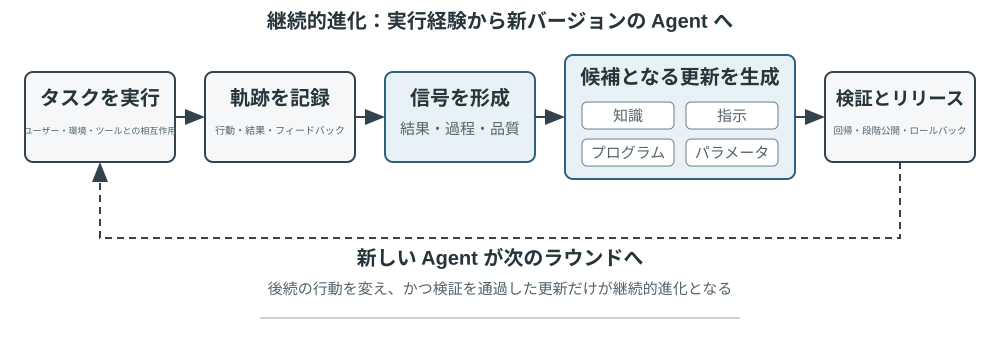

# マルチモーダルとリアルタイム対話

これまでの章では、テキストの世界における Agent の設計を論じてきました。コンテキスト、ツール、コードを通じてデジタルシステムとやり取りする、というものです。しかし、Agent がやり取りする対象はテキストや API だけではありません。Agent がユーザーの音声指示を聞き取り、画面上で正しいボタンを見つけてクリックし、あるいはロボットアームを制御して物体を正確につかむ必要があるとき、Agent はまったく新しい領域へと足を踏み入れます。それが **マルチモーダルなリアルタイム対話** です。純粋なテキストの入出力から **マルチモーダルな知覚とリアルタイム応答** へと拡張することは、Agent が「対話ボックス」から飛び出すための鍵となる一歩です。いわゆる「マルチモーダル」とは、テキストだけでなく、文字・音声・画像・動画・動作という複数の情報形式を同時に扱うことを指します。

まず本章の範囲を定めておきます。静止画像や文書の理解――スクリーンショットを見る、図表を読む、PDF を解析する――は、すでに知覚ツールとして前の各章の Agent 実践に自然に溶け込んでいます。今日のマルチモーダル大規模モデルにとって、この種の「一度入力し、一度理解する」タスクは相対的に成熟しており、専用のアーキテクチャ設計を必要としません。本章が焦点を当てるのは別種の問題、すなわち **リアルタイム性がマルチモーダル問題を難しくする** 3 つの場面――音声対話、GUI 操作、ロボット制御です。これらの場面では、入力は絶えず流れ続け、出力は厳しい時間予算内に返さなければならず、そのためアーキテクチャ設計に質的な変化が生じます。連続的な視覚ストリーム（動画）のリアルタイム理解については、本書執筆時点でも Agent にとって未解決の問題です。本章の Computer Use のパートで論じるフレームごとのスクリーンショットの限界と、章末の演習問題で再びこの話題に立ち戻ります。もう一つの境界も引いておく必要があります。マルチモーダルな **生成**（画像生成、動画生成）は、本書の枠組みでは普通のツール呼び出しにすぎません（第 5 章のマルチメディア生成ですでに触れました）。Agent はそれを外部ツールとして呼び出せばよく、本章が解決しようとするリアルタイム対話の難題には関わらないため、本章の主線には含めません。

音声対話、Computer Use、ロボット操作は、一見するとまったく異なる 3 つの領域にまたがっているように見えますが、実際にやってみると、行き詰まる箇所が非常によく似ていることに気づきます。いずれも複数のモダリティの情報を同時に処理しなければならず、いずれも遅延に極度に敏感です。音声の間（ま）が 2 秒を超えると人は苛立ち、ロボット制御のミリ秒単位のブレは衝突を招きかねません。この 2 つの制約が共に、3 つの場面を同じアーキテクチャの方向へと押しやります。すなわち **直列パイプライン**（工場の流れ作業のように、一つの工程が終わってはじめて次に渡せる）から **エンドツーエンドモデル**（統一された 1 つのモデルが入力から出力まで直接処理し、途中の受け渡し工程を省く）へ、という方向です。

本章は以下の筋道で展開します。

1. まず「音声アーキテクチャの 3 つのパラダイム」で座標系を組み立てます。カスケード（VAD-ASR-LLM-TTS のパイプライン）、エンドツーエンドの全モダリティ（Omni、単一モデルだが依然として交互に話す）、全二重（Moshi、GPT-Live、聞きながら話す）です。そして「いかに VAD の輪番前提から脱するか」という軸に沿って、各段の遅延とトレードオフを順に解きほぐしていきます。そのうちカスケードの節では、ストリーミング音声知覚で VAD + ASR をどう置き換えるかも述べます。
2. 次に、思考アーキテクチャが「リアルタイム応答」と「深い思考」の矛盾をいかに調停するかを見ます。速い思考と遅い思考を単純に並行させるものから、バックグラウンドの推論モデルを「軍師」に据える分離型のアプローチ（GPT-Live の委譲、Pine AI など）、さらには Step-Audio R1 が思考を単一モデルへと「内在化」させた「考えながら話す」に至るまでを扱います。
3. 続いて、より人間らしい音声合成による実行層の最適化を論じます。
4. 最後に視点を Computer Use（AI に人間のようにパソコンの画面を操作させる）とロボット操作へと広げ、同じ遅延とマルチモーダルの問題がこの 2 つの場面でどう現れるかを見ます。

そのうち、理論寄りで場面をまたいで応用できる 2 つの重点を特に指摘しておきます。**思考アーキテクチャ**（速い・遅いという 2 系統の思考がいかに協調するか）と、そこから派生する **速い-遅いのインターフェース**（Latent Bridge、速いモデルと遅いモデルの間で文字以外に何を伝えられるか）です。これらは音声の場面から語り起こしますが、音声だけに奉仕するものではありません。後半の Computer Use やロボットでも同じく「いつ遅い軍師を呼ぶべきか」という問題に出くわすので、読者には特に留意していただきたい点です。

## 音声：最も自然な人間とコンピュータのインターフェース

音声は文字を音に変えるだけではない。発話はタイピングの約4倍速く、手と視線を使わないため、いつでも割り込まれ得る連続入出力ループに Agent を置くのに適している。音声入力は発話を文字にし、音声 Agent は利用者が Agent と直接協働できるようにする。どちらも序章の whisper coding を支える。

本節では、利用者が Agent に話す場合と、Agent が利用者に代わって外界に話す場合を扱う。音声モデルは何に答えられるかを、対話構造は聞き取り、応答、発話権の交代、確認とツール呼び出しを時間内に行えるかを決める。

### 相互作用の時間構造：カスケードから全二重へ

OpenAI は GPT-Live で、音声対話をカスケード、ターンベース、全二重の三パラダイムに整理した[^ch9-12]。これは新旧の順位ではなく、遅延・コスト・観測性のトレードオフである。

| パラダイム | 構造 | 利点 | 制約 |
| --- | --- | --- | --- |
| カスケード | VAD → ASR → LLM → TTS | 交換・デバッグしやすい明確なモジュール | 遅延の累積とパラ言語情報の欠落 |
| エンドツーエンド Omni | 一つのモデルが聞き、考え、話す | 低遅延、声色・感情・環境音を保持 | ターン依存、訓練とデバッグが難しい |
| 全二重 | 聞き、話し、判断し続ける | 重なり発話と自然な割り込み | 訓練・制御・評価が複雑 |

共通する課題は、交互に話す仮定と VAD による発話権の推測を越えることだ。全二重だけが発話権を継続的なモデル判断にする。

[^ch9-12]: OpenAI. *Introducing GPT-Live.* 2026-07-08. https://openai.com/index/introducing-gpt-live/。この三分類は ChatGPT Voice の三世代をまとめた同記事に由来し、本文の Omni は「turn-based voice models」に対応する。

### パラダイム一・カスケードパイプライン（Cascading）

商用音声アシスタントの多くは直列パイプラインを使う（図9-1）。VAD が終了を判断し、ASR が音声を文字にし、LLM が回答を生成し、TTS が読み上げる。モジュール性は最適化を容易にするが、各境界が待ち時間を加える。



| モジュール | 役割 | ボトルネック |
| --- | --- | --- |
| VAD | 発話終了の判定 | 無音閾値による待機と誤分割 |
| ASR | 音声を文字に変換 | 認識遅延と文脈欠落 |
| LLM | 理解・思考・生成 | 最初の token の遅延、reasoning の追加待機 |
| TTS | 文字を音声に変換 | 最初のパケットと再生バッファ |

短い回答でも段階の待機は直列に累積する（図9-2）。本番のキューイングは空載遅延をさらに増幅する（図9-3）が、容量計画は本章では扱わない。


> **実験 9-1 ★：従来型音声 Agent を構築する**
>
> マイク、Silero VAD、ローカル Whisper、ストリーミング LLM、Fish S1 TTS を WebSocket で接続し、カスケード基線を作る。保持された単一ターンの実証はメディアとモデルが最後まで動いたことを示すが、並列性や本番負荷のベンチマークではない。[chapter9/live-audio](../chapter9/live-audio/) にコードと受入記録がある。

> **追加プロジェクト：WebRTC で「利用者に電話する」音声 Agent**
>
> PSTN は必須ではない。ブラウザ WebRTC で会話を開始し、不足情報を尋ね、復唱確認し、構造化結果を保存する閉ループを再現できる。外部機関には同じ契約を準拠した PSTN/SIP に置き換える。詳細は [chapter9/phone-agent](../chapter9/phone-agent/) にあり、歴史的な exp9-2 識別子は保持するが本文の番号付き実験ではない。

#### 直列からストリーミング知覚へ

ASR は発話中に暫定転写を出し、LLM は最初の文を TTS に渡し、TTS は音声チャンクを返せる。ただし三段階が最初から最後まで完全並列になるわけではない。部分転写による先行生成にはキャンセル、無効化、再実行、ロールバックが必要だ。

従来の VAD + ASR 前端には、無音待ちによる遅延、ためらいや感情を表せない情報損失、固有名詞の文脈分断という三つの問題がある。因果またはチャンク型エンコーダと増分デコードが真のストリーミングに必要で、Whisper のエンコーダは完全な音声区間を必要とする。LLM ベースの聴覚モデルはテキストと意味イベントを出力し、文脈と世界知識を利用できる。

終端判定を組み込む場合、ラベルは判断時点で見える情報だけから作る必要がある[^ch9-11]。speak_start/end、interrupt、emotion、laugh、sigh、noise のイベントを文字と一緒に出力すれば、音をすべてテキストに圧縮せず対話状態を扱える。

[^ch9-11]: 終端判定を認識器に組み込む診断と後知恵ラベルの問題については Li, Bojie and Noah Shi. *The Trade-off Was in the Labels: Causal Supervision for Turn-Aware Streaming ASR.* 2026（発表予定）を参照。

> **実験 9-2 ★：Qwen2-Audio でストリーミング音声知覚を模擬する**
>
> 増加する音声プレフィックスで連続知覚を模擬し、600 ms VAD + Whisper と比較する。canonical run は全ゲートに合格したが期待挙動は 2/6 のみで、8.4–11.3 秒を要し、pause の silence を見落とし noise の cough/laughter を誤分類した。これは失敗モードの検査であり、100–200 ms の真のストリーミングを主張しない。記録は [chapter9/streaming-speech](../chapter9/streaming-speech/) にある。

### パラダイム二・エンドツーエンド全モダリティ（Omni）

音声を文字へ変換するカスケードは感情、抑揚、環境音を失うことがある。Omni は一つのモデルで聞き、回答し、話すため情報を保持しやすい。自己カスケードは文字で十分な課題では知覚誤りを直せるが、話速や感情が必要な課題では文字のボトルネックが証拠を消す[^ch9-13]。Omni もターンを前提とするため、数字の途中の無音を終了と誤判定し得る。

[^ch9-13]: カスケードとエンドツーエンドの精度優位が逆転する条件については Li, Bojie and Noah Shi. *The Cascade Gap: When and Why Self-Cascades Help Multimodal Agents.* 2026（発表予定）を参照。


リアルタイム音声 API は両者の中間で、ネイティブ音声処理と VAD、割り込み、非同期ツール呼び出しを組み合わせる。比較すべきはランキングではなくタスクごとの失敗である。

> **実験 9-3 ★★：MiniCPM-o 4.5 をローカルで実行し、エンドツーエンドと自己カスケードを比較する**
>
> revision を固定し thinking mode を無効にして、音声から直接回答する経路と転写後に回答する経路を比較する。音声情報の保持を測るもので、「考えながら話す」能力ではない。
>
> | タスク | エンドツーエンド | 自己カスケード | 観察 |
> | --- | ---: | ---: | --- |
> | 語義算術（2） | 1/2 | 2/2 | 転写誤りを一つ修正 |
> | 副言語的な話速（2） | 2/2 | 1/2 | 純テキスト転写が速い／遅いの差を消す |
> | 合計 | 3/4 | 3/4 | 合計は同じで失敗位置は相補的 |
>
> サンプルは小さく、全体の精度や速度は結論できない。完全な証拠は [chapter9/end-to-end-speech](../chapter9/end-to-end-speech/) にある。

Step-Audio 2 は生音声から文字と音声を出力し、Step-Audio R1 は推論を音声モデルに内在化する。

### パラダイム三・全二重インタラクティブモデル

Omni は利用者とモデルの発話を分けるが、同時通訳などは重なりを要する。全二重モデルはターンを前提とせず、聞き、話し、続行・停止・割り込み・ツール呼び出しを連続的に判断する。Kyutai の Moshi は音声ストリームを並列にモデル化した初期例だ。

Thinking Machines Lab の Interaction Model[^ch9-14] は相互作用を VAD などの外部ハーネスではなくモデル内に持つ。短いマイクロターンで無音、重なり、割り込みを文脈として保ち、背景推論モデルに会話を委譲しながら話頭を維持できる。

[^ch9-14]: Thinking Machines Lab, “Interaction Models: A Scalable Approach to Human-AI Collaboration,” 2026-05. https://thinkingmachines.ai/blog/interaction-models/

GPT-Live は待機、相づち、割り込み、リアルタイム翻訳を生産規模で扱う。カスケードは無音でターンを推測し、ストリーミング知覚は意味へ引き上げ、全二重は切替を継続判断にする。

### 認知の時間構造：リアルタイム対話と深い思考

前景モデルは利用者がオンラインの間に返答し、背景モデルは長く思考できる。三つの設計は線形の進歩ではなく取捨選択である。

| 設計 | 前景 | 背景 | 主なリスク |
| --- | --- | --- | --- |
| 速い応答、遅い修正 | 即時に返す | 再考して補足 | 矛盾 |
| 速い対話、遅い助言 | 話頭と表現を維持 | 助言やツール結果 | インターフェース制約 |
| 思考と表現の統合 | 考えながら話す | 表現と状態を共有 | 訓練コスト |

#### 解決策一：速い思考でつなぎ、遅い思考で回答する

速いモデルが数百ミリ秒で応答し、遅いモデルが深く推論すると、簡単な質問は二重処理され、難しい質問は矛盾し得る。二つの実体が独立に考えることが原因だ。


#### 解決策二：速い思考で対話し、遅い思考で助言する

背景モデルが専用インターフェースで助言を送り、前景モデルが会話を維持する。間接通信なので中間思考は見えず、真に考えながら話すことはできない。

#### 解決策三：思考と表現をエンドツーエンド統合する（Step-Audio R1）

MGRD は音響特徴に基づく思考を蒸留し、MPS 双脳構造は計画と表現を並列化する。構想側の思考片を表現側が部分回答と結合して音声化するため、全推論を待たずに話せる（図9-6）。統合型は自然だが共同再訓練が必要で、分離型は背景モデルを交換しやすい。


### より人間らしい音声合成

滑らかすぎて間のない TTS は機械らしさを露呈する。LLM は THINKING、EMO:happy、SPEED:0.8x などの制御マーカーを出し、TTS は間、韻律、速度、笑い、ため息へ変換する。Fish Audio S1 の比較では複数参照が三回の位置均衡盲聴で最高だったが、無標記が単一参照を上回り全順位は再現されなかった。小規模研究を一般的な音質結論にはできない。

> **実験 9-4 ★★：Fish Audio の制御トークン TTS**
>
> 多参照音声ライブラリを作り、制御なし、単一参照、複数参照を比較する。詳細な 24 参照音声、A/B/C 媒体、受入記録は [chapter9/controllable-tts](../chapter9/controllable-tts/) にある。

## Computer Use：GUI 自動化 Agent

ここまで読んで、本章が音声に割いた紙幅が後の 2 つの場面より明らかに多いことに気づくかもしれません――これは意図的なものです。リアルタイム・マルチモーダルというこの進化の線上で、音声は最も完全に、最も参照系とするに値するかたちで進んだ一つです。「直列パイプラインは遅延が高すぎる」というこの問題から出発し、エンドツーエンド、全二重、考えながら話す、といった一連の方式を経て、今日の相対的にかたちを成した終局まで進んでおり、問題→方式→終局の全行程がすでに走り抜けられています。だからこそ私たちはそれを徹底的に論じました。続く Computer Use とロボットの 2 つの場面は、いずれも音声のこの脈絡と対照して見ることができます――それぞれこの進化の線のどの段まで進んだのか、どこで行き詰まっているのか。

この 3 つの場面は一見異なりますが、同じ中核の挑戦に直面しています。リアルタイム知覚、低遅延の意思決定、持続的な対話です。続いて、これらの技術的主題が視覚対話（Computer Use）と物理対話（ロボット）でどう再現されるかを見ましょう――まず視点を聴覚モダリティから視覚モダリティへと広げます。もし Agent が音声を理解できるだけでなく、画面を「見て理解」し、グラフィカルインターフェースを操作できるとしたら?

Computer Use（GUI 自動化 Agent とも呼ぶ）は、AI に人間のように画面を観察し、マウスとキーボードを操作してソフトウェアを使わせます――たとえばブラウザを開いて情報を検索する、表計算ソフトにデータを記入する、システム設定で構成を調整する、といった具合です。その中核は **知覚-思考-行動** のループです（図9-6）。

1. Agent が現在の画面をスクリーンショットする
2. マルチモーダルモデルがスクリーンショットとタスク指示を受け取り、一段の思考と一つの具体的な動作を出力する
3. 実行層が現実の環境でその動作を実行する（マウスを動かす、クリックする、文字を入力する、など）
4. インターフェースの応答を待ってから再びスクリーンショットし、次のループに入る


このループには 3 つの鍵となる設計次元があります。**行動空間**（Agent がどんな操作を実行できるか）、**視覚グラウンディング**（スクリーンショットの中でいかに目標要素を見つけるか）、そして **モデルアーキテクチャ**（スクリーンショットからいかに正しい動作を生成するか）です。

### 行動空間の設計

Anthropic は完全な対話能力を構成する 3 種類のツールを定義しています（図9-7）。


**GUI 操作ツール**（computer tool）：マウス操作には移動（mouse_move）、左／右／中ボタンのクリック、ダブル／トリプルクリック、ドラッグ（left_click_drag）、そしてより細かい押下／解放（left_mouse_down/up）が含まれます。スクロール（scroll）は 4 方向をサポートし、修飾キーと組み合わせられます。キーボード操作には一字ずつの入力（type、各文字の間隔 12ms で本物のタイピングを模す）、組み合わせキー（key、Ctrl+C など）、長押し（hold_key）が含まれます。知覚動作：スクリーンショット（screenshot）、カーソル位置の取得（cursor_position）、待機（wait）。

**コマンド実行ツール**（bash tool）：持続的な bash ターミナルセッションを提供し、120 秒のタイムアウトで、番兵文字列によってコマンドの実行完了を検出し、複数回の呼び出しの間で環境の状態を保ちます（あるディレクトリに cd した後、次の呼び出しでもそのディレクトリにいる、など）。

**ファイル編集ツール**（str_replace_editor）：文字列マッチングによって安全な編集を実現し、閲覧、作成、置換、挿入、取り消しの操作をサポートします。ファイル全体を直接上書きするより正確で、他の内容を誤って書き換えにくくなります。

> **実験 9-5 ★：Computer Use を実行する（Anthropic 参照経路またはオープンモデル経路）**
>
> 経路 A は Anthropic Computer Use Demo を使用します。コンテナにはブラウザやターミナルなどの一般的なツールを含む、完全な Ubuntu デスクトップ環境がパッケージされています。フロントエンドがタスクを受け取り、バックエンドが指示とスクリーンショットを Claude に送信し、モデルが返したマウス、キーボード、ターミナル、編集の各操作を実行します。この経路はネイティブな `computer` ツールプロトコルを理解するためのもので、すべての読者が Anthropic API を利用できる必要はありません。
>
> 経路 B は本書の付属プロジェクト [`chapter9/computer-use-open-model`](../chapter9/computer-use-open-model/) を使用します。デフォルトではオープンウェイトの Qwen3-VL 32B Instruct で browser-use を駆動し、OpenRouter のホステッド API を利用することも、`OPEN_MODEL_BASE_URL` をセルフホストの vLLM/SGLang または別の互換エンドポイントに向けることもできます。エンドポイントはスクリーンショットを受け取り、ネイティブ JSON Schema をサポートする必要があります。通常の JSON のみをサポートする場合は、schema-in-prompt 互換モードを明示的に有効化できます。
>
> 2 つの経路は、同じ読み取り専用タスクと同じ受け入れ条件を使用します。最大 25 ステップ、1 ステップにつき 1 操作のみとし、モデル／エンドポイントの識別情報、プロバイダーの生の応答、ステップごとのスクリーンショット、操作列、最終回答、停止理由を保存します。異なるモデルは別々の実験群として報告しなければならず、オープンモデルの結果を Claude の再現として示したり、「コンテナの起動成功」をタスク完了とみなしたりしてはいけません。操作間隔と計画品質は実測結果であり、2〜5 秒であることや他モデルより必ず優れることをあらかじめ仮定しません。
>

### 視覚グラウンディング（Grounding）

ループの各ラウンドで、モデルはスクリーンショットの中で目標要素を正確に特定する必要があります――「検索ボックスはどこか?」「送信ボタンの座標は何か?」。これが視覚グラウンディング（Grounding）の問題です。現在、主に **2 つの大きな考え方** があります。一つはグラウンディングを **選択問題** に変えるもの――先にインターフェースの要素に番号を振っておき、モデルはその中から一つ選ぶだけです。もう一つは **純粋な座標予測** ――モデルに人間のように直接スクリーンショットを「見て」座標を報告させます。そのうち選択問題の考え方にはさらに 2 つの実装方式があります。**純視覚アノテーション**（オリジナルの Set-of-Mark、セグメンテーションモデルでピクセル上に候補領域を切り出す）と **構造化要素インデックス**（DOM/Accessibility Tree、インターフェースが備える構造を直接読み取る）です。選択問題の考え方の共通の利点は、開放的な「スクリーンショットの中でボタンを見つけて座標を予測する」を、閉じた「アノテーション済みの要素から一つ選ぶ」へと変えることです――試験で選択問題が穴埋め問題より正解しやすいのと同じで、モデルは「画面左上のやや右、約 200 ピクセルの箇所の青いボタンをクリック」ではなく「[123] をクリック」と言えばよいのです。

**Set-of-Mark：視覚アノテーション法。**

オリジナルの Set-of-Mark（SoM）は 2023 年にマイクロソフトリサーチが提案したもので、当初は GPT-4V の視覚グラウンディング能力を引き出すためのものでした。それは **純視覚** の手法です。画像セグメンテーションモデル（SAM、SEEM など）でスクリーンショット上に候補領域を自動で切り出し、各領域に番号マーカーを重ねます。モデルが見るのは番号付きの画像で、番号を報告するだけでよく、システムが対応する領域の中心座標へ換算します。全過程で DOM を必要とせず、いかなるインターフェース内部の構造も必要としないため、ネイティブのデスクトップソフトウェアやゲームのインターフェースにも同様に適用できます――セグメンテーションモデルが候補領域を切り出せさえすれば。

**構造化要素インデックス：SoM の思想を Web 上で構造化して実装したもの。**

インターフェース自体が構造化された情報を提供できるとき、アノテーションはより精確に行えます。現代のウェブページはレンダリング前にすでに完全な要素構造（DOM ツリー）と意味的な役割（どれがボタンで、どれが入力ボックスか）を定義しています。無障害インターフェース（Accessibility Tree）は多くのデスクトップアプリに類似の情報を提供します。セグメンテーションモデルにピクセルの中で「どの領域がボタンか」を当てさせるより、インターフェース自体に「クリックできる要素は何があるか?」と直接尋ねるほうがよいのです。browser-use プロジェクトに代表される Web Agent の方式はまさにこうしています。DOM から対話可能な要素を列挙して番号を振るもので、SoM の思想を Web 上で構造化して実装したものと見なせます（図9-8）。流れは 4 ステップに分かれます。

1. ブラウザのデバッグインターフェース（CDP、Chrome DevTools Protocol）を通じてウェブページの構造化表現（DOM ツリー）と無障害情報を取得する
2. どの要素が対話可能か（ボタン、入力ボックス、リンクなど）を自動で検出する
3. 各対話可能要素に一意の ID を振り、スクリーンショット上に境界ボックスを描く
4. 同時に、各 ID に対応する要素を記述したテキストリストを生成する

```
Screenshot: [画像中の主要な要素に [1]、[2]、[3]、[4] などの ID が付されている]

Elements:
[1] <input type="text" placeholder="Search" aria-label="Search" />
[2] <button id="submit-btn" aria-label="Submit form" />
[3] <input type="text" placeholder="Enter your name" value="" />
[4] <a href="/docs" aria-label="Documentation" />
```

モデルは ID 番号を一つ出力するだけでよく、システムがその要素の中心座標を使って自動でクリックを実行します。この種の方式はトークンを節約しません（すべてのアノテーション情報をモデルに送る必要があるため）が、グラウンディングは正確で安定しており、しかもセグメンテーションモデルが持ち込みうる見落としと誤検出も避けられます。


**純粋な座標予測。**

第 3 の路線はいかなるアノテーションもせず、モデルに直接座標を出力させます。**SeeClick** と Claude の computer use に代表されます。膨大な GUI スクリーンショットと要素位置のペアデータで視覚モデルを訓練し、自然言語の記述（「送信ボタンをクリック」など）をスクリーンショット中の精確な座標へ直接マッピングすることを学ばせます――人間のユーザーと同じように、純粋に「見る」ことだけでクリックすべき位置を見つけるのです。

座標予測の方式では、モデルの座標理解は訓練時に使った解像度に強く依存します（図9-9）。Claude は訓練に XGA（1024x768）、WXGA（1280x800）、FWXGA（1366x768）を使っており、入力するスクリーンショットの解像度が合わないと、モデルが予測する座標は系統的にずれます――小さな地図で距離を測って、それをそのまま大きな地図に使うようなものです。したがって、ツール層で双方向の座標スケーリング機構を実装する必要があり、しかも **アスペクト比で目標解像度を選ぶ** 必要があります。非等比の引き伸ばしで画面が歪み、それにつれて座標判断までずれてしまうのを避けるためです。たとえば、実際の画面解像度が 2560×1440（16:9）なら、Claude がサポートする 3 段の中からアスペクト比が同じく 16:9 に近い目標を選ぶべきです――FWXGA（1366×768）が最も合致します。スクリーンショット時に画面を等比で 1366×768 に縮小してモデルに入れ、モデルがクリック座標 (683, 384) を出力したら、実際の座標 (683×2560/1366, 384×1440/768) ≈ (1280, 720) へと逆マッピングします。逆に、無理やり 16:9 を 4:3 の 1024×768 に引き伸ばすと、画面は横方向に押し潰され、モデルが予測する座標は系統的にずれます。


3 つの路線の選択のロジックはこうまとめられます。**構造化情報が得られるときは DOM/Accessibility Tree のインデックスを優先する**、グラウンディングが最も精確で安定します。**得られないとき**（Photoshop のようなネイティブのデスクトップソフトウェア、Canvas/WebGL でレンダリングされたインターフェース、ゲーム）は、**視覚アノテーション（オリジナルの SoM 路線）を使ってもよいし、座標予測を使ってもよい**。視覚アノテーションはグラウンディングを選択問題に変え、専門的な訓練を受けていない汎用モデルにより親切です。座標予測はアノテーションのステップを省き、GUI グラウンディングの訓練を受けたモデルにより直接的です。両者とも、小さな要素や密集したインターフェースでの精度には依然として差があります。

> **実験 9-6 ★：browser-use で自動ブラウザ操作を実現する**
>
> ブラウザ自動化フレームワーク Playwright とマルチモーダルモデルを組み合わせ、自然言語で駆動するブラウザ操作を実現します。SoM 可視化モードを有効にし、各意思決定の前に注釈枠付きのスクリーンショットを保存します。モデルインターフェースは OpenAI や Anthropic に限定されません。本書ではオープンモデル Qwen3-VL の API 設定を提供し、ほかのホステッドサービスやセルフホスト推論向けに汎用の OpenAI 互換 base URL も用意しています。
>
> テストタスク「Google を開いてサンフランシスコの天気を検索する」：起動後のスクリーンショットには Google 検索ページが表示され、対話可能な要素に番号が付いています。モデルは検索ボックスを選び、「San Francisco weather today」と入力して検索を実行し、結果ページから気温と天気の状態を抽出します。受け入れ時には回答と軌跡を独立して検証し、実際のステップ数と所要時間をそのまま記録します。「5 ステップ、約 20 秒」は特定の 1 回の実行における観測値にすぎず、実行証跡なしに固定結果として扱うことはできません。
>
> 本書に保存されたオープンモデルの正式実行では、OpenRouter 上の `qwen/qwen3-vl-32b-instruct` を使用しました。モデルは Google 検索の step 4 で CAPTCHA に遭遇した際に成功を主張せず、weather.com に切り替えました。そして step 16 で San Francisco の Today ページから 64°F、Sunny、体感 62°F、最高 74°F、最低 55°F を読み取りました。16 件中 16 件の API 応答が要求した Qwen3-VL モデルを報告し、15 枚の有効なステップスクリーンショットと読み取り専用の操作軌跡が独立した決定論的な受け入れ検証に合格しました。この結果はオープンモデル API 経路が実行可能であることを示しますが、Anthropic ネイティブ `computer` ツールの実験群を再現したことにはなりません。

### アニメーションを見て、音を聞ける Computer Use Agent

ここまで、Computer Use の知覚はすべて一つの暗黙の前提の上に築かれてきました。**画面は静止している** ――一枚撮り、一歩考え、一度クリックし、また次の一枚を撮る。しかし現実の画面は動画を流し、一瞬で消える通知をポップアップし、会議中の人の声を再生します。3〜5 秒に一度しか目を開けず、しかも耳をまったく持たない Agent は、これらの「2 フレームの間に起きたこと」を見ることも聞くこともできません。画面録画を見る、会議についていく、音声の合図を聞く、一瞬で消えるダイアログに対応する――この一連の日常的なパソコン操作は、今日の Computer Use Agent にとってほぼ禁区です。

ここで本当に再設計されるべきは「動作インターフェース」ではなく「**観察インターフェース**」です[^ch9-9]。中核の発想は、**観察**（連続的、適応的、マルチモーダル）を **動作**（離散的）から分離し、環境と任意の既製の Computer Use モデルの間に挟む、再訓練不要の知覚ミドルウェア（Agent-パソコン観察インターフェース、AOI と呼べます）に仕立てることです。それには「必要に応じて水門を開く」3 つの部品があります。その一、**フレーム間キーフレーム捕捉** ――まず極めて安価なピクセルゲートでほとんど変化のない画面を飛ばし、次に小さなモデルで画面に意味ある変化が生じたかを判断し、変化したときだけ一フレームを撮ります。静止画面ではほぼゼロコストです。その二、**音量ゲート制御の音声書き起こし** ――音があるときだけ音声認識を呼び出し、Agent に初めて「耳を生やさせ」ます。その三、そして最も鍵となるのが、**画面を持続的な文字へと語り起こす** ことです――モデルに捕捉したフレームを一文に記述させ（「たった今ポップアップした通知は、リリース日が 4 月 28 日に変わったと言っている」）、そして **元の画像が後でコンテキストから片づけられても、この文字は記憶に残り続け**、動的な情報をテキストのかたちで先へと携えていきます。

一つの反直感的な発見はこうです。本当に効くのは「どのフレームを選ぶか」ではなく「**フレームを長く保存できる文字へと語り起こす**」ことなのです――文字こそが LLM Agent の最も得意とするモダリティです。7B から最先端規模までの 8 つのモデルで、このミドルウェアはいかなる再訓練も要さずに +17 から +48 パーセントポイントの向上をもたらし、そのうち音声類のタスクの差が最も甚だしいものでした。この知覚を加えると、Agent はもともと「聞こえるのに動けなかった」音声タスクをすべてやり遂げられるようになります。ただしそれは万能の固定構成ではありません――より新しい一部のモデルでは、画像トークンを詰め込みすぎるとかえって推論を圧迫し、性能を落とすので、これらの部品は **モデルごとに一つずつ選ぶ** べきであり、一挙に全開にすべきではありません。これは前掲の Set-of-Mark と座標予測のトレードオフと同じ理屈です。知覚の方式に銀の弾丸はなく、モデルの気質に合わせて構成しなければなりません。

[^ch9-9]: ゲート制御キーフレーム、必要に応じた書き起こし、フレームを持続的な文字へ語り起こすというこの 3 つの部品、その完全な機構とモデルごとのアブレーションは Li, Bojie and Noah Shi. *Agent-Computer Observation Interfaces Enable Dynamic Computer Use.* arXiv:2606.29472, 2026 を参照。

### モバイル端末：技術よりもエコシステムの壁が難しい

Computer Use はモバイル端末へも広がっています。モバイル端末とデスクトップは技術的に確かに差異があります。行動空間はもはや「マウス座標 + キーボード」ではなく、システムの無障害サービス API（Android の AccessibilityService など）に接続してインターフェースの要素を読み取り、クリックとテキスト入力を下ろすものになります。対話方式もマウスポインタからタッチジェスチャに変わり、座標の意味もそれにつれて変わります――同じ (x, y) が指のシングルタップなのか、長押しなのか、それともスワイプジェスチャの起点なのか、それを画定するには追加のジェスチャ種別が必要です。第 6 章で紹介した AndroidWorld などのモバイル端末ベンチマークは、まさにこうした行動空間の上で、Agent が実際のアプリのタスクを完遂する能力を評価します。

しかしモバイル端末を本当に行き詰まらせるのは、しばしばこれらの技術的差異ではなく、エコシステムの壁です。かつてスマートフォンメーカーが、コンシューマー向けスマートフォンに AI アシスタントを統合し、WeChat、淘宝（タオバオ）、支付宝（アリペイ）などの日常アプリを自動操作させようと試みましたが、すぐにプラットフォームの制限に遭いました。

これは Computer Use が直面する独特の挑戦、すなわち **エコシステムの壁** を露わにします。締め出しの背後にある根本原因は、ビジネスモデルの衝突です。従来のインターネットアプリの中核的な収益化ロジックは **トラフィックとアテンション** です。ユーザーはフィードをスクロールしながら広告を見、商品を検索しながらレコメンドアルゴリズムの誘導に従い、ページを閲覧しながら衝動買いをします。ところが Agent がユーザーに代わって操作すると、この収益化の連鎖は完全に迂回されます。AI は広告に注目せず、衝動買いもせず、目標へまっすぐ向かってタスクを終えたら去っていきます。広告とトラフィックで収益化するプラットフォームにとって、Agent の一つ一つの操作はそのビジネスモデルの根幹を侵食しているのです。

これは、Computer Use が直面するのが CAPTCHA（認証コード）などの技術レベルの対抗だけでなく、より根本的には **構造的な利害の衝突** であることを意味します。この矛盾は短期的には調停しがたく、Computer Use のコンシューマー向け場面での実装は、純粋な技術問題よりも厄介な挑戦に直面することになります。

### リアルタイム性：いまだ解決されていない中核の挑戦

**OSWorld**（第 6 章でその評価方法論を詳しく紹介しました）は広く使われている Computer Use の評価ベンチマークで、実際の Ubuntu/Windows/macOS 環境で Agent がアプリをまたぐタスクを完遂する能力をテストします。初期の汎用モデルはこのベンチマークで成功率が 2 割程度しかありませんでしたが、その後の専用モデルとより強い汎用モデルが精度を押し上げ続け、本書執筆時点ではすでに徐々に人間の水準に近づいています。しかし精度は終点からはほど遠いのです――本当のボトルネックはすでに「正しくできるか」から「速くできるか」へと移りました。

**OSWorld-Human** の効率研究は、胸に刺さる事実を明らかにしました。タスクが最終的に成功しても、Agent が同じタスクを完遂するのに要する操作ステップは依然として人間より明らかに多く、しかも各ステップの推論遅延はタスクが進むにつれて増え続けます――コンテキストが長いほどモデルの意思決定は遅くなり、後半のステップの所要時間はしばしば前半をはるかに上回ります。人間なら数十秒で終わる文書の書式調整を、Agent は数分もかけてようやく片づけることがあります。**精度が人間の水準に達しても実用と同義ではない――効率こそが真のボトルネックなのです。**

効率問題の根源は音声の場面と似ています。直列の「スクリーンショット-思考-クリック」ループでは、各工程を極限まで最適化しても、一歩ずつ累積する遅延はやはり受け入れがたいのです。より深層の問題はこうです。現在の Computer Use はまったく「先を見越して考える」ことをしません。もし Agent が現在の動作を実行すると同時に次に何をすべきかを予測できれば――たとえばページの読み込みを待つ間に次にどこをクリックするか考えておければ――思考と実行の時間を重ね合わせ、総遅延を大幅に下げられます（これはまさに本章前半の音声の場面での「考えながら話す」、および第 4 章の「持続的な思考」式の非同期 Agent と同じ要求で、ここでは「考えながら操作する」に置き換わっただけです）。

音声の領域と異なるのは、Computer Use 自身のリアルタイム性――「スクリーンショット-思考-クリック」というこのループそのものを速くすること――には、現在まだ系統的な解決策がなく、依然としてフレームごとのスクリーンショットの離散的なループにとどまっている点です。しかしそれを迂回する一つの考え方はすでに走り抜けられており、使っているのはまさに本章で繰り返し登場する速い-遅いの分離です。遅いパソコン操作 Agent を速くするのが難しいなら、**ユーザーにそれをただ待たせなければよい** のです。「話す」と「パソコンを操作する」を速いと遅いの 2 セットのモデルに分けて並行して動かします[^ch9-10]――小さなモデル（速い）がリアルタイム音声対話を担い、最先端の VLM（遅い）がブラウザで一歩ずつ操作し、両者の間はきわめて簡素な「純テキストの契約」だけで意思疎通します。遅い Agent は操作のたびに、刻々と更新される状態要約を一文添え（「フォームに記入中で、あなたの生年月日がまだ必要です」）、速い Agent はそれに基づいてリアルタイムにユーザーへ答え、ユーザーが口頭で示した新しい情報を遅い Agent へ伝達し、しかも **状態要約が完了を確認するまで、速い Agent は決して「済みました」と言ってはいけません**。これはまさに「一方で電話をかけて話しながら、他方でパソコンを自分で操作させる」場面です。実験では、この分離によって音声応答は「単一モデルが操作しながら話す」より約 15 倍速くなり（中央値の遅延 0.58 秒 vs 8.64 秒）、しかもタスク成功率は下がりませんでした。ひとたびその速いと遅いの間のテキスト経路を抜き取ると、成功率は即座に 0 に崩れます――ユーザーが口頭で示した鍵となる情報が、二度とブラウザへ伝わらなくなるからです。これは前掲の Latent Bridge、そして音声の場面での「考えながら話す」と同じ 1 セットの考え方です。ある工程が生来遅いなら、別の速い工程にユーザーの待ち時間を埋めさせる――ただその「純テキストの契約」は、本質的には本書が第 2 章から今まで論じてきた Agent ステータスバーにほかなりません。Computer Use のループそのものの高速化は、なお次の重要な研究方向かもしれませんが、「速い-遅いの分離で『遅い』を隠す」ことは、すでに使える一つの答えなのです。

[^ch9-10]: 音声-操作の速い-遅い分離と「純テキストの契約」の完全な設計は Li, Bojie and Noah Shi. *Talking While Acting: Real-Time Voice for Slow Computer-Use Agents.* 2026（発表予定）を参照。

## ロボット操作：リアルタイム制御から訓練と汎化へ

> **この節の五つの実験は同じ課題を使う。赤いカップをトレーに入れ、黄色い紙くずをゴミ箱に入れ、最後にもう一度観察して机の状態を確認する。実機とシミュレータは分けて報告するが、行動の意味と成功条件は同じである。**
>
音声 Agent は聴覚モダリティで遅延に向き合い、Computer Use は視覚モダリティで遅延に向き合いますが、Agent が物理世界のロボットを制御する必要があるとき、遅延とマルチモーダルの挑戦はさらに拡大されます――動作の結果は不可逆で、一度の衝突で物体やロボット自身を損なうことがあります。本節ではまず、ロボットがいかに二層アーキテクチャと動作分割でリアルタイム制御の問題を抑え込むかを見て、その流れで、目下より硬い難題――訓練と汎化――へと移ります。データをどう得るか、モデルをどうタスクをまたぎ、プラットフォームをまたいで転移させるか。

### ハードウェアはボトルネックではなく、アルゴリズムこそがボトルネックだ

ロボットは汎用の開放場面でまだ広く応用されていませんが、ボトルネックは結局ハードウェアにあるのか、アルゴリズムにあるのか。XLeRobot プロジェクトは有力な反証を示しました。コスト 1000 ドル未満の双腕車輪型ロボットが、人間が VR ヘッドセットで遠隔操縦（テレオペレーション）するとき、すでに大量の家庭タスクを流暢に完遂できるのです。より複雑な、器用な手を要する家庭タスクも、Unitree のロボットは人間のテレオペレーションのもとで流暢に完遂できます。テレオペレーションの遅延はおよそ 100〜200ms で、すでに物理的な対話の応答要求に近づいています。センサーの解像度、アクチュエーターの精度、制御周波数（ロボットが毎秒動作指令を更新する回数。周波数が低いほど動きは滑らかでなくなり、ブレや目標軌道からの逸脱が生じやすくなる）は、現在の低コストプラットフォームですでに実用タスクを支えるのに十分です。

この論断には境界を引いておく必要があります。テレオペレーションの反証が本当に示せるのは、「既存の低コストハードウェアに人間の知能を加えれば、**この種の視覚フィードバックを主とする家庭操作タスク** を完遂するのに十分だ」ということです。それはハードウェアがすべての次元で合格していることを意味しません――触覚センシングの欠如、器用な手の信頼性とコストは、今なお公認のハードウェア上の短所です。ひとたびタスクが精密な力制御と触覚フィードバックに大きく依存すれば、ハードウェアが必ずしもボトルネックでないとは言えません。したがって以下で言う「ハードウェアはボトルネックではない」は、いずれも本節で論じるこの種のタスクの範囲に限定されます。

この種のタスクに関して言えば、真の隔たりはアルゴリズムの層にあります。以下の 2 つの小節でそれぞれ展開します。

> **実験 9-7 ★：XLeRobot のテレオペレーションで机を片付ける**
>
> **目的:** 実機の XLeRobot を遠隔操作し、同じ多段階の机上整理タスクを実行して状態を確認する。
>
> **原則:** 数百ドル程度のアームでも、人間のテレオペレーションならこのタスクを完了できる。したがってこのタスクではハードウェア本体がボトルネックではなく、知覚・計画・閉ループ制御・失敗回復が差を生む。
>
### 二層アーキテクチャ：計画と制御の分離

ロボットが複雑な家庭タスクを完遂するには、2 つの異なる時間スケールで意思決定する必要があります。第一層は比較的遅い **長期計画**（long-horizon planning）です。「机をきれいに掃除する」のような高レベルの指示を子目標の並び（台を片づける、食洗機に入れる、表面を拭く）へと分解するもので、環境の意味を理解し、タスクの依存関係を推論し、多段の行動方針を計画する必要があります――人が手をつける前にまず「何を先に、何を後にするか」を考えるのと同じです。第二層は比較的速い **VLA 制御**（Vision-Language-Action、視覚-言語-行動モデル）です。個々の具体的な操作（「流しの前まで歩く」「布巾を取る」「台を拭く」）を実行するもので、現在見ている画面と言語指示に応じて制御信号を出力し続け、ロボットの動作を滑らかに連続させます。

この二層アーキテクチャは複雑さを効果的に分離します。長期計画は「何をするか」を担い、VLA 制御は「どうするか」を担います。この「高レベルの遅い意思決定 + 低レベルの速い実行」という二層アーキテクチャは、前掲の音声の場面での「速い・遅い思考」と構造上きわめて似ています――いずれも複雑な思考とリアルタイム応答を異なるモジュールへ分離しています。注意を促しておくと、ここでの「計画／制御」が対応するのは、速い・遅い思考のうち「遅い深い思考／速いリアルタイム応答」というこの次元の分離であって、方式三 MPS の「構想脳／表現脳」のような「思考／表現」の分離ではありません――後者が分けるのは「考える」と「話す」であり、前者が分けるのは「全局を謀る」と「リアルタイムに実行する」で、2 つの「二 X アーキテクチャ」が切り分ける次元は同じではありません。

もっともリアルタイム性は忽然と消えたわけではなく、VLA 制御層へと押し下げられ、**動作分割**（Action Chunking、後述の「VLA 制御」の節を参照）によって薄められます。モデルは一度の推論で未来の一小段の動作の並びを生成し、制御スレッドが高い周波数で再生し、一度の推論の遅延をその一段の動作の実行時間の中へ薄めます。しかしここには避けて通れないトレードオフがあります――分割は反応性を滑らかさと引き換えにするものです。ブロックが長いほど、一度の推論の遅延は薄く分散され、動きはより連続しますが、モデルはこの間、新しい画面を「見られず」、突発的な変化（物体が動かされる、誰かが手で遮る）にもより鈍くなります。リアルタイム性と滑らかさの間のこのトレードオフは、二層アーキテクチャが消したのではなく、ただ転移させただけの部分です。

ここで本章の主線の一つの転換も述べておく必要があります。ロボットの場面では、リアルタイム性の矛盾はすでに二層分離と動作分割で部分的に緩和されており、現在の主要な矛盾は **訓練と汎化** へと移りました――いかに十分な実演データを得るか、いかにモデルをタスクをまたぎプラットフォームをまたいで汎化させるか。続くいくつかの小節は、まさにこの新しい矛盾をめぐって展開します。これは第 6 章のシミュレーション環境と第 7 章の強化学習の主題が物理世界へと延伸したものでもあります。

そしてこの新しい矛盾は主に VLA 制御層にのしかかります。VLA は「VLM + 動作出力」と見なせます。**VLM**（Vision-Language Model、視覚-言語モデル――画像と文字を同時に理解できる大規模モデル）が「見て理解する」と「考えて整理する」を担い、VLA はその上でさらに「手を動かす」必要があり、真の挑戦はまさにこの「手を動かす」層にあります。現在の VLA 制御層は主に模倣学習（行動クローニング）で訓練されます――大量の人間の実演から「何を見たら何をするか」を直接学ぶもので（OpenVLA、RT-2、π₀ などがいずれもこの類です）、強化学習は近年その上に加わった補助的手段です。強化学習で訓練された VLA は単一のタスクではよい性能を示せますが、しばしば汎化能力が不足します。第 7 章の SimpleVLA-RL が LIBERO で高い単一タスクの結果を報告したとしても、それは各タスクを個別に RL 訓練したものであって、一つの統一モデルがすべてのタスクへゼロショットで汎化したものではありません。この「一つのタスクにつき一度訓練する」というモードは、新しいタスクに出くわすたびにデータを集め直し、訓練し直さねばならないことを意味します。

以下の 2 つの節で、それぞれ長期計画と VLA 制御の具体的な技術方式を掘り下げます。

### 長期計画：VLM から専用の身体化思考モデルへ

汎用 VLM はすでにまずまずの身体化思考能力を備えています。Google DeepMind の **Gemini Robotics-ER 1.5** は身体化思考（Embodied Reasoning、すなわち物理世界における物体の位置、運動、因果関係を理解すること）に特化して最適化されており、15 の学術ベンチマーク（Point-Bench、RefSpatial、RoboSpatial、BLINK など）で平均 62.8% を記録し、GPT-4o（60.6%）と Gemini 2.5 Pro（59.3%）を上回りました。中核の優位には、高度な空間理解と物体の位置特定、時系列推論（「このカップを押し倒したらどうなるか」という類の動作の因果を予測する）、タスクのオーケストレーション（高レベルの指示を小さなステップへ分解する）が含まれ、思考（thinking）機構とツール呼び出しをネイティブにサポートします。[^ch9-2]

[^ch9-2]: Google DeepMind, “Gemini Robotics-ER 1.5” . https://deepmind.google/models/gemini-robotics/gemini-robotics-er/

> **実験 9-8 ★：同じ課題の理想制御上限をシミュレーションで測る**
>
> **目的:** 知覚や行動選択を誤らない理想コントローラで同じ課題を実行し、再現可能な上限を作る。
>
> **原則:** これは常に正しい判断をしたときの上限を示す基準であり、実機が動いたことを示すものではない。
>

> **実験 9-9 ★★：Gemini Robotics-ER 1.5 で実機 XLeRobot を自律制御する**
>
> **目的:** 人間を、机を観察して pick・place・verify の限定スキルを呼び出す Agent に置き換え、実験 9-7 と同じ機体・課題・成功条件を保つ。
>
> **原則:** 比較で見える差は知覚、計画、タイミング、閉ループ制御、失敗回復にあり、新しい機械的限界ではない。
>

### VLA 制御：実演データから身体をまたぐ汎化へ

二層アーキテクチャの実行層では、RT-2、OpenVLA、π₀ という 3 つの代表的モデルがいずれも VLA 制御――すなわちカメラの画面と言語指示に応じてリアルタイムにロボットの動作を出力すること（図9-10）――に専心しています。それらは動作表現の点で 2 つの路線に分かれます。離散的な動作トークンと、連続的な軌道生成です。


**RT-2 と OpenVLA：離散的な動作トークンの路線。**

**RT-2** はこの路線を切り開きました。大規模な視覚-言語モデルの上で直接ファインチューニングし、ロボットの連続的な動作をトークンへと離散化し、テキストを生成するように一つずつ自己回帰的に出力し、事前学習済みモデルの汎化能力を借りて、新しい物体と新しい指示へのゼロショット転移の効果を高めます。**OpenVLA** は RT-2 の動作表現の方式を受け継ぎ、言語モデルと視覚エンコーダーを一つのアーキテクチャに統一し、画像と文字の指示を入力とし、動作トークンを出力します。訓練は 2 段階に分かれます。まず大規模なプラットフォーム横断データセット Open X-Embodiment（20 種類以上のロボットプラットフォームの実際の操作実演を含む）で事前学習し、汎用的な操作知識（「つかむ」「置く」などの動作パターンは異なるロボットの間で相通じる）を学び、次に特定のプラットフォーム向けに少量のデータでファインチューニングします。動作表現が本質的に同じである以上、両者の真の違いは開放性とエンジニアリング上の選択にあります。RT-2 とその訓練データは Google 内部のものですが、OpenVLA は完全にオープンソースです――オープンソースの骨格モデル（Llama 2 に視覚エンコーダーを加えたもの）に公開データセットを組み合わせ、コミュニティ全体が初めてそれをベースに再現・改良できるようにしました。

**動作分割：VLA 領域に共通の周波数補償技術。**

LLM の推論には遅延があるため、VLA の制御周波数は従来のロボット制御の要求よりはるかに低いのです（従来のロボット制御は通常 50〜1000Hz の制御周波数を要求しますが、VLA の一度の推論は約 1〜10Hz しかありません――差は 2 桁に達します）。オリジナルの OpenVLA はまさにこの問題の典型です。それは一度の推論で一つの動作しか出力せず（約 6Hz の単一ステップの自己回帰予測）、動作のカクつきこそが、それが非難される主な短所でした。**動作分割**（Action Chunking）は、まさにこの差を埋めるために生まれた汎用技術です――最初は ACT（Zhao et al., 2023）が提案し、後に π₀、OpenVLA-OFT などに広く採用されました。モデルは一度の推論で一つの動作だけを出力するのではなく、一気に未来の一小段の時間の動作の並びを生成し（π₀ の典型的な構成を例にとると、一度に約 0.5〜1 秒の動作ブロック、50Hz の制御周波数では 25〜50 個の動作を生成します）、制御スレッドが高い周波数で順に実行し、同時にモデルはバックグラウンドで非同期に次のバッチを生成します。モデルの推論時間がこのバッチの動作の実行時間より短くさえあれば、ロボットは連続した滑らかな運動を保てます――動画のバッファリングのように、後の内容を前もって読み込んでおけば、再生がカクつかないのと同じです。

**π₀：連続的な軌道生成の路線。**

動作表現の真の分かれ目は、RT-2 と OpenVLA の間にあるのではなく、**離散的なトークンと連続的な軌道生成** の間にあります。**π₀** は後者の路線を代表します。離散的な動作トークンを一つずつ予測するのではなく、flow matching（フローマッチング、拡散モデルと同根の連続生成手法）を使い、ランダムノイズから出発して多段の反復で「ノイズ除去」し、滑らかで連続した動作軌道を直接生成します。この表現は動作分割と生来相性がよく、器用な操作など動作の精度と滑らかさへの要求が高いタスクでより良い性能を示します。たとえて言えば、離散的なトークンの路線はメニューから「左へ 5 度」「前へ 3 センチ」と一歩ずつ選ぶようなもので、連続的な軌道の路線は画家がまず一本の曲線全体を描き、それから一筆ずつ修正して仕上げるようなものです。

### Sim2Real Transfer：シミュレーションから現実への隔たり

第 6 章のシミュレーション環境の節で、sim-to-real gap（現実との差）の由来、およびドメインランダム化（domain randomization）がそれに対処する原理はすでに明らかにしたので、ここでは繰り返しません――一言でまとめれば、シミュレーションは真の物理・視覚・ハードウェア特性を完全には再現できないので、訓練時にこれらのパラメータを大きな範囲でランダムに掻き乱し、方策にあらゆる変化に対して安定な汎用表現を学び出させるよう迫るのです（図9-11）。以下ではこの原理が実際のロボットアーム上でどう実装されるかだけを見ます。


この路線にはすでに少なからぬ成功例があります。OpenAI のロボットハンドによる器用な操作（Dactyl プロジェクトは手内での立方体の再配向を実現し、その後続の仕事では自動ドメインランダム化 ADR を用いて片手でのルービックキューブ解法を実現しました）や、ETH Zurich の ANYmal（四足ロボットが雪原、砂利などの複雑な野外地形をロバストに歩行する）が、いずれもこれに当たります。

本章で本当に補うべきは、ドメインランダム化を実機に落とし込む際に避けて通れない 2 つのエンジニアリング上の工程です。その一は **ランダム化範囲の較正** です。範囲は当てずっぽうで決めてはいけません。狭すぎれば真の変化をカバーできず、広すぎれば訓練の難度が増して「何にでも対応できるが何も精密でない」次善の方策を学び出してしまいます。実践では通常、まず実際の環境のデータから鍵となるパラメータの分布（摩擦係数、モーターの応答遅延の真の分布など）を **実測して較正** し、その範囲内でサンプリングします。シミュレーション訓練の方策が実機で明らかに性能を落とすようなら、ランダム化範囲を徐々に広げ、sim-to-real gap が許容できるところまで収束させます。その二は **視覚の整合** です。シミュレーションと現実のカメラの位置姿勢を精確に較正し（環境の整合）、実際に撮影した背景をシミュレーションのレンダリングへランダムに差し替え（greenscreen 背景差し替え）、シミュレーションの画面をできるだけ実機が見るものに近づけます――この 2 ステップは実験 9-9 で具体的に実演します。

> **実験 9-10 ★★：シミュレーションで三つの自律ループを比較する**
>
> **目的:** 同じ課題とツールで、オープンループ、各ステップで確認する方式、短期予測を使う方式を比較する。
>
> **原則:** 逐次確認は局所的失敗から回復し、世界モデルは予測と現実が一致すれば計画を続け、ずれれば再計画する。最終状態は新しい観察で確認する。
>

> **実験 9-11 ★★★：同じ課題の RGB 環境横断テスト**
>
> **目的:** 背景、物体の見た目、照明、視覚ノイズを変え、シミュレーションで学んだ視覚方策が新しい画像に適応するか調べる。
>
> **原則:** 視覚の多様性は環境横断の頑健性を高め得るが、実機の校正と安全な閉ループを代替しない。
>

## 2026 年アップデート：ストリーミング計画と世界モデル

ロボットの節は「VLM が計画を書き、VLA が実行する」で終わるべきではありません。**「机を片付ける」** という例を考えましょう。長期計画器はまず、半分ほど液体の入ったカップ、紙くず、3 冊の本、開いたラップトップ、ゴミ箱、収納箱という状態リストを作り、前提条件と成功確認を伴うコマンドを出力します。

1. 「机まで移動し、机の縁から 30 cm 離れて停止する」
2. 「2 枚の紙くずをゴミ箱に入れ、紙くずが残っていないことを確認する」
3. 「カップを垂直に保ってトレーに置く。液体が動いたら速度を落とす」
4. 「ラップトップを閉じて左奥へ移動する。電源ケーブルを引っ張らない」
5. 「本を大きさ順に積み、ペンを収納箱に入れる」
6. 「壊れやすい物と通電中の機器を片付けてから、机を拭く」
7. 「一歩下がってもう一度観察し、最終状態を確認する」

これは文章の段落ではなく依存グラフです。ユーザーが「ラップトップを先に片付けて」と言えば、システムは目標の優先度を更新します。カップが倒れたら、ロボットは安全点で停止し、`cup.orientation=fallen` や `laptop.at_risk=true` といった事実を記録し、古くなった計画の後続部分を無効にして再計画します。つまり、ラップトップを守り、こぼれた液体を封じ、再観察してから、影響を受けていないタスクだけを再開します。完了済みの動作は繰り返しません。緊急事象は現在のチャンクをキャンセルし、通常の更新は次の安全点まで待ちます。

### ストリーミング実行

計画と実行は重ね合わせられます。安全なプレフィックスが完成したら、プランナーは後続部分の計画を続けながら、完全なコマンドをエグゼキュータへストリーム送信します。コマンドイベントは完全で監査可能でなければなりません。

~~~json
{"type":"command.commit","seq":12,"command_id":"desk-02","command":"put paper in bin","preconditions":["paper.visible","bin.reachable"],"success":"paper_count=0","cancel_at":"before_grasp"}
~~~

エグゼキュータは `started`、`succeeded`、`cancelled`、`failed` を返します。プランナーはその観測で依存関係を更新し、キューが古くなったり満杯になったりしたときはバックプレッシャーを適用します。ストリーミングは最初の安全な動作までの時間を短縮しますが、不完全な JSON や検証されていないモデルの思考を実行してよいという意味ではありません。

### 現在の VLA が汎化しにくい理由

OpenVLA は文字どおり projector だけを更新して訓練されたわけではありません。原論文では、全パラメータの fine-tuning、視覚エンコーダを凍結した設定、最終層のみの更新、LoRA も報告されています。それでも、より深い批判は残ります。巨大なテキスト・画像の事前訓練コーパスが、はるかに小さいロボットデータセットと狭い適応経路で接続され、低コストの適応では新しい振る舞いが projector、LoRA モジュール、または action head に集中しがちです。Behavior cloning が学ぶのは「観測 + 指示 → action chunk」であって、反実仮想的な物理結果ではありません。embodiment 固有のアクション空間と古い action chunk も転移を制限します。言語 backbone が「カップ」という語を知っていても、摩擦、液体、接触、電源ケーブルの振る舞いまで知っていることにはなりません。

### 世界モデル

世界モデルは、行動可能な遷移を学習します。

~~~text
状態 + 候補アクション -> 予測された未来状態 -> アクションを選択して検証
~~~

これは V-JEPA だけを指す言葉ではありません。潜在予測モデル（V-JEPA 2）、インタラクティブ生成モデル（Genie 3 と Cosmos）、World-Action Model（GeniWorld と Robust-WAM）、ラベルなし動画からの latent action 学習（LAWM-3D）、model-based RL（Dreamer と MuZero）を含む、より広い系統です。大規模な観測から学び、実行前に反実仮想の行動結果を試し、共有されたダイナミクスと embodiment 固有の制御を分離し、予測と現実が食い違えば再計画することに価値があります。

2026 年の新しい preprint では、共有ダイナミクス事前分布と embodiment 固有の head（DyPES-VLA）、分布外の閉ループ操作のための視覚・アクション表現（GeniWorld）、人間の動画からの 3D-aware latent action（LAWM-3D）、semantic foresight alignment（Robust-WAM）、非同期リアルタイム展開が研究されています。いずれも有望な研究結果であり、汎化が解決済みになったことを示すものではありません。

## 本章のまとめ

3 つの場面は表面上の差異は甚だしいものの、遅延とマルチモーダルというこの 2 つの難関は常に影のように付きまといます。音声はすでに、直列パイプラインからエンドツーエンドと全二重へ、分離した速い・遅い思考から「考えながら話す」へという進化の道を歩み抜きました。Computer Use は OSWorld などのベンチマークでの精度がすでに人間の水準に近づいていますが、操作ステップが人間より明らかに多く、ステップの所要時間がタスクの進行につれて増え続ける効率の差には、まだ系統的な解法がありません。ロボットは視覚フィードバックを主とする操作タスクにおいて、ボトルネックがすでにハードウェアから VLA 制御層のタスク横断汎化能力へと移りました（触覚、器用な手などは依然として未攻略のハードウェア上の短所です）。次章では視点を複数の Agent 間の協調へと引き上げます。それはまた別の次元の挑戦です。

## 演習問題

1. ★★ 音声 Agent のエンドツーエンドモデルは ASR-LLM-TTS を単一のモデルに統合し、遅延を下げた一方でモジュール性を失いました。もしエンドツーエンドモデルがある工程（音声認識など）で誤ると、デバッグと修復は直列パイプラインよりはるかに困難です。あなたならエンドツーエンド音声 Agent の可観測性（observability）システムをどう設計しますか?
2. ★ Step-Audio R1 は MPS デュアルブレイン・アーキテクチャによって「考えながら話す」を実現しました。しかし人間は「考えながら話す」とき、しばしば熟慮を経ていないことを口にしたり、自己訂正したり、フィラーを使ったりします。Agent の「考えながら話す」は、人間のこれらの特徴を模倣すべきでしょうか?
3. ★★ SoM（Set-of-Mark）とその構造化変種（DOM 要素インデックス）は、Computer Use の視覚グラウンディングを開放的な座標予測から閉じた ID 選択へと変えましたが、いずれもまずインターフェースの要素を検出してアノテーションする必要があります――セグメンテーションモデルに頼るにせよ、DOM に頼るにせよ。もしインターフェースが非標準のコントロールや動的に変化する要素を含んでいれば、アノテーションは不完全または不正確になりかねません。この場合、座標予測へフォールバックすべきでしょうか?
4. ★★ XLeRobot などの千ドル級のロボットプラットフォームは、テレオペレーションによるデータ収集を安価にしました。しかしテレオペレーションデータの品質は、操作者の技能に大きく依存します。不慣れな操作者が提供したデータは、VLA モデルの訓練にどう影響するでしょうか? データ収集の段階で、いかにして低品質なデータを自動で選り分けますか?
5. ★★★ 本章は音声、Computer Use、ロボットという 3 種類の対話形態をカバーしました。この 3 種類の形態の共通の趨勢は、直列パイプラインからエンドツーエンドモデルへと進化することです。もしこの趨勢が続くなら、5 年後の Agent の対話層はどんな姿になるでしょうか?
6. ★★★ 現在の Computer Use は「スクリーンショット → 動作 → スクリーンショット」という離散的なループで動作し、各観察は一枚の静止フレームです。しかし人間の画面に対する知覚は連続的です――私たちはアニメーションの再生を見、読み込みの進捗を観察し、動画の内容を理解できます。これは、今日の Computer Use が時系列的な視覚理解を要するタスクを根本的に処理できないことを意味します。連続的な視覚ストリームの理解を支えるには、知覚層をどう再設計すればよいでしょうか?
7. ★★ DOM/Accessibility Tree の要素インデックスは標準的な Web アプリでは効果が著しいのですが、ますます多くのソフトウェアインターフェース（Canvas/WebGL レンダリング、プラットフォーム横断の自前描画コントロール）はアクセス可能な構造化情報を提供せず、視覚アノテーションか座標予測に頼るしかありません。あなたは Computer Use が純視覚の路線に賭けるべきだと考えますか、それとも構造化と視覚の 2 つの経路を同時に維持すべきだと考えますか? 2 つの経路を維持するコストと便益は、それぞれ何でしょうか?
8. ★★ VLA モデルは動作分割（action chunking）を採用しています――本文で述べたとおり、π₀ の典型的な構成は 50Hz の周波数での未来の 25〜50 個の動作を一度に生成するもので――推論の遅延を実行時間の中に隠します。しかしもし実行の過程で環境が急変すれば（物体が動かされるなど）、事前に生成した動作の並びは無効になります。動作分割の効率上の優位と、環境変化への応答速度の間で、いかにバランスを取りますか?
9. ★★★ 本章の 3 つの場面（音声、Computer Use、ロボット）はいずれも「知覚-思考-行動」ループの遅延問題に直面し、いずれも速い・遅い思考の並行化の方向へ進化しています。音声の場面では、これは「言い間違えたら訂正する」と表れ、Computer Use の場面では「先にクリックしてから見る」と表れ、ロボットの場面では「一歩進んでは様子を見る」と表れます。これらの速い思考に基づく行動が、取り返しのつかない結果を招かないことを、いかにして保証しますか?
