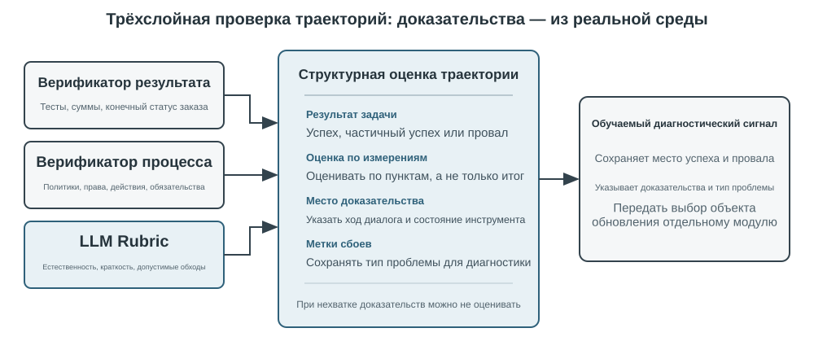

# Мультимодальность и интерактивность в реальном времени

В предыдущих главах мы рассматривали устройство агента в текстовом мире — как он взаимодействует с цифровыми системами через контекст, инструменты и код. Но объекты взаимодействия агента не ограничиваются текстом и API. Когда агенту нужно понять голосовую команду пользователя, найти и нажать нужную кнопку на экране или точно управлять механической рукой для захвата предмета, он вступает в совершенно новую область: **мультимодальное взаимодействие в реальном времени** — расширение от чисто текстового ввода-вывода к **мультимодальному восприятию и отклику в реальном времени**. Это ключевой шаг агента за пределы «диалогового окна». «Мультимодальность» означает одновременную обработку разных форм информации — текста, речи, изображений, видео, действий — а не только текста.

Сначала очертим границы этой главы. Статическое понимание изображений и документов — просмотр скриншота, чтение диаграммы, разбор PDF — уже органично вошло в практику агентов из предыдущих глав как инструмент восприятия: для сегодняшних мультимодальных больших моделей такие задачи «один ввод — одно понимание» уже относительно зрелые и не требуют специального архитектурного решения. Эта глава сосредоточена на другом классе проблем: **три сценария, где реальное время делает мультимодальность по-настоящему сложной** — голосовой диалог, управление GUI, управление роботом. В этих сценариях ввод непрерывно поступает потоком, вывод должен укладываться в жёсткий временной бюджет, и из-за этого архитектурное решение качественно меняется. Что касается понимания в реальном времени непрерывного визуального потока (видео) — на момент написания книги для агентов это всё ещё открытый вопрос; мы вернёмся к этой теме в разделе про Computer Use, где обсудим ограничения покадровых скриншотов, и в вопросах для размышления в конце главы. Проведём ещё одну границу: мультимодальная **генерация** (создание изображений, видео) в рамках этой книги — обычный вызов инструмента (об этом уже шла речь в пятой главе, посвящённой генерации мультимедиа), агент просто использует это как внешний инструмент, и это не связано с проблемой интерактивности в реальном времени, которую мы решаем в этой главе, — поэтому это не входит в основную линию главы.

Голосовое взаимодействие, Computer Use и управление роботом на первый взгляд относятся к трём совершенно разным областям, но на практике оказывается, что узкие места у них удивительно похожи: все они требуют одновременной обработки информации разных модальностей, и все они крайне чувствительны к задержке. Пауза в голосовом диалоге дольше двух секунд вызывает раздражение, а миллисекундное дрожание в управлении роботом может привести к столкновению. Эти два ограничения вместе толкают все три сценария в одном архитектурном направлении: от **последовательного конвейера** (как на заводской линии — один этап заканчивается, только потом передаёт эстафету следующему) к **сквозной модели** (единая модель напрямую идёт от входа к выходу, минуя промежуточные передачи).

Глава построена по следующей логике:

1. Сначала выстроим систему координат из «трёх парадигм голосовой архитектуры» — каскад (конвейер VAD-ASR-LLM-TTS), сквозная всемодальная модель (Omni, единая модель, но всё ещё говорящая по очереди), полный дуплекс (Moshi, GPT-Live, слушает и говорит одновременно) — и вдоль оси «как избавиться от предположения о поочерёдности речи, заложенного в VAD» последовательно разберём задержку и компромиссы каждого звена; в разделе про каскад отдельно расскажем, как заменить VAD + ASR потоковым голосовым восприятием.
2. Затем посмотрим, как архитектура мышления примиряет противоречие между «мгновенным откликом» и «глубоким размышлением»: от простого параллелизма быстрого и медленного мышления, через путь развязки, где фоновая модель рассуждения выступает «военным советником» (делегирование в GPT-Live, Pine AI и другие), до Step-Audio R1, который «интернализует» размышление в единую модель — «думает и говорит одновременно».
3. Затем обсудим оптимизацию исполнительного слоя за счёт более человекоподобного синтеза речи.
4. Наконец расширим взгляд до Computer Use (когда ИИ управляет экраном компьютера, как человек) и управления роботом, посмотрим, как те же проблемы задержки и мультимодальности проявляются в этих двух сценариях.

Особо отметим два момента, более теоретических и переносимых между сценариями: **архитектуру мышления** (как взаимодействуют два контура — быстрого и медленного мышления) и производный от неё **интерфейс быстрого и медленного мышления** (Latent Bridge — что кроме текста можно передавать между быстрой и медленной моделями). Хотя разговор о них начинается с голосового сценария, они полезны не только там — далее в Computer Use и робототехнике мы снова столкнёмся с вопросом «когда стоит позвать медленного советника», и на это стоит обратить особое внимание.

## Голос: самый естественный интерфейс человека и машины

Голос — это не просто текст, превращённый в звук. Человек говорит примерно в четыре раза быстрее, чем печатает, и при этом освобождает руки и глаза. Поэтому голосовой Agent образует непрерывный цикл ввода и вывода, в котором пользователь может перебить его в любой момент. Диктовка превращает речь в текст, а голосовой Agent позволяет сотрудничать с ним напрямую; оба сценария поддерживают описанный ранее whisper coding.

Здесь рассматриваются два направления: пользователь говорит с Agent, а Agent говорит с внешним миром от имени пользователя. Голосовая модель определяет, на что Agent способен ответить, а архитектура взаимодействия — насколько хорошо он слышит, быстро отвечает, передаёт очередь и выполняет подтверждения и вызовы инструментов во время разговора.

### Время взаимодействия: от каскада к полному дуплексу

Введение OpenAI о GPT-Live описывает три парадигмы голосового взаимодействия: каскадную, поочерёдную и полнодуплексную[^ch9-12]. Это не линейная замена старого новым, а разные компромиссы между задержкой, стоимостью и наблюдаемостью:

| Парадигма | Основная структура | Главное преимущество | Главное ограничение |
| --- | --- | --- | --- |
| Каскад | VAD → ASR → LLM → TTS | Ясные модули, которые легко заменять и отлаживать | Задержка накапливается, а просодические сигналы теряются на границах |
| Сквозной Omni | Одна модель слушает, думает и говорит | Меньшая задержка, лучше сохраняются тон, эмоции и окружающий звук | Всё ещё требует очереди; обучение и отладка дороже |
| Полный дуплекс | Непрерывно слушает, говорит и принимает решения | Перекрывающаяся речь, естественные перебивания и непрерывный поток | Сложнее обучать, контролировать и оценивать |

Общая идея — уйти от предположения, что люди говорят строго по очереди, и от догадки VAD о том, кому принадлежит очередь. Каскад и Omni всё ещё делят разговор на ходы, а полный дуплекс превращает владение очередью в непрерывное решение модели.

[^ch9-12]: OpenAI. *Introducing GPT-Live.* 2026-07-08. https://openai.com/index/introducing-gpt-live/ Классификация «каскад / по очереди / полный дуплекс» взята из описания трёх поколений ChatGPT Voice; термин «сквозной мультимодальный (Omni)» соответствует категории «turn-based voice models».

### Парадигма 1 · Каскадный конвейер

Большинство коммерческих голосовых помощников по-прежнему используют последовательный конвейер (рис. 9-1): VAD определяет конец реплики, ASR переводит аудио в текст, LLM понимает запрос и генерирует ответ, а TTS озвучивает его. Модульность упрощает независимую оптимизацию, но каждая граница добавляет ожидание.


| Модуль | Роль | Типичное узкое место |
| --- | --- | --- |
| VAD | Определить окончание речи | Порог тишины задерживает ответ и ошибочно делит реплики |
| ASR | Преобразовать аудио в текст | Задержка распознавания и потеря контекста |
| LLM | Понять, рассуждать и сгенерировать ответ | Время до первого токена; reasoning добавляет ожидание |
| TTS | Преобразовать текст в речь | Синтез первого пакета и буфер воспроизведения |

Для короткого ответа без reasoning ожидание VAD, ASR, LLM и TTS складывается последовательно (рис. 9-2); конкретные значения зависят от длины ввода, модели, оборудования, сети и нагрузки. В производстве очередь дополнительно увеличивает простой (рис. 9-3).




> **Эксперимент 9-1 ★: построение традиционного голосового Agent**
>
> Соедините микрофон, Silero VAD, локальный Whisper, потоковую LLM и Fish S1 TTS через WebSocket. Сохранённое реальное свидетельство одного хода подтверждает работу медиа- и модельного конвейера от начала до конца, но не является бенчмарком параллелизма или производственной нагрузки. Код и запись приёмки находятся в [chapter9/live-audio](../chapter9/live-audio/).

> **Дополнение: голосовой Agent, который «звонит пользователю» через WebRTC**
>
> Телефонному Agent не нужен PSTN. Браузерный WebRTC воспроизводит цикл открытия сессии, запроса недостающих сведений, повторения их для подтверждения и сохранения структурированного результата. Для связи с внешней организацией тот же контракт можно подключить к совместимому провайдеру PSTN/SIP. Полный медиатракт, сравнение direct/ReAct и свидетельства приёмки находятся в [chapter9/phone-agent](../chapter9/phone-agent/). Исторические идентификаторы запусков \`exp9-2\` сохранены, но в рукописи это больше не нумерованный эксперимент.

#### От последовательности к потоковому восприятию

Потоковый ASR может выдавать предварительную расшифровку, пока пользователь говорит; LLM — отправлять в TTS первое готовое для произнесения предложение; TTS — возвращать аудиоблоки. Это не делает ASR, LLM и TTS полностью параллельными: при изменении частичного текста генерацию приходится отменять, запускать заново или исправлять, а одного параметра \`stream\` недостаточно.

Обычный streaming также не устраняет ожидание тишины VAD. Связка VAD + ASR накапливает задержку, теряет колебания, эмоции, короткие реплики и окружающий звук, а имена и адреса электронной почты могут быть разорваны между сегментами. Настоящей потоковой модели нужны причинный или блочный энкодер и инкрементальное декодирование; энкодер Whisper ждёт целый аудиосегмент, поэтому Whisper нельзя называть причинной потоковой моделью. Аудиомодель на базе LLM может выдавать текст и семантические события из непрерывного звука, но симуляция префиксов не обещает задержку причинной модели.

Кроме слов поток может выдавать маркеры \`speak_start/end\` и \`interrupt\` (границы речи и намерение перебить), \`emotion\` (эмоция и колебание), а также \`laugh\`, \`sigh\` и \`noise\` (паралингвистические и внешние звуки). Так голосовой Agent не сжимает каждое акустическое событие до обычного текста.

[^ch9-11]: О встраивании определения очереди в распознаватель и проблеме меток, использующих информацию из будущего, см. Bojie Li и Noah Shi, *The Trade-off Was in the Labels: Causal Supervision for Turn-Aware Streaming ASR*, 2026 (готовится к публикации).

> **Эксперимент 9-2 ★: моделирование потокового речевого восприятия с помощью Qwen2-Audio**
>
> Qwen2-Audio сам по себе не потоковая модель. Эксперимент имитирует непрерывное восприятие растущими аудиопревью и сравнивает его с VAD на 600 мс + Whisper. Эталонный запуск прошёл проверки выполнения и происхождения, но воспроизвёл лишь 2 из 6 ожидаемых реакций: вызовы заняли 8,4–11,3 с, в образце pause не появился \`silence\`, а в образце noise сохранилась ошибка \`cough/laughter\`. Это отрицательный результат проверки механизма, а не свидетельство «настоящего потокового восприятия за 100–200 мс». Полная запись в [chapter9/streaming-speech](../chapter9/streaming-speech/).

### Парадигма 2 · Сквозные мультимодальные модели (Omni)

Даже с потоковым восприятием каскад передаёт слушание, мышление и речь через дискретные интерфейсы; при превращении аудио в текст теряются эмоция, интонация и окружающий звук. Omni делает всё одной моделью, что уменьшает задержку и сохраняет нетекстовые сигналы, но повышает стоимость обучения, отладки и замены компонентов (рис. 9-4). Самокаскад может исправить ошибку распознавания, когда для задачи достаточно текста; если же ответ зависит от скорости речи, эмоции или среды, текстовый узкий канал необратимо уничтожает доказательство[^ch9-13].

Omni всё ещё предполагает очередность и использует VAD или семантическое определение конца реплики. Пауза в последовательности чисел может быть принята за конец; потоковое восприятие улучшает решение, но не отменяет ходов разговора.

[^ch9-13]: Полное измерение того, когда меняется преимущество каскада и сквозной модели, см. Li, Bojie и Noah Shi, *The Cascade Gap: When and Why Self-Cascades Help Multimodal Agents*, 2026 (готовится к публикации).


Realtime speech API занимают промежуточное положение: модель принимает аудио напрямую, но управление взаимодействием по-прежнему опирается на VAD, перебивания и асинхронные вызовы инструментов. Важно сравнивать не рейтинги, а то, на каких задачах ошибаются сквозной и самокаскадный пути.

> **Эксперимент 9-3 ★★: локальный запуск MiniCPM-o 4.5 — сквозной путь против самокаскада**
>
> Зафиксируйте одну локальную ревизию MiniCPM-o 4.5, отключите режим мышления и сравните прямые ответы на аудио с самокаскадом: сначала расшифровать, затем ответить по тексту. Эксперимент измеряет сохранение аудиоинформации, а не последующую способность «думать во время речи».
>
> | Тип задачи | Сквозной | Самокаскад | Наблюдение |
> | --- | ---: | ---: | --- |
> | Семантическая арифметика (2) | 1/2 | 2/2 | Самокаскад исправил одну ошибку расшифровки |
> | Паралингвистическая скорость речи (2) | 2/2 | 1/2 | Текстовая расшифровка стёрла различие «быстро/медленно» |
> | Итого | 3/4 | 3/4 | Равные суммы, взаимодополняющие ошибки |
>
> Выборка мала и не доказывает, какой путь обычно точнее или быстрее. Версии, сырые ответы и аудио-в-аудио свидетельства находятся в [chapter9/end-to-end-speech](../chapter9/end-to-end-speech/).

Step-Audio 2 показывает сквозной путь от сырого аудио к тексту и речи, сохраняя эмоцию, темп, интонацию и окружающий звук. Step-Audio R1 дополнительно встраивает рассуждение в аудиомодель и служит примером «думать во время речи».

### Парадигма 3 · Интерактивные полнодуплексные модели

Omni разделяет «говорит пользователь» и «говорит модель», но синхронный перевод требует перекрытия. Полнодуплексная модель слушает и говорит непрерывно, каждый раз решая, продолжать ли, замолчать, перебить или вызвать инструмент. Moshi от Kyutai был ранним исследовательским примером. Thinking Machines Lab называет такой подход **Interaction Model**[^ch9-14]: взаимодействие зашито в модель, а не собрано вокруг VAD. GPT-Live доводит его до производственного масштаба и делегирует сложную работу фоновой модели, пока передний план поддерживает разговор.

[^ch9-14]: Thinking Machines Lab, “Interaction Models: A Scalable Approach to Human-AI Collaboration”, 2026-05. https://thinkingmachines.ai/blog/interaction-models/

Траектория такова: каскад угадывает ход по порогу тишины, потоковое восприятие поднимает решение до семантического уровня, а полный дуплекс превращает смену хода в непрерывное решение.

### Когнитивное время: взаимодействие в реальном времени и глубокое мышление

Передний план должен ответить, пока пользователь ещё вовлечён, а фоновая модель может думать дольше. Это три компромиссных дизайна, а не последовательные ступени:

| Дизайн | Передний план | Фон | Главный риск |
| --- | --- | --- | --- |
| Быстрый заполнитель, медленная коррекция | Немедленный ответ | Переосмыслить и дополнить | Противоречие |
| Быстрое взаимодействие, медленный совет | Поддерживать разговор и выбирать формулировку | Совет или результат инструмента | Ограниченный интерфейс |
| Единые мышление и выражение | Думать и говорить вместе | Общее состояние модели | Дорого обучать и заменять |

Первое решение может дважды обработать вопрос и прийти к противоречию. Второе надёжнее: фон передаёт совет через строку состояния, но передний план не видит промежуточные рассуждения и не умеет по-настоящему думать во время речи. Третье объединяет процессы. В Step-Audio R1 метод MGRD привязывает рассуждение к акустическим признакам, а двухмозговая архитектура MPS параллельно планирует и озвучивает (рис. 9-5 и 9-6). Единая модель естественнее, раздельная проще в замене фонового «мозга»; это разные компромиссы.

### Синтез речи, более похожей на человеческую

Слишком гладкий TTS без пауз выдаёт машину. Основная LLM может добавлять к тексту маркеры \`THINKING\`, \`EMO:happy\` и \`SPEED:0.8x\`, а TTS отображает их в паузы, просодию, темп, смех и вздохи. Это можно реализовать специальным TTS с поддержкой маркеров или клонированием голоса с несколькими эталонными записями.

> **Эксперимент 9-4 ★★: управление TTS метками на основе Fish Audio**
>
> С помощью Fish Audio S1 создайте библиотеку голоса с несколькими эталонами и сравните три настройки: без меток, с одной записью и с несколькими записями. Исполнительный слой выбирает эмоцию, темп и стиль по меткам. В трёх сбалансированных слепых прослушиваниях конфигурация с несколькими эталонами получила лучший результат (4,67/5 по сходству с человеком-оператором), но полный ожидаемый порядок не воспроизвёлся: вариант без меток превзошёл вариант с одной записью. Малое исследование показывает пользу выразительного управления, но не даёт общего вывода о качестве речи. Библиотека из 24 записей, медиа A/B/C и протокол приёмки находятся в [chapter9/controllable-tts](../chapter9/controllable-tts/).
## Computer Use: агент автоматизации GUI

Читая до этого момента, вы, возможно, заметили, что в этой главе речи посвящено заметно больше места, чем двум оставшимся сценариям, — и это сделано намеренно. На этой линии эволюции реального времени в мультимодальности речь прошла путь наиболее полно и заслуживает того, чтобы служить системой отсчёта: отталкиваясь от проблемы «слишком высокой задержки последовательного конвейера», через сквозные модели, полный дуплекс, «говорю, пока думаю» и целый ряд других решений, речь дошла до относительно сформировавшегося сегодняшнего итога — весь путь от проблемы через решение к итогу здесь полностью пройден. Поэтому мы разобрали её подробно, а два следующих сценария — Computer Use и роботы — можно рассматривать, сверяясь с этой линией эволюции речи: на какой стадии этого пути находится каждый из них, и на чём он застрял.

Эти три сценария кажутся разными, но сталкиваются с одними и теми же базовыми вызовами: восприятие в реальном времени, принятие решений с низкой задержкой, непрерывное взаимодействие. Далее посмотрим, как эти технические темы воспроизводятся в визуальном взаимодействии (Computer Use) и физическом взаимодействии (роботы) — сначала расширим взгляд от слуховой модальности к визуальной: что если агент способен не только понимать речь, но и «видеть» экран и управлять графическим интерфейсом?

Computer Use (также называемый агентом автоматизации GUI) позволяет ИИ пользоваться программами так же, как человек, — наблюдая за экраном и управляя мышью и клавиатурой: например, открыть браузер и найти информацию, заполнить данные в таблице или изменить настройки в системных параметрах. В основе лежит цикл **восприятие — мышление — действие** (Рис. 9-7):

1. Агент делает скриншот текущего экрана
2. Мультимодальная модель получает скриншот и указание задачи, выводит рассуждение и конкретное действие
3. Слой исполнения выполняет это действие в реальной среде (двигает мышь, кликает, вводит текст и т. д.)
4. После ожидания реакции интерфейса снова делается скриншот, и цикл переходит к следующему шагу


В этом цикле есть три ключевых измерения проектирования: **пространство действий** (какие операции доступны агенту), **визуальное позиционирование** (как найти целевой элемент на скриншоте) и **архитектура модели** (как сгенерировать правильное действие на основе скриншота).

### Проектирование пространства действий

Anthropic определяет три категории инструментов, составляющих полную способность к взаимодействию (Рис. 9-8):


**Инструмент GUI-операций** (computer tool): операции мыши включают перемещение (mouse_move), клик левой/правой/средней кнопкой, двойной/тройной клик, перетаскивание (left_click_drag), а также более точные нажатие/отпускание (left_mouse_down/up). Прокрутка (scroll) поддерживает четыре направления и может комбинироваться с клавишами-модификаторами. Клавиатурные операции включают посимвольный ввод (type, интервал между символами 12 мс имитирует реальную печать), сочетания клавиш (key, например Ctrl+C), удержание клавиши (hold_key). Действия восприятия: скриншот (screenshot), получение позиции курсора (cursor_position), ожидание (wait).

**Инструмент выполнения команд** (bash tool): предоставляет постоянную сессию bash-терминала с тайм-аутом 120 секунд, определяет завершение выполнения команды по строке-«часовому», сохраняет состояние среды между несколькими вызовами (например, если перейти в директорию через cd, следующий вызов будет уже в ней).

**Инструмент редактирования файлов** (str_replace_editor): реализует безопасное редактирование через сопоставление строк, поддерживает просмотр, создание, замену, вставку и отмену операций — это точнее, чем прямая перезапись всего файла, и снижает риск случайного изменения остального содержимого.

> **Эксперимент 9-5 ★: запуск Computer Use (эталонный путь Anthropic или путь открытой модели)**
>
> Путь A использует Anthropic Computer Use Demo. Контейнер содержит полноценную рабочую среду Ubuntu с браузером, терминалом и другими стандартными инструментами. Фронтенд принимает задачу, бэкенд отправляет инструкции и скриншоты в Claude, а затем выполняет возвращённые моделью действия с мышью, клавиатурой, терминалом или редактором. Этот путь предназначен для изучения протокола нативного инструмента `computer` и не требует, чтобы у каждого читателя был доступ к Anthropic API.
>
> Путь B использует сопроводительный проект книги [`chapter9/computer-use-open-model`](../chapter9/computer-use-open-model/). По умолчанию он управляет browser-use с помощью модели с открытыми весами Qwen3-VL 32B Instruct—через размещённый API OpenRouter либо посредством перенаправления `OPEN_MODEL_BASE_URL` на самостоятельно размещённый vLLM/SGLang или другую совместимую конечную точку. Конечная точка должна принимать скриншоты и поддерживать нативный JSON Schema; если поддерживается только обычный JSON, можно явно включить режим совместимости schema-in-prompt.
>
> Оба пути используют одну и ту же задачу только для чтения и один контракт приёмки: не более 25 шагов, ровно одно действие на шаг, сохранение идентификатора модели/конечной точки, исходных ответов поставщика, пошаговых скриншотов, последовательности действий, окончательного ответа и причины остановки. Разные модели необходимо представлять как отдельные экспериментальные ветви: результат открытой модели нельзя выдавать за воспроизведение Claude, а «успешный запуск контейнера»—за выполнение задачи. Интервалы между действиями и качество планирования являются измеряемыми результатами; нельзя заранее считать интервал равным 2–5 секундам или предполагать неизбежное превосходство над другими моделями.

### Визуальная локализация (Grounding)

В каждом раунде цикла модели нужно точно определить положение целевого элемента на скриншоте — «где находится строка поиска?», «каковы координаты кнопки отправки?». Это и есть задача визуальной локализации (Grounding). Сейчас существует **два основных подхода**: первый — превратить локализацию в **вопрос с вариантами ответа**: сначала все элементы интерфейса помечаются номерами, и модели остаётся лишь выбрать один из них; второй — **прямое предсказание координат**: модель, как человек, буквально «смотрит» на скриншот и называет координаты. Причём подход с вариантами ответа реализуется двумя способами: **чисто визуальная разметка** (исходный Set-of-Mark, где сегментационная модель нарезает кандидатные области по пикселям) и **структурированное индексирование элементов** (DOM/Accessibility Tree, когда структура считывается напрямую из самого интерфейса). Общее преимущество подходов с вариантами ответа в том, что открытая задача «найти на скриншоте кнопку и предсказать её координаты» превращается в закрытую задачу «выбрать один элемент из уже размеченных» — точно так же, как на экзамене вопрос с вариантами ответа проще, чем вопрос с открытым ответом: модели достаточно сказать «нажать [123]», а не «нажать на синюю кнопку примерно в 200 пикселях правее верхнего левого угла экрана».

**Set-of-Mark: метод визуальной разметки.**

Исходный Set-of-Mark (SoM) был предложен исследовательским подразделением Microsoft в 2023 году, изначально — чтобы раскрыть возможности визуальной локализации GPT-4V. Это **чисто визуальный** метод: сегментационная модель (SAM, SEEM и т. п.) автоматически нарезает на скриншоте кандидатные области, для каждой из них накладывается номерная метка, и модель видит изображение с номерами — ей достаточно назвать номер, а система пересчитает его в координаты центра соответствующей области. Весь процесс не требует DOM и вообще какой-либо внутренней структуры интерфейса, поэтому подход применим и к нативному настольному ПО, и к игровым интерфейсам — лишь бы сегментационная модель могла нарезать кандидатные области.

**Структурированное индексирование элементов: структурная реализация идеи SoM для веба.**

Когда сам интерфейс может предоставить структурированную информацию, разметку можно сделать точнее. Современные веб-страницы ещё до рендеринга уже определяют полную структуру элементов (дерево DOM) и семантические роли (что является кнопкой, что — полем ввода), а интерфейс специальных возможностей (Accessibility Tree) даёт аналогичную информацию для многих настольных приложений. Вместо того чтобы заставлять сегментационную модель угадывать по пикселям «какая область является кнопкой», логичнее прямо спросить сам интерфейс: «какие у тебя есть кликабельные элементы?». Именно так поступают веб-агенты на базе проекта browser-use: интерактивные элементы перечисляются из DOM и нумеруются — это можно рассматривать как структурную реализацию идеи SoM для веба (Рис. 9-9). Процесс состоит из четырёх шагов:

1. Через отладочный интерфейс браузера (CDP, Chrome DevTools Protocol) получить структурированное представление страницы (дерево DOM) и информацию о доступности
2. Автоматически определить, какие элементы интерактивны (кнопки, поля ввода, ссылки и т. д.)
3. Присвоить каждому интерактивному элементу уникальный ID и нарисовать вокруг него рамку на скриншоте
4. Одновременно сформировать текстовый список, описывающий, какой элемент соответствует каждому ID

```
Скриншот: [на изображении ключевые элементы помечены ID [1], [2], [3], [4] и т. д.]

Элементы:
[1] <input type="text" placeholder="Search" aria-label="Search" />
[2] <button id="submit-btn" aria-label="Submit form" />
[3] <input type="text" placeholder="Enter your name" value="" />
[4] <a href="/docs" aria-label="Documentation" />
```

Модели достаточно вывести только номер ID, а система автоматически выполнит клик по координатам центра этого элемента. Такой подход не экономит токены (потому что всю разметочную информацию нужно отправить модели), зато обеспечивает точную и стабильную локализацию и избавляет от пропусков и ложных срабатываний, которые может внести сегментационная модель.


**Прямое предсказание координат.**

Третий путь не использует никакую разметку и заставляет модель напрямую выдавать координаты. Яркие примеры — **SeeClick** и Computer Use от Claude: на огромном массиве парных данных «скриншот GUI — положение элемента» обучается визуальная модель, которая учится напрямую отображать описание на естественном языке (например, «нажми кнопку отправки») в точные координаты на скриншоте — точно так же, как человек находит нужное место, полагаясь исключительно на зрение.

В схемах с предсказанием координат понимание моделью координат сильно зависит от разрешения, использованного при обучении (Рис. 9-10). Claude обучалась на XGA (1024×768), WXGA (1280×800), FWXGA (1366×768); если разрешение входного скриншота не совпадает с этими значениями, предсказанные моделью координаты систематически смещаются — как если бы вы измерили расстояние на карте меньшего масштаба и напрямую применили результат к карте большего масштаба. Поэтому на уровне инструментов нужно реализовать механизм двустороннего масштабирования координат, причём **целевое разрешение нужно выбирать по соотношению сторон**, чтобы неравномерное растяжение не деформировало изображение и не сбило вместе с ним оценку координат. Например, если реальное разрешение экрана — 2560×1440 (16:9), нужно среди трёх поддерживаемых Claude вариантов выбрать тот, чьё соотношение сторон тоже близко к 16:9, — лучше всего подходит FWXGA (1366×768). При съёмке скриншота экран пропорционально масштабируется до 1366×768 и подаётся в модель; модель выдаёт координаты клика (683, 384), которые затем обратно пересчитываются в реальные координаты (683×2560/1366, 384×1440/768) ≈ (1280, 720). И наоборот, если насильно растянуть 16:9 в 4:3 разрешение 1024×768, изображение будет сжато по горизонтали, и предсказанные моделью координаты систематически сместятся.


Логику выбора между тремя путями можно сформулировать так: **когда доступна структурированная информация, приоритет отдаётся индексированию через DOM/Accessibility Tree** — это даёт самую точную и стабильную локализацию; **когда она недоступна** (нативное настольное ПО вроде Photoshop, интерфейсы, отрисованные через Canvas/WebGL, игры), **можно использовать как визуальную разметку (исходный путь SoM), так и предсказание координат**. Визуальная разметка превращает локализацию в выбор варианта ответа и более дружелюбна к универсальным моделям без специального обучения; предсказание координат обходится без этапа разметки и более прямолинейно для моделей, прошедших обучение локализации в GUI. У обоих подходов на мелких элементах и плотных интерфейсах точность всё ещё оставляет желать лучшего.

> **Эксперимент 9-6 ★: реализация автоматического управления браузером с помощью browser-use**
>
> Фреймворк автоматизации браузера Playwright в сочетании с мультимодальной моделью реализует управление браузером на естественном языке. Включается визуализация SoM, и перед каждым решением сохраняется скриншот с размеченными рамками. Интерфейс модели не ограничен OpenAI или Anthropic: книга предоставляет конфигурацию API для открытой модели Qwen3-VL и сохраняет универсальный совместимый с OpenAI base URL для других размещённых сервисов или самостоятельно размещённого инференса.
>
> Тестовая задача «открыть Google и узнать погоду в Сан-Франциско»: после запуска скриншот показывает страницу поиска Google с пронумерованными интерактивными элементами. Модель выбирает поле поиска, вводит «San Francisco weather today», отправляет запрос, а затем извлекает температуру и погодные условия со страницы результатов. При приёмке ответ и траектория независимо проверяются, а фактическое число шагов и затраченное время записываются без изменений. «5 шагов, около 20 секунд» может быть лишь наблюдением из отдельного запуска, а не фиксированным результатом без подтверждения исполнения.
>
> Сохранённый в книге официальный запуск открытой модели использовал `qwen/qwen3-vl-32b-instruct` в OpenRouter. Встретив CAPTCHA в Google Search на шаге 4, модель не объявила об успехе, а перешла на weather.com и на шаге 16 прочитала на странице Today для Сан-Франциско: 64°F, Sunny, ощущается как 62°F, максимум 74°F и минимум 55°F. Все 16 из 16 ответов API указали запрошенную модель Qwen3-VL, а 15 корректных пошаговых скриншотов вместе с траекторией действий только для чтения прошли независимую детерминированную приёмку. Этот результат доказывает работоспособность пути API открытой модели, но не означает, что экспериментальная ветвь с нативным инструментом `computer` от Anthropic воспроизведена.

### Computer Use Agent, способный видеть движение и слышать звук

До сих пор восприятие в Computer Use строилось на одном неявном допущении: **экран статичен** — сделали скриншот, подумали шаг, кликнули, снова сделали скриншот. Но в реальности на экране может проигрываться видео, может всплывать мимолётное уведомление, может звучать голос собеседника на конференц-звонке. Агент, который «открывает глаза» раз в 3–5 секунд и вообще не имеет «ушей», не может ни увидеть, ни услышать то, что происходит «между двумя кадрами». Просмотр записи экрана, участие в звонке, реагирование на голосовые подсказки, обработка мгновенно исчезающих диалоговых окон — вся эта категория повседневных операций с компьютером сегодня для Computer Use Agent практически недоступна.

По-настоящему заново нужно проектировать не «интерфейс действий», а «**интерфейс наблюдения**» [^ch9-9]. Ключевая идея — отделить **наблюдение** (непрерывное, адаптивное, мультимодальное) от **действия** (дискретного) и оформить его как слой перцептивного middleware, который встраивается между средой и любой уже готовой моделью Computer Use без её переобучения (можно назвать его интерфейсом наблюдения агент — компьютер, AOI). У него три компонента, каждый из которых «открывает шлюз» только по необходимости: во-первых, **захват ключевых кадров между тактами** — сначала крайне дешёвый пиксельный фильтр пропускает почти неизменные кадры, затем небольшая модель определяет, произошло ли значимое изменение изображения, и только при изменении делается снимок; при статичной картинке стоимость почти нулевая; во-вторых, **транскрипция речи, управляемая громкостью** — распознавание речи вызывается только при наличии звука, благодаря чему у агента впервые «отрастают уши»; в-третьих, что важнее всего, — **превращение кадра в устойчивый текст**: модель описывает захваченный кадр одной фразой («только что всплывшая подсказка сообщает, что дата релиза перенесена на 28 апреля»), и **даже после того, как исходное изображение будет вычищено из контекста, эта фраза остаётся в памяти**, унося динамическую информацию дальше в текстовом виде.

Один неочевидный вывод: по-настоящему важно не «какие именно кадры выбрать», а «**превратить кадр в текст, способный храниться долго**» — ведь текст — это модальность, с которой LLM-агент справляется лучше всего. На восьми моделях от 7B до передового масштаба этот слой middleware без какого-либо переобучения даёт прирост от +17 до +48 процентных пунктов, причём разрыв особенно велик в задачах, связанных с речью: добавив этот слой восприятия, агент способен выполнять голосовые задачи, которые раньше «слышал, но не мог выполнить». Но это не универсальная фиксированная конфигурация на все случаи жизни — на некоторых более новых моделях избыток токенов изображения, наоборот, вытесняет рассуждение и снижает качество работы, поэтому эти компоненты нужно **подбирать индивидуально под модель**, а не включать все разом. Это та же логика, что и в компромиссах Set-of-Mark и предсказания координат выше: у восприятия нет серебряной пули — конфигурацию нужно подстраивать под характер модели.

[^ch9-9]: Полное описание механизма трёх компонентов — шлюзование ключевых кадров, транскрипция по необходимости, превращение кадров в устойчивый текст — и абляции по каждой модели см. Li, Bojie and Noah Shi. *Agent-Computer Observation Interfaces Enable Dynamic Computer Use.* arXiv:2606.29472, 2026.

### Мобильные устройства: экосистемные барьеры сложнее технологий

Computer Use также расширяется на мобильные устройства. Технически мобильные и настольные платформы действительно различаются: пространство действий здесь обычно уже не «координаты мыши + клавиатура», а обращение к системному API служб специальных возможностей (например, AccessibilityService в Android) для считывания элементов интерфейса и отправки кликов и текстового ввода; способ взаимодействия тоже меняется — от указателя мыши к сенсорным жестам, а семантика координат вместе с этим меняется: одна и та же пара (x, y) может означать одиночное касание пальцем, долгое нажатие или начальную точку жеста смахивания — для их различения нужен дополнительный тип жеста. Именно на таком пространстве действий описанные в главе 6 мобильные бенчмарки вроде AndroidWorld оценивают способность агента выполнять реальные задачи в приложениях.

Но по-настоящему сдерживает мобильные устройства, как правило, не эта техническая разница, а экосистемные барьеры. Некоторые производители смартфонов уже пытались встроить в потребительские устройства ИИ-помощника, автоматически управляющего повседневными приложениями вроде WeChat, Taobao, Alipay, но быстро столкнулись с ограничениями со стороны платформ.

Это раскрывает уникальную проблему, с которой сталкивается Computer Use: **экосистемный барьер**. Коренная причина блокировок — конфликт бизнес-моделей. Основная логика монетизации традиционных интернет-приложений — это **трафик и внимание**: пользователь листает ленту и видит рекламу, ищет товар и следует рекомендательным алгоритмам, просматривает страницы и совершает импульсивные покупки. Когда же вместо пользователя действиями управляет агент, эта цепочка монетизации полностью обходится стороной: ИИ не обращает внимания на рекламу и не совершает импульсивных покупок, а идёт прямо к цели и заканчивает задачу. Для платформ, монетизирующихся за счёт рекламы и трафика, каждое действие агента подтачивает саму основу их бизнес-модели.

Это означает, что Computer Use сталкивается не только с техническим противодействием вроде CAPTCHA (проверочные коды), но и со **структурным конфликтом интересов**. Это противоречие сложно устранить в краткосрочной перспективе, что делает внедрение Computer Use в потребительских сценариях более трудной задачей, чем чисто техническая проблема.

### Оперативность: пока нерешённая ключевая проблема

**OSWorld** (методология его оценки подробно описана в главе 6) — широко используемый бенчмарк для оценки Computer Use, тестирующий способность агента выполнять межприложенческие задачи в реальных средах Ubuntu/Windows/macOS. Ранние универсальные модели на этом бенчмарке показывали успех лишь около двадцати процентов, но последующие специализированные модели и более мощные универсальные модели постоянно поднимали точность, и к моменту написания книги она уже приближается к человеческому уровню. Но точность далеко не конечная цель — истинное узкое место сместилось от «сможет ли сделать правильно» к «сможет ли сделать быстро».

Исследование эффективности **OSWorld-Human** раскрывает неприятный факт: даже если задача в итоге выполнена успешно, агенту требуется заметно больше шагов действий, чем человеку, а задержка рассуждения на каждом шаге продолжает расти по мере продвижения задачи — чем длиннее контекст, тем медленнее модель принимает решения, и время выполнения поздних шагов часто намного превышает время выполнения ранних. Правку формата документа, которую человек делает за несколько десятков секунд, агент может провозиться несколько минут. **Достижение точности человеческого уровня не равнозначно практической применимости — истинное узкое место именно в эффективности.**

Корень проблемы эффективности похож на голосовые сценарии: в последовательном цикле «скриншот — размышление — клик» даже при максимальной оптимизации каждого этапа накопленная задержка остаётся неприемлемой. Более глубокая проблема в том, что нынешний Computer Use совсем не умеет «думать заранее». Если бы агент мог одновременно с выполнением текущего действия предсказывать, что делать на следующем шаге — например, пока страница загружается, уже понять, куда кликать дальше, — время размышления и выполнения можно было бы перекрыть друг другом и значительно снизить общую задержку (это то же самое требование, что и «говорить, продолжая думать» в голосовых сценариях ранее в этой главе, и «непрерывное мышление» асинхронных агентов из главы 4, только здесь оно превращается в «действовать, продолжая думать»).

В отличие от голосовой сферы, у самой оперативности Computer Use — ускорения самого цикла «скриншот — размышление — клик» — пока нет системного решения, он по-прежнему остаётся в рамках дискретного цикла покадровых скриншотов. Но уже опробован один способ обойти эту проблему, использующий уже неоднократно упомянутое в этой главе разделение быстрого и медленного: раз ускорить медленного агента, управляющего компьютером, трудно, то **не заставляйте пользователя тупо ждать его**. «Разговор» и «управление компьютером» разделяются на два параллельно работающих набора моделей, быстрый и медленный [^ch9-10] — маленькая модель (быстрая) отвечает за диалог в реальном времени, а передовая VLM (медленная) шаг за шагом действует в браузере, и они общаются между собой только через предельно простой «чисто текстовый контракт»: медленный агент при каждом действии прикладывает скользяще обновляемое краткое резюме состояния («сейчас заполняю форму, ещё нужна ваша дата рождения»), быстрый агент на основе этого резюме отвечает пользователю в реальном времени и передаёт медленному агенту новую информацию, сказанную пользователем устно, причём **пока резюме состояния не подтвердит завершение, быстрому агенту категорически запрещено говорить «готово»**. Это в точности сценарий «разговаривать по телефону, пока компьютер сам всё делает». В экспериментах такое разделение ускорило голосовой отклик примерно в 15 раз по сравнению с «одной моделью, которая одновременно и действует, и говорит» (медианная задержка 0,58 секунды против 8,64 секунды), при этом успешность выполнения задач не снизилась; а стоит убрать текстовый канал между быстрой и медленной частями — успешность мгновенно падает до нуля, потому что ключевая информация, устно сказанная пользователем, больше не доходит до браузера. Это та же идея, что и Latent Bridge выше, и «говорить, продолжая думать» в голосовых сценариях: когда одно звено по природе своей медленное, пусть быстрое звено заполнит время ожидания пользователя — просто этот «чисто текстовый контракт» по сути и есть строка состояния агента, о которой эта книга говорит начиная со второй главы. Ускорение самого цикла Computer Use, возможно, всё ещё остаётся важным направлением будущих исследований, но «спрятать медленное с помощью разделения быстрого и медленного» — уже рабочий ответ.

[^ch9-10]: Полное описание разделения быстрого и медленного между голосом и действием и «чисто текстового контракта» см. Li, Bojie and Noah Shi. *Talking While Acting: Real-Time Voice for Slow Computer-Use Agents.* 2026 (готовится к публикации).

## Управление роботами: от управления в реальном времени к обучению и обобщению

> **Все пять экспериментов в этом разделе используют одну задачу: положить красную чашку на поднос, жёлтую бумажку — в мусорный контейнер, затем снова осмотреть и проверить состояние стола. Реальный робот и симулятор описываются раздельно, но смысл действий и критерии успеха одинаковы.**
>
Голосовой агент сталкивается с задержкой в модальности слуха, Computer Use — с задержкой в модальности зрения, а когда агенту нужно управлять роботом в физическом мире, вызовы задержки и мультимодальности усиливаются ещё сильнее — последствия действия необратимы, одно столкновение может повредить предмет или сам робот. В этом разделе сначала рассмотрим, как роботы с помощью двухуровневой архитектуры и разбиения действий на блоки решают проблему управления в реальном времени, а затем перейдём к более твёрдому орешку на сегодня — обучению и обобщению: откуда берутся данные и как модель переносится между задачами и платформами.

### Железо не узкое место — узкое место в алгоритмах

Роботы всё ещё не получили широкого распространения в открытых сценариях общего назначения — так узкое место в железе или в алгоритмах? Проект XLeRobot даёт убедительный контрдовод: двурукий колёсный робот стоимостью менее 1000 долларов, под удалённым управлением человека через VR-шлем (телеоперацией), уже способен плавно выполнять большой набор бытовых задач. Более сложные бытовые задачи, требующие ловких манипуляторов, робот Unitree под телеоперацией человека тоже выполняет плавно. Задержка телеоперации составляет около 100–200 мс, что уже близко к требованиям физического взаимодействия по времени отклика. Разрешение сенсоров, точность приводов, частота управления (количество обновлений управляющих команд робота в секунду — чем ниже частота, тем менее плавно движение и тем выше риск дрожания или отклонения от целевой траектории) на текущих недорогих платформах уже достаточны для практических задач.

Здесь нужно чётко очертить границы этого утверждения: телеоперационный контрдовод на самом деле показывает лишь то, что «существующего недорогого железа в сочетании с интеллектом человека достаточно для выполнения **этого класса бытовых манипуляционных задач, где преобладает визуальная обратная связь**». Это не означает, что железо в порядке по всем измерениям — отсутствие тактильного восприятия, надёжность и стоимость ловких манипуляторов остаются общепризнанными слабыми местами железа; если задача сильно зависит от тонкого силового управления и тактильной обратной связи, железо вполне может оказаться узким местом. Поэтому дальнейшее утверждение «железо не узкое место» ограничено рамками задач, обсуждаемых в этом разделе.

Применительно к этому классу задач настоящий разрыв лежит на уровне алгоритмов — ему посвящены два следующих подраздела.

> **Эксперимент 9-7 ★: телеоперация XLeRobot для уборки стола**
>
> **Цель:** Оператор дистанционно управляет реальным XLeRobot, выполняет ту же многошаговую задачу и проверяет состояние стола.
>
> **Принцип:** Манипулятор стоимостью в несколько сотен долларов справляется с этой задачей под управлением человека; здесь узкое место не корпус робота, а восприятие, планирование, управление с обратной связью и восстановление после ошибок.
>
### Двухуровневая архитектура: разделение планирования и управления

Для выполнения сложных бытовых задач роботу нужно принимать решения на двух разных временных масштабах. Первый уровень — более медленное **долгосрочное планирование** (long-horizon planning): разбиение высокоуровневой инструкции вроде «убери стол начисто» на последовательность подцелей (очистить столешницу, загрузить посудомоечную машину, протереть поверхности) — требует понимания семантики среды, рассуждения о зависимостях задач, планирования многошагового плана действий — примерно так же, как человек сначала обдумывает «что делать сначала, что потом», прежде чем взяться за дело. Второй уровень — более быстрое **VLA-управление** (Vision-Language-Action, модель «зрение-язык-действие»): выполнение каждой конкретной операции («подойти к раковине», «взять тряпку», «протереть столешницу») — на основе текущей видимой картинки и языковой инструкции непрерывно генерируются управляющие сигналы, обеспечивающие плавность и связность движений робота.

Такая двухуровневая архитектура эффективно разделяет сложность: долгосрочное планирование отвечает за «что делать», VLA-управление — за «как делать». Эта двухуровневая архитектура «медленное решение на высоком уровне + быстрое исполнение внизу» структурно очень похожа на «быстрое и медленное мышление» из раздела о речевых сценариях выше — в обоих случаях сложное мышление и реагирование в реальном времени разносятся по разным модулям. Стоит уточнить: здесь разделение «планирование / управление» соответствует измерению «медленное глубокое размышление / быстрый отклик в реальном времени» из «быстрого и медленного мышления», а не разделению «мышление / выражение», как в третьей схеме MPS («мозг замысла / мозг выражения»), — там разделяются «думать» и «говорить», а здесь — «планировать целиком» и «исполнять в реальном времени»; эти два вида «двух-X архитектур» режут по разным измерениям.

Впрочем, требование реального времени никуда не исчезает — оно просто переносится вниз, на уровень VLA-управления, и там сглаживается с помощью **разбиения действий на блоки** (Action Chunking, см. ниже раздел «VLA-управление»): модель за один проход генерирует небольшую последовательность будущих действий, поток управления воспроизводит её с высокой частотой, распределяя задержку одного вывода модели по всему времени выполнения блока действий. Но здесь есть неизбежный компромисс: разбиение на блоки — это обмен реактивности на плавность: чем длиннее блок, тем сильнее размазывается задержка одного вывода модели и тем плавнее движение, но тем дольше модель «не видит» новую картинку и тем медленнее реагирует на внезапные изменения (предмет убрали, кто-то подставил руку). Этот компромисс между реальным временем и плавностью — часть проблемы, которую двухуровневая архитектура не устраняет, а лишь переносит.

Здесь также нужно отметить один поворот основной линии главы: в сценарии робототехники противоречие реального времени уже частично снято двухуровневым разделением и разбиением действий на блоки, и основное текущее противоречие сместилось в область **обучения и обобщения** — как получить достаточно данных демонстраций, как заставить модель обобщаться между задачами и платформами. Следующие несколько подразделов как раз посвящены этому новому противоречию — это продолжение в физическом мире тем шестой главы о среде симуляции и седьмой главы об обучении с подкреплением.

При этом это новое противоречие в основном ложится на уровень VLA-управления. VLA можно рассматривать как «VLM + вывод действий»: **VLM** (Vision-Language Model, модель «зрение-язык» — большая модель, способная одновременно понимать изображения и текст) отвечает за «увидеть» и «продумать», а VLA сверх этого должна ещё «действовать руками» — и именно в этом «действии руками» заключён настоящий вызов. Сегодня уровень VLA-управления в основном обучается через имитационное обучение (клонирование поведения) — прямое обучение на большом объёме человеческих демонстраций по принципу «что видишь, то и делаешь» (к этому классу относятся OpenVLA, RT-2, π₀ и другие); обучение с подкреплением служит дополнительным методом поверх него, появившимся в последние годы. VLA, обученные с помощью обучения с подкреплением, хотя и показывают хорошие результаты на отдельной задаче, часто страдают недостаточным обобщением: даже когда, как отмечено в седьмой главе, SimpleVLA-RL показывает очень высокие результаты по отдельным задачам на LIBERO, обучение с подкреплением проводится отдельно для каждой задачи, а не в виде единой модели, способной к обобщению без примеров (zero-shot) на все задачи сразу. Такая модель «обучение под каждую задачу отдельно» означает, что при появлении новой задачи снова придётся собирать данные и заново обучать модель.

Следующие два раздела подробно рассматривают конкретные технические решения долгосрочного планирования и VLA-управления.

### Долгосрочное планирование: от VLM к специализированным моделям воплощённого мышления

Универсальные VLM уже обладают неплохими способностями воплощённого мышления. **Gemini Robotics-ER 1.5** от Google DeepMind специально оптимизирована для воплощённого рассуждения (Embodied Reasoning, то есть понимания положения, движения и причинно-следственных связей объектов в физическом мире) и в среднем показывает 62,8% на 15 академических бенчмарках (Point-Bench, RefSpatial, RoboSpatial, BLINK и др.), превосходя GPT-4o (60,6%) и Gemini 2.5 Pro (59,3%). Основные преимущества: продвинутое понимание пространства и локализация объектов, временное рассуждение (предсказание причинно-следственных связей действий вроде «что будет, если опрокинуть эту чашку»), оркестрация задач (разбиение высокоуровневой инструкции на маленькие шаги), а также нативная поддержка режима размышления (thinking) и вызова инструментов.[^ch9-2]

[^ch9-2]: Google DeepMind, «Gemini Robotics-ER 1.5». https://deepmind.google/models/gemini-robotics/gemini-robotics-er/

> **Эксперимент 9-8 ★: измерение верхней границы идеального управления в симуляции**
>
> **Цель:** Выполнить ту же задачу идеальным контроллером, который не ошибается в восприятии и выборе действий, чтобы получить воспроизводимую верхнюю границу.
>
> **Принцип:** Это эталон при всегда верных решениях, а не свидетельство работы реального робота.
>

> **Эксперимент 9-9 ★★: автономное управление реальным XLeRobot с Gemini Robotics-ER 1.5**
>
> **Цель:** Заменить человека Agent, который наблюдает стол и вызывает ограниченные навыки pick, place и verify, сохранив робота, задачу и критерии эксперимента 9-7.
>
> **Принцип:** Прямое сравнение выявляет разрыв в восприятии, планировании, синхронизации, замкнутом управлении и восстановлении, а не новую механическую границу.
>

### VLA-управление: от данных демонстраций к обобщению между воплощениями

На уровне исполнения двухуровневой архитектуры три представительные модели — RT-2, OpenVLA и π₀ — сосредоточены именно на VLA-управлении, то есть на выводе действий робота в реальном времени на основе изображения с камеры и языковой инструкции (Рис. 9-11). По способу представления действий они делятся на два направления: дискретные токены действий и генерация непрерывной траектории.


**RT-2 и OpenVLA: направление дискретных токенов действий.**

**RT-2** заложила это направление: прямая тонкая настройка на масштабной модели «зрение-язык», где непрерывные действия робота дискретизируются в токены и выводятся по одному авторегрессионно, как при генерации текста, — за счёт способности к обобщению предобученной модели улучшается перенос без примеров (zero-shot) на новые объекты и инструкции. **OpenVLA** унаследовала схему представления действий из RT-2, объединив языковую модель и визуальный энкодер в единой архитектуре: на вход подаются изображение и текстовая инструкция, на выходе — токены действий. Обучение проводится в два этапа: сначала предобучение на масштабном кросс-платформенном наборе данных Open X-Embodiment (охватывающем демонстрации реальных операций на более чем 20 платформах роботов), где усваиваются общие знания об операциях (паттерны действий вроде «взять», «положить» переносимы между разными роботами), затем тонкая настройка на небольшом объёме данных под конкретную платформу. Раз представление действий по сути одинаково, реальные различия между RT-2 и OpenVLA лежат в открытости и инженерных решениях: RT-2 и её обучающие данные принадлежат Google и закрыты, тогда как OpenVLA полностью открыта — открытая базовая модель (Llama 2 плюс визуальный энкодер) в сочетании с публичным набором данных впервые позволили всему сообществу воспроизводить и улучшать эту работу.

**Разбиение действий на блоки: универсальная техника компенсации частоты в области VLA.**

Из-за задержки вывода LLM частота управления VLA намного ниже требований традиционного управления роботами (традиционное управление роботом обычно требует частоты 50–1000 Гц, тогда как один вывод VLA даёт лишь около 1–10 Гц — разрыв достигает двух порядков). Оригинальная OpenVLA — типичный пример этой проблемы: за один вывод она выдаёт только одно действие (примерно 6 Гц одношагового авторегрессивного предсказания), и рывковость движения как раз и была её главным недостатком, за который её критиковали. **Разбиение действий на блоки** (Action Chunking) — универсальная техника, созданная именно для устранения этого разрыва: впервые предложена в ACT (Zhao et al., 2023), впоследствии широко принята в π₀, OpenVLA-OFT и других: за один вывод модель генерирует не одно действие, а сразу последовательность действий на небольшой промежуток будущего времени (для типичной конфигурации π₀ — блок действий длительностью примерно 0,5–1 секунда, то есть 25–50 действий при частоте управления 50 Гц), поток управления исполняет их последовательно с высокой частотой, пока модель в фоне асинхронно генерирует следующую порцию. Пока время вывода модели меньше времени исполнения этой порции действий, робот сохраняет непрерывное плавное движение — как с буферизацией видео: если следующий фрагмент заранее загружен, воспроизведение идёт без рывков.

**π₀: направление генерации непрерывной траектории.**

Настоящий водораздел в представлении действий проходит не между RT-2 и OpenVLA, а между **дискретными токенами и генерацией непрерывной траектории**. **π₀** представляет второе направление: вместо предсказания дискретных токенов действий по одному она использует flow matching (сопоставление потоков — метод непрерывной генерации, родственный диффузионным моделям), чтобы, начиная со случайного шума и проходя через многошаговое «удаление шума», напрямую сгенерировать плавную непрерывную траекторию действий. Такое представление естественно сочетается с разбиением действий на блоки и показывает лучшие результаты на задачах, требующих высокой точности и плавности движений, — например в ловких манипуляциях. Аналогия: путь дискретных токенов похож на постепенный выбор из меню «влево на 5 градусов», «вперёд на 3 сантиметра», а путь непрерывной траектории — на художника, который сначала набрасывает целую кривую, а затем шаг за шагом дорабатывает её штрихами.

### Sim2Real Transfer: разрыв между симуляцией и реальностью

Раздел о средах симуляции в шестой главе уже подробно раскрыл происхождение sim-to-real gap (разрыва между симуляцией и реальностью) и принцип работы domain randomization (рандомизации домена) для его преодоления — не будем повторяться, вкратце: симуляция не может полностью воспроизвести реальную физику, визуальные и аппаратные характеристики, поэтому при обучении эти параметры широко и случайно варьируются, вынуждая политику выучить универсальное представление, устойчивое к самым разным изменениям (Рис. 9-11). Ниже рассмотрим только то, как этот принцип реализуется на реальном манипуляторе.


На этом пути уже есть немало успешных примеров: ловкая манипуляция роботизированной кистью OpenAI (проект Dactyl реализовал переориентацию кубика внутри руки, а его последующая работа с автоматической рандомизацией домена ADR реализовала сборку кубика Рубика одной рукой) и ANYmal от ETH Zurich (четвероногий робот, устойчиво передвигающийся по сложной пересечённой местности — снегу, гальке) — оба относятся к этому направлению.

Что действительно нужно добавить в этой главе — это два инженерных момента, без которых не обойтись при переносе рандомизации домена на реальную машину. Первый — **калибровка диапазона рандомизации**: диапазон нельзя задавать наугад — слишком узкий не покроет реальные вариации, слишком широкий увеличит сложность обучения и приведёт к субоптимальной политике, которая «справляется со всем, но ни в чём не сильна». На практике сначала обычно **эмпирически калибруют** распределения ключевых параметров по данным из реальной среды (например, реальное распределение коэффициента трения, задержки отклика мотора) и выбирают выборку в этом диапазоне; если политика, обученная в симуляции, заметно теряет качество на реальной машине, диапазон рандомизации постепенно расширяют, пока sim-to-real gap не сойдётся до приемлемого уровня. Второй — **визуальное выравнивание**: точная калибровка позы камеры в симуляции и в реальности (выравнивание среды), а также случайная замена реально снятого фона в рендеринг симуляции (замена фона greenscreen), чтобы картинка симуляции максимально приближалась к тому, что видит реальная машина — эти два шага будут конкретно показаны в эксперименте 9-9.

> **Эксперимент 9-10 ★★: сравнение трёх автономных циклов в симуляции**
>
> **Цель:** При тех же задаче и инструментах сравнить открытый цикл, проверку после каждого шага и краткосрочную предиктивную стратегию.
>
> **Принцип:** Пошаговая проверка позволяет восстановиться после локальной ошибки; мировая модель продолжает план при совпадении прогноза с реальностью и перепланирует при расхождении. Финал подтверждается новым наблюдением.
>

> **Эксперимент 9-11 ★★★: RGB-тест одной задачи в разных средах**
>
> **Цель:** Менять фон, внешний вид объектов, освещение и визуальный шум и проверять переносимость визуальной политики на новые изображения.
>
> **Принцип:** Визуальное разнообразие может повысить устойчивость, но не заменяет калибровку реального робота и полный контур безопасности.
>

+## Обновление 2026 года: потоковое планирование и модели мира

Раздел о роботах не должен заканчиваться формулой «VLM пишет план, а VLA его исполняет». Рассмотрим задачу **«навести порядок на столе»**. Планировщик строит список состояния: наполовину полный стакан, бумажный мусор, три книги, открытый ноутбук, корзина и органайзер, — а затем выдаёт команды с предусловиями и проверкой результата:

1. «Подойди к столу и остановись в 30 см от края».
2. «Положи две бумажки в корзину и проверь, что мусора не осталось».
3. «Держи стакан вертикально и поставь его на поднос; замедлись, если жидкость колеблется».
4. «Закрой ноутбук и перемести его в левый дальний угол; не натягивай кабель питания».
5. «Сложи книги по размеру и убери ручки в органайзер».
6. «Только после удаления хрупких предметов и включённых устройств протри стол».
7. «Отойди, снова осмотри стол и проверь конечное состояние».

Это граф зависимостей, а не абзац текста. Если пользователь говорит «сначала убери ноутбук», меняется приоритет цели. Если стакан опрокинулся, робот останавливается в безопасной точке, записывает cup.orientation=fallen и laptop.at_risk=true, отменяет устаревший хвост плана и перепланирует: защитить ноутбук, локализовать воду, повторно осмотреть сцену и продолжить только незатронутые задачи. Уже подтверждённые действия не повторяются. Аварийное событие отменяет текущий блок, обычное обновление ждёт следующей безопасной точки.

### Потоковое исполнение

Планирование и исполнение могут перекрываться. Как только готов безопасный префикс, планировщик отправляет исполнителю полную команду и продолжает строить хвост:

~~~json
{"type":"command.commit","seq":12,"command_id":"desk-02","command":"put paper in bin","preconditions":["paper.visible","bin.reachable"],"success":"paper_count=0","cancel_at":"before_grasp"}
~~~

Исполнитель возвращает started, succeeded, cancelled или failed. Планировщик обновляет зависимости и применяет backpressure, если очередь переполнена или команды устарели. Потоковая схема сокращает ожидание первого безопасного действия, но не разрешает выполнять незавершённый JSON или непроверенные рассуждения модели.

### Почему современные VLA плохо обобщают

OpenVLA обучался не только обновлением projector: исходная работа рассматривает полную донастройку, замороженный зрительный кодировщик, последнюю слой и LoRA. Тем не менее структурная критика остаётся верной. Огромный корпус текста и изображений соединяется с гораздо меньшим набором робототехнических данных узким каналом адаптации; дешёвая донастройка часто сосредоточивает новое поведение в projector, LoRA-модулях или action head. Имитационное обучение осваивает «наблюдение + инструкция → блок действий», а не контрфактические физические последствия. Специфичные для воплощения пространства действий и устаревающие блоки дополнительно ограничивают перенос.

### Модели мира

Модель мира учит переход, пригодный для действия: состояние + кандидатное действие → предсказанное будущее состояние → выбор и проверка действия. Это понятие шире V-JEPA: сюда входят латентные предиктивные модели (V-JEPA 2), интерактивные генеративные модели (Genie 3 и Cosmos), World-Action Models (GeniWorld и Robust-WAM), латентные действия из неразмеченного видео (LAWM-3D) и модельное RL (Dreamer и MuZero). Такие модели позволяют учиться на наблюдениях в большом масштабе, проверять контрфактические действия до исполнения, отделять общую динамику от управления конкретным роботом и перепланировать, когда прогноз расходится с реальностью.

Препринты 2026 года исследуют общие динамические априоры и специфичные головы действий (DyPES-VLA), визуальные действия для замкнутого управления вне распределения (GeniWorld), трёхмерные латентные действия из человеческого видео (LAWM-3D), семантическое согласование будущего (Robust-WAM) и асинхронное исполнение в реальном времени. Это перспективные результаты, но не окончательное решение проблемы обобщения.

## Резюме главы

Три сценария внешне сильно различаются, но два барьера — задержка и мультимодальность — неизменно сопровождают каждый из них. Речь прошла путь эволюции от последовательного конвейера к сквозной модели и полному дуплексу, от разделённого быстрого и медленного мышления к «думать на ходу говоря»; точность Computer Use на бенчмарках вроде OSWorld уже приблизилась к человеческому уровню, но разрыв в эффективности — заметно большее число операций по сравнению с человеком и постоянно растущее время на шаг по мере продвижения задачи — пока не имеет системного решения; узкое место робототехники в задачах манипуляции, где преобладает визуальная обратная связь, сместилось с железа на способность к обобщению между задачами на уровне VLA-управления (тактильное восприятие, ловкие манипуляторы и подобное остаются непреодолёнными слабыми местами железа). В следующей главе взгляд сместится на взаимодействие между несколькими агентами — это вызов уже другого измерения.

## Вопросы для размышления

1. ★★ Сквозная модель речевого агента объединяет ASR-LLM-TTS в единую модель, снижая задержку, но теряя модульность. Если сквозная модель ошибается на каком-то этапе (например, при распознавании речи), отладка и исправление оказываются намного сложнее, чем в последовательном конвейере. Как бы вы спроектировали систему наблюдаемости (observability) для сквозного речевого агента?
2. ★ Step-Audio R1 реализует «думать на ходу говоря» через двухмозговую архитектуру MPS. Но человек, «думая на ходу говоря», часто произносит непродуманные фразы, сам себя исправляет или использует слова-паразиты. Должно ли «думание на ходу говоря» агента подражать этим человеческим особенностям?
3. ★★ SoM (Set-of-Mark) и его структурированные варианты (индексация элементов DOM) переводят визуальную локализацию Computer Use от предсказания открытых координат к выбору закрытого набора ID, но оба подхода требуют предварительного обнаружения и разметки элементов интерфейса — будь то модель сегментации или DOM. Если интерфейс содержит нестандартные элементы управления или динамически изменяющиеся элементы, разметка может оказаться неполной или неточной. Следует ли в этом случае возвращаться к предсказанию координат?
4. ★★ Платформы роботов уровня тысячи долларов, такие как XLeRobot, делают сбор данных телеоперации дешёвым. Но качество данных телеоперации сильно зависит от навыков оператора. Как данные от неквалифицированного оператора повлияют на обучение модели VLA? Как можно автоматически отсеивать низкокачественные данные на этапе сбора?
5. ★★★ Эта глава охватила три формы взаимодействия — речь, Computer Use и робототехнику. Общая тенденция этих трёх форм — эволюция от последовательного конвейера к сквозной модели. Если эта тенденция продолжится, каким будет уровень взаимодействия агента через пять лет?
6. ★★★ Сегодня Computer Use работает по дискретному циклу «скриншот → действие → скриншот», где каждое наблюдение — это статичный кадр. Но восприятие экрана человеком непрерывно — мы видим воспроизведение анимации, наблюдаем прогресс загрузки, понимаем содержание видео. Это означает, что современный Computer Use в принципе не способен справляться с задачами, требующими понимания временного визуального ряда. Как переосмыслить слой восприятия, чтобы он поддерживал понимание непрерывного визуального потока?
7. ★★ Индексация элементов через DOM/Accessibility Tree работает отлично на стандартных веб-приложениях, но всё больше программных интерфейсов (рендеринг на Canvas/WebGL, кросс-платформенные самодельные элементы управления) не предоставляют доступной структурированной информации и полагаются только на визуальную разметку или предсказание координат. Считаете ли вы, что Computer Use должен делать ставку на чисто визуальный путь, или стоит одновременно поддерживать оба пути — структурированный и визуальный? Каковы затраты и выгоды поддержки обоих путей?
8. ★★ Модели VLA используют разбиение действий на блоки (action chunking) — как описано в основном тексте, типичная конфигурация π₀ генерирует за раз 25–50 будущих действий при частоте 50 Гц — скрывая задержку вывода во времени исполнения. Но если во время исполнения среда резко меняется (например, объект убрали), предгенерированная последовательность действий становится недействительной. Как найти баланс между преимуществом эффективности разбиения действий на блоки и скоростью реагирования на изменения среды?
9. ★★★ Все три сценария этой главы (речь, Computer Use, робототехника) сталкиваются с проблемой задержки в цикле «восприятие-мышление-действие» и эволюционируют в сторону параллелизации быстрого и медленного мышления. В речевом сценарии это проявляется как «сказал неправильно — исправился на ходу»; в сценарии Computer Use — как «сначала кликнуть, потом посмотреть»; в сценарии робототехники — как «шаг за шагом, глядя по ходу дела». Как гарантировать, что действия, основанные на быстром мышлении, не приведут к необратимым последствиям?
