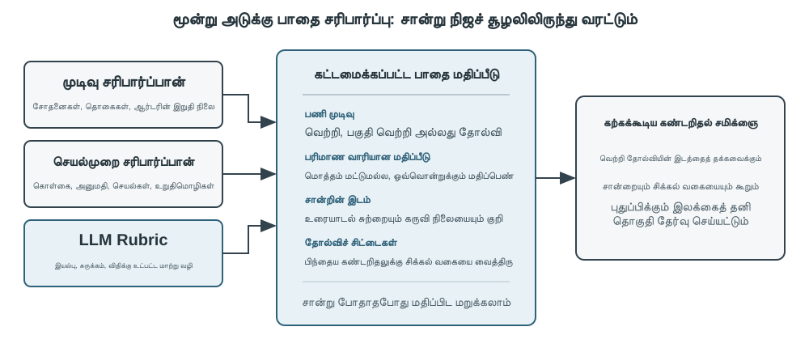
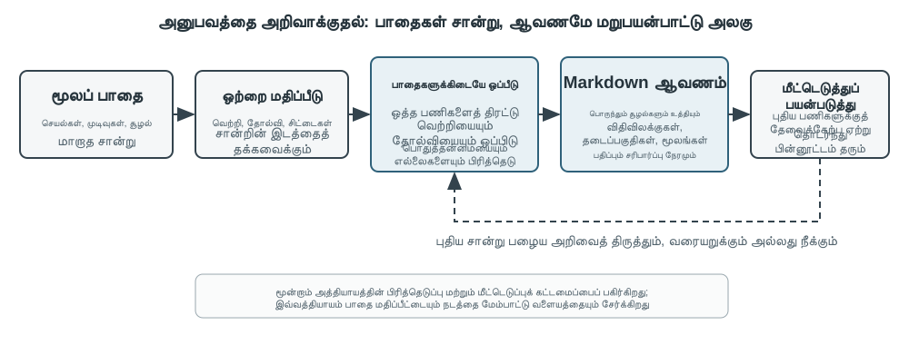

# பல்முக மற்றும் நிகழ்நேர இடைவினை

முந்தைய அத்தியாயங்கள், உரை உலகில் ஏஜெண்டுகளின் வடிவமைப்பை ஆராய்ந்தன—சூழல், கருவிகள் மற்றும் குறியீடு மூலம் டிஜிட்டல் அமைப்புகளுடன் இடைவினை புரிவது. ஆனால் ஒரு ஏஜெண்டின் உலகம் உரையையும் API-களையும் விடப் பெரியது. ஒரு ஏஜெண்ட் பயனரின் குரல் கட்டளைகளைப் புரிந்துகொள்ள வேண்டும், திரையில் சரியான பொத்தானைக் கண்டுபிடித்து கிளிக் செய்ய வேண்டும், அல்லது ஒரு பொருளைப் பிடிக்க ஒரு ரோபோ கையை துல்லியமாகக் கட்டுப்படுத்த வேண்டும் என்றால், அது ஒரு புதிய களத்தில் நுழைகிறது: **பல்முக நிகழ்நேர இடைவினை**—தூய உரை உள்ளீடு/வெளியீட்டில் இருந்து **பல்முக உணர்தல் மற்றும் நிகழ்நேர பதிலளிப்பு** வரை விரிவடைதல். ஏஜெண்டுகள் "உரையாடல் பெட்டியில்" இருந்து வெளியேறுவதற்கு இது ஒரு முக்கியமான படியாகும். "பல்முகம்" என்பது ஒரே நேரத்தில் பல வகையான தகவல்களை—உரை, பேச்சு, படங்கள், வீடியோ, செயல்கள்—செயலாக்குவதைக் குறிக்கிறது, வெறும் உரையை மட்டுமல்ல.

முதலில், இந்த அத்தியாயத்தின் எல்லைகளை வரையறுப்போம். நிலையான படம் மற்றும் ஆவண புரிதல்—ஒரு ஸ்கிரீன்ஷாட்டைப் பார்ப்பது, ஒரு விளக்கப்படத்தைப் படிப்பது, ஒரு PDF ஐ பாகுபடுத்துவது—ஏற்கனவே முந்தைய அத்தியாயங்களின் ஏஜெண்ட் நடைமுறைகளில் உணர்தல் கருவிகளாக இயற்கையாக ஒருங்கிணைக்கப்பட்டுள்ளன. இன்றைய பல்முக LLMகளுக்கு, இந்த "ஒரு உள்ளீடு, ஒரு புரிதல்" பணிகள் ஒப்பீட்டளவில் முதிர்ச்சியடைந்தவை மற்றும் சிறப்பு கட்டமைப்பு வடிவமைப்பு தேவையில்லை. இந்த அத்தியாயம் மற்றொரு வகை சிக்கல்களில் கவனம் செலுத்துகிறது: **நிகழ்நேர கட்டுப்பாடுகள் பல்முக சிக்கல்களை கடினமாக்கும்** மூன்று காட்சிகள்—குரல் உரையாடல், GUI செயல்பாடு மற்றும் ரோபோ கட்டுப்பாடு. இந்த காட்சிகளில், உள்ளீடு தொடர்ச்சியானது, மேலும் வெளியீடு கடுமையான நேர வரம்புகளுக்குள் வழங்கப்பட வேண்டும், இது கட்டமைப்பு வடிவமைப்பில் ஒரு தரமான மாற்றத்தை ஏற்படுத்துகிறது. தொடர்ச்சியான காட்சி ஸ்ட்ரீம்களின் (வீடியோ) நிகழ்நேர புரிதலைப் பொறுத்தவரை, இது எழுதும் நேரத்தில் ஏஜெண்டுகளுக்கு ஒரு திறந்த சிக்கலாகவே உள்ளது—கம்ப்யூட்டர் யூஸ் பிரிவு பிரேம்-பை-பிரேம் ஸ்கிரீன்ஷாட்களின் வரம்புகளை எதிர்கொள்ளும்போது இதற்குத் திரும்புவோம்; அத்தியாய இறுதிக் கேள்விகளிலும் இது மீண்டும் வரும். மற்றொரு எல்லையும் வரையப்பட வேண்டும்: பல்முக **உருவாக்கம்** (பட உருவாக்கம், வீடியோ உருவாக்கம்) இந்த புத்தகத்தின் கட்டமைப்பில் ஒரு வழக்கமான கருவி அழைப்பு மட்டுமே (அத்தியாயம் 5, மல்டிமீடியா உருவாக்கம் பற்றி விவாதிக்கப்பட்டது). ஏஜெண்ட் அதை ஒரு வெளிப்புற கருவியாகப் பயன்படுத்துகிறது; இது இந்த அத்தியாயம் கையாளும் நிகழ்நேர இடைவினை சவால்களை உள்ளடக்காது, எனவே இது முக்கிய விவாதத்தின் பகுதியாக இல்லை.

குரல் இடைவினை, கம்ப்யூட்டர் யூஸ் மற்றும் ரோபோ செயல்பாடு ஆகியவை மூன்று முற்றிலும் வேறுபட்ட துறைகளை உள்ளடக்கியதாகத் தோன்றினாலும், செயல்படுத்தும்போது, தடைகள் வியக்கத்தக்க வகையில் ஒத்தவை: அவை அனைத்தும் ஒரே நேரத்தில் பல முகங்களின் தகவல்களைச் செயலாக்க வேண்டும் மற்றும் தாமதத்திற்கு மிகவும் உணர்திறன் கொண்டவை. இரண்டு வினாடிகளுக்கு மேல் குரல் இடைநிறுத்தம் விரக்தியை ஏற்படுத்துகிறது, மேலும் ரோபோ கட்டுப்பாட்டில் மில்லி-செகண்ட் அளவிலான ஜிட்டர் மோதல்களுக்கு வழிவகுக்கும். இந்த இரண்டு கட்டுப்பாடுகளும் மூன்று காட்சிகளையும் ஒரே கட்டமைப்பு திசையை நோக்கி தள்ளுகின்றன: **தொடர் பைப்லைனில்** இருந்து (தொழிற்சாலை அசெம்பிளி லைன் போல, ஒரு படி முடிவதற்கு முன் அடுத்தது தொடங்க முடியாது) **எண்ட்-டு-எண்ட் மாதிரிக்கு** (உள்ளீட்டிலிருந்து நேரடியாக வெளியீட்டிற்குச் செல்லும் ஒருங்கிணைந்த மாதிரி, இடைநிலை கைமாற்றங்களை நீக்குகிறது) மாறுதல்.

இந்த அத்தியாயம் பின்வரும் வரிசையில் விரிவடைகிறது:

1.  முதலில், "குரல் கட்டமைப்பின் மூன்று முன்னுதாரணங்கள்"—அடுக்கு (VAD-ASR-LLM-TTS குழாய்), இறுதி-முதல்-இறுதி அனைத்து-முறை (Omni, ஒற்றை மாதிரி ஆனால் இன்னும் திருப்ப-எடுத்தல்), மற்றும் முழு-இருவழி (Moshi, GPT-Live, ஒரே நேரத்தில் கேட்டல் மற்றும் பேசுதல்)—ஆகியவற்றுடன் ஒரு குறிப்புச் சட்டகத்தை (coordinate system) அமைக்கிறோம், மேலும் "VAD இன் திருப்ப அனுமானத்திலிருந்து எவ்வாறு விடுபடுவது" என்ற அச்சில் ஒவ்வொரு இணைப்பின் தாமதம் மற்றும் பரிமாற்றங்களை பகுப்பாய்வு செய்கிறோம். அடுக்கு பகுதி, VAD + ASR ஐ ஸ்ட்ரீமிங் குரல் உணர்வுடன் எவ்வாறு மாற்றுவது என்பதையும் விவாதிக்கும்.
2.  அடுத்து, சிந்தனை கட்டமைப்பு "நிகழ்நேர பதில்" மற்றும் "ஆழமான சிந்தனை" ஆகியவற்றுக்கு இடையேயான முரண்பாட்டை எவ்வாறு சமரசம் செய்கிறது என்பதை ஆராய்வோம்: வேகமான மற்றும் மெதுவானவற்றின் எளிய இணைநிலைப்படுத்தலில் இருந்து, ஒரு பின்னணி பகுத்தறிவு மாதிரி "மூலோபாயவாதியாக" (GPT-Live பிரதிநிதித்துவம், Pine AI, போன்றவை) செயல்படும் பிரிக்கப்பட்ட அணுகுமுறை வரை, Step-Audio R1 இன் "பேசும்போது சிந்திக்கும்" ஒற்றை மாதிரியில் சிந்தனையை "உள்மயமாக்குதல்" வரை.
3.  பின்னர், மிகவும் மனிதனைப் போன்ற பேச்சு தொகுப்பு எவ்வாறு செயல்படுத்தல் அடுக்கை மேம்படுத்துகிறது என்பதை விவாதிப்போம்.
4.  இறுதியாக, கணினி பயன்பாடு (AI ஒரு மனிதனைப் போல கணினித் திரையை இயக்க உதவுதல்) மற்றும் ரோபோ இயக்கம் ஆகியவற்றிற்கு முன்னோக்கை விரிவுபடுத்துகிறோம், இதே தாமதம் மற்றும் பல்முறை சிக்கல்கள் இந்த இரண்டு சூழ்நிலைகளிலும் எவ்வாறு வெளிப்படுகின்றன என்பதைக் கவனிக்கிறோம்.

காட்சிகளுக்கு இடையில் மாற்றத்தக்க இரண்டு கோட்பாட்டு புள்ளிகள் சிறப்பு கவனம் செலுத்த வேண்டியவை: **சிந்தனை கட்டமைப்பு** (வேகமான மற்றும் மெதுவான சிந்தனை எவ்வாறு ஒத்துழைக்கிறது) மற்றும் அதிலிருந்து பெறப்பட்ட **வேக-மெதுவான இடைமுகம்** (**Latent Bridge**, உரையைத் தவிர வேகமான மற்றும் மெதுவான மாதிரிகளுக்கு இடையில் என்ன அனுப்ப முடியும்). குரல் காட்சியில் இருந்து அறிமுகப்படுத்தப்பட்டாலும், அவை குரலுக்கு மட்டும் அல்ல—கணினி பயன்பாடு மற்றும் ரோபோ பகுதிகளும் "எப்போது மெதுவான மூலோபாயவாதியை ஆலோசிப்பது" என்ற கேள்வியை எதிர்கொள்ளும், இதை வாசகர்கள் கவனமாக கவனிக்க வேண்டும்.

## குரல்: மிகவும் இயற்கையான மனித-இயந்திர இடைமுகம்

குரல் என்பது உரையை ஒலியாக மாற்றுவது மட்டுமல்ல. பேசும் வேகம் தட்டச்சு வேகத்தைவிட சுமார் நான்கு மடங்கு அதிகம்; கைகள் மற்றும் கண்கள் விடுபடுவதால், எந்த நேரத்திலும் பயனர் குறுக்கிடக்கூடிய தொடர்ச்சியான உள்ளீடு-வெளியீட்டு வளையத்தில் ஏஜெண்டை வைக்கிறது. Dictation பேச்சை உரையாக மாற்றுகிறது; குரல் ஏஜெண்ட் ஏஜெண்டுடன் நேரடியாக ஒத்துழைக்கச் செய்கிறது. இரண்டும் முன்பு அறிமுகமான whisper-coding பணிமுறையை ஆதரிக்கின்றன.

இந்தப் பகுதி இரண்டு திசைகளைப் பார்க்கிறது: பயனர் ஏஜெண்டிடம் பேசுவது, மற்றும் ஏஜெண்ட் பயனரின் சார்பாக வெளி உலகுடன் பேசுவது. குரல் மாதிரி ஏஜெண்ட் என்ன பதிலளிக்க முடியும் என்பதைத் தீர்மானிக்கும்; தொடர்பாடல் கட்டமைப்பு தெளிவாகக் கேட்பது, நேரத்தில் பதிலளிப்பது, இயல்பாக முறை மாற்றுவது, அழைப்பின் போது உறுதிப்படுத்தல்கள் மற்றும் கருவி அழைப்புகளை நிறைவு செய்வது ஆகியவற்றைத் தீர்மானிக்கும்.

### தொடர்பாடல் நேரம்: cascade முதல் full-duplex வரை

OpenAI-யின் GPT-Live அறிமுகம் மூன்று குரல் தொடர்பாடல் வடிவங்களை விவரிக்கிறது: cascade, turn-based மற்றும் full-duplex[^ch9-12]. இவை பழையது புதியதால் நேரடியாக மாற்றப்படுவது அல்ல; தாமதம், செலவு மற்றும் கண்காணிப்புத் திறன் ஆகியவற்றின் வெவ்வேறு சமரசங்கள்:

| வடிவம் | அடிப்படை கட்டமைப்பு | முக்கிய நன்மை | முக்கிய வரம்பு |
| --- | --- | --- | --- |
| Cascade | VAD → ASR → LLM → TTS | தெளிவான, மாற்றவும் பிழைத்திருத்தவும் எளிய தொகுதிகள் | தாமதம் சேர்கிறது; இடைமுகங்களில் மொழியல்லா தகவல் தொலைகிறது |
| End-to-end Omni | ஒரே மாதிரி கேட்டு, சிந்தித்து, பேசுகிறது | குறைந்த தாமதம்; தொனி, உணர்ச்சி, சுற்றுச்சூழல் ஒலி நன்றாகப் பாதுகாக்கப்படும் | இன்னும் turn-based; பயிற்சியும் பிழைத்திருத்தமும் விலை உயர்ந்தவை |
| Full-duplex | தொடர்ந்து கேட்டு, பேசி, முடிவு செய்கிறது | ஒட்டிய பேச்சு, இயல்பான குறுக்கீடு, தொடர்ச்சியான ஓட்டம் | பயிற்சி, கட்டுப்பாடு, மதிப்பீடு சிக்கலானவை |

மனிதர்கள் ஒருவர் முடித்த பிறகே மற்றவர் பேச வேண்டும் என்ற அனுமானத்திலிருந்தும், யாரிடம் முறை உள்ளது என VAD செய்யும் ஊகத்திலிருந்தும் வெளியேறுவதே பொதுவான நோக்கம். Cascade மற்றும் Omni இன்னும் தொடர்பை turns ஆகப் பிரிக்கின்றன; full-duplex முறையின் உரிமையை மாதிரியின் தொடர்ச்சியான முடிவாக மாற்றுகிறது.

[^ch9-12]: OpenAI, *Introducing GPT-Live*, 2026-07-08. https://openai.com/index/introducing-gpt-live/ கட்டுரை சுருக்கும் ChatGPT Voice-ன் மூன்று தலைமுறைகளிலிருந்து cascade / turn-based / full-duplex வகைப்பாடு வருகிறது; “end-to-end omnimodal (Omni)” என்பது “turn-based voice models” வகைக்கு இணையானது.

### வடிவம் 1 · Cascade pipeline

பெரும்பாலான வணிக குரல் உதவியாளர்கள் இன்னும் தொடர்ச்சியான pipeline-ஐப் பயன்படுத்துகின்றனர் (படம் 9-1): VAD பயனர் பேசி முடித்தாரா என முடிவு செய்கிறது, ASR ஆடியோவை உரையாக மாற்றுகிறது, LLM புரிந்து பதிலை உருவாக்குகிறது, TTS அதை ஒலியாக்குகிறது. தொகுதிகளைத் தனித்தனியாக மேம்படுத்தலாம்; ஆனால் ஒவ்வொரு எல்லையும் காத்திருப்பைச் சேர்க்கிறது.


| தொகுதி | பணி | வழக்கமான bottleneck |
| --- | --- | --- |
| VAD | பேச்சு முடிந்ததா என தீர்மானித்தல் | அமைதி threshold தாமதத்தையும் தவறான turn பிரிப்பையும் ஏற்படுத்தும் |
| ASR | ஆடியோவை உரையாக மாற்றுதல் | recognition தாமதம், context இழப்பு |
| LLM | புரிதல், reasoning, generation | முதல் token-க்கு நேரம்; reasoning கூடுதல் காத்திருப்பு |
| TTS | உரையைப் பேச்சாக மாற்றுதல் | முதல் packet synthesis, playback buffer |

Reasoning இல்லாத குறுகிய பதிலில் VAD, ASR, LLM, TTS காத்திருப்புகள் தொடர்ச்சியாகச் சேர்கின்றன (படம் 9-2); உண்மையான மதிப்புகள் input நீளம், மாதிரி, hardware, network, load ஆகியவற்றைப் பொறுத்தவை. Production queueing idle latency-யை மேலும் பெருக்கும் (படம் 9-3).




> **சோதனை 9-1 ★: பாரம்பரிய குரல் ஏஜெண்டை உருவாக்குதல்**
>
> Microphone, Silero VAD, உள்ளூர் Whisper, streaming LLM, Fish S1 TTS ஆகியவற்றை WebSocket வழியாக இணைத்து cascade baseline-ஐ உருவாக்கவும். சேமிக்கப்பட்ட உண்மையான single-turn evidence, media மற்றும் model chain end-to-end இயங்கியதை மட்டும் காட்டுகிறது; இது concurrency அல்லது production-load benchmark அல்ல. Code மற்றும் acceptance record: [chapter9/live-audio](../chapter9/live-audio/).

> **கூடுதல் திட்டம்: WebRTC மூலம் “பயனரை அழைக்கும்” குரல் ஏஜெண்ட்**
>
> Phone Agent-க்கு PSTN அவசியமில்லை. Browser WebRTC session-ஐத் திறந்து, விடுபட்ட தகவலைக் கேட்டு, மீண்டும் வாசித்து உறுதிப்படுத்தி, structured result-ஐ சேமிக்கும் வளையத்தை மீண்டும் உருவாக்கும். வெளி நிறுவனத்தைத் தொடர்பு கொள்ள வேண்டுமெனில் அதே tool contract-ஐ இணக்கமான PSTN/SIP provider-ஆக மாற்றலாம். முழு media path, direct/ReAct comparison, acceptance evidence ஆகியவை [chapter9/phone-agent](../chapter9/phone-agent/) இல் உள்ளன. வரலாற்று \`exp9-2\` run identifiers நீடிக்கும்; அது manuscript-ல் numbered experiment அல்ல.

#### Serial முதல் streaming perception வரை

Streaming ASR பயனர் பேசும்போதே provisional transcript-ஐ வழங்கலாம்; LLM முதல் பேசக்கூடிய வாக்கியத்தை TTS-க்கு அனுப்பலாம்; TTS audio chunks-ஐத் திருப்பி அளிக்கலாம். இதனால் எல்லா நிலைகளும் முழுமையாக parallel ஆகாது: partial transcript மாறினால் generation-ஐ cancel, restart அல்லது correct செய்ய வேண்டும்; \`stream\` இயக்குவது மட்டும் போதாது.

சாதாரண streaming VAD-யின் silence wait-ஐ அகற்றாது. VAD + ASR முன்பகுதி முடிவை உறுதிப்படுத்தும் வரை காத்திருப்பதால் latency சேர்க்கிறது; hesitation, emotion, backchannel, ambient sound ஆகியவற்றை இழக்கிறது; பெயர்கள் மற்றும் email முகவரிகள் chunks-களில் பிரிந்து தவறாக அறியப்படலாம். உண்மையான streaming model-க்கு causal அல்லது chunked encoder மற்றும் incremental decoding தேவை. Whisper encoder முழு audio segment-ஐ எதிர்பார்ப்பதால் causal streaming model அல்ல. LLM அடிப்படையிலான audio model தொடர்ச்சியான audio-வில் text மற்றும் semantic events-ஐ வெளியிடலாம்; ஆனால் prefix simulation causal latency-க்கான வாக்குறுதி அல்ல.

Text tokens உடன் \`speak_start/end\`, \`interrupt\` (speech boundary மற்றும் interruption), \`emotion\` (உணர்ச்சி, தயக்கம்), \`laugh\`, \`sigh\`, \`noise\` (paralinguistic மற்றும் சூழல் ஒலி) போன்ற markers-ஐ வெளியிடலாம். இவ்வாறு ஒவ்வொரு ஒலியையும் plain text-ஆகச் சுருக்க வேண்டியதில்லை.

[^ch9-11]: Turn judgment-ஐ recognizer-ல் உட்பொதிப்பது மற்றும் hindsight labels பற்றிய சிக்கலுக்கான பகுப்பாய்வுக்கு Bojie Li மற்றும் Noah Shi, *The Trade-off Was in the Labels: Causal Supervision for Turn-Aware Streaming ASR*, 2026 (வெளியீடு நிலுவையில்) பார்க்கவும்.

> **சோதனை 9-2 ★: Qwen2-Audio உடன் streaming குரல் உணர்வை உருவகப்படுத்துதல்**
>
> Qwen2-Audio தானாகவே streaming model அல்ல. அதிகரிக்கும் audio prefixes மூலம் continuous perception-ஐ உருவகப்படுத்தி, 600 ms VAD + Whisper உடன் ஒப்பிடவும். Canonical run execution மற்றும் provenance gates-ஐக் கடந்தது; எதிர்பார்த்த 6 நடத்தைகளில் 2 மட்டுமே மீளுருவாக்கப்பட்டன: prefix calls 8.4–11.3 வினாடிகள் எடுத்தன, pause sample \`silence\`-ஐ தவறவிட்டது, noise sample \`cough/laughter\`-ஐத் தவறாக வகைப்படுத்தியது. இது mechanism மற்றும் failure mode-ஐ சோதிக்கும் negative result; 100–200 ms உண்மையான streaming perception-க்கு ஆதாரம் அல்ல. முழுப் பதிவு: [chapter9/streaming-speech](../chapter9/streaming-speech/).

### வடிவம் 2 · End-to-end omnimodal models (Omni)

Streaming perception இருந்தாலும் cascade listening, thinking, speaking ஆகியவற்றை discrete interfaces வழியாக அனுப்புகிறது; audio plain text ஆகும் போது emotion, intonation, ambient sound இழக்கப்படலாம். Omni ஒரே மாதிரியில் audio-வை கேட்டு, பதிலை உருவாக்கி, பேசுகிறது; பயிற்சி, debugging, component replacement செலவு அதிகரித்தாலும் latency மற்றும் non-text signal-களைப் பாதுகாக்கிறது (படம் 9-4). Text போதுமான பணிகளில் self-cascade transcription பிழையைச் சரிசெய்யலாம்; பதில் speaking rate, emotion அல்லது ambient sound-ஐச் சார்ந்தால் text bottleneck சான்றை நிரந்தரமாக இழக்கிறது[^ch9-13].

Omni இன்னும் turn-taking-ஐ எதிர்பார்க்கிறது; VAD அல்லது semantic endpointing மூலம் floor-ஐத் தீர்மானிக்கிறது. எண்களின் தொடரில் வரும் pause முடிவாகப் புரிந்துகொள்ளப்படலாம்; streaming perception தீர்ப்பை மேம்படுத்தும், turns-ஐ நீக்காது.

[^ch9-13]: Cascade மற்றும் end-to-end accuracy advantage எப்போது மாறுகிறது என்பதற்கான முழு அளவீட்டுக்கு Li, Bojie மற்றும் Noah Shi, *The Cascade Gap: When and Why Self-Cascades Help Multimodal Agents*, 2026 (வெளியீடு நிலுவையில்) பார்க்கவும்.



Realtime speech API-கள் cascade மற்றும் Omni நடுவில் உள்ளன: model audio-வை native-ஆக கையாளும், ஆனால் VAD, interruption மற்றும் asynchronous tool calls தேவைப்படும். Leaderboard-ஐ விட ஒவ்வொரு task-ல் end-to-end மற்றும் self-cascade எவ்வாறு தோல்வியடைகின்றன என்பதே பயனுள்ள ஒப்பீடு.

> **சோதனை 9-3 ★★: MiniCPM-o 4.5-ஐ உள்ளூராக இயக்குதல் — end-to-end எதிர் self-cascade**
>
> ஒரு local revision-ஐ நிலைநிறுத்தி, thinking mode-ஐ முடக்கி, audio-க்கு நேரடி பதிலும் self-cascade (முதலில் transcribe, பின்னர் transcript-ல் பதில்) முறையும் ஒப்பிடுக. இது audio தகவல் பாதுகாப்பை அளவிடுகிறது; பின்னர் வரும் “think while speaking” திறனை அல்ல.
>
> | பணி வகை | End-to-end | Self-cascade | கவனிப்பு |
> | --- | ---: | ---: | --- |
> | Semantic arithmetic (2) | 1/2 | 2/2 | Self-cascade ஒரு transcription பிழையைச் சரிசெய்தது |
> | Paralinguistic speaking rate (2) | 2/2 | 1/2 | Plain-text transcript fast/slow வேறுபாட்டை அழித்தது |
> | மொத்தம் | 3/4 | 3/4 | சம மொத்தம்; ஒன்றுக்கொன்று துணையான தோல்விகள் |
>
> மாதிரி சிறியது; எந்த வழி பொதுவாகத் துல்லியமானது அல்லது வேகமானது என நிரூபிக்க முடியாது. Hardware, versions, raw outputs மற்றும் audio-to-audio evidence: [chapter9/end-to-end-speech](../chapter9/end-to-end-speech/).

Step-Audio 2 raw audio-வை text மற்றும் speech-ஆக வெளியிடும் end-to-end பாதையை காட்டுகிறது; emotion, speaking rate, intonation, ambient sound ஆகியவற்றை semantic content-ஐத் தாண்டி கையாள்கிறது. Step-Audio R1 reasoning-ஐ audio model-க்குள் internalize செய்து “think while speaking” உதாரணமாகிறது.

### வடிவம் 3 · Full-duplex interactive models

Omni “user speaks” மற்றும் “model speaks” எனப் பிரிக்கிறது; simultaneous interpreting போன்ற பணிகளுக்கு overlap தேவை. Full-duplex model தொடர்ந்து கேட்டு பேசுகிறது; தொடரலாமா, இடைநிறுத்தலாமா, குறுக்கிடலாமா, tool அழைக்கலாமா என மீண்டும் மீண்டும் முடிவு செய்கிறது. Kyutai-யின் Moshi ஆரம்பகால ஆய்வு உதாரணம். Thinking Machines Lab இதை **Interaction Model**[^ch9-14] என அழைக்கிறது: VAD-ஐச் சுற்றி வெளியில் கட்டாமல் interaction-ஐ மாதிரிக்குள் கட்டுகிறது. GPT-Live இதை production scale-க்கு கொண்டு வந்து, foreground உரையாடலைத் தொடரும் போது சிக்கலான வேலையை background reasoning model-க்கு ஒப்படைக்கிறது.

[^ch9-14]: Thinking Machines Lab, “Interaction Models: A Scalable Approach to Human-AI Collaboration,” 2026-05. https://thinkingmachines.ai/blog/interaction-models/

பயணம் இதுதான்: cascade silence threshold மூலம் turn-ஐ ஊகிக்கிறது; streaming perception semantic நிலைக்கு உயர்த்துகிறது; full-duplex turn switch-ஐ தொடர்ச்சியான model decision-ஆக மாற்றுகிறது.

### அறிவாற்றல் நேரம்: நிகழ்நேர தொடர்பாடலும் ஆழ்ந்த சிந்தனையும்

Foreground model பயனர் ஈடுபாட்டில் இருக்கும் போதே பதிலளிக்க வேண்டும்; background model அதிக நேரம் சிந்திக்கலாம். இவை நேர்கோட்டுத் தொடர் அல்ல, சமரசமான மூன்று வடிவங்கள்:

| வடிவமைப்பு | Foreground | Background | முக்கிய ஆபத்து |
| --- | --- | --- | --- |
| வேகமான filler, மெதுவான correction | உடனடி பதில் | மறுபரிசீலித்து நிறைவு செய்தல் | முரண்பாடு |
| வேகமான interaction, மெதுவான advice | உரையாடலைத் தொடர்தல், சொற்களைத் தேர்ந்தெடுத்தல் | ஆலோசனை அல்லது tool முடிவு | குறுகிய interface |
| சிந்தனையும் வெளிப்பாடும் ஒருங்கிணைவு | சிந்தித்தபடி பேசுதல் | model state-ஐப் பகிர்தல் | அதிக training/replacement செலவு |

முதல் வடிவம் ஒரே கேள்வியை இருமுறை செயல்படுத்தி முரண்படலாம். இரண்டாவது status bar வழியாக ஆலோசனையை அனுப்புவதால் நிலையானது, ஆனால் foreground இடைநிலை reasoning-ஐப் பார்க்காது; உண்மையில் பேசிக்கொண்டே சிந்திக்க முடியாது. மூன்றாவது இரண்டையும் ஒன்றிணைக்கிறது. Step-Audio R1-ல் MGRD reasoning-ஐ acoustic features-ல் நிலைநிறுத்துகிறது; MPS dual-brain architecture planning மற்றும் expression-ஐ parallel-ஆக இயக்குகிறது (படங்கள் 9-5, 9-6). Unified model இயல்பானது; decoupled model background brain-ஐ எளிதாக மாற்றலாம்.

### மேலும் மனிதனைப் போன்ற பேச்சுத் தொகுப்பு

இடைவெளி இல்லாத அளவுக்கு smooth-ஆக இருக்கும் பாரம்பரிய TTS தன் இயந்திர அடையாளத்தை வெளிப்படுத்தும். முதன்மை LLM text உடன் \`THINKING\`, \`EMO:happy\`, \`SPEED:0.8x\` போன்ற control markers-ஐ வெளியிடலாம்; TTS அவற்றை pause, prosody, speaking rate, laughter, sigh ஆகிய ஒலிகளாக மாற்றும். Markers-ஐப் புரியும் TTS-ஐப் பயிற்றுவிக்கலாம் அல்லது பல reference clips மூலம் voice cloning செய்யலாம்.

> **சோதனை 9-4 ★★: Fish Audio மூலம் control-token இயக்கும் TTS**
>
> Fish Audio S1-ஐப் பயன்படுத்தி பல-reference voice library உருவாக்கி மூன்று அமைப்புகளை ஒப்பிடுக: control markers இல்லாமல், ஒரு reference clip உடன், பல reference clips உடன். Execution layer markers-க்கு ஏற்ற emotion, speaking rate, style-ஐத் தேர்ந்தெடுக்கும். சமநிலை செய்யப்பட்ட blind listening மூன்று சுற்றுகளில் பல-reference அமைப்பு உயர்ந்த மதிப்பெண் பெற்றது (மனித customer-service likeness 4.67/5), ஆனால் எதிர்பார்த்த முழு வரிசை மீளவில்லை: marker இல்லாத arm single-reference arm-ஐ விட உயர்ந்தது. சிறிய listening study என்பதால் expressive control உதவுகிறது எனச் சுட்டுகிறது; பொதுவான speech-quality முடிவு அல்ல. 24-reference library, A/B/C media மற்றும் acceptance record: [chapter9/controllable-tts](../chapter9/controllable-tts/).
## கணினி பயன்பாடு: GUI ஆட்டோமேஷன் ஏஜெண்ட்

இந்த அத்தியாயம், அடுத்தடுத்த இரண்டு காட்சிகளை விட, குரலுக்கு கணிசமாக அதிக இடத்தை ஒதுக்குகிறது என்பதை நீங்கள் இப்போது கவனித்திருக்கலாம்—இது வேண்டுமென்றே செய்யப்பட்டது. நிகழ்நேர மல்டிமோடாலிட்டியின் பரிணாமப் பாதையில், குரல் மிக நீண்ட தூரம் பயணித்துள்ளது, சிறந்த குறிப்புச் சட்டகமாகவும் அமைகிறது: "தொடர் பைப்லைன் தாமதம் மிக அதிகம்" என்ற பிரச்சனையில் இருந்து தொடங்கி, எண்ட்-டு-எண்ட், ஃபுல்-டூப்ளக்ஸ், பேசும்போதே சிந்தித்தல் போன்ற தொடர்ச்சியான தீர்வுகள் வழியாக, இன்றைய ஒப்பீட்டளவில் முதிர்ந்த இறுதி நிலை வரை, பிரச்சனை → தீர்வு → இறுதி நிலை என்ற முழு பயணமும் கடக்கப்பட்டுள்ளது. எனவே, அதை நாம் முழுமையாக விளக்குகிறோம். அடுத்தடுத்த கணினி பயன்பாடு மற்றும் ரோபாட்டிக்ஸ் காட்சிகளை இந்த குரல் பாதையின் அடிப்படையில் பார்க்கலாம்—ஒவ்வொன்றும் இந்த பரிணாம வரிசையில் எங்கு நிற்கிறது, எங்கு சிக்கிக் கொண்டுள்ளது என்பதைப் பார்க்கலாம்.

இந்த மூன்று காட்சிகளும் வித்தியாசமாகத் தோன்றினாலும், ஒரே மைய சவால்களை எதிர்கொள்கின்றன: நிகழ்நேர உணர்தல், குறைந்த-தாமத முடிவெடுத்தல் மற்றும் தொடர்ச்சியான தொடர்பு. அடுத்து, இந்த தொழில்நுட்ப கருப்பொருள்கள் காட்சி தொடர்பு (கணினி பயன்பாடு) மற்றும் இயற்பியல் தொடர்பு (ரோபாட்டிக்ஸ்) ஆகியவற்றில் எவ்வாறு மீண்டும் தோன்றுகின்றன என்பதைப் பார்ப்போம்—முதலில், செவிப்புலன் முறையிலிருந்து காட்சி முறைக்கு முன்னோக்கை விரிவுபடுத்துவோம்: ஒரு ஏஜெண்ட் பேச்சைப் புரிந்துகொள்வது மட்டுமல்லாமல், திரையை "பார்த்து" வரைகலை இடைமுகத்தை இயக்கவும் முடிந்தால் என்ன செய்யும்?

கணினி பயன்பாடு (GUI ஆட்டோமேஷன் ஏஜெண்ட் என்றும் அழைக்கப்படுகிறது) AI ஆனது, திரையைக் கவனித்து, மவுஸ் மற்றும் கீபோர்டை இயக்குவதன் மூலம், ஒரு மனிதனைப் போல மென்பொருளைப் பயன்படுத்த அனுமதிக்கிறது—எடுத்துக்காட்டாக, தகவலைத் தேட ஒரு உலாவியைத் திறப்பது, விரிதாள் பயன்பாட்டில் தரவை நிரப்புவது அல்லது கணினி அமைப்புகளில் உள்ளமைவுகளைச் சரிசெய்வது. இதன் மையமானது ஒரு **Perceive-Think-Act** சுழற்சி (படம் 9-7) ஆகும்:

1.  ஏஜெண்ட் தற்போதைய திரையின் ஸ்கிரீன்ஷாட்டை எடுக்கிறது.
2.  ஒரு மல்டிமோடல் மாதிரி, ஸ்கிரீன்ஷாட் மற்றும் பணி அறிவுறுத்தலைப் பெற்று, ஒரு சிந்தனை மற்றும் ஒரு குறிப்பிட்ட செயலை வெளியிடுகிறது.
3.  செயலாக்க அடுக்கு, உண்மையான சூழலில் செயலைச் செய்கிறது (மவுஸை நகர்த்துதல், கிளிக் செய்தல், உரையைத் தட்டச்சு செய்தல் போன்றவை).
4.  இடைமுகம் பதிலளிக்க காத்திருந்து, மற்றொரு ஸ்கிரீன்ஷாட்டை எடுத்து, அடுத்த சுழற்சி மறு செய்கையில் நுழைகிறது.


இந்த வளையத்தில் மூன்று முக்கிய வடிவமைப்பு பரிமாணங்கள் உள்ளன: **செயல் இடம்** (ஏஜெண்ட் என்ன செயல்பாடுகளைச் செய்ய முடியும்), **காட்சி அடிப்படை** (ஸ்கிரீன்ஷாட்டில் இலக்கு உறுப்பை எவ்வாறு கண்டுபிடிப்பது), மற்றும் **மாதிரி கட்டமைப்பு** (ஸ்கிரீன்ஷாட்டில் இருந்து சரியான செயலை எவ்வாறு உருவாக்குவது).

### செயல் இட வடிவமைப்பு

Anthropic மூன்று வகையான கருவிகளை வரையறுக்கிறது, அவை ஒரு முழுமையான தொடர்பு திறனை உருவாக்குகின்றன (படம் 9-8):


**GUI செயல்பாட்டு கருவி** (கணினி கருவி): சுட்டி செயல்பாடுகளில் நகர்த்துதல் (mouse_move), இடது/வலது/நடுத்தர கிளிக், இரட்டை-கிளிக்/மூன்று-கிளிக், இழுத்தல் (left_click_drag), மற்றும் மிகவும் துல்லியமான அழுத்துதல்/விடுதல் செயல்கள் (left_mouse_down/up) ஆகியவை அடங்கும். உருட்டுதல் (scroll) நான்கு திசைகளை ஆதரிக்கிறது மற்றும் மாற்றி விசைகளுடன் இணைக்கப்படலாம். விசைப்பலகை செயல்பாடுகளில் எழுத்து எழுத்தாக தட்டச்சு செய்தல் (type, எழுத்துகளுக்கு இடையே 12ms இடைவெளியுடன் உண்மையான தட்டச்சை உருவகப்படுத்த), விசை சேர்க்கைகள் (key, எ.கா., Ctrl+C), மற்றும் ஒரு விசையை அழுத்திப் பிடித்தல் (hold_key) ஆகியவை அடங்கும். உணர்வு செயல்கள்: ஸ்கிரீன்ஷாட், கர்சர் நிலையை மீட்டெடுத்தல் (cursor_position), மற்றும் காத்திருத்தல் (wait).

**கட்டளை செயல்பாட்டு கருவி** (bash கருவி): 120-வினாடி நேர வரம்புடன் நிரந்தர bash முனைய அமர்வை வழங்குகிறது. கட்டளை நிறைவைக் கண்டறிய ஒரு சென்டினல் சரத்தைப் பயன்படுத்துகிறது மற்றும் பல அழைப்புகளில் சூழல் நிலையைப் பராமரிக்கிறது (எ.கா., ஒரு கோப்பகத்திற்கு `cd` செய்த பிறகு, அடுத்த அழைப்பு அந்த கோப்பகத்திலேயே இருக்கும்).

**கோப்பு திருத்தும் கருவி** (str_replace_editor): சரம் பொருத்துதல் மூலம் பாதுகாப்பான திருத்தத்தை செயல்படுத்துகிறது, இது பார்வை, உருவாக்கு, மாற்று, செருகு மற்றும் செயல்தவிர் செயல்பாடுகளை ஆதரிக்கிறது. முழு கோப்பையும் நேரடியாக மேலெழுதுவதை விட இது மிகவும் துல்லியமானது மற்றும் தற்செயலாக மற்ற உள்ளடக்கத்தை மாற்றும் வாய்ப்பு குறைவு.

> **சோதனை 9-5 ★: Computer Use-ஐ இயக்குதல் (Anthropic reference path அல்லது open-model path)**
>
> Path A, Anthropic Computer Use Demo-வைப் பயன்படுத்துகிறது. அதன் container, browser, terminal மற்றும் பிற பொதுவான கருவிகளுடன் முழுமையான Ubuntu desktop சூழலை வழங்குகிறது. Frontend பணியைப் பெறுகிறது; backend வழிமுறைகளையும் screenshots-ஐயும் Claude-க்கு அனுப்பி, மாதிரி திருப்பும் mouse, keyboard, terminal அல்லது editing செயல்களை இயக்குகிறது. இந்தப் பாதை native `computer` tool protocol-ஐப் புரிந்துகொள்வதற்கானது; ஒவ்வொரு வாசகருக்கும் Anthropic API அணுகல் இருக்க வேண்டும் என்பதில்லை.
>
> Path B, இந்தப் புத்தகத்தின் [`chapter9/computer-use-open-model`](../chapter9/computer-use-open-model/) துணைத் திட்டத்தைப் பயன்படுத்துகிறது. இயல்பாக open-weight Qwen3-VL 32B Instruct மூலம் browser-use-ஐ இயக்குகிறது; OpenRouter hosted API-ஐப் பயன்படுத்தலாம் அல்லது `OPEN_MODEL_BASE_URL`-ஐ self-hosted vLLM/SGLang அல்லது வேறு compatible endpoint-க்கு சுட்டலாம். Endpoint screenshots-ஐ ஏற்று native JSON Schema-ஐ ஆதரிக்க வேண்டும்; சாதாரண JSON மட்டுமே ஆதரித்தால் schema-in-prompt compatibility mode-ஐ வெளிப்படையாக இயக்கலாம்.
>
> இரு பாதைகளும் ஒரே read-only பணியையும் ஒரே acceptance contract-ஐயும் பயன்படுத்துகின்றன: அதிகபட்சம் 25 steps, ஒவ்வொரு step-இலும் ஒரே ஒரு action, மேலும் model/endpoint identity, raw provider responses, step-by-step screenshots, action sequence, final answer மற்றும் stop reason ஆகியவற்றைப் பாதுகாத்தல். வேறுபட்ட மாதிரிகளைத் தனித்தனி experimental arms ஆகவே அறிக்கையிட வேண்டும்; open-model முடிவை Claude reproduction எனக் காட்டக்கூடாது, “container வெற்றிகரமாகத் தொடங்கியது” என்பதை பணி முடிந்ததாகவும் கருதக்கூடாது. Action interval மற்றும் planning quality ஆகியவை அளவிடப்படும் முடிவுகள்; அவை முன்கூட்டியே 2–5 வினாடிகள் என்றோ, பிற மாதிரிகளை கட்டாயம் மிஞ்சும் என்றோ கருதப்படுவதில்லை.
>

### காட்சி அடிப்படை

சுழற்சியின் ஒவ்வொரு மறுமுறையிலும், மாதிரியானது ஸ்கிரீன்ஷாட்டில் உள்ள இலக்கு உறுப்பை துல்லியமாக கண்டறிய வேண்டும்—"தேடல் பெட்டி எங்கே?" "சமர்ப்பி பொத்தானின் ஆயத்தொலைவுகள் என்ன?" இதுதான் காட்சி அடிப்படை சிக்கல் (visual grounding problem). தற்போது, **இரண்டு முக்கிய அணுகுமுறைகள்** உள்ளன: ஒன்று, உள்ளூர்மயமாக்கலை **பல்தேர்வு சிக்கலாக** மாற்றுவது—முதலில் இடைமுக உறுப்புகளை எண்களுடன் குறியிடவும், மாதிரி ஒன்றை மட்டும் தேர்ந்தெடுக்க வேண்டும்; மற்றொன்று **தூய ஆயத்தொலைவு கணிப்பு**—மாதிரியானது ஸ்கிரீன்ஷாட்டை "பார்த்து" நேரடியாக ஆயத்தொலைவுகளைப் புகாரளிக்க அனுமதிப்பது, மனிதனைப் போலவே. பல்தேர்வு அணுகுமுறைக்கு இரண்டு செயலாக்க முறைகள் உள்ளன: **தூய காட்சி குறியீடு** (அசல் Set-of-Mark, பிக்சல்களில் வேட்பாளர் பகுதிகளை வெட்டுவதற்கு பிரிவு மாதிரியைப் பயன்படுத்துதல்) மற்றும் **கட்டமைக்கப்பட்ட உறுப்பு அட்டவணைப்படுத்தல்** (DOM/அணுகல்தன்மை மரம், இடைமுகத்தின் உள்ளார்ந்த கட்டமைப்பை நேரடியாகப் படித்தல்). பல்தேர்வு அணுகுமுறையின் பொதுவான நன்மை என்னவென்றால், இது "ஸ்கிரீன்ஷாட்டில் பொத்தானைக் கண்டுபிடித்து அதன் ஆயத்தொலைவுகளைக் கணிக்கவும்" என்ற திறந்த முடிவு சிக்கலை "ஏற்கனவே குறியிடப்பட்ட உறுப்புகளிலிருந்து ஒன்றைத் தேர்ந்தெடுக்கவும்" என்ற மூடிய முடிவு சிக்கலாக மாற்றுகிறது—தேர்வில் நிரப்பு வினாக்களை விட பல்தேர்வு வினாக்களுக்கு பதிலளிப்பது எளிதானது போலவே, மாதிரியானது "திரையின் மேல் இடது மூலையிலிருந்து சுமார் 200 பிக்சல்கள் வலதுபுறத்தில் உள்ள நீல பொத்தானைக் கிளிக் செய்யவும்" என்று சொல்வதற்குப் பதிலாக "கிளிக் [123]" என்று மட்டுமே சொல்ல வேண்டும்.

**Set-of-Mark: காட்சி குறியீட்டு முறை.**

அசல் Set-of-Mark (SoM) 2023 இல் மைக்ரோசாப்ட் ஆராய்ச்சியால் முன்மொழியப்பட்டது, ஆரம்பத்தில் GPT-4V இன் காட்சி அடிப்படை திறன்களைத் திறக்க. இது ஒரு **முற்றிலும் காட்சி** முறை: இது படப் பிரிவு மாதிரிகளை (SAM, SEEM, போன்றவை) பயன்படுத்தி ஸ்கிரீன்ஷாட்டில் வேட்பாளர் பகுதிகளை தானாக வெட்டி, ஒவ்வொரு பகுதியிலும் ஒரு எண்ணிடப்பட்ட குறியை மேலெழுதுகிறது, மேலும் மாதிரியானது எண்களுடன் கூடிய படத்தைப் பார்க்கிறது. மாதிரியானது எண்ணை மட்டும் புகாரளிக்க வேண்டும், மேலும் அமைப்பு அதை தொடர்புடைய பகுதியின் மைய ஆயத்தொலைவுகளாக மாற்றுகிறது. முழு செயல்முறைக்கும் DOM அல்லது எந்த உள் இடைமுக கட்டமைப்பும் தேவையில்லை, எனவே இது சொந்த டெஸ்க்டாப் மென்பொருள் மற்றும் விளையாட்டு இடைமுகங்களுக்கும் சமமாக பொருந்தும்—பிரிவு மாதிரியானது வேட்பாளர் பகுதிகளை வெட்ட முடியும் வரை.

**கட்டமைக்கப்பட்ட உறுப்பு அட்டவணைப்படுத்தல்: வலையில் SoM யோசனையின் கட்டமைக்கப்பட்ட செயலாக்கம்.**

இடைமுகமே கட்டமைக்கப்பட்ட தகவலை வழங்க முடியும்போது, குறியீடு மிகவும் துல்லியமாக இருக்கும். நவீன வலைப்பக்கங்கள் வழங்குவதற்கு முன்பே ஒரு முழுமையான உறுப்பு அமைப்பை (DOM மரம்) மற்றும் சொற்பொருள் பாத்திரங்களை (எது ஒரு பொத்தான், எது ஒரு உள்ளீட்டுப் பெட்டி) வரையறுக்கின்றன, மேலும் அணுகல்தன்மை இடைமுகம் (Accessibility Tree) பல டெஸ்க்டாப் பயன்பாடுகளுக்கு ஒத்த தகவலை வழங்குகிறது. பிக்சல்களில் இருந்து "எந்தப் பகுதி ஒரு பொத்தான்" என்பதை ஒரு பிரிவினை மாதிரி (segmentation model) யூகிப்பதற்குப் பதிலாக, இடைமுகத்தையே நேரடியாகக் கேட்பது நல்லது, "உங்களிடம் என்ன கிளிக் செய்யக்கூடிய உறுப்புகள் உள்ளன?" browser-use திட்டத்தால் பிரதிநிதித்துவப்படுத்தப்படும் வலை முகவர் (Web Agent) அணுகுமுறை, இதைத்தான் செய்கிறது: இது DOM இலிருந்து ஊடாடும் உறுப்புகளை எண்ணி பட்டியலிடுகிறது. இது வலையில் SoM கருத்தின் கட்டமைக்கப்பட்ட செயலாக்கமாகக் கருதப்படலாம் (படம் 9-9). இந்த செயல்முறை நான்கு படிகளைக் கொண்டுள்ளது:

1. உலாவி பிழைத்திருத்த இடைமுகம் (CDP, Chrome DevTools Protocol) மூலம் வலைப்பக்கத்தின் கட்டமைக்கப்பட்ட பிரதிநிதித்துவத்தையும் (DOM மரம்) அணுகல்தன்மை தகவலையும் பெறுதல்
2. எந்த உறுப்புகள் ஊடாடக்கூடியவை (பொத்தான்கள், உள்ளீட்டுப் பெட்டிகள், இணைப்புகள் போன்றவை) என்பதை தானாகக் கண்டறிதல்
3. ஒவ்வொரு ஊடாடும் உறுப்புக்கும் ஒரு தனித்துவமான ID ஐக் குறித்து, ஸ்கிரீன்ஷாட்டில் எல்லைப் பெட்டிகளை (bounding boxes) வரைதல்
4. ஒரே நேரத்தில் ஒவ்வொரு ID க்கும் தொடர்புடைய உறுப்பை விவரிக்கும் ஒரு உரை பட்டியலை உருவாக்குதல்

```
Screenshot: [Key elements in the image are annotated with IDs like [1], [2], [3], [4]]

Elements:
[1] <input type="text" placeholder="Search" aria-label="Search" />
[2] <button id="submit-btn" aria-label="Submit form" />
[3] <input type="text" placeholder="Enter your name" value="" />
[4] <a href="/docs" aria-label="Documentation" />
```

மாதிரி ஒரு ID எண்ணை மட்டும் வெளியிட வேண்டும், மேலும் கணினி தானாகவே அந்த உறுப்பின் மைய ஆயங்களைப் பயன்படுத்தி கிளிக்கை இயக்கும். இந்த வகை அணுகுமுறை டோக்கன்களைச் சேமிக்காது (ஏனெனில் அனைத்து குறியீட்டுத் தகவலும் மாதிரிக்கு அனுப்பப்பட வேண்டும்), ஆனால் இருப்பிடம் துல்லியமாகவும் நிலையானதாகவும் இருக்கும், மேலும் பிரிவினை மாதிரிகள் அறிமுகப்படுத்தக்கூடிய தவறிய கண்டறிதல்கள் மற்றும் தவறான நேர்மறைகளையும் (false positives) இது தவிர்க்கிறது.


**தூய ஆயத்தொலைவு முன்கணிப்பு (Pure Coordinate Prediction).**

மூன்றாவது வழி எந்த குறியீட்டையும் செய்யாமல், மாதிரியை நேரடியாக ஆயங்களை வெளியிடுமாறு கேட்கிறது. **SeeClick** மற்றும் Claude இன் கணினி பயன்பாடு (computer use) ஆகியவற்றால் பிரதிநிதித்துவப்படுத்தப்படும் இந்த அணுகுமுறை, GUI ஸ்கிரீன்ஷாட்கள் மற்றும் உறுப்பு நிலைகளின் பாரிய தரவுத்தொகுப்பில் ஒரு பார்வை மாதிரியை (vision model) பயிற்றுவித்து, இயற்கை மொழி விளக்கங்களை (எ.கா., "சமர்ப்பி பொத்தானைக் கிளிக் செய்க") நேரடியாக ஸ்கிரீன்ஷாட்டில் உள்ள துல்லியமான ஆயங்களுக்கு மேப்பிங் செய்ய கற்றுக்கொடுக்கிறது—ஒரு மனித பயனரைப் போலவே, கிளிக் செய்ய வேண்டிய இடத்தைக் கண்டுபிடிக்க முற்றிலும் "பார்ப்பதை" நம்பியுள்ளது.

ஆயத்தொலைவு முன்கணிப்பு முறைகளில், பயிற்சியின் போது பயன்படுத்தப்படும் தெளிவுத்திறனை (resolution) பொறுத்தே மாதிரியின் ஆயத்தொலைவுகளைப் புரிந்துகொள்ளும் திறன் அதிகம் சார்ந்துள்ளது (படம் 9-10). Claude ஆனது XGA (1024x768), WXGA (1280x800), மற்றும் FWXGA (1366x768) ஆகிய தெளிவுத்திறன்களைப் பயன்படுத்தி பயிற்றுவிக்கப்பட்டது. உள்ளீட்டு ஸ்கிரீன்ஷாட்டின் தெளிவுத்திறன் பொருந்தவில்லை என்றால், மாதிரியின் முன்கணிக்கப்பட்ட ஆயத்தொலைவுகள் முறையாக மாறும் (systematically shift)—இது ஒரு சிறிய வரைபடத்தில் தூரத்தை அளந்து, அதை நேரடியாக ஒரு பெரிய வரைபடத்தில் பயன்படுத்துவதைப் போன்றது. எனவே, கருவி அடுக்கில் (tool layer) இரு-திசை ஆயத்தொலைவு அளவிடுதல் வழிமுறை (bidirectional coordinate scaling mechanism) செயல்படுத்தப்பட வேண்டும், மேலும் இலக்கு தெளிவுத்திறனானது **காட்சி விகிதத்தின் (aspect ratio) அடிப்படையில் தேர்ந்தெடுக்கப்பட வேண்டும்**—இது சீரற்ற நீட்சி (non-uniform stretching) காரணமாக படம் சிதைந்து, அதன் மூலம் ஆயத்தொலைவு தீர்ப்பில் பிழை ஏற்படுவதைத் தவிர்க்கிறது. உதாரணமாக, உண்மையான திரை தெளிவுத்திறன் 2560×1440 (16:9) ஆக இருந்தால், Claude ஆதரிக்கும் மூன்று விருப்பங்களில் மிகவும் பொருத்தமான இலக்கு FWXGA (1366×768) ஆகும், இதன் காட்சி விகிதம் 16:9 க்கு மிக அருகில் உள்ளது. ஸ்கிரீன்ஷாட் விகிதாசாரமாக 1366×768 க்கு அளவிடப்பட்டு மாதிரிக்கு அளிக்கப்படுகிறது; மாதிரி கிளிக் ஆயத்தொலைவுகளை (683, 384) வெளியிட்ட பிறகு, அவை உண்மையான ஆயத்தொலைவுகளுக்கு (683×2560/1366, 384×1440/768) ≈ (1280, 720) என தலைகீழாக மேப்பிங் செய்யப்படுகின்றன. மாறாக, 16:9 படம் வலுக்கட்டாயமாக 4:3 விகிதமுள்ள 1024×768 க்கு நீட்டப்பட்டால், படம் கிடைமட்டமாக அழுத்தப்பட்டு, மாதிரியின் முன்கணிக்கப்பட்ட ஆயத்தொலைவுகள் முறையாக மாறும்.


மூன்று வழிகளுக்கான தேர்வு தர்க்கத்தை பின்வருமாறு சுருக்கமாகக் கூறலாம்: **கட்டமைக்கப்பட்ட தகவல் கிடைக்கும்போது, மிகவும் துல்லியமான மற்றும் நிலையான உள்ளூர்மயமாக்கலுக்கு DOM/அணுகல்தன்மை மர (Accessibility Tree) அட்டவணைப்படுத்தலுக்கு முன்னுரிமை அளிக்கவும்**; **அது கிடைக்காதபோது** (எ.கா., Photoshop போன்ற பூர்வீக டெஸ்க்டாப் மென்பொருள், Canvas/WebGL வழங்கப்பட்ட இடைமுகங்கள், விளையாட்டுகள்), **காட்சி குறிப்பு (visual annotation—அசல் SoM வழி) அல்லது ஆயத்தொலைவு முன்கணிப்பு ஆகிய இரண்டையும் பயன்படுத்தலாம்**. காட்சி குறிப்பு உள்ளூர்மயமாக்கலை பல-தேர்வு சிக்கலாக மாற்றுகிறது, இது குறிப்பாகப் பயிற்றுவிக்கப்படாத பொது-நோக்க மாதிரிகளுக்கு மிகவும் ஏற்றதாக உள்ளது; ஆயத்தொலைவு முன்கணிப்பு குறிப்பு படியை நீக்கி, GUI உள்ளூர்மயமாக்கலுக்காகப் பயிற்றுவிக்கப்பட்ட மாதிரிகளுக்கு மிகவும் நேரடியானதாக உள்ளது. இரண்டிற்கும் சிறிய உறுப்புகள் மற்றும் அடர்த்தியான இடைமுகங்களில் இன்னும் துல்லிய இடைவெளிகள் உள்ளன.

> **சோதனை 9-6 ★: உலாவி-பயன்பாட்டைப் (browser-use) பயன்படுத்தி தானியங்கி உலாவி செயல்பாடுகளை செயல்படுத்துதல்**
>
> Browser automation framework ஆன Playwright-ஐ multimodal model-உடன் இணைத்து, இயற்கை மொழியால் இயக்கப்படும் browser செயல்பாடுகளை நடைமுறைப்படுத்துங்கள். SoM visualization-ஐ இயக்கி, ஒவ்வொரு முடிவுக்கும் முன் annotated bounding boxes கொண்ட screenshot-ஐச் சேமியுங்கள். Model interface OpenAI அல்லது Anthropic-க்கு மட்டும் வரையறுக்கப்படவில்லை; இந்தப் புத்தகம் open Qwen3-VL model-க்கான API configuration-ஐ வழங்குகிறது, மேலும் பிற hosted services அல்லது self-hosted inference-க்காக generic OpenAI-compatible base URL-ஐ வைத்திருக்கிறது.
>
> சோதனைப் பணி “Google-ஐத் திறந்து San Francisco வானிலையைத் தேடு”: தொடங்கிய பிறகு screenshot-ல் Google search page மற்றும் எண் குறிக்கப்பட்ட interactive elements தோன்றும். மாதிரி search box-ஐத் தேர்ந்தெடுத்து “San Francisco weather today” என உள்ளிட்டு தேடலைச் சமர்ப்பித்து, results page-லிருந்து வெப்பநிலையையும் வானிலை நிலையையும் எடுக்கிறது. Acceptance-இல் answer மற்றும் trajectory-ஐ சுயாதீனமாகச் சரிபார்த்து, உண்மையான step count மற்றும் elapsed time-ஐ அப்படியே பதிவு செய்ய வேண்டும். “5 steps, சுமார் 20 seconds” என்பது ஒரு குறிப்பிட்ட இயக்கத்தின் observation மட்டுமே; execution receipt இல்லாமல் நிலையான முடிவாகக் கொள்ளக்கூடாது.
>
> புத்தகத்தில் பாதுகாக்கப்பட்ட அதிகாரப்பூர்வ open-model run, OpenRouter-இல் உள்ள `qwen/qwen3-vl-32b-instruct`-ஐப் பயன்படுத்தியது. Google Search step 4-இல் CAPTCHA-வைச் சந்தித்தபோது மாதிரி வெற்றி பெற்றதாகக் கூறாமல் weather.com-க்கு மாறியது; இறுதியில் step 16-இல் San Francisco Today page-லிருந்து 64°F, Sunny, feels like 62°F, high 74°F, low 55°F என வாசித்தது. 16/16 API responses-உம் கோரப்பட்ட Qwen3-VL model-ஐ அறிக்கையிட்டன; 15 செல்லுபடியாகும் step screenshots மற்றும் read-only action trajectory ஆகியவை independent deterministic acceptance-ஐத் தாண்டின. இந்த முடிவு open-model API path இயங்குவதை நிரூபிக்கிறது; Anthropic native `computer` tool arm மீளுருவாக்கப்பட்டது என்று பொருளல்ல.

### வீடியோக்களைப் பார்க்கவும் ஒலிகளைக் கேட்கவும் முடிந்த கணினி பயன்பாட்டு முகவர்

இதுவரை, கணினி பயன்பாட்டின் உணர்தல் ஒரு மறைமுகமான அனுமானத்தின் அடிப்படையில் இருந்தது: **திரை நிலையானது**—ஒரு திரைப்பிடிப்பை எடுக்கவும், ஒரு படிக்கு சிந்திக்கவும், கிளிக் செய்யவும், பின்னர் அடுத்த திரைப்பிடிப்பை எடுக்கவும். ஆனால் உண்மையில், திரைகள் வீடியோக்களை இயக்குகின்றன, சில வினாடிகளில் மறைந்துவிடும் அறிவிப்புகளைக் காட்டுகின்றன, கூட்டங்களின் மனித குரல்களையும் ஒலிக்கின்றன. ஒவ்வொரு 3–5 வினாடிகளுக்கும் "கண்களைத் திறக்கும்" மற்றும் காதுகள் இல்லாத ஒரு முகவர், "இரண்டு பிரேம்களுக்கு இடையில்" நடக்கும் அனைத்திற்கும் குருடாகவும் செவிடாகவும் இருக்கிறது. திரைப் பதிவுகளைப் பார்ப்பது, கூட்டங்களில் சேர்வது, குரல் அறிவுறுத்தலைப் பின்பற்றுவது, மறைவதற்குள் ஒரு உரையாடல் பெட்டியைப் பிடிப்பது—இந்த முழு வகை அன்றாட கணினி செயல்பாடுகளும் இன்றைய கணினி பயன்பாட்டு முகவருக்கு கிட்டத்தட்ட தடைசெய்யப்பட்ட மண்டலமாகும்.

இங்கு உண்மையில் மறுவடிவமைப்பு செய்யப்பட வேண்டியது "செயல் இடைமுகம்" அல்ல, மாறாக "**கவனிப்பு இடைமுகம்**"[^ch9-10] ஆகும். மையக் கருத்து **கவனிப்பை** (தொடர்ச்சியான, தகவமைப்பு, பல்முறை) **செயலில்** இருந்து (தனித்த) பிரிப்பதாகும், இது சூழலுக்கும் எந்தவொரு ஆஃப்-த-ஷெல்ஃப் கணினி பயன்பாட்டு மாதிரிக்கும் இடையில் ஒரு உணர்வு இடைநிலை அடுக்கை (perceptual middleware) உருவாக்குகிறது, மறுபயிற்சி தேவையில்லை (இதை முகவர்-கணினி கவனிப்பு இடைமுகம், AOI என்று அழைக்கலாம்). இது மூன்று "வாயில்" கூறுகளைக் கொண்டுள்ளது: முதலில், **இடை-பிரேம் முக்கிய பிரேம் பிடிப்பு**—கிட்டத்தட்ட மாறாத பிரேம்களைத் தவிர்க்க மிகவும் மலிவான பிக்சல் வாயிலைப் பயன்படுத்தவும், பின்னர் ஒரு சிறிய மாதிரியைப் பயன்படுத்தி அர்த்தமுள்ள மாற்றம் ஏற்பட்டுள்ளதா என தீர்மானிக்கவும், மாற்றம் இருக்கும்போது மட்டுமே ஒரு பிரேமைப் பிடிக்கவும், இதன் விளைவாக நிலையான திரைகளுக்கு கிட்டத்தட்ட பூஜ்ஜிய செலவு; இரண்டாவதாக, **ஒலி-வாயில் பேச்சு படியெடுப்பு**—ஒலி இருக்கும்போது மட்டுமே பேச்சு அங்கீகாரத்தை அழைக்கவும், முகவருக்கு முதல் முறையாக "காதுகளை" வழங்கவும்; மூன்றாவதாக, மிக முக்கியமாக, **திரையை நிலையான உரையாக விவரித்தல்**—மாதிரி பிடிக்கப்பட்ட பிரேமை ஒரு வாக்கியத்தில் விவரிக்கச் செய்யவும் (எ.கா., "பாப்அப் வெளியீட்டு தேதி ஏப்ரல் 28 ஆக மாற்றப்பட்டுள்ளது என்று சொன்னது"), மற்றும் **அசல் படம் பின்னர் சூழலில் இருந்து அழிக்கப்பட்டாலும், இந்த உரை நினைவகத்தில் இருக்கும்**, மாறும் தகவலை உரை வடிவில் முன்னோக்கி எடுத்துச் செல்கிறது. ஒரு எதிர்பாராத கண்டுபிடிப்பு என்னவென்றால், உண்மையில் முக்கியமானது "எந்த பிரேம்களை தேர்ந்தெடுப்பது" அல்ல, மாறாக "**பிரேம்களை நீண்ட காலம் நிலைத்திருக்கக்கூடிய உரையாக விவரிப்பது**"—உரை என்பது LLM ஏஜெண்டுகள் மிகச் சிறப்பாக கையாளும் முறைமையாகும். 7B முதல் முன்னணி அளவு வரையிலான எட்டு மாதிரிகளில், இந்த இடைநிலை மென்பொருள், எந்த மறுபயிற்சியும் இல்லாமல், +17 முதல் +48 சதவீத புள்ளிகள் வரை முன்னேற்றத்தை அளித்தது, குரல் தொடர்பான பணிகளில் மிகப்பெரிய இடைவெளி காணப்பட்டது: இந்த உணர்வு அடுக்கு சேர்க்கப்பட்டதன் மூலம், முன்பு "கேட்கக்கூடியதாக இருந்தாலும் செயல்படுத்த முடியாத" குரல் பணிகளை ஏஜெண்டால் நிறைவேற்ற முடிந்தது. இருப்பினும், இது அனைவருக்கும் பொருந்தக்கூடிய நிலையான உள்ளமைவு அல்ல—சில புதிய மாதிரிகளில், அதிகமான பட டோக்கன்களை செலுத்துவது பகுத்தறிவை நெருக்கி, செயல்திறனைக் குறைக்கும். எனவே, இந்த கூறுகள் **ஒவ்வொரு மாதிரியின் அடிப்படையில் தேர்ந்தெடுக்கப்பட வேண்டும்**, கண்மூடித்தனமாக இயக்கப்படக்கூடாது. இது Set-of-Mark மற்றும் ஆயத்தொலைவு முன்கணிப்பு இடையேயான பரிமாற்றத்தின் அதே கொள்கையாகும்: உணர்வுத் திட்டங்களுக்கு எந்த வெள்ளி அம்பும் இல்லை; அவை மாதிரியின் குணத்திற்கு ஏற்ப வடிவமைக்கப்பட வேண்டும்.

[^ch9-9]: மூன்று கூறுகளின் முழுமையான பொறிமுறை மற்றும் ஒவ்வொரு மாதிரிக்கான நீக்கல் பகுப்பாய்வு—கேட்டட் கீஃப்ரேம்கள், தேவைக்கேற்ப டிரான்ஸ்கிரிப்ஷன், மற்றும் பிரேம்களை நிலையான உரையாக விவரித்தல்—ஆகியவற்றிற்கு, Li, Bojie மற்றும் Noah Shi எழுதிய *Agent-Computer Observation Interfaces Enable Dynamic Computer Use.* arXiv:2606.29472, 2026 ஐப் பார்க்கவும்.

### மொபைல்: சுற்றுச்சூழல் தடைகள் தொழில்நுட்பத்தை விட கடினமானவை
### Computer Use-க்கான உலக மாதிரிகள்

Observation interface “இரண்டு screenshots-களுக்கு இடையில் என்ன நடந்தது?” என்ற கேள்விக்கு dynamic மாற்றங்களை விரைவாக அனுப்பி memory-யில் வைத்துக் கொண்டு பதிலளிக்கிறது. ஆனால் planning செலவை அது அழிக்காது; Agent இன்னும் “screenshot—think—click” serial loop-ஐ மீண்டும் செய்யலாம். OSWorld-Human மனித அளவிலான துல்லியம் அதிக படிகள் மற்றும் காத்திருப்புடன் கூட வரலாம் எனக் காட்டுகிறது.

மனிதர் desktop-ஐ predictive முறையில் இயக்குகிறார்: action விளைவைக் கணித்து, பார்த்த state prediction-க்கு ஒத்திருந்தால் replan செய்யாமல் திட்டத்தைத் தொடர்கிறார்; விலகல் ஏற்பட்டால் மட்டுமே observation மற்றும் planning-க்கு திரும்புகிறார். இதுவே speculative execution; world model இதை Agent-க்கு வழங்குகிறது. **World model பிரச்சினையின் மற்ற பாதியைத் தீர்க்கிறது**: அடுத்த state-ஐக் கணித்து, பொருந்தினால் தொடரவும், பொருந்தாவிட்டால் replan அல்லது stop செய்யவும் உதவுகிறது.

கம்ப்யூட்டர் யூஸ் மொபைல் தளத்திற்கும் விரிவடைகிறது. மொபைலுக்கும் டெஸ்க்டாப்பிற்கும் இடையே தொழில்நுட்ப வேறுபாடுகள் உள்ளன: செயல் இடம் பொதுவாக "மவுஸ் ஆயத்தொலைவுகள் + கீபோர்டு" அல்ல, மாறாக கணினியின் அணுகல்திறன் சேவை API (எ.கா., ஆண்ட்ராய்டின் AccessibilityService) உடன் இடைமுகம் கொண்டு இடைமுக உறுப்புகளைப் படித்து கிளிக்குகள் மற்றும் உரை உள்ளீட்டை வெளியிடுகிறது; தொடர்பு முறையும் மவுஸ் பாயிண்டரிலிருந்து தொடு சைகைகளாக மாறுகிறது, இது ஆயத்தொலைவுகளின் பொருளை மாற்றுகிறது—அதே (x, y) ஒரு விரல் தட்டுதல், நீண்ட அழுத்துதல் அல்லது ஸ்வைப் சைகையின் தொடக்கப் புள்ளியைக் குறிக்கிறதா என்பதை வரையறுக்க கூடுதல் சைகை வகை தேவைப்படுகிறது. அத்தியாயம் 6 இல் அறிமுகப்படுத்தப்பட்ட AndroidWorld போன்ற மொபைல் பெஞ்ச்மார்க்குகள், இந்த செயல் இடத்தில் உண்மையான பயன்பாடுகளில் பணிகளை முடிக்கும் ஏஜெண்டின் திறனை மதிப்பிடுகின்றன.

இருப்பினும், மொபைல் கம்ப்யூட்டர் யூஸை உண்மையில் தடுப்பது பெரும்பாலும் இந்த தொழில்நுட்ப வேறுபாடுகள் அல்ல, மாறாக சுற்றுச்சூழல் தடைகள் ஆகும். சில தொலைபேசி உற்பத்தியாளர்கள் நுகர்வோர் தர தொலைபேசிகளில் AI உதவியாளர்களை ஒருங்கிணைக்க முயன்றனர், அவை WeChat, Taobao மற்றும் Alipay போன்ற அன்றாட பயன்பாடுகளை தானாக இயக்க அனுமதிக்கின்றன, ஆனால் அவை விரைவில் தள கட்டுப்பாடுகளை சந்தித்தன.

இது கணினி பயன்பாட்டிற்கு (Computer Use) ஒரு தனித்துவமான சவாலை வெளிப்படுத்துகிறது: **சுற்றுச்சூழல் தடைகள் (ecosystem barriers)**. இந்தத் தடைகளுக்குப் பின்னால் உள்ள அடிப்படைக் காரணம் வணிக மாதிரிகளின் முரண்பாடு ஆகும். பாரம்பரிய இணைய பயன்பாடுகளின் முக்கிய வருவாய் ஈட்டும் தர்க்கம் **போக்குவரத்து மற்றும் கவனம் (traffic and attention)** ஆகும்: பயனர்கள் ஊட்டங்களை (feeds) உருட்டும்போது விளம்பரங்களைப் பார்க்கிறார்கள், பொருட்களைத் தேடும்போது பரிந்துரை அல்காரிதங்களைப் பின்பற்றுகிறார்கள், மற்றும் பக்கங்களை உலாவும்போது உந்துதல் வாங்குதல்களைச் செய்கிறார்கள். ஒரு ஏஜெண்ட் (Agent) பயனரின் சார்பில் செயல்படும்போது, இந்த வருவாய் ஈட்டும் சங்கிலி முற்றிலுமாகத் தவிர்க்கப்படுகிறது: AI விளம்பரங்களுக்குக் கவனம் செலுத்துவதில்லை, உந்துதல் வாங்குதல்களைச் செய்வதில்லை, மேலும் பணியை முடிக்க நேரடியாக இலக்கை நோக்கிச் செல்கிறது. விளம்பரம் மற்றும் போக்குவரத்து வருவாயை நம்பியிருக்கும் தளங்களுக்கு, ஒரு ஏஜெண்டின் ஒவ்வொரு செயல்பாடும் அவற்றின் வணிக மாதிரியின் அடித்தளத்தை அரித்துவிடுகிறது.

இதன் பொருள், கணினி பயன்பாடு CAPTCHA போன்ற தொழில்நுட்ப எதிர் நடவடிக்கைகளை மட்டுமல்ல, **ஒரு கட்டமைப்பு ரீதியான நலன் முரண்பாட்டையும் (structural conflict of interest)** எதிர்கொள்கிறது. இந்த முரண்பாட்டை குறுகிய காலத்தில் சமரசம் செய்வது கடினம், மேலும் இது முற்றிலும் தொழில்நுட்ப சிக்கல்களை விட நுகர்வோர் சூழ்நிலைகளில் கணினி பயன்பாட்டை நிலைநிறுத்துவதற்கு மிகவும் சவாலான தடையாக அமைகிறது.

### நிகழ்நேர செயல்திறன்: தீர்க்கப்படாத மைய சவால்

**OSWorld** (அத்தியாயம் 6 அதன் மதிப்பீட்டு முறையை விவரிக்கிறது) என்பது கணினி பயன்பாட்டிற்கான பரவலாகப் பயன்படுத்தப்படும் ஒரு அளவுகோலாகும் (benchmark), இது உண்மையான Ubuntu/Windows/macOS சூழல்களில் பயன்பாடுகளுக்கு இடையேயான பணிகளை முடிக்கும் ஒரு ஏஜெண்டின் திறனைச் சோதிக்கிறது. ஆரம்பகால பொது-நோக்க மாதிரிகள் இந்த அளவுகோலில் சுமார் 20% வெற்றி விகிதத்தை மட்டுமே அடைந்தன. அதைத் தொடர்ந்து வந்த சிறப்பு மாதிரிகள் மற்றும் அதிக சக்திவாய்ந்த பொது-நோக்க மாதிரிகள் தொடர்ந்து துல்லியத்தை அதிகரித்து, இந்த எழுத்தின் நிலவரப்படி படிப்படியாக மனித-நிலை செயல்திறனை நெருங்கி வருகின்றன. இருப்பினும், துல்லியம் மட்டுமே இறுதிக் கோடு அல்ல—உண்மையான இடையூறு "அதைச் சரியாகச் செய்ய முடியுமா?" என்பதிலிருந்து "அதை விரைவாகச் செய்ய முடியுமா?" என்பதற்கு மாறியுள்ளது.

**OSWorld-Human** திறன் ஆய்வு ஒரு கவலைக்குரிய உண்மையை வெளிப்படுத்துகிறது: ஒரு பணி இறுதியில் வெற்றிகரமாக முடிந்தாலும் கூட, Agent-க்குத் தேவைப்படும் செயல்பாட்டு படிகளின் எண்ணிக்கை மனிதனை விட கணிசமாக அதிகமாக உள்ளது, மேலும் ஒவ்வொரு படிக்குமான inference latency பணி முன்னேறும்போது அதிகரிக்கிறது—சூழல் நீளமாக, மாதிரியின் முடிவெடுக்கும் வேகம் குறைகிறது, மேலும் பிந்தைய படிகளுக்கு எடுக்கும் நேரம் பெரும்பாலும் ஆரம்ப படிகளை விட அதிகமாக இருக்கும். ஒரு மனிதன் சில பத்து வினாடிகளில் முடிக்கக்கூடிய ஒரு ஆவண வடிவமைப்பு சரிசெய்தலை, ஒரு Agent முடிக்க பல நிமிடங்கள் ஆகலாம். **மனித அளவிலான துல்லியத்தை அடைவது நடைமுறைக்குரியதாக இருப்பதற்கு சமமானதல்ல—திறன்தான் உண்மையான தடையாகும்.**

திறன் பிரச்சினையின் மூல காரணம் பேச்சு சூழ்நிலையைப் போன்றது: தொடர்ச்சியான "திரைப்பிடிப்பு-சிந்தனை-கிளிக்" சுழற்சியில், ஒவ்வொரு படியும் மிகச் சிறப்பாக மேம்படுத்தப்பட்டாலும், படி முதல் படி வரை குவிந்துவரும் தாமதம் இன்னும் ஏற்றுக்கொள்ள முடியாததாக உள்ளது. ஆழமான பிரச்சனை என்னவென்றால், தற்போதைய Computer Use முற்றிலும் "முன்கூட்டியே சிந்திக்கும்" திறன் கொண்டதாக இல்லை. ஒரு agent தற்போதைய செயலைச் செயல்படுத்தும்போதே அடுத்து என்ன செய்ய வேண்டும் என்பதைக் கணிக்க முடிந்தால்—எடுத்துக்காட்டாக, ஒரு பக்கம் ஏற்றப்படும் வரை காத்திருக்கும்போது அடுத்து எங்கு கிளிக் செய்ய வேண்டும் என்பதைப் பற்றி சிந்திப்பது—அது சிந்தனை மற்றும் செயல்பாட்டு நேரத்தை ஒன்றுடன் ஒன்று இணைக்க முடியும், இது மொத்த தாமதத்தை கணிசமாகக் குறைக்கும் (இது இந்த அத்தியாயத்தின் முந்தைய பகுதியில் உள்ள "பேசும்போது சிந்தித்தல்" சூழ்நிலை மற்றும் அத்தியாயம் 4 இல் உள்ள "தொடர்ச்சியான சிந்தனை" ஒத்திசைவற்ற agent ஆகியவற்றின் அதே தேவையாகும், இங்கு "இயக்கும்போது சிந்தித்தல்" என்று மாற்றப்பட்டுள்ளது).

பேச்சுத் துறையைப் போலல்லாமல், கம்ப்யூட்டர் யூஸ்-இன் நிகழ்நேர செயல்திறனை மேம்படுத்துவதற்கு—"ஸ்கிரீன்ஷாட்-சிந்தனை-கிளிக்" சுழற்சியை வேகமாக்குவதற்கு—தற்போது முறையான தீர்வு எதுவும் இல்லை, மேலும் அது பிரேம்-பை-பிரேம் ஸ்கிரீன்ஷாட்களின் தனித்த சுழற்சியில் சிக்கியுள்ளது. இருப்பினும், இந்த அத்தியாயத்தில் மீண்டும் மீண்டும் தோன்றும் வேக-மெதுவான பிரிப்பு (fast-slow decoupling) மூலம் ஒரு மாற்று வழி ஏற்கனவே பயனுள்ளதாக நிரூபிக்கப்பட்டுள்ளது: மெதுவான கம்ப்யூட்டர்-யூஸ் ஏஜெண்டை வேகமாக்குவது கடினம் என்பதால், **பயனர் அதற்காக காத்திருக்க வேண்டாம்**. "பேசுதல்" மற்றும் "கம்ப்யூட்டரை இயக்குதல்" ஆகியவற்றை ஒரே நேரத்தில் இயங்கும் இரண்டு மாதிரிகளாகப் பிரிக்கவும், ஒன்று வேகமானது மற்றும் ஒன்று மெதுவானது[^ch9-10]—ஒரு சிறிய மாதிரி (வேகமானது) நிகழ்நேர குரல் உரையாடலைக் கையாள்கிறது, அதே நேரத்தில் ஒரு அதிநவீன VLM (மெதுவானது) உலாவியில் படிப்படியாக செயல்படுகிறது. இரண்டும் ஒரு குறைந்தபட்ச "எளிய உரை ஒப்பந்தம்" (plain text contract) மூலம் மட்டுமே தொடர்பு கொள்கின்றன: மெதுவான ஏஜெண்ட் ஒவ்வொரு முறையும் ஒரு செயலைச் செய்யும்போதும், அது ஒரு சுழலும் நிலை சுருக்கத்தை ("படிவத்தை நிரப்புகிறேன், உங்கள் பிறந்த தேதி இன்னும் தேவை") இணைக்கிறது. வேகமான ஏஜெண்ட் இதைப் பயன்படுத்தி பயனருக்கு நிகழ்நேரத்தில் பதிலளிக்கிறது மற்றும் பயனர் வாய்மொழியாக வழங்கும் எந்தவொரு புதிய தகவலையும் மெதுவான ஏஜெண்டிற்கு அனுப்புகிறது. முக்கியமாக, **நிலை சுருக்கம் முடிந்ததை உறுதிப்படுத்தும் வரை, வேகமான ஏஜெண்ட் "முடிந்தது" என்று ஒருபோதும் சொல்லக்கூடாது**. இது "கம்ப்யூட்டரை தானாக இயங்க விட்டுவிட்டு போனில் பேசுவது" போன்ற காட்சியாகும். சோதனைகளில், இந்த பிரிப்பு, "ஒரே மாதிரி ஒரே நேரத்தில் இயங்கி பேசுவதை" விட குரல் பதில்களை சுமார் 15 மடங்கு வேகமாக்கியது (சராசரி தாமதம் 0.58 வினாடிகள் vs. 8.64 வினாடிகள்), பணி வெற்றி விகிதத்தைக் குறைக்காமல். வேகமான மற்றும் மெதுவான மாதிரிகளுக்கு இடையேயான உரை சேனலை அகற்றியவுடன், வெற்றி விகிதம் உடனடியாக 0 ஆகக் குறைந்தது—ஏனெனில் பயனர் வாய்மொழியாக வழங்கிய முக்கிய தகவல் இனி உலாவியை அடைய முடியவில்லை. இது முன்பு விவாதிக்கப்பட்ட லேட்டன்ட் பிரிட்ஜ் மற்றும் பேச்சுக் காட்சியில் உள்ள "சிந்தித்துப் பேசுதல்" ஆகியவற்றின் அதே கருத்தாகும்: ஒரு கூறு இயல்பாகவே மெதுவாக இருக்கும்போது, மற்றொரு வேகமான கூறு பயனரின் காத்திருப்பு நேரத்தை நிரப்பட்டும்—இந்த "எளிய உரை ஒப்பந்தம்" அடிப்படையில் அத்தியாயம் 2 முதல் விவாதிக்கப்பட்ட ஏஜெண்ட் நிலைப் பட்டியாகும் (agent status bar). கம்ப்யூட்டர் யூஸ் சுழற்சியை வேகப்படுத்துவது இன்னும் ஒரு முக்கியமான ஆராய்ச்சி திசையாக இருக்கலாம், ஆனால் "வேக-மெதுவான பிரிப்புடன் மந்தத்தை மறைப்பது" ஏற்கனவே ஒரு சாத்தியமான தீர்வாகும்.

[^ch9-10]: பேச்சு-செயல் வேக-மெதுவான பிரிப்பு மற்றும் "எளிய உரை ஒப்பந்தத்தின்" முழுமையான வடிவமைப்பை Li, Bojie மற்றும் Noah Shi. *Talking While Acting: Real-Time Voice for Slow Computer-Use Agents.* 2026 (வெளியாகவுள்ளது) இல் காணலாம்.

## ரோபோட் மேனிபுலேஷன்: நிகழ்நேரக் கட்டுப்பாடு முதல் பயிற்சி மற்றும் பொதுமைப்படுத்தல் வரை

> **இந்தப் பகுதியின் ஐந்து சோதனைகளும் ஒரே பணியைப் பயன்படுத்துகின்றன: சிவப்பு கோப்பையை தட்டில் வைக்கவும், மஞ்சள் காகிதத்தை குப்பைத்தொட்டியில் வைக்கவும், பின்னர் மீண்டும் கவனித்து மேசையின் நிலையைச் சரிபார்க்கவும். உண்மையான ரோபோவும் சிமுலேட்டரும் தனித்தனியாக அறிக்கையிடப்படுகின்றன; செயல் பொருளும் வெற்றி நிபந்தனைகளும் ஒன்றே.**
>
குரல் முகவர்கள் செவிப்புலன் முறைமையில் (auditory modality) தாமதத்தை (latency) எதிர்கொள்கின்றனர், மேலும் கணினி பயன்பாடு (Computer Use) காட்சி முறைமையில் (visual modality) தாமதத்தை எதிர்கொள்கிறது. முகவர்கள் இயற்பியல் உலகில் ரோபோக்களைக் கட்டுப்படுத்த வேண்டியிருக்கும் போது, தாமதம் மற்றும் பன்முக முறைமை (multimodality) ஆகியவற்றின் சவால்கள் மேலும் பெரிதாகின்றன—செயல்களின் விளைவுகள் மீள முடியாதவை, மேலும் ஒரு ஒற்றை மோதல் பொருட்களையோ அல்லது ரோபோவையோ சேதப்படுத்தும். இந்தப் பகுதி முதலில், ரோபோக்கள் எவ்வாறு இரு-அடுக்கு கட்டமைப்பு (two-layer architecture) மற்றும் செயல் துண்டாக்கல் (action chunking) ஆகியவற்றைப் பயன்படுத்தி நிகழ்நேர கட்டுப்பாட்டுச் சிக்கலை (real-time control problem) அடக்குகின்றன என்பதைப் பார்க்கிறது, பின்னர் தற்போதைய கடினமான சவாலுக்கு மாறுகிறது—பயிற்சி மற்றும் பொதுமைப்படுத்தல் (training and generalization): தரவு எங்கிருந்து வருகிறது மற்றும் மாதிரிகள் எவ்வாறு பணிகள் மற்றும் தளங்களுக்கு இடையே மாற்றம் செய்ய முடியும்.

### வன்பொருள் தடையல்ல, வழிமுறைகளே தடை

பொதுவான திறந்த காட்சிகளில் ரோபோக்கள் ஏன் பரவலாக ஏற்றுக்கொள்ளப்படவில்லை? தடை வன்பொருளா அல்லது வழிமுறைகளா? XLeRobot திட்டம் ஒரு வலுவான எதிர் உதாரணத்தை வழங்குகிறது: $1000 க்கும் குறைவான விலையுள்ள இரட்டை-கை சக்கர ரோபோ, ஒரு மனிதர் VR ஹெட்செட் மூலம் தொலை இயக்கப்படும் போது (teleoperation), ஏற்கனவே பல்வேறு வீட்டு வேலைகளை சீராக செய்ய முடியும். திறமையான கைகள் தேவைப்படும் மிகவும் சிக்கலான வீட்டு வேலைகளுக்கு, Unitree இன் ரோபோக்களும் மனித தொலை இயக்கத்தின் கீழ் சீராக செயல்பட முடியும். தொலை இயக்க தாமதம் சுமார் 100-200ms ஆகும், இது இயற்பியல் தொடர்புக்கான பதில் தேவைகளுக்கு நெருக்கமானது. தற்போதைய குறைந்த-செலவு தளங்களில் உள்ள சென்சார் தெளிவுத்திறன், இயக்கி துல்லியம் மற்றும் கட்டுப்பாட்டு அதிர்வெண் (ஒரு ரோபோ ஒரு நொடிக்கு அதன் செயல் கட்டளைகளைப் புதுப்பிக்கும் எண்ணிக்கை; குறைந்த அதிர்வெண் குறைவான மென்மையான இயக்கம் மற்றும் இலக்கு பாதையில் இருந்து அதிக நடுக்கம் அல்லது விலகலுக்கு வழிவகுக்கிறது) ஆகியவை நடைமுறை பணிகளுக்கு ஏற்கனவே போதுமானவை.

இந்த வாதத்திற்கு ஒரு தெளிவான எல்லை தேவை: தொலை இயக்க எதிர் உதாரணம் உண்மையில் நிரூபிப்பது என்னவென்றால், "தற்போதுள்ள குறைந்த-செலவு வன்பொருள், மனித நுண்ணறிவுடன் இணைந்து, **முதன்மையாக காட்சி பின்னூட்டத்தை (visual feedback) நம்பியிருக்கும் இந்த வகை வீட்டு கையாளுதல் பணிகளை** முடிக்க போதுமானது." இது வன்பொருள் அனைத்து பரிமாணங்களிலும் போதுமானது என்று அர்த்தமல்ல—தொட்டுணர்வு உணர்தல் (tactile sensing) இல்லாமை, திறமையான கைகளின் நம்பகத்தன்மை மற்றும் செலவு ஆகியவை அங்கீகரிக்கப்பட்ட வன்பொருள் குறைபாடுகளாகவே உள்ளன. ஒரு பணி நுண்ணிய விசை கட்டுப்பாடு மற்றும் தொட்டுணர்வு பின்னூட்டத்தை பெரிதும் சார்ந்திருக்கும் போது, வன்பொருள் உண்மையில் தடையாக மாறக்கூடும். எனவே, கீழே உள்ள "வன்பொருள் தடையல்ல" என்ற கூற்று, இந்தப் பகுதியில் விவாதிக்கப்படும் பணி வகைக்கு மட்டுமே வரையறுக்கப்பட்டுள்ளது.

இந்த பணிகளுக்கு, உண்மையான இடைவெளி வழிமுறை அடுக்கில் (algorithm layer) உள்ளது, இது பின்வரும் இரண்டு துணைப் பிரிவுகளில் விரிவாக விளக்கப்பட்டுள்ளது.

> **சோதனை 9-7 ★: XLeRobot தொலை இயக்கத்தில் மேசையை ஒழுங்குபடுத்துதல்**
>
> **நோக்கம்:** உண்மையான XLeRobot-ஐ தொலைவில் இயக்கி அதே பல-படி பணியைச் செய்து மேசை நிலையைச் சரிபார்க்கவும்.
>
> **கொள்கை:** சில நூறு டாலர் மதிப்புள்ள கை, மனித தொலை இயக்கத்தில் இந்தப் பணியைச் செய்ய முடியும்; இப்பணிக்கு வன்பொருள் உடல் bottleneck அல்ல, உணர்தல், திட்டமிடல், மூடிய-சுழற்சி கட்டுப்பாடு மற்றும் தோல்வி மீட்பே இடைவெளி.
>
### இரண்டு-அடுக்கு கட்டமைப்பு: திட்டமிடல் மற்றும் கட்டுப்பாட்டின் பிரிப்பு

சிக்கலான வீட்டுப் பணிகளை முடிக்க ரோபோக்கள் இரண்டு வெவ்வேறு நேர அளவீடுகளில் முடிவுகளை எடுக்க வேண்டும். முதல் அடுக்கு மெதுவான **நீண்ட-கால திட்டமிடல்** ஆகும்: "மேசையை சுத்தம் செய்" போன்ற உயர்-நிலை அறிவுறுத்தலை துணை-இலக்குகளின் வரிசையாக (கவுண்டர்டாப்பை சுத்தம் செய், பாத்திரங்கழுவியை ஏற்று, மேற்பரப்புகளைத் துடை) சிதைப்பது. இதற்கு சூழலியல் சொற்பொருள்களைப் புரிந்துகொள்வது, பணி சார்புகளைப் பற்றி சிந்திப்பது மற்றும் பல-படி செயல் வரிசைகளைத் திட்டமிடுவது தேவை—ஒரு நபர் தொடங்குவதற்கு முன் "முதலில் என்ன செய்வது, அடுத்து என்ன செய்வது" என்று சிந்திப்பதைப் போன்றது. இரண்டாவது அடுக்கு வேகமான **VLA கட்டுப்பாடு** (Vision-Language-Action மாதிரி) ஆகும்: ஒவ்வொரு குறிப்பிட்ட செயல்பாட்டையும் ("சிங்க்கிற்கு நட," "துணியை எடு," "கவுண்டர்டாப்பைத் துடை") செயல்படுத்தி, தற்போதைய காட்சி உள்ளீடு மற்றும் மொழி அறிவுறுத்தலின் அடிப்படையில் தொடர்ச்சியாக கட்டுப்பாட்டு சமிக்ஞைகளை வெளியிட்டு, மென்மையான மற்றும் ஒருங்கிணைந்த ரோபோ இயக்கத்தை உறுதி செய்கிறது.

இந்த இரண்டு-அடுக்கு கட்டமைப்பு சிக்கலை திறம்பட பிரிக்கிறது: நீண்ட-கால திட்டமிடல் "என்ன செய்வது" என்பதைக் கையாள்கிறது, மேலும் VLA கட்டுப்பாடு "எப்படி செய்வது" என்பதைக் கையாள்கிறது. இந்த "மெதுவான உயர்-நிலை முடிவெடுத்தல் + வேகமான கீழ்-நிலை செயலாக்கம்" இரண்டு-அடுக்கு கட்டமைப்பு, முன்பு பேச்சு காட்சியில் இருந்த "வேகமான-மெதுவான சிந்தனை" உடன் கட்டமைப்பு ரீதியாக மிகவும் ஒத்ததாக உள்ளது—இரண்டும் சிக்கலான சிந்தனையை நிகழ்நேர பதிலிலிருந்து வெவ்வேறு தொகுதிகளாகப் பிரிக்கின்றன. இங்கே "திட்டமிடல்/கட்டுப்பாடு" என்பது வேகமான-மெதுவான சிந்தனையில் உள்ள "மெதுவான ஆழமான சிந்தனை / வேகமான நிகழ்நேர பதில்" என்ற பிரிப்பு பரிமாணத்துடன் ஒத்துப்போகிறது என்பதைக் கவனத்தில் கொள்ள வேண்டும், இது தீர்வு 3-ன் MPS "உருவாக்கும் மூளை / உச்சரிப்பு மூளை" என்ற "சிந்தனை/வெளிப்பாடு" பிரிப்பு அல்ல—பிந்தையது "சிந்தனையை" "பேச்சிலிருந்து" பிரிக்கிறது, அதே நேரத்தில் முந்தையது "உலகளாவிய திட்டமிடலை" "நிகழ்நேர செயலாக்கத்திலிருந்து" பிரிக்கிறது. இந்த இரண்டு "இரட்டை-X கட்டமைப்புகளின்" பரிமாணங்கள் வேறுபட்டவை.

இருப்பினும், நிகழ்நேர செயல்திறன் மறைந்துவிடவில்லை; அது VLA கட்டுப்பாட்டு அடுக்குக்கு தள்ளப்பட்டுள்ளது, அங்கு அது **ஆக்ஷன் சங்கிங்** (Action Chunking) மூலம் குறைக்கப்படுகிறது (கீழே உள்ள "VLA கட்டுப்பாடு" துணைப்பிரிவைப் பார்க்கவும்): மாதிரியானது ஒரு அனுமானத்தில் எதிர்கால செயல்களின் குறுகிய வரிசையை உருவாக்குகிறது, மேலும் கட்டுப்பாட்டு நூல் அவற்றை அதிக அதிர்வெண்ணில் மீண்டும் இயக்குகிறது, ஒரு அனுமானத்தின் தாமதத்தை முழு செயல் வரிசையின் செயல்படுத்தும் நேரத்தில் பரப்புகிறது. ஆனால் இங்கே தவிர்க்க முடியாத ஒரு பரிமாற்றம் உள்ளது—சங்கிங் எதிர்வினைத்திறனை மென்மைக்காக பரிமாறிக்கொள்கிறது: சங்க் நீளமாக இருந்தால், ஒவ்வொரு அனுமானத்தின் தாமதமும் அதிகமாக சராசரியாக்கப்பட்டு இயக்கம் மென்மையாகிறது, ஆனால் இந்த நேரத்தில் மாதிரியானது புதிய காட்சித் தகவல்களுக்கு "குருடாக" இருப்பதால், திடீர் மாற்றங்களுக்கு (ஒரு பொருள் நகர்த்தப்படுதல், ஒரு கை வழியைத் தடுப்பது) குறைவான எதிர்வினை காட்டுகிறது. நிகழ்நேர செயல்திறனுக்கும் மென்மைக்கும் இடையிலான இந்த பரிமாற்றமானது, இரண்டு-அடுக்கு கட்டமைப்பு அகற்றவில்லை, மாறாக மாற்றிய ஒரு பிரச்சனையின் பகுதியாகும்.

இது இந்த அத்தியாயத்தின் முக்கிய நூலில் ஒரு மாற்றத்தையும் குறிக்கிறது: ரோபாட்டிக்ஸ் காட்சியில், நிகழ்நேர முரண்பாடு இரண்டு-அடுக்கு பிரிப்பு மற்றும் ஆக்ஷன் சங்கிங் மூலம் ஓரளவு குறைக்கப்பட்டுள்ளது. தற்போதைய முதன்மை முரண்பாடு **பயிற்சி மற்றும் பொதுமைப்படுத்தலுக்கு** (training and generalization) மாறியுள்ளது—போதுமான ஆர்ப்பாட்டத் தரவை எவ்வாறு பெறுவது மற்றும் மாதிரிகள் பணிகள் மற்றும் தளங்களில் எவ்வாறு பொதுமைப்படுத்த முடியும் என்பது. பின்வரும் துணைப்பிரிவுகள் இந்த புதிய முரண்பாட்டில் கவனம் செலுத்துகின்றன, இது அத்தியாயம் 6 இன் உருவகப்படுத்துதல் சூழல்கள் மற்றும் அத்தியாயம் 7 இன் வலுவூட்டல் கற்றல் ஆகியவற்றின் கருப்பொருள்களை இயற்பியல் உலகத்திற்கு நீட்டிப்பதாகும்.

இந்த புதிய முரண்பாடு முதன்மையாக VLA கட்டுப்பாட்டு அடுக்கில் எடை போடுகிறது. VLA ஐ "VLM + செயல் வெளியீடு" எனக் காணலாம்: **VLM** (Vision-Language Model—படங்கள் மற்றும் உரை இரண்டையும் புரிந்துகொள்ளும் திறன் கொண்ட ஒரு பெரிய மாதிரி) "பார்ப்பதையும்" "தெளிவாக சிந்திப்பதையும்" கையாள்கிறது, அதே நேரத்தில் VLA "செயல்படவும்" வேண்டும். உண்மையான சவால் "செயல்படும்" அடுக்கில் உள்ளது. தற்போது, VLA கட்டுப்பாட்டு அடுக்கு முதன்மையாக பின்பற்றுதல் கற்றல் (behavioral cloning) மூலம் பயிற்றுவிக்கப்படுகிறது—அதிக எண்ணிக்கையிலான மனித ஆர்ப்பாட்டங்களிலிருந்து நேரடியாக "ஒன்றைப் பார்த்து, ஒன்றைச் செய்" என்பதைக் கற்றுக்கொள்வது (OpenVLA, RT-2, π₀, போன்றவை அனைத்தும் இந்த வகையைச் சேர்ந்தவை). வலுவூட்டல் கற்றல் என்பது சமீபத்திய ஆண்டுகளில் மேலே சேர்க்கப்பட்ட ஒரு துணை முறையாகும். வலுவூட்டல் கற்றலுடன் பயிற்றுவிக்கப்பட்ட VLA கள் தனிப்பட்ட பணிகளில் நன்றாக செயல்பட முடியும் என்றாலும், அவை பெரும்பாலும் பொதுமைப்படுத்தும் திறனைக் கொண்டிருக்கவில்லை: அத்தியாயம் 7 இலிருந்து SimpleVLA-RL LIBERO இல் அதிக ஒற்றை-பணி முடிவுகளைப் புகாரளித்தாலும், அது ஒவ்வொரு பணிக்கும் தனித்தனியாக RL உடன் பயிற்றுவிக்கப்படுகிறது, அனைத்து பணிகளுக்கும் ஜீரோ-ஷாட் பொதுமைப்படுத்தும் ஒருங்கிணைந்த மாதிரி அல்ல. இந்த "ஒரு பணிக்கு ஒருமுறை பயிற்சி" மாதிரி என்பது ஒவ்வொரு புதிய பணிக்கும் தரவை மீண்டும் சேகரித்து மாதிரியை மீண்டும் பயிற்றுவிக்க வேண்டும் என்பதாகும்.

பின்வரும் இரண்டு பிரிவுகள் முறையே நீண்ட-அடிவான திட்டமிடல் மற்றும் VLA கட்டுப்பாட்டுக்கான குறிப்பிட்ட தொழில்நுட்ப தீர்வுகளை ஆழமாக ஆராய்கின்றன.

### நீண்ட-அடிவான திட்டமிடல்: VLM இலிருந்து சிறப்பு உருவகப்படுத்தப்பட்ட பகுத்தறிவு மாதிரிகள் வரை

பொது-நோக்க VLMs ஏற்கனவே நல்ல உருவகப்படுத்தப்பட்ட பகுத்தறிவு திறன்களைக் கொண்டுள்ளன. Google DeepMind இன் **Gemini Robotics-ER 1.5** குறிப்பாக உருவகப்படுத்தப்பட்ட பகுத்தறிவுக்காக (இயற்பியல் உலகில் உள்ள பொருட்களின் நிலை, இயக்கம் மற்றும் காரண உறவுகளைப் புரிந்துகொள்வது) உகந்ததாக்கப்பட்டுள்ளது. இது 15 கல்வி அளவுகோல்களில் (Point-Bench, RefSpatial, RoboSpatial, BLINK, போன்றவை) சராசரியாக 62.8% மதிப்பெண்ணை அடைந்து, GPT-4o (60.6%) மற்றும் Gemini 2.5 Pro (59.3%) ஆகியவற்றை விஞ்சுகிறது. முக்கிய நன்மைகள் பின்வருமாறு: மேம்பட்ட இடஞ்சார்ந்த புரிதல் மற்றும் பொருள் உள்ளூர்மயமாக்கல், தற்காலிக பகுத்தறிவு (செயல்களின் விளைவுகளை முன்னறிவித்தல், எ.கா., "இந்த கோப்பையை நான் தள்ளினால் என்ன நடக்கும்?"), பணி வரிசைமுறை (உயர்-நிலை அறிவுறுத்தல்களை சிறிய படிகளாகப் பிரித்தல்), மற்றும் சிந்தனை வழிமுறைகள் மற்றும் கருவி அழைப்புகளுக்கான உள்ளார்ந்த ஆதரவு.[^ch9-2]

[^ch9-2]: Google DeepMind, "Gemini Robotics-ER 1.5" . https://deepmind.google/models/gemini-robotics/gemini-robotics-er/

> **சோதனை 9-8 ★: சிமுலேட்டரில் அதே பணிக்கான சிறந்த கட்டுப்பாட்டு உச்சத்தை அளவிடுதல்**
>
> **நோக்கம்:** உணர்தல் அல்லது செயல் தேர்வில் தவறாத ideal controller மூலம் அதே பணியை இயக்கி மீண்டும் செய்யக்கூடிய உச்சத்தை அமைக்கவும்.
>
> **கொள்கை:** சரியான முடிவுகள் எப்போதும் கிடைக்கும் நிலைக்கான reference இது; உண்மையான ரோபோ இயக்கப்பட்டது என்பதற்கான ஆதாரம் அல்ல.
>

> **சோதனை 9-9 ★★: Gemini Robotics-ER 1.5 மூலம் உண்மையான XLeRobot தன்னாட்சி கட்டுப்பாடு**
>
> **நோக்கம்:** மனித இயக்குநருக்குப் பதிலாக மேசையை கவனித்து வரையறுக்கப்பட்ட pick, place, verify திறன்களை அழைக்கும் Agent-ஐப் பயன்படுத்தவும்; 9-7-ன் அதே ரோபோ, பணி, வெற்றி நிபந்தனைகள் நீடிக்கும்.
>
> **கொள்கை:** வேறுபாடு புதிய இயந்திர வரம்பில் அல்ல; உணர்தல், திட்டமிடல், நேர அமைப்பு, closed-loop கட்டுப்பாடு மற்றும் மீட்பில் உள்ளது.
>

### VLA கட்டுப்பாடு: செயல்விளக்கத் தரவிலிருந்து குறுக்கு-உருவகப்படுத்தல் பொதுமைப்படுத்தல் வரை

இரண்டு-அடுக்கு கட்டமைப்பின் செயலாக்க அடுக்கில், மூன்று பிரதிநிதித்துவ மாதிரிகள்—RT-2, OpenVLA மற்றும் π₀—அனைத்தும் VLA கட்டுப்பாட்டில் கவனம் செலுத்துகின்றன, அதாவது கேமரா படங்கள் மற்றும் மொழி அறிவுறுத்தல்களின் அடிப்படையில் நிகழ்நேரத்தில் ரோபோ செயல்களை வெளியிடுதல் (படம் 9-11). அவை செயல் பிரதிநிதித்துவத்தில் இரண்டு வெவ்வேறு வழிகளைச் சேர்ந்தவை: தனித்த செயல் டோக்கன்கள் மற்றும் தொடர்ச்சியான பாதை உருவாக்கம்.


**RT-2 மற்றும் OpenVLA: தனித்த செயல் டோக்கன் வழி.**

**RT-2** இந்தப் பாதையை முன்னோடியாக அறிமுகப்படுத்தியது: இது ஒரு பெரிய அளவிலான காட்சி-மொழி மாதிரியை நேரடியாக நன்றாகச் சரிசெய்கிறது (fine-tune), ரோபோவின் தொடர்ச்சியான செயல்களை டோக்கன்களாகப் பிரித்து, உரையை உருவாக்குவது போல, அவற்றை ஒவ்வொன்றாக தானியங்கி பின்னடைவு முறையில் (autoregressively) வெளியிடுகிறது. இது முன்-பயிற்சி பெற்ற மாதிரியின் பொதுமைப்படுத்தல் திறனைப் பயன்படுத்தி, புதிய பொருள்கள் மற்றும் வழிமுறைகளுக்கான பூஜ்ஜிய-ஷாட் மாற்றத்தை (zero-shot transfer) மேம்படுத்துகிறது. **OpenVLA** ஆனது RT-2 இன் செயல் பிரதிநிதித்துவத் திட்டத்தைப் பின்பற்றுகிறது, மொழி மாதிரி மற்றும் காட்சி குறியாக்கியை (vision encoder) ஒரே கட்டமைப்பில் ஒருங்கிணைக்கிறது. இது படங்கள் மற்றும் உரை வழிமுறைகளை உள்ளீடாக எடுத்து, செயல் டோக்கன்களை வெளியீடாக வழங்குகிறது. பயிற்சி இரண்டு நிலைகளில் செய்யப்படுகிறது: முதலில், குறுக்கு-தள தரவுத்தொகுப்பான Open X-Embodiment (20 க்கும் மேற்பட்ட ரோபோ தளங்களில் இருந்து நிஜ-உலக கையாளுதல் நிகழ்வுகளை உள்ளடக்கியது) இல் முன்-பயிற்சி செய்து, பொதுவான கையாளுதல் அறிவைக் கற்றுக்கொள்வது ("பிடி" மற்றும் "வை" போன்ற செயல் முறைகள் வெவ்வேறு ரோபோக்களில் பொதுவானவை); இரண்டாவதாக, ஒரு குறிப்பிட்ட தளத்திற்காக சிறிய அளவிலான தரவுகளுடன் நன்றாகச் சரிசெய்தல். செயல் பிரதிநிதித்துவம் அடிப்படையில் ஒரே மாதிரியாக இருப்பதால், இரண்டிற்கும் இடையேயான உண்மையான வேறுபாடு திறந்தநிலை மற்றும் பொறியியல் தேர்வுகளில் உள்ளது: RT-2 மற்றும் அதன் பயிற்சித் தரவு கூகிளின் உள் தரவு, அதேசமயம் OpenVLA முழுமையாக திறந்த மூலமாகும்—இது ஒரு திறந்த மூல முதுகெலும்பு மாதிரி (Llama 2 மற்றும் ஒரு காட்சி குறியாக்கி) மற்றும் பொது தரவுத்தொகுப்புகளைக் கொண்டுள்ளது, இது முழு சமூகத்திற்கும் முதல் முறையாக அதை மீண்டும் உருவாக்கவும் மேம்படுத்தவும் அனுமதிக்கிறது.

**செயல் துண்டாக்கல் (Action Chunking): VLA களத்தில் ஒரு உலகளாவிய அதிர்வெண் ஈடுசெய்யும் நுட்பம்.**

LLM அனுமானத்தின் (inference) தாமதம் காரணமாக, VLA இன் கட்டுப்பாட்டு அதிர்வெண் பாரம்பரிய ரோபோ கட்டுப்பாட்டிற்குத் தேவையானதை விட மிகக் குறைவாக உள்ளது (பாரம்பரிய ரோபோ கட்டுப்பாட்டிற்கு பொதுவாக 50-1000Hz தேவைப்படுகிறது, அதேசமயம் VLA ஒற்றை அனுமானம் சுமார் 1-10Hz மட்டுமே—சுமார் 100 மடங்கு வரையிலான வேறுபாடு). அசல் OpenVLA இந்தப் பிரச்சினைக்கு ஒரு பொதுவான உதாரணம்: இது ஒரு அனுமானத்திற்கு ஒரு செயலை மட்டுமே வெளியிடுகிறது (சுமார் 6Hz ஒற்றை-படி தானியங்கி பின்னடைவு முன்கணிப்பு), மேலும் செயலில் உள்ள திடீர் மாற்றங்கள் (action jerkiness) துல்லியமாக அதன் முக்கிய விமர்சிக்கப்பட்ட குறைபாடு ஆகும். **செயல் துண்டாக்கல் (Action Chunking)** என்பது இந்த இடைவெளியைக் குறைக்க வடிவமைக்கப்பட்ட ஒரு உலகளாவிய நுட்பமாகும்—இது முதலில் ACT (Zhao et al., 2023) ஆல் முன்மொழியப்பட்டது, பின்னர் π₀, OpenVLA-OFT போன்றவற்றால் பரவலாக ஏற்றுக்கொள்ளப்பட்டது: ஒரு அனுமானத்திற்கு ஒரு செயலை மட்டும் வெளியிடுவதற்குப் பதிலாக, மாதிரி எதிர்கால செயல்களின் ஒரு குறுகிய வரிசையை ஒரே நேரத்தில் உருவாக்குகிறது (π₀ இன் பொதுவான உள்ளமைவை உதாரணமாக எடுத்துக் கொண்டால், இது சுமார் 0.5-1 வினாடி நீளமுள்ள ஒரு செயல் துண்டை உருவாக்குகிறது, இது 50Hz கட்டுப்பாட்டு அதிர்வெண்ணில் 25-50 செயல்களாகும்). கட்டுப்பாட்டு நூல் (control thread) அவற்றை அதிக அதிர்வெண்ணில் வரிசையாக இயக்குகிறது, அதே நேரத்தில் மாதிரி பின்னணியில் அடுத்த தொகுப்பை ஒத்திசைவின்றி (asynchronously) உருவாக்குகிறது. மாதிரியின் அனுமான நேரம் இந்த தொகுப்பு செயல்களின் இயக்க நேரத்தை விட குறைவாக இருக்கும் வரை, ரோபோ தொடர்ச்சியான மற்றும் மென்மையான இயக்கத்தை பராமரிக்க முடியும்—இது வீடியோ பஃபரிங் போன்றது, உள்ளடக்கத்தை முன்கூட்டியே ஏற்றுவதால் பிளேபேக் தடுமாறாது.

**π₀: தொடர்ச்சியான பாதை உருவாக்கும் வழி (Continuous Trajectory Generation Route).**

செயல் பிரதிநிதித்துவத்தில் உண்மையான பிரிவு RT-2 மற்றும் OpenVLA க்கு இடையில் இல்லை, மாறாக **தனித்துவமான டோக்கன்கள் மற்றும் தொடர்ச்சியான பாதை உருவாக்கம்** ஆகியவற்றுக்கு இடையில் உள்ளது. **π₀** பிந்தைய பாதையை பிரதிநிதித்துவப்படுத்துகிறது: தனித்துவமான செயல் டோக்கன்களை ஒவ்வொன்றாக கணிப்பதற்கு பதிலாக, இது ஃப்ளோ மேட்ச்சிங் (diffusion மாதிரிகளின் அதே தோற்றம் கொண்ட ஒரு தொடர்ச்சியான உருவாக்க முறை) ஐப் பயன்படுத்தி சீரற்ற இரைச்சலில் இருந்து தொடங்கி, பல மறுசெயல் "denoising" படிகள் மூலம், நேரடியாக ஒரு மென்மையான, தொடர்ச்சியான செயல் பாதையை உருவாக்குகிறது. இந்த பிரதிநிதித்துவம் இயற்கையாகவே செயல் சங்கிலியுடன் (action chunking) இணைந்து, துல்லியம் மற்றும் மென்மை தேவைப்படும் பணிகளில், அதாவது நுட்பமான கையாளுதல் (dexterous manipulation) போன்றவற்றில், சிறப்பாக செயல்படுகிறது. ஒரு உவமையைப் பயன்படுத்துவதானால்: தனித்துவமான டோக்கன் பாதை என்பது ஒரு மெனுவிலிருந்து "5 டிகிரி இடது," "3 செ.மீ முன்னோக்கி" என படிப்படியாக தேர்ந்தெடுப்பது போன்றது; தொடர்ச்சியான பாதை உருவாக்கம் என்பது ஒரு கலைஞர் முதலில் முழு வளைவையும் வரைந்து, பின்னர் அதை ஒவ்வொரு அடியாக செம்மைப்படுத்துவது போன்றது.

### சிம்யூலேஷன்-டு-ரியல் (Sim2Real) மாற்றம்: சிம்யூலேஷனில் இருந்து நிஜத்திற்கான இடைவெளி

அத்தியாயம் 6 இன் சிம்யூலேஷன் சூழல் பகுதி ஏற்கனவே சிம்-டு-ரியல் இடைவெளியின் மூலத்தையும் அதைச் சமாளிக்க டொமைன் ரேண்டமைசேஷன் (domain randomization) கொள்கையையும் விளக்கியுள்ளது, எனவே அதை இங்கு மீண்டும் விவரிக்கவில்லை. சுருக்கமாக: சிம்யூலேஷன் நிஜ உலக இயற்பியல், காட்சிகள் மற்றும் வன்பொருள் பண்புகளை முழுமையாக பிரதிபலிக்க முடியாது. எனவே, பயிற்சியின் போது, இந்த அளவுருக்கள் பரந்த அளவில் சீரற்றதாக்கப்படுகின்றன, இது பல்வேறு மாற்றங்களுக்கு உறுதியான ஒரு பொதுவான பிரதிநிதித்துவத்தைக் கற்றுக்கொள்ள கொள்கையை கட்டாயப்படுத்துகிறது (படம் 9-11). கீழே, இந்த கொள்கை ஒரு உண்மையான ரோபோ கையில் எவ்வாறு செயல்படுத்தப்படுகிறது என்பதில் கவனம் செலுத்துகிறோம்.


இந்த அணுகுமுறைக்கு பல வெற்றிகரமான எடுத்துக்காட்டுகள் உள்ளன: OpenAI இன் ரோபோ கையுடன் நுட்பமான கையாளுதல் (Dactyl திட்டம் கையில் கனசதுரத்தை மறுநோக்குநிலைப்படுத்தியது, மற்றும் அடுத்தடுத்த பணிகள் ஆட்டோமேட்டிக் டொமைன் ரேண்டமைசேஷன் (ADR) ஐப் பயன்படுத்தி ஒரு கையால் ரூபிக்ஸ் கனசதுரத்தை தீர்த்தது) மற்றும் ETH சூரிச்சின் ANYmal (பனி மற்றும் சரளை போன்ற சிக்கலான வெளிப்புற நிலப்பரப்புகளில் உறுதியாக நடக்கும் நான்கு கால் ரோபோ) ஆகியவை முக்கிய எடுத்துக்காட்டுகளாகும்.

இந்த அத்தியாயம் கூடுதலாகச் சேர்ப்பது, டொமைன் ரேண்டமைசேஷனை உண்மையான ரோபோவுக்குக் கொண்டு செல்லும்போது தவிர்க்க முடியாத இரண்டு பொறியியல் படிகளாகும். முதலாவது **ரேண்டமைசேஷன் வரம்பை அளவீடு செய்தல்**: வரம்பை தன்னிச்சையாக அமைக்க முடியாது. அது மிகவும் குறுகலாக இருந்தால், நிஜ உலக மாறுபாடுகளை உள்ளடக்காது; மிகவும் அகலமாக இருந்தால், பயிற்சி சிரமத்தை அதிகரித்து, "எல்லாவற்றையும் கையாளும் ஆனால் எதிலும் தேர்ச்சி பெறாத" ஒரு துணை உகந்த கொள்கைக்கு வழிவகுக்கும். நடைமுறையில், முக்கிய அளவுருக்களின் (எ.கா., உராய்வு குணகம், மோட்டார் பதில் தாமதம்) பரவல் முதலில் நிஜ உலக தரவுகளிலிருந்து **அளவிடப்பட்டு அளவீடு செய்யப்படுகிறது**, மேலும் மாதிரி எடுப்பது இந்த வரம்பிற்குள் செய்யப்படுகிறது. உருவகப்படுத்துதலில் பயிற்றுவிக்கப்பட்ட கொள்கையானது உண்மையான ரோபோவில் குறிப்பிடத்தக்க செயல்திறன் வீழ்ச்சியைக் காட்டினால், சிம்-டு-ரியல் இடைவெளி ஏற்றுக்கொள்ளக்கூடிய அளவில் ஒருங்கிணையும் வரை ரேண்டமைசேஷன் வரம்பு படிப்படியாக விரிவுபடுத்தப்படுகிறது. இரண்டாவது **காட்சி சீரமைப்பு**: உருவகப்படுத்துதலுக்கும் நிஜத்திற்கும் இடையே கேமரா போஸை துல்லியமாக அளவீடு செய்தல் (சூழல் சீரமைப்பு) மற்றும் உருவகப்படுத்துதலின் பின்னணியை நிஜ உலக பின்னணி படங்களுடன் தோராயமாக மாற்றுதல் (கிரீன்ஸ்கிரீன் பின்னணி மாற்றீடு) ஆகியவை இதில் அடங்கும். இதன் மூலம் உருவகப்படுத்தப்பட்ட காட்சிகள் உண்மையான ரோபோ பார்ப்பதற்கு முடிந்தவரை நெருக்கமாக இருக்கும். இந்த இரண்டு படிகளும் சோதனை 9-9 இல் நிரூபிக்கப்படும்.

> **சோதனை 9-10 ★★: சிமுலேட்டரில் மூன்று தன்னாட்சி சுழற்சிகளை ஒப்பிடுதல்**
>
> **நோக்கம்:** அதே பணி மற்றும் கருவிகளுடன் open-loop, ஒவ்வொரு படியிலும் சரிபார்ப்பு, குறுகிய-கால prediction ஆகியவற்றை ஒப்பிடவும்.
>
> **கொள்கை:** படிப்படியான சரிபார்ப்பு உள்ளூர் தோல்வியிலிருந்து மீட்கும்; world model prediction பொருந்தினால் தொடரவும், விலகினால் மறுதிட்டமிடவும் உதவும். இறுதி நிலை புதிய observation-ஆல் உறுதிப்படுத்தப்படுகிறது.
>

> **சோதனை 9-11 ★★★: அதே பணிக்கான RGB சூழல்-கடக்கும் சோதனை**
>
> **நோக்கம்:** பின்னணி, பொருள் தோற்றம், ஒளி மற்றும் காட்சி noise-ஐ மாற்றி, சிமுலேஷனில் கற்ற visual policy புதிய படங்களுக்கு ஏற்புமா எனச் சோதிக்கவும்.
>
> **கொள்கை:** காட்சி பல்வகைமை robustness-ஐ உயர்த்தலாம்; ஆனால் உண்மையான ரோபோ calibration மற்றும் முழு safety loop-ஐ மாற்றாது.
>

+## 2026 புதுப்பிப்பு: ஸ்ட்ரீமிங் திட்டமிடலும் உலக மாதிரிகளும்

ரோபோட் பகுதி “VLM ஒரு திட்டத்தை எழுதுகிறது; VLA அதைச் செயல்படுத்துகிறது” என்பதோடு முடிவடையக் கூடாது. **“மேசையை ஒழுங்குபடுத்து”** என்ற பணியை எடுத்துக்கொள்வோம். நீண்ட-அடிவான திட்டமிடுபவர் முதலில் நிலைப் பட்டியலை உருவாக்குகிறார்: பாதி நிரம்பிய கோப்பை, கழிவுக் காகிதங்கள், மூன்று புத்தகங்கள், திறந்த மடிக்கணினி, குப்பைத்தொட்டி, சேமிப்புப் பெட்டி. பின்னர் முன்நிபந்தனைகளும் வெற்றி சரிபார்ப்புகளும் கொண்ட கட்டளைகளை அனுப்புகிறார்:

1. “மேசைக்கு முன் சென்று அதன் விளிம்பிலிருந்து 30 செ.மீ. தூரத்தில் நிறுத்து.”
2. “இரண்டு காகிதங்களையும் குப்பைத்தொட்டியில் போட்டு, எதுவும் மீதமில்லை என்பதை உறுதிப்படுத்து.”
3. “கோப்பையை நிமிர்ந்தபடி தட்டில் வை; திரவம் அசைந்தால் வேகத்தை குறை.”
4. “மடிக்கணினியை மூடி இடது பின்புறம் நகர்த்து; மின்கம்பியை இழுக்காதே.”
5. “புத்தகங்களை அளவுப்படி அடுக்கி, பேனாக்களை பெட்டியில் வை.”
6. “உடையக்கூடிய பொருட்களும் மின் சாதனங்களும் அகற்றப்பட்ட பின்பே மேசையைத் துடை.”
7. “ஒரு படி பின்சென்று மீண்டும் கவனித்து இறுதி நிலையைச் சரிபார்.”

இது உரைப் பத்தி அல்ல; சார்புகளின் வரைபடம். பயனர் “முதலில் மடிக்கணினியை வை” என்றால் இலக்கின் முன்னுரிமை மாறும். கோப்பை கவிழ்ந்தால், ரோபோட் பாதுகாப்பான இடத்தில் நின்று cup.orientation=fallen, laptop.at_risk=true என்று பதிவு செய்து, பழைய திட்டத்தின் மீதிப் பகுதியை ரத்து செய்கிறது. பின்னர் மடிக்கணினியைப் பாதுகாத்தல், திரவத்தை கட்டுப்படுத்தல், மீண்டும் கவனித்தல், பாதிக்காத பணிகளை மட்டும் தொடர்தல் என மறுதிட்டமிடுகிறது. ஏற்கெனவே உறுதிப்படுத்திய செயல்கள் மீண்டும் செய்யப்படாது; அவசர நிகழ்வு நடப்பு action chunk-ஐ ரத்து செய்யும், சாதாரண புதுப்பிப்பு அடுத்த பாதுகாப்புப் புள்ளி வரை காத்திருக்கும்.

### ஸ்ட்ரீமிங் செயல்படுத்தல்

திட்டமிடலும் செயல்படுத்தலும் ஒரே நேரத்தில் நடைபெறலாம். பாதுகாப்பான தொடக்கப்பகுதி தயாரானதும், திட்டமிடுபவர் மீதிப் பகுதியைத் திட்டமிடிக்கொண்டே முழுமையான command-ஐ executor-க்கு அனுப்புகிறார்:

~~~json
{"type":"command.commit","seq":12,"command_id":"desk-02","command":"put paper in bin","preconditions":["paper.visible","bin.reachable"],"success":"paper_count=0","cancel_at":"before_grasp"}
~~~

Executor started, succeeded, cancelled அல்லது failed என நிலையைத் திருப்புகிறது. வரிசை நிரம்பியிருந்தாலோ கட்டளைகள் பழையதாகிவிட்டாலோ planner backpressure பயன்படுத்துகிறது. ஸ்ட்ரீமிங் முதல் பாதுகாப்பான செயலுக்கான காத்திருப்பை குறைக்கிறது; முழுமையற்ற JSON அல்லது சரிபார்க்காத மாதிரி சிந்தனையைச் செயல்படுத்த அனுமதிப்பதில்லை.

### தற்போதைய VLA ஏன் குறைவாகப் பொதுமைப்படுத்துகிறது

OpenVLA projector-ஐ மட்டும் புதுப்பித்து பயிற்றுவிக்கப்படவில்லை; அதன் அசல் ஆய்வு full fine-tuning, உறையவைத்த vision encoder, கடைசி layer மற்றும் LoRA ஆகியவற்றையும் ஒப்பிடுகிறது. இருந்தாலும் அடிப்படை விமர்சனம் பொருந்தும்: மிகப்பெரிய உரை/பட முன்பயிற்சி தொகுப்பு, மிகச் சிறிய ரோபோட் தரவுடன் குறுகிய adaptation பாதை வழியாக இணைக்கப்படுகிறது. குறைந்த செலவிலான adaptation புதிய நடத்தையை projector, LoRA modules அல்லது action head-ல் குவிக்கிறது. Behavior cloning “கவனிப்பு + கட்டளை → action chunk” என்பதை கற்கிறது; எதிர்மறை-கற்பனை இயற்பியல் விளைவுகளை அல்ல. embodiment-ஐச் சார்ந்த action space மற்றும் பழைய action chunk-களும் transfer-ஐக் குறைக்கின்றன.

### உலக மாதிரிகள்

உலக மாதிரி செயல்படக்கூடிய மாற்றத்தை கற்கிறது: நிலை + தேர்வு செயல் → கணிக்கப்பட்ட எதிர்கால நிலை → செயலைத் தேர்ந்து சரிபார்த்தல். இது V-JEPA மட்டும் அல்ல. latent predictive models (V-JEPA 2), interactive generative models (Genie 3, Cosmos), World-Action Models (GeniWorld, Robust-WAM), குறியீடில்லா வீடியோவிலிருந்து latent action learning (LAWM-3D), model-based RL (Dreamer, MuZero) ஆகியவை இதில் அடங்கும். பெருமளவு கவனிப்பிலிருந்து கற்றல், செயல்படுத்தும் முன் மாற்று விளைவுகளைச் சோதித்தல், பொதுவான dynamics-ஐ embodiment-specific control-இலிருந்து பிரித்தல், கணிப்பும் உண்மையும் மாறும்போது மறுதிட்டமிடல் ஆகியவை இதன் மதிப்பு.

2026 preprint-கள் shared dynamics priors மற்றும் embodiment-specific heads (DyPES-VLA), OOD closed-loop manipulation-க்கு visual actions (GeniWorld), மனித வீடியோவிலிருந்து 3D latent actions (LAWM-3D), semantic foresight alignment (Robust-WAM), asynchronous real-time deployment ஆகியவற்றை ஆராய்கின்றன. இவை நம்பிக்கையளிக்கும் முடிவுகள்; பொதுமைப்படுத்தல் முழுமையாகத் தீர்ந்துவிட்டதற்கான சான்றுகள் அல்ல.

## அத்தியாயச் சுருக்கம்

மூன்று காட்சிகளும் மேலோட்டமாக மிகவும் வேறுபட்டதாகத் தோன்றினாலும், தாமதம் (latency) மற்றும் பல்முறைமை (multimodality) ஆகிய இரண்டு தடைகளும் எப்போதும் நிலவுகின்றன. குரல், ஒரு தொடர் குழாய் (serial pipeline) அமைப்பிலிருந்து எண்ட்-டு-எண்ட் (end-to-end) மற்றும் முழு-இருவழி (full-duplex) ஆகவும், தனித்தனி வேக மற்றும் மெதுவான சிந்தனையிலிருந்து "பேசும்போதே சிந்தித்தல்" (thinking while speaking) ஆகவும் உருவெடுத்துள்ளது; OSWorld போன்ற அளவுகோல்களில் (benchmarks) கணினி பயன்பாட்டின் (Computer Use) துல்லியம் மனித அளவை நெருங்கி வருகிறது, ஆனால் இதற்கு மனிதர்களை விட கணிசமாக அதிக படிகள் தேவைப்படுகின்றன, மேலும் பணி நீளும்போது ஒவ்வொரு படியும் மேலும் மெதுவாகிறது—இந்தத் திறன் இடைவெளிக்கு (efficiency gap) இன்னும் முறையான தீர்வு இல்லை; காட்சி வழிகாட்டுதலுடன் கூடிய கையாளுதல் பணிகளில் (visually-guided manipulation tasks) ரோபோக்களுக்கு, தடையானது வன்பொருளிலிருந்து VLA கட்டுப்பாட்டு அடுக்கின் (VLA control layer) குறுக்கு-பணி பொதுமைப்படுத்தல் திறனுக்கு (cross-task generalization capability) மாறியுள்ளது (தொட்டுணர்வு உணர்தல் (tactile sensing) மற்றும் திறமையான கைகள் (dexterous hands) ஆகியவை தீர்க்கப்படாத வன்பொருள் வரம்புகளாகவே உள்ளன). அடுத்த அத்தியாயம், பல முகவர்களுக்கு (multiple agents) இடையேயான ஒத்துழைப்பின் மீது கவனத்தைத் திருப்பும், இது வேறுபட்ட பரிமாணத்தின் சவாலாகும்.

## சிந்தனை கேள்விகள்

1. ★★ குரல் முகவர்களுக்கான (voice agents) எண்ட்-டு-எண்ட் மாதிரியானது ASR-LLM-TTS ஐ ஒரே மாதிரியாக இணைத்து, தாமதத்தைக் குறைக்கிறது, ஆனால் தொகுதித்தன்மையை (modularity) இழக்கிறது. எண்ட்-டு-எண்ட் மாதிரியானது ஒரு குறிப்பிட்ட கட்டத்தில் (எ.கா., பேச்சு அங்கீகாரம்) பிழை ஏற்படுத்தினால், அதைப் பிழைத்திருத்தம் செய்து சரிசெய்வது தொடர் குழாய் அமைப்பை விட மிகவும் கடினம். எண்ட்-டு-எண்ட் குரல் முகவருக்கான கண்காணிப்புத் திறன் அமைப்பை (observability system) நீங்கள் எவ்வாறு வடிவமைப்பீர்கள்?
2. ★ ஸ்டெப்-ஆடியோ R1 (Step-Audio R1) ஆனது MPS இரட்டை-மூளை கட்டமைப்பின் (MPS dual-brain architecture) மூலம் "பேசும்போதே சிந்தித்தலை" அடைகிறது. இருப்பினும், மனிதர்கள் "பேசும்போதே சிந்திக்கும்போது", பெரும்பாலும் யோசிக்காமல் வார்த்தைகளை உதிர்க்கிறார்கள், தங்களைத் தாங்களே சரிசெய்துகொள்கிறார்கள், அல்லது நிரப்பு வார்த்தைகளை (filler words) பயன்படுத்துகிறார்கள். ஒரு முகவரின் "பேசும்போதே சிந்தித்தல்" இந்த மனிதப் பண்புகளைப் பிரதிபலிக்க வேண்டுமா?
3. ★★ SoM (Set-of-Mark) மற்றும் அதன் கட்டமைக்கப்பட்ட மாறுபாடுகள் (DOM உறுப்பு அட்டவணைப்படுத்தல்) கணினி பயன்பாட்டின் காட்சி இருப்பிடத்தை (visual localization) திறந்த-முடிவு ஆயத்தொலைவு கணிப்பிலிருந்து (open-ended coordinate prediction) மூடிய-தொகுப்பு அடையாளத் தேர்வுக்கு (closed-set ID selection) மாற்றுகின்றன, ஆனால் அவை அனைத்திற்கும் முதலில் UI உறுப்புகளைக் கண்டறிந்து குறிப்பிடுதல் தேவைப்படுகிறது—அது ஒரு பிரிவினை மாதிரி (segmentation model) மூலமாகவோ அல்லது DOM மூலமாகவோ இருக்கலாம். இடைமுகத்தில் தரமற்ற கட்டுப்பாடுகள் (non-standard controls) அல்லது மாறும் உறுப்புகள் (dynamically changing elements) இருந்தால், குறிப்புகள் முழுமையற்றதாகவோ அல்லது துல்லியமற்றதாகவோ இருக்கலாம். இதுபோன்ற சந்தர்ப்பங்களில், நாம் ஆயத்தொலைவு கணிப்புக்குத் (coordinate prediction) திரும்ப வேண்டுமா?
4. ★★ XLeRobot போன்ற ஆயிரம் டாலர் ரோபோ தளங்கள், தொலை இயக்கத் தரவு சேகரிப்பை (teleoperation data collection) மலிவாக்குகின்றன. இருப்பினும், தொலை இயக்கத் தரவின் தரமானது ஆபரேட்டரின் திறமையைப் பொறுத்தது. திறமையற்ற ஆபரேட்டரிடமிருந்து வரும் குறைந்த தரமான தரவு, VLA மாதிரியின் பயிற்சியை எவ்வாறு பாதிக்கும்? தரவு சேகரிப்பு கட்டத்தின் போது குறைந்த தரமான தரவை தானாக வடிகட்டுவது எப்படி?
5. ★★★ இந்த அத்தியாயம் மூன்று தொடர்பு முறைகளை (interaction modalities) உள்ளடக்கியது: குரல், கணினி பயன்பாடு மற்றும் ரோபாட்டிக்ஸ். இந்த முறைகளில் ஒரு பொதுவான போக்கு, தொடர் குழாய்களிலிருந்து எண்ட்-டு-எண்ட் மாதிரிகளுக்கான பரிணாம வளர்ச்சியாகும். இந்தப் போக்கு தொடர்ந்தால், ஐந்து ஆண்டுகளில் முகவர் தொடர்பு அடுக்கு (agent interaction layer) எப்படி இருக்கும்?
6. ★★★ தற்போதைய கணினி பயன்பாடு (Computer Use) ஒரு தனித்த "திரைப்பிடிப்பு → செயல் → திரைப்பிடிப்பு" சுழற்சியில் இயங்குகிறது, இதில் ஒவ்வொரு கவனிப்பும் ஒரு நிலையான பிரேம் ஆகும். ஆனால் மனிதர்கள் திரையை தொடர்ச்சியாக உணர்கிறார்கள்—நாம் அசைவூட்டங்கள் இயங்குவதைப் பார்க்கிறோம், ஏற்றுதல் முன்னேற்றத்தைக் கவனிக்கிறோம், மற்றும் வீடியோ உள்ளடக்கத்தைப் புரிந்துகொள்கிறோம். இதன் பொருள், இன்றைய கணினி பயன்பாடு தற்காலிக காட்சி புரிதல் தேவைப்படும் பணிகளைக் கையாள முடியாது. தொடர்ச்சியான காட்சி ஸ்ட்ரீம் புரிதலை ஆதரிக்க, உணர்வு அடுக்கை (perception layer) எவ்வாறு மறுவடிவமைப்பு செய்வீர்கள்?
7. ★★ DOM/அணுகல்தன்மை மர உறுப்பு அட்டவணைப்படுத்தல் (DOM/Accessibility Tree element indexing) நிலையான வலை பயன்பாடுகளில் நன்றாக வேலை செய்கிறது, ஆனால் அதிகரித்து வரும் மென்பொருள் இடைமுகங்கள் (Canvas/WebGL ரெண்டரிங், கிராஸ்-பிளாட்ஃபார்ம் தனிப்பயன் வரையப்பட்ட கட்டுப்பாடுகள்) அணுகக்கூடிய கட்டமைக்கப்பட்ட தகவலை வழங்குவதில்லை, அவை முற்றிலும் காட்சி குறிப்பு அல்லது ஒருங்கிணைப்பு முன்கணிப்பை நம்பியுள்ளன. கணினி பயன்பாடு முற்றிலும் காட்சி அணுகுமுறையில் பந்தயம் கட்ட வேண்டுமா, அல்லது கட்டமைக்கப்பட்ட மற்றும் காட்சி பாதைகள் இரண்டையும் பராமரிக்க வேண்டுமா? இரண்டு பாதைகளையும் பராமரிப்பதன் செலவுகள் மற்றும் நன்மைகள் என்ன?
8. ★★ VLA மாதிரிகள் செயல் துண்டாக்கலை (action chunking) பயன்படுத்துகின்றன—உரையில் குறிப்பிட்டுள்ளபடி, π₀ இன் வழக்கமான உள்ளமைவு 50Hz இல் 25-50 எதிர்கால செயல்களை உருவாக்குகிறது—இது செயல்படுத்தும் நேரத்திற்குள் அனுமான தாமதத்தை (inference latency) மறைக்கிறது. இருப்பினும், செயல்படுத்தலின் போது சூழல் திடீரென மாறினால் (எ.கா., ஒரு பொருள் நகர்த்தப்பட்டால்), முன் உருவாக்கப்பட்ட செயல் வரிசை செல்லாததாகிவிடும். செயல் துண்டாக்கலின் செயல்திறன் நன்மையை சூழல் மாற்றங்களுக்கு பதிலளிக்கும் தேவையுடன் எவ்வாறு சமநிலைப்படுத்தலாம்?
9. ★★★ இந்த அத்தியாயத்தில் உள்ள மூன்று காட்சிகளும் (குரல், கணினி பயன்பாடு, ரோபாட்டிக்ஸ்) "உணர்-சிந்தி-செயல்" சுழற்சியின் தாமதப் பிரச்சினையை எதிர்கொள்கின்றன மற்றும் வேகமான மற்றும் மெதுவான சிந்தனையை இணையாக்கும் திசையில் உருவாகி வருகின்றன. குரலில், இது "தவறாகப் பேசிய பின் திருத்துதல்" ஆக வெளிப்படுகிறது; கணினி பயன்பாட்டில், "முதலில் கிளிக் செய்து, பின்னர் பார்ப்பது" ஆக; ரோபாட்டிக்ஸில், "முதலில் அடி எடுத்து வைத்து, பின்னர் பார்ப்பது" ஆக. வேகமான சிந்தனையின் அடிப்படையிலான இந்த செயல்கள் மீள முடியாத விளைவுகளுக்கு வழிவகுக்காமல் இருப்பதை எவ்வாறு உறுதி செய்யலாம்?
