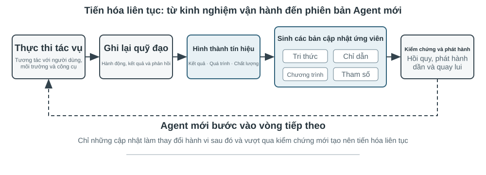
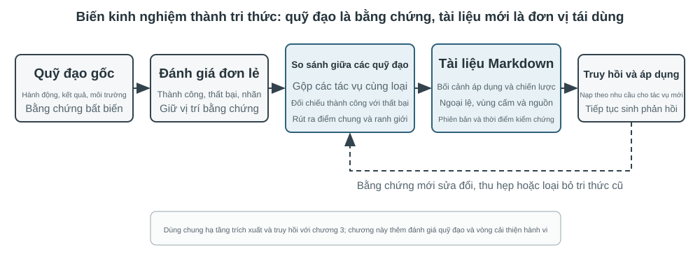

# Tương tác đa phương thức và thời gian thực

Các chương trước khám phá thiết kế của Agent trong thế giới văn bản—tương tác với các hệ thống kỹ thuật số thông qua ngữ cảnh, công cụ và mã. Tuy nhiên, đối tượng tương tác của Agent không chỉ là văn bản và API. Khi Agent cần hiểu hướng dẫn bằng giọng nói của người dùng, tìm và nhấp vào nút chính xác trên màn hình hoặc điều khiển cánh tay robot để nắm bắt chính xác các đối tượng, nó sẽ chuyển sang một trường mới: **Tương tác thời gian thực đa phương thức** - từ đầu vào và đầu ra văn bản đơn giản đến **nhận thức đa phương thức và phản hồi theo thời gian thực**, đây là bước quan trọng để Agent thoát ra khỏi "hộp thoại". Cái gọi là "đa phương thức" có nghĩa là xử lý nhiều dạng thông tin cùng một lúc - văn bản, giọng nói, hình ảnh, video, hành động - không chỉ văn bản.

Đầu tiên hãy xác định ranh giới của chương này. Hiểu tài liệu và hình ảnh tĩnh - xem ảnh chụp màn hình, đọc biểu đồ, phân tích cú pháp PDF - đã được tích hợp một cách tự nhiên vào thực hành Agent trong các chương trước dưới dạng công cụ nhận thức: Đối với các mô hình lớn đa phương thức ngày nay, loại nhiệm vụ "một lần nhập, một lần hiểu" này tương đối hoàn thiện và không yêu cầu thiết kế kiến trúc đặc biệt. Chương này tập trung vào một loại vấn đề khác: ba tình huống trong đó **thời gian thực khiến các vấn đề đa phương thức trở nên khó khăn**—đối thoại bằng giọng nói, hoạt động GUI và điều khiển robot. Trong những tình huống này, đầu vào được luân chuyển liên tục và đầu ra phải được phân phối trong phạm vi ngân sách thời gian nghiêm ngặt, dẫn đến sự thay đổi về chất trong thiết kế kiến trúc. Đối với việc hiểu theo thời gian thực về các luồng hình ảnh liên tục (video), đây vẫn là một vấn đề mở đối với Agent tại thời điểm viết bài - những hạn chế của ảnh chụp màn hình theo từng khung hình được thảo luận trong phần Computer Use của chương này và các câu hỏi cuối chương sẽ quay lại chủ đề này. Một ranh giới khác cần được rút ra: **tạo sinh** đa phương thức (tạo hình ảnh và video) chỉ là một lệnh gọi công cụ thông thường trong khuôn khổ cuốn sách này (Chương 5 Tạo đa phương tiện đã được đề cập). Agent có thể sử dụng nó như một công cụ bên ngoài. Nó không liên quan đến vấn đề tương tác thời gian thực sẽ được giải quyết trong chương này, vì vậy nó không nằm trong nội dung chính của chương này.

Tương tác bằng giọng nói, Computer Use và hoạt động của robot dường như trải rộng trên ba lĩnh vực hoàn toàn khác nhau, nhưng khi thực hiện, bạn sẽ thấy rằng các khu vực bị kẹt rất giống nhau: chúng đều xử lý nhiều thông tin phương thức cùng một lúc và chúng đều cực kỳ nhạy cảm với độ trễ. Việc tạm dừng lời nói hơn hai giây có thể khiến mọi người lo lắng và cảm giác bồn chồn ở mức một phần nghìn giây trong quá trình điều khiển robot có thể dẫn đến va chạm. Cùng với nhau, hai ràng buộc này đẩy ba kịch bản theo cùng một hướng kiến trúc: từ **dây chuyền lắp ráp nối tiếp**(giống như dây chuyền lắp ráp tại nhà máy, một liên kết được hoàn thành trước khi được bàn giao cho dây chuyền tiếp theo) đến **mô hình đầu cuối**(một mô hình thống nhất đi trực tiếp từ đầu vào đến đầu ra, loại bỏ sự cần thiết của các liên kết chuyển giao trung gian).

Chương này diễn ra trong ngữ cảnh sau:

1. Trước tiên, hãy sử dụng "ba mô hình kiến trúc giọng nói" để thiết lập hệ tọa độ - phân tầng (VAD-ASR-LLM-TTS Pipeline), full-modal (Omni, một mô hình nhưng vẫn thay phiên nhau nói), song công hoàn toàn (Moshi, GPT-Live, nghe và nói), và dọc theo trục “làm thế nào để loại bỏ giả định lần lượt của VAD” để tháo gỡ sự chậm trễ và đánh đổi của mỗi liên kết; phần phân tầng cũng sẽ nói về cách sử dụng nhận thức giọng nói truyền phát để thay thế VAD + ASR.
2. Hãy xem cách kiến trúc tư duy dung hòa mâu thuẫn giữa “phản ứng thời gian thực” và “suy nghĩ sâu”: từ sự song song đơn giản giữa nhanh và chậm, đến lộ trình tách rời trong đó mô hình lý luận nền đóng vai trò là “nhà chiến lược” (phái đoàn GPT-Live, Pine AI, v.v.), đến “tư duy và nói” của Step-Audio R1 “nội hóa” suy nghĩ thành một mô hình duy nhất.
3. Sau đó thảo luận về việc tối ưu hóa lớp thực thi để tổng hợp giọng nói giống con người hơn.
4. Cuối cùng, mở rộng góc nhìn sang Computer Use (cho phép AI vận hành màn hình máy tính giống như con người) và vận hành robot để xem các vấn đề về độ trễ và đa phương thức giống nhau biểu hiện như thế nào trong hai tình huống này.

Có hai điểm chính đặc biệt mang tính lý thuyết và có thể được chuyển qua các tình huống: **Kiến trúc tư duy**(cách tư duy nhanh và chậm phối hợp với nhau) và **Giao diện nhanh và chậm** bắt nguồn từ nó (Cầu tiềm ẩn, những gì khác có thể được truyền giữa các mô hình nhanh và chậm ngoài văn bản). Mặc dù bắt đầu từ cảnh giọng nói nhưng chúng không chỉ phục vụ giọng nói - Computer Use sau đây và robot cũng sẽ gặp phải vấn đề “khi nào nên thuê chuyên gia tư vấn chậm”, điều này đáng được độc giả đặc biệt quan tâm.

## Giọng nói: giao diện người–máy tự nhiên nhất

Giọng nói không chỉ là chuyển văn bản thành âm thanh. Tốc độ nói nhanh khoảng bốn lần tốc độ gõ và giải phóng tay, mắt, nên Agent tự nhiên trở thành một vòng lặp vào–ra liên tục mà người dùng có thể ngắt bất cứ lúc nào. Đọc chính tả chuyển lời nói thành văn bản; voice Agent cho phép người dùng cộng tác trực tiếp với Agent. Cả hai đều hỗ trợ quy trình whisper coding đã giới thiệu trước đây.

Phần này xét hai hướng: người dùng nói với Agent, và Agent nói với thế giới bên ngoài thay mặt người dùng. Mô hình giọng nói quyết định Agent có thể trả lời gì; kiến trúc tương tác quyết định Agent có nghe rõ, đáp kịp thời, chuyển lượt tự nhiên, hoàn tất xác nhận và gọi công cụ trong cuộc gọi hay không.

### Thời gian tương tác: từ cascade đến full-duplex

Bài giới thiệu GPT-Live của OpenAI nêu ba mô hình tương tác bằng giọng nói: cascade, theo lượt và full-duplex[^ch9-12]. Đây không phải chuỗi thay thế đơn giản mà là các đánh đổi khác nhau giữa độ trễ, chi phí và khả năng quan sát:

| Mô hình | Cấu trúc cốt lõi | Ưu điểm chính | Hạn chế chính |
| --- | --- | --- | --- |
| Cascade | VAD → ASR → LLM → TTS | Mô-đun rõ ràng, dễ thay thế và gỡ lỗi | Độ trễ cộng dồn, thông tin cận ngôn ngữ mất ở các giao diện |
| Omni end-to-end | Một mô hình nghe, suy nghĩ và nói | Độ trễ thấp hơn, giữ tốt giọng điệu, cảm xúc và âm thanh môi trường | Vẫn theo lượt; huấn luyện và gỡ lỗi tốn kém hơn |
| Full-duplex | Liên tục nghe, nói và quyết định | Nói chồng, ngắt lời tự nhiên và luồng liên tục | Huấn luyện, điều khiển và đánh giá phức tạp hơn |

Điểm chung là thoát khỏi giả định mọi người phải nói lần lượt và khỏi phỏng đoán của VAD về người đang giữ lượt. Cascade và Omni vẫn chia tương tác thành các lượt; full-duplex biến quyền giữ lượt thành quyết định liên tục của mô hình.

[^ch9-12]: OpenAI. *Introducing GPT-Live.* 2026-07-08. https://openai.com/index/introducing-gpt-live/ Phân loại cascade / turn-based / full-duplex xuất phát từ phần tóm tắt ba thế hệ ChatGPT Voice; thuật ngữ “end-to-end omnimodal (Omni)” tương ứng với nhóm “turn-based voice models”.

### Mô hình 1 · Pipeline cascade

Phần lớn trợ lý giọng nói thương mại vẫn dùng pipeline tuần tự (Hình 9-1): VAD quyết định người dùng đã nói xong, ASR chuyển âm thanh thành văn bản, LLM hiểu và tạo câu trả lời, rồi TTS đọc câu trả lời. Tính mô-đun giúp tối ưu từng thành phần độc lập, nhưng mỗi ranh giới lại thêm thời gian chờ.



| Mô-đun | Vai trò | Nút thắt thường gặp |
| --- | --- | --- |
| VAD | Xác định lời nói đã kết thúc | Ngưỡng im lặng gây chờ và tách lượt sai |
| ASR | Chuyển âm thanh thành văn bản | Độ trễ nhận dạng và mất ngữ cảnh |
| LLM | Hiểu, suy luận và sinh câu trả lời | Thời gian đến token đầu tiên; reasoning làm chờ lâu hơn |
| TTS | Chuyển văn bản thành giọng nói | Tổng hợp gói đầu tiên và bộ đệm phát |

Với câu trả lời ngắn không reasoning, thời gian chờ của VAD, ASR, LLM và TTS cộng dồn theo chuỗi (Hình 9-2); giá trị thực phụ thuộc độ dài đầu vào, mô hình, phần cứng, mạng và tải. Trong sản xuất, xếp hàng còn khuếch đại độ trễ nhàn rỗi (Hình 9-3).


> **Thử nghiệm 9-1 ★: Xây dựng Agent thoại truyền thống**
>
> Kết nối microphone, Silero VAD, Whisper cục bộ, LLM streaming và Fish S1 TTS qua WebSocket để lập đường cơ sở cascade. Bằng chứng thực của một lượt còn lại cho thấy chuỗi media và mô hình chạy end-to-end; đây không phải benchmark về đồng thời hay tải sản xuất. Mã và hồ sơ nghiệm thu ở [chapter9/live-audio](../chapter9/live-audio/).

> **Bổ sung: Xây dựng Agent thoại WebRTC “gọi cho người dùng”**
>
> Phone Agent không cần PSTN. WebRTC trên trình duyệt có thể tái hiện vòng lặp mở phiên, hỏi thông tin thiếu, đọc lại để xác nhận và lưu kết quả có cấu trúc. Khi cần liên hệ tổ chức bên ngoài, thay hợp đồng công cụ bằng nhà cung cấp PSTN/SIP phù hợp. Đường truyền media, so sánh direct/ReAct và bằng chứng nghiệm thu ở [chapter9/phone-agent](../chapter9/phone-agent/). Dự án giữ các run identifier lịch sử \`exp9-2\`, nhưng không còn là một thử nghiệm được đánh số trong bản thảo.

#### Từ tuần tự đến nhận biết streaming

Streaming ASR có thể tạo transcript tạm thời trong khi người dùng nói; LLM gửi câu đầu tiên có thể đọc được cho TTS; TTS trả về các đoạn âm thanh để chồng lấp sinh, tổng hợp và phát. Điều đó không làm ASR, LLM và TTS song song hoàn toàn: nếu transcript một phần thay đổi, phải hủy, khởi động lại hoặc sửa phần sinh; chỉ bật \`stream\` là chưa đủ.

Streaming thông thường cũng không bỏ được thời gian chờ im lặng của VAD. Front end VAD + ASR tích lũy độ trễ, làm mất do dự, cảm xúc, backchannel và âm thanh môi trường; tên riêng hay địa chỉ email có thể bị chia giữa các đoạn. Mô hình streaming thực sự cần encoder nhân quả hoặc theo khối cùng giải mã tăng dần. Encoder của Whisper chờ toàn bộ đoạn âm thanh nên không nên gọi là mô hình streaming nhân quả. Mô hình âm thanh dựa trên LLM có thể phát văn bản và sự kiện ngữ nghĩa từ âm thanh liên tục, nhưng mô phỏng bằng prefix không phải cam kết hiệu năng của mô hình nhân quả.

Ngoài token văn bản, luồng có thể phát \`speak_start/end\`, \`interrupt\` (ranh giới lời nói và ý định ngắt), \`emotion\` (cảm xúc và do dự), \`laugh\`, \`sigh\`, \`noise\` (âm thanh cận ngôn ngữ và môi trường). Nhờ vậy Agent không phải nén mọi sự kiện âm thanh thành văn bản thường.

[^ch9-11]: Về việc đưa phán đoán lượt vào bộ nhận dạng và vấn đề nhãn sử dụng thông tin tương lai, xem Bojie Li và Noah Shi, *The Trade-off Was in the Labels: Causal Supervision for Turn-Aware Streaming ASR*, 2026 (sắp xuất bản).

> **Thử nghiệm 9-2 ★: Mô phỏng nhận biết giọng nói streaming bằng Qwen2-Audio**
>
> Bản thân Qwen2-Audio không phải mô hình streaming. Thử nghiệm mô phỏng nhận biết liên tục bằng các prefix âm thanh tăng dần và so sánh với VAD 600 ms + Whisper. Canonical run vượt qua các cổng thực thi và provenance nhưng chỉ tái hiện 2/6 hành vi: các lệnh prefix mất 8,4–11,3 giây, mẫu pause bỏ sót \`silence\`, và mẫu noise vẫn phân loại sai \`cough/laughter\`. Đây là kết quả âm tính để kiểm tra cơ chế và lỗi; không phải bằng chứng cho nhận biết streaming thật 100–200 ms. Toàn bộ hồ sơ ở [chapter9/streaming-speech](../chapter9/streaming-speech/).

### Mô hình 2 · Mô hình omnimodal end-to-end (Omni)

Ngay cả khi có nhận biết streaming, cascade vẫn đưa nghe, suy nghĩ và nói qua các giao diện rời rạc; cảm xúc, ngữ điệu và âm thanh môi trường có thể mất khi âm thanh biến thành văn bản. Omni dùng một mô hình để nghe, sinh câu trả lời và nói, giữ được tín hiệu phi văn bản nhưng tốn hơn khi huấn luyện, gỡ lỗi và thay thành phần (Hình 9-4). Self-cascade có thể sửa lỗi nhận biết khi văn bản đủ cho nhiệm vụ; nếu câu trả lời phụ thuộc tốc độ nói, cảm xúc hoặc môi trường, nút thắt văn bản làm mất bằng chứng không thể đảo ngược[^ch9-13].

Omni vẫn giả định chia lượt và thường dùng VAD hoặc endpointing ngữ nghĩa. Một khoảng dừng trong chuỗi số có thể bị coi là kết thúc; nhận biết streaming cải thiện phán đoán nhưng không xóa lượt.

[^ch9-13]: Đo lường đầy đủ thời điểm lợi thế độ chính xác giữa cascade và end-to-end đảo chiều, xem Li, Bojie và Noah Shi, *The Cascade Gap: When and Why Self-Cascades Help Multimodal Agents*, 2026 (sắp xuất bản).



Realtime speech API nằm giữa cascade và Omni: mô hình xử lý âm thanh native nhưng điều khiển tương tác vẫn dựa vào VAD, ngắt lời và gọi công cụ bất đồng bộ. So sánh có ích không phải bảng xếp hạng mà là cách hai đường end-to-end và self-cascade thất bại ở các nhiệm vụ khác nhau.

> **Thử nghiệm 9-3 ★★: Chạy MiniCPM-o 4.5 cục bộ — end-to-end so với self-cascade**
>
> Cố định một revision cục bộ, tắt chế độ suy nghĩ, rồi so sánh câu trả lời trực tiếp từ audio với self-cascade (transcribe trước, trả lời từ transcript sau). Đo khả năng giữ thông tin âm thanh, **không** đo khả năng “vừa nói vừa suy nghĩ” về sau.
>
> | Loại nhiệm vụ | End-to-end | Self-cascade | Quan sát |
> | --- | ---: | ---: | --- |
> | Số học ngữ nghĩa (2) | 1/2 | 2/2 | Self-cascade sửa một lỗi phiên âm |
> | Tốc độ nói cận ngôn ngữ (2) | 2/2 | 1/2 | Transcript văn bản xóa khác biệt nhanh/chậm |
> | Tổng | 3/4 | 3/4 | Tổng bằng nhau, lỗi bổ sung |
>
> Mẫu nhỏ nên không chứng minh đường nào thường chính xác hay nhanh hơn. Phiên bản, đầu ra thô và bằng chứng audio-to-audio ở [chapter9/end-to-end-speech](../chapter9/end-to-end-speech/).

Step-Audio 2 cho thấy đường end-to-end xử lý audio thô và phát văn bản lẫn giọng nói, chú ý đến cảm xúc, tốc độ, ngữ điệu và âm thanh môi trường. Step-Audio R1 đưa suy luận vào mô hình âm thanh và làm ví dụ cho “vừa suy nghĩ vừa nói”.

### Mô hình 3 · Mô hình tương tác full-duplex

Omni vẫn tách “người dùng nói” và “mô hình nói”, nhưng phiên dịch đồng thời cần chồng lấp. Full-duplex lắng nghe và nói liên tục, liên tiếp quyết định có tiếp tục, dừng, ngắt hay gọi công cụ. Moshi của Kyutai là một ví dụ nghiên cứu sớm. Thinking Machines Lab gọi đây là **Interaction Model**[^ch9-14]: tương tác được xây trong mô hình thay vì lắp quanh VAD. GPT-Live đưa hướng này lên quy mô sản xuất và ủy thác việc phức tạp cho mô hình suy luận nền trong khi mô hình tiền cảnh giữ cuộc trò chuyện.

[^ch9-14]: Thinking Machines Lab, “Interaction Models: A Scalable Approach to Human-AI Collaboration”, 2026-05. https://thinkingmachines.ai/blog/interaction-models/

Đường tiến hóa là: cascade đoán lượt bằng ngưỡng im lặng; nhận biết streaming nâng phán đoán lên mức ngữ nghĩa; full-duplex biến việc đổi lượt thành quyết định liên tục.

### Thời gian nhận thức: tương tác thời gian thực và suy nghĩ sâu

Mô hình tiền cảnh phải trả lời khi người dùng còn chờ; mô hình nền có thể suy nghĩ lâu hơn. Đây là ba đánh đổi, không phải các bậc tiến hóa tuyến tính:

| Thiết kế | Tiền cảnh | Nền | Rủi ro chính |
| --- | --- | --- | --- |
| Lấp chỗ nhanh, sửa chậm | Trả lời ngay | Nghĩ lại và bổ sung | Mâu thuẫn |
| Tương tác nhanh, lời khuyên chậm | Giữ mạch hội thoại và chọn cách nói | Lời khuyên hoặc kết quả công cụ | Giao diện hạn chế |
| Hợp nhất suy nghĩ và biểu đạt | Vừa suy nghĩ vừa nói | Chia sẻ trạng thái mô hình | Chi phí huấn luyện và thay thế cao |

Giải pháp đầu có thể xử lý câu hỏi hai lần và tự mâu thuẫn. Giải pháp hai ổn định hơn nhờ gửi lời khuyên qua status bar, nhưng tiền cảnh không thấy suy luận trung gian và không thực sự suy nghĩ trong khi nói. Giải pháp ba hợp nhất hai quá trình. Trong Step-Audio R1, MGRD neo suy luận vào đặc trưng âm học, còn kiến trúc hai não MPS cho phép lập kế hoạch và biểu đạt chạy song song (Hình 9-5 và 9-6). Mô hình hợp nhất tự nhiên hơn; thiết kế tách rời dễ thay “bộ não” nền hơn.

### Tổng hợp giọng nói giống con người hơn

TTS truyền thống quá trơn tru và ít ngắt nghỉ sẽ để lộ bản chất máy móc. LLM chính có thể phát thêm các marker điều khiển như \`THINKING\`, \`EMO:happy\`, \`SPEED:0.8x\`; TTS ánh xạ chúng thành khoảng dừng, ngữ điệu, tốc độ, tiếng cười và tiếng thở dài. Có thể huấn luyện TTS hiểu marker hoặc dùng voice cloning với nhiều đoạn tham chiếu.

> **Thử nghiệm 9-4 ★★: TTS điều khiển bằng token với Fish Audio**
>
> Dùng Fish Audio S1 để xây dựng thư viện giọng nhiều tham chiếu và so sánh ba cấu hình: không marker, một đoạn tham chiếu và nhiều đoạn tham chiếu. Lớp thực thi chọn cảm xúc, tốc độ và phong cách khớp marker. Cấu hình nhiều tham chiếu đạt điểm cao nhất trong ba vòng nghe mù cân bằng (độ giống nhân viên dịch vụ khách hàng thật 4,67/5), nhưng thứ tự dự kiến không lặp lại đầy đủ vì nhánh không marker vượt nhánh một tham chiếu. Kết quả gợi ý kiểm soát biểu cảm có ích, song nghiên cứu nghe nhỏ không kết luận chất lượng giọng nói nói chung. Thư viện 24 tham chiếu, media A/B/C và hồ sơ nghiệm thu ở [chapter9/controllable-tts](../chapter9/controllable-tts/).
## Computer Use: GUI Tự động hóa Agent

Khi đọc điều này, bạn có thể nhận thấy rằng chương này dành nhiều không gian cho giọng nói hơn đáng kể so với hai cảnh cuối - điều này là có chủ ý. Trên tiến trình phát triển của đa phương thức thời gian thực, giọng nói là thứ hoàn thiện nhất và đáng được sử dụng làm hệ thống tham chiếu nhất: bắt đầu từ vấn đề "độ trễ đường ống nối tiếp quá cao", thông qua một loạt các giải pháp như end-to-end, full-duplex, suy nghĩ và nói chuyện, v.v., cho đến phần cuối tương đối hình thành ngày nay, toàn bộ quá trình của vấn đề → giải pháp → kết thúc đã được hoàn thành. Vì vậy, hãy giải thích nó kỹ lưỡng. Hai cảnh tiếp theo của Computer Use và robot có thể được xem trong ngữ cảnh giọng nói - chúng đã đạt đến giai đoạn nào của đường tiến hóa này và chúng đang bị mắc kẹt ở đâu.

Ba kịch bản này có vẻ khác nhau nhưng chúng phải đối mặt với những thách thức cốt lõi giống nhau: nhận thức theo thời gian thực, ra quyết định có độ trễ thấp và tương tác liên tục. Hãy xem cách các chủ đề kỹ thuật này được tái tạo trong tương tác trực quan (Computer Use) và tương tác vật lý (robot) – trước tiên bằng cách mở rộng góc nhìn từ phương thức thính giác sang phương thức thị giác: Điều gì sẽ xảy ra nếu Agent không chỉ hiểu được lời nói mà còn có thể “đọc” màn hình và vận hành giao diện đồ họa?

Computer Use (còn gọi là GUI Automation Agent) cho phép AI sử dụng phần mềm giống con người bằng cách quan sát màn hình và thao tác chuột, bàn phím - chẳng hạn như mở trình duyệt để tìm kiếm thông tin, điền dữ liệu vào phần mềm bảng tính hoặc điều chỉnh cấu hình trong cài đặt hệ thống. Cốt lõi của nó là một chu trình nhận thức-suy nghĩ-hành động (Hình 9-7):

1. Agent chụp ảnh màn hình hiện tại
2. Mô hình đa phương thức nhận ảnh chụp màn hình và hướng dẫn nhiệm vụ, đồng thời đưa ra suy nghĩ và hành động cụ thể.
3. Lớp thực thi thực hiện hành động trong môi trường thực (di chuyển chuột, nhấp chuột, nhập văn bản, v.v.)
4. Đợi giao diện phản hồi rồi chụp ảnh màn hình lại để vào chu kỳ tiếp theo.


Có ba chiều thiết kế chính trong chu trình này: **không gian hành động**(những thao tác mà Agent có thể thực hiện), **định vị trực quan**(cách tìm phần tử mục tiêu trong ảnh chụp màn hình) và **kiến trúc mô hình**(cách tạo hành động chính xác từ ảnh chụp màn hình).

### Thiết kế không gian hành động

Anthropic xác định ba loại công cụ để hình thành khả năng tương tác hoàn chỉnh (Hình 9-8):


**GUI Operation Tool**(công cụ máy tính): Thao tác chuột bao gồm di chuyển (mouse_move), nhấp chuột trái/phải/giữa, nhấp đúp/ba lần, kéo (left_click_drag) và nhấn/nhả chi tiết hơn (left_mouse_down/up). Cuộn hỗ trợ bốn hướng và có thể được sử dụng với các phím bổ trợ. Thao tác trên bàn phím bao gồm nhập từng từ (loại, mỗi ký tự cách nhau 12 mili giây để mô phỏng thao tác gõ thực), tổ hợp phím (phím, chẳng hạn như Ctrl+C) và nhấn và giữ (hold_key). Các hành động được nhận biết: ảnh chụp màn hình (ảnh chụp màn hình), lấy vị trí con trỏ (cursor_position), chờ (wait).

**Công cụ thực thi lệnh**(công cụ bash): Cung cấp phiên cuối bash liên tục, thời gian chờ 120 giây, phát hiện xem lệnh có được thực thi thông qua chuỗi trọng điểm hay không và duy trì trạng thái môi trường giữa nhiều lệnh gọi (ví dụ: sau khi cd vào một thư mục, lệnh gọi tiếp theo sẽ vẫn ở trong thư mục đó).

**Công cụ chỉnh sửa tệp**(str_replace_editor): Chỉnh sửa an toàn đạt được thông qua khớp chuỗi. Nó hỗ trợ các hoạt động xem, tạo, thay thế, chèn và hoàn tác. Nó chính xác hơn việc ghi đè trực tiếp toàn bộ tập tin và ít có khả năng vô tình làm thay đổi nội dung khác.

> **Thử nghiệm 9-5 ★: Chạy Computer Use (lộ trình tham chiếu Anthropic hoặc lộ trình mô hình mở)**
>
> Lộ trình A sử dụng Anthropic Computer Use Demo. Container đóng gói một môi trường desktop Ubuntu hoàn chỉnh, gồm trình duyệt, terminal và các công cụ thông dụng khác. Frontend nhận tác vụ; backend gửi hướng dẫn và ảnh chụp màn hình đến Claude, rồi thực thi các thao tác chuột, bàn phím, terminal hoặc chỉnh sửa do mô hình trả về. Lộ trình này dùng để tìm hiểu giao thức công cụ `computer` nguyên bản; không yêu cầu mọi độc giả đều phải có quyền truy cập Anthropic API.
>
> Lộ trình B sử dụng dự án đi kèm sách [`chapter9/computer-use-open-model`](../chapter9/computer-use-open-model/). Theo mặc định, dự án điều khiển browser-use bằng mô hình trọng số mở Qwen3-VL 32B Instruct, qua API được OpenRouter lưu trữ hoặc bằng cách trỏ `OPEN_MODEL_BASE_URL` đến vLLM/SGLang tự lưu trữ hay endpoint tương thích khác. Endpoint phải nhận được ảnh chụp màn hình và hỗ trợ JSON Schema nguyên bản; nếu chỉ hỗ trợ JSON thông thường, có thể bật rõ ràng chế độ tương thích schema-in-prompt.
>
> Hai lộ trình dùng cùng một tác vụ chỉ đọc và cùng một hợp đồng nghiệm thu: tối đa 25 bước, mỗi bước chỉ thực hiện một hành động, đồng thời lưu danh tính mô hình/endpoint, phản hồi nguyên gốc của nhà cung cấp, ảnh chụp từng bước, chuỗi hành động, câu trả lời cuối cùng và lý do dừng. Các mô hình khác nhau phải được báo cáo như những nhánh thí nghiệm riêng; không được trình bày kết quả mô hình mở như một lần tái lập Claude, cũng không được coi “container khởi động thành công” là hoàn thành tác vụ. Khoảng thời gian giữa hành động và chất lượng lập kế hoạch là kết quả đo được, không phải giả định trước rằng khoảng thời gian là 2–5 giây hoặc mô hình chắc chắn vượt trội hơn các mô hình khác.
>

### Định vị trực quan (Nối đất)

Trong mỗi vòng lặp, mô hình cần xác định chính xác phần tử mục tiêu trong ảnh chụp màn hình - "Hộp tìm kiếm ở đâu?" "Tọa độ của nút gửi là gì?" Đây là vấn đề định vị trực quan (Nối đất). Hiện tại có hai ý tưởng chính: một là biến định vị thành câu hỏi trắc nghiệm - đầu tiên đánh dấu các thành phần giao diện bằng số và mô hình chỉ cần chọn một trong số đó; cái còn lại là **dự đoán tọa độ thuần túy** - để mô hình trực tiếp "nhìn" vào ảnh chụp màn hình và báo cáo tọa độ như con người. Có hai cách để triển khai ý tưởng câu hỏi trắc nghiệm: **Chú thích trực quan thuần tuý**(Set-of-Mark gốc, sử dụng mô hình phân đoạn để cắt bỏ các vùng ứng cử viên trên pixel) và **Chỉ mục thành phần cấu trúc**(Cây DOM/Accessibility, đọc trực tiếp cấu trúc đi kèm với giao diện). Ưu điểm chung của ý tưởng câu hỏi trắc nghiệm là chuyển đổi câu hỏi mở "tìm nút trong ảnh chụp màn hình và dự đoán tọa độ" thành câu hỏi đóng "chọn một trong các yếu tố được đánh dấu" - giống như các câu hỏi trắc nghiệm trong bài thi dễ trả lời chính xác hơn các câu hỏi điền vào chỗ trống. Mô hình chỉ cần nói "nhấp [123]" thay vì "nhấp vào nút màu xanh lam cách khoảng 200 pixel ở bên phải góc trên bên trái của màn hình."

**Set-of-Mark: Phương pháp chú thích trực quan.**

Set-of-Mark (SoM) ban đầu được Microsoft Research đề xuất vào năm 2023, ban đầu nhằm phát huy khả năng định vị trực quan của GPT-4V. Đây là một phương pháp **hoàn toàn trực quan**: sử dụng mô hình phân đoạn hình ảnh (SAM, SEEM, v.v.) để tự động cắt các vùng ứng cử viên trên ảnh chụp màn hình và chồng các điểm đánh dấu được đánh số lên từng vùng. Những gì mô hình nhìn thấy là một hình ảnh được đánh số, chỉ cần báo số, hệ thống sẽ chuyển đổi thành tọa độ trung tâm của khu vực tương ứng. Toàn bộ quá trình không yêu cầu DOM hoặc bất kỳ cấu trúc giao diện nội bộ nào, do đó, giao diện trò chơi và phần mềm máy tính để bàn gốc cũng có thể được áp dụng - miễn là mô hình phân khúc có thể loại bỏ các khu vực ứng cử viên.

**Chỉ mục phần tử có cấu trúc: Triển khai có cấu trúc các ý tưởng SoM trên Web.**

Chú thích có thể được thực hiện chính xác hơn khi chính giao diện cung cấp thông tin có cấu trúc. Các trang web hiện đại có cấu trúc thành phần hoàn chỉnh (cây DOM) và các vai trò ngữ nghĩa (là nút, là hộp nhập liệu) được xác định trước khi hiển thị. Cây trợ năng cung cấp thông tin tương tự cho nhiều ứng dụng trên máy tính để bàn. Thay vì yêu cầu mô hình phân đoạn đoán "nút là khu vực nào" trong pixel, tốt hơn là bạn nên hỏi trực tiếp chính giao diện "bạn có những yếu tố nào có thể nhấp vào được?". Giải pháp Web Agent do dự án browser-use đại diện thực hiện chính xác điều này: liệt kê và đánh số các phần tử tương tác từ DOM, có thể được coi là triển khai có cấu trúc các ý tưởng SoM trên Web (Hình 9-9). Quá trình này được chia thành bốn bước:

1. Lấy biểu diễn có cấu trúc (DOM tree) và thông tin truy cập của trang web thông qua giao diện gỡ lỗi trình duyệt (CDP, Chrome DevTools Protocol)
2. Tự động phát hiện những thành phần nào có thể tương tác (nút, hộp nhập liệu, liên kết, v.v.)
3. Gắn nhãn cho mỗi phần tử có thể tương tác bằng một ID duy nhất và vẽ hộp giới hạn trên ảnh chụp màn hình
4. Đồng thời, tạo ra một danh sách văn bản để mô tả các thành phần tương ứng với mỗi ID.

```
Ảnh chụp màn hình: [Các thành phần chính trong ảnh được đánh dấu bằng ID như [1], [2], [3], [4], v.v.]

Elements:
[1] <input type="text" placeholder="Search" aria-label="Search" />
[2] <button id="submit-btn" aria-label="Submit form" />
[3] <input type="text" placeholder="Enter your name" value="" />
[4] <a href="/docs" aria-label="Documentation" />
```

Mô hình chỉ cần xuất số ID và hệ thống sẽ tự động sử dụng tọa độ trung tâm của phần tử để thực hiện nhấp chuột. Loại giải pháp này không lưu mã thông báo (vì tất cả thông tin chú thích phải được gửi đến mô hình), nhưng định vị chính xác và ổn định, đồng thời tránh được các phát hiện bị bỏ sót và phát hiện sai có thể do mô hình phân đoạn đưa ra.


**Dự đoán tọa độ thuần túy.**

Tuyến thứ ba không thực hiện bất kỳ chú thích nào và trực tiếp cho phép mô hình xuất tọa độ. Lấy việc sử dụng **SeeClick** và Claude của máy tính làm ví dụ: đào tạo mô hình trực quan dựa trên dữ liệu được ghép nối của các ảnh chụp màn hình và vị trí phần tử GUI khổng lồ, đồng thời cho phép mô hình học cách ánh xạ các mô tả ngôn ngữ tự nhiên (chẳng hạn như "nhấp vào nút gửi") trực tiếp tới tọa độ chính xác trong ảnh chụp màn hình - giống như người dùng con người, hoàn toàn dựa vào "tìm kiếm" để tìm vị trí cần nhấp.

Trong sơ đồ dự đoán tọa độ, sự hiểu biết của mô hình về tọa độ phụ thuộc nhiều vào độ phân giải được sử dụng trong quá trình huấn luyện (Hình 9-10). Claude được đào tạo bằng XGA (1024x768), WXGA (1280x800) và FWXGA (1366x768). Nếu độ phân giải ảnh chụp màn hình đầu vào không khớp, tọa độ mà mô hình dự đoán sẽ được bù một cách có hệ thống - giống như đo khoảng cách trên bản đồ nhỏ và sau đó sử dụng trực tiếp trên bản đồ lớn. Do đó, cần triển khai cơ chế chia tỷ lệ tọa độ hai chiều trên lớp công cụ và chọn độ phân giải mục tiêu theo tỷ lệ khung hình để tránh kéo dài không đẳng cự làm biến dạng hình ảnh và làm sai lệch phán đoán tọa độ. Ví dụ: nếu độ phân giải màn hình thực là 2560×1440 (16:9), bạn nên chọn một trong ba mức được Claude hỗ trợ với tỷ lệ khung hình cũng gần 16:9 – FWXGA (1366×768) là phù hợp nhất. Khi chụp ảnh màn hình, hãy chia tỷ lệ màn hình thành 1366×768 và gửi cho mô hình; sau khi mô hình xuất ra tọa độ nhấp chuột (683, 384), nó sẽ được ánh xạ ngược sang tọa độ thực (683×2560/1366, 384×1440/768) ≈ (1280, 720). Ngược lại, nếu bạn kéo căng mạnh 16:9 thành 4:3 1024×768, màn hình sẽ bị nén theo chiều ngang và tọa độ mà mô hình dự đoán sẽ bị dịch chuyển một cách có hệ thống.


Logic lựa chọn của ba tuyến đường có thể được tóm tắt như sau: **Khi có sẵn thông tin có cấu trúc, chỉ mục Cây DOM/Accessibility** được sử dụng đầu tiên và vị trí là chính xác và ổn định nhất; **Khi không có sẵn**(phần mềm máy tính gốc như Photoshop, giao diện kết xuất Canvas/WebGL, trò chơi), **Bạn có thể sử dụng chú thích trực quan (tuyến SoM gốc) hoặc dự đoán tọa độ**. Chú thích trực quan biến việc định vị thành một câu hỏi trắc nghiệm, thân thiện hơn với các mô hình tổng quát chưa được đào tạo đặc biệt; dự đoán tọa độ loại bỏ bước chú thích và trực tiếp hơn đối với các mô hình đã trải qua khóa đào tạo định vị GUI. Vẫn còn khoảng cách về độ chính xác giữa hai yếu tố này trên các phần tử nhỏ và giao diện dày đặc.

> **Thử nghiệm 9-6 ★: Sử dụng browser-use để đạt được hoạt động trình duyệt tự động**
>
> Kết hợp Playwright, một framework tự động hóa trình duyệt, với mô hình đa phương thức để triển khai thao tác trình duyệt được điều khiển bằng ngôn ngữ tự nhiên. Bật trực quan hóa SoM và lưu ảnh chụp màn hình có hộp giới hạn được chú thích trước mỗi quyết định. Giao diện mô hình không bị giới hạn ở OpenAI hay Anthropic; sách cung cấp cấu hình API cho mô hình mở Qwen3-VL và giữ một base URL tổng quát tương thích OpenAI cho các dịch vụ lưu trữ khác hoặc suy luận tự lưu trữ.
>
> Nhiệm vụ kiểm tra “Mở Google và tìm thời tiết San Francisco”: sau khi khởi động, ảnh chụp màn hình hiển thị trang tìm kiếm Google với các phần tử tương tác được đánh số. Mô hình chọn hộp tìm kiếm, nhập “San Francisco weather today”, gửi tìm kiếm rồi trích xuất nhiệt độ và điều kiện thời tiết từ trang kết quả. Khi nghiệm thu, cần kiểm tra độc lập câu trả lời và quỹ đạo, đồng thời ghi trung thực số bước thực tế và thời gian đã dùng. “5 bước, khoảng 20 giây” chỉ có thể là giá trị quan sát của một lần chạy cụ thể, không phải kết quả cố định nếu không có biên nhận thực thi.
>
> Lần chạy chính thức của mô hình mở được lưu trong sách sử dụng `qwen/qwen3-vl-32b-instruct` trên OpenRouter. Khi gặp CAPTCHA ở bước 4 của Google Search, mô hình không tuyên bố thành công mà chuyển sang weather.com; đến bước 16, nó đọc từ trang Today của San Francisco: 64°F, Sunny, cảm giác như 62°F, cao nhất 74°F và thấp nhất 55°F. Cả 16/16 phản hồi API đều báo đúng mô hình Qwen3-VL được yêu cầu; 15 ảnh chụp bước hợp lệ cùng quỹ đạo hành động chỉ đọc đã vượt qua nghiệm thu quyết định độc lập. Kết quả này chứng minh lộ trình API mô hình mở có thể chạy được; nó không đồng nghĩa với việc đã tái lập nhánh sử dụng công cụ `computer` nguyên bản của Anthropic.

### Có thể xem hoạt hình và nghe âm thanh Computer Use Agent

Cho đến nay, nhận thức về Computer Use dựa trên một giả định ngầm: **Màn hình tĩnh**—chụp ảnh, suy nghĩ về một bước, nhấp chuột rồi chụp ảnh. Nhưng trên thực tế, màn hình sẽ phát video, các thông báo thoáng qua sẽ bật lên và giọng nói trong cuộc họp sẽ được phát. Agent, chỉ mở mắt sau mỗi 3–5 giây và hoàn toàn không có tai, không thể nhìn hay nghe thấy "những điều xảy ra giữa các khung hình" này. Xem các bản ghi màn hình, theo dõi các cuộc họp, nghe lời nhắc bằng giọng nói và xử lý các hộp thoại thoáng qua—toàn bộ danh mục hoạt động máy tính hàng ngày này gần như bị giới hạn đối với Computer Use Agent ngày nay.

Thứ thực sự cần được thiết kế lại ở đây không phải là "giao diện hành động", mà là " **giao diện quan sát**" [^ch9-9]. Ý tưởng cốt lõi là tách **quan sát**(liên tục, thích ứng, đa phương thức) khỏi **hành động**(rời rạc) và tạo một lớp phần mềm trung gian nhận thức (có thể gọi là Agent-Giao diện quan sát máy tính, AOI) được chèn giữa môi trường và bất kỳ mô hình Computer Use nào được tạo sẵn mà không cần đào tạo lại. Nó có ba thành phần "cổng theo yêu cầu": Đầu tiên, **Chụp khung hình chính giữa các khung** - đầu tiên sử dụng cổng pixel cực rẻ để bỏ qua hình ảnh gần như không thay đổi, sau đó sử dụng một mô hình nhỏ để xác định xem hình ảnh có những thay đổi có ý nghĩa hay không và chỉ chặn một khung hình khi có thay đổi, chi phí gần như bằng 0 đối với ảnh tĩnh; thứ hai, **Phiên âm giọng nói có kiểm soát âm lượng** - chỉ nhận dạng giọng nói khi có âm thanh, hãy để Agent Lần đầu tiên "mọc tai"; thứ ba, và quan trọng nhất, **tường thuật bức ảnh thành văn bản lâu dài** - hãy để mô hình mô tả khung hình đã chụp thành một câu ("Lời nhắc vừa xuất hiện cho biết ngày phát hành đã được thay đổi thành ngày 28 tháng 4") và **ngay cả khi hình ảnh gốc sau đó bị xóa khỏi ngữ cảnh, văn bản này vẫn còn trong bộ nhớ**, mang thông tin động xuống dưới dạng văn bản.

Một khám phá phản trực giác là điều thực sự quan trọng không phải là "nên chọn khung nào" mà là " **tường thuật các khung thành văn bản có thể được giữ lại trong thời gian dài**" - văn bản là phương thức mà LLM Agent xử lý tốt nhất. Trên tám mô hình từ quy mô 7B đến quy mô tiên tiến, lớp phần mềm trung gian này mang lại sự cải thiện từ +17 đến +48 điểm phần trăm mà không cần đào tạo lại. Trong số đó, khoảng cách là khác biệt nhất đối với các tác vụ lời nói: với việc bổ sung lớp nhận thức này, Agent có thể thực hiện tất cả các tác vụ lời nói mà ban đầu "nghe được nhưng không thể di chuyển". Nhưng không phải cấu hình cố định có thể chinh phục thế giới - trên một số mẫu máy mới hơn, việc nhồi quá nhiều mã thông báo hình ảnh sẽ lấn át khả năng lý luận và kéo giảm hiệu suất, vì vậy các thành phần này cần phải được chọn từng thành phần một theo mô hình, thay vì sử dụng tất cả cùng một lúc. Điều này giống như lựa chọn trước đây giữa Set-of-Mark và dự đoán tọa độ: không có viên đạn bạc trong sơ đồ nhận thức và nó phải được khớp theo đặc điểm của mô hình.

[^ch9-9]: Ba thành phần của khung hình chính, phiên âm theo yêu cầu và khung tường thuật thành văn bản cố định. Cơ chế hoàn chỉnh và sự cắt bỏ theo từng mô hình được tìm thấy ở Li, Bojie và Noah Shi. *Agent-Giao diện quan sát trên máy tính kích hoạt Computer Use động.* arXiv:2606.29472, 2026.

### Di động: Rào cản sinh thái còn khó hơn công nghệ

Computer Use cũng đang mở rộng sang thiết bị đầu cuối di động. Thực sự có sự khác biệt về mặt kỹ thuật giữa thiết bị đầu cuối di động và máy tính để bàn: không gian hành động thường không còn là "tọa độ chuột + bàn phím" mà truy cập vào dịch vụ trợ năng API của hệ thống (chẳng hạn như AccessibilityService của Android) để đọc các thành phần giao diện, thực hiện nhấp chuột và nhập văn bản; phương thức tương tác cũng thay đổi từ con trỏ chuột sang cử chỉ chạm và ngữ nghĩa của tọa độ thay đổi tương ứng - giống nhau (x, y) Cho dù đó là nhấp ngón tay, nhấn lâu hay điểm bắt đầu của cử chỉ trượt đều yêu cầu các loại cử chỉ bổ sung để xác định. Các điểm chuẩn dành cho thiết bị di động như AndroidWorld được giới thiệu trong Chương 6 được sử dụng để đánh giá khả năng của Agent trong việc hoàn thành các tác vụ Ứng dụng thực trong không gian hành động như vậy.

Nhưng điều thực sự cản trở thiết bị đầu cuối di động thường không phải là những khác biệt về mặt kỹ thuật mà là những rào cản về sinh thái. Một số nhà sản xuất điện thoại di động đã cố gắng tích hợp trợ lý AI vào điện thoại di động dành cho người tiêu dùng để cho phép chúng tự động vận hành các ứng dụng hàng ngày như WeChat, Taobao và Alipay, nhưng họ sớm gặp phải những hạn chế về nền tảng.

Điều này cho thấy một thách thức đặc biệt mà Computer Use phải đối mặt: **rào cản sinh thái**. Lý do cơ bản đằng sau lệnh cấm là xung đột mô hình kinh doanh. Logic kiếm tiền cốt lõi của các ứng dụng Internet truyền thống là **lưu lượng truy cập và sự chú ý**: người dùng xem quảng cáo khi duyệt các luồng thông tin, làm theo hướng dẫn của thuật toán đề xuất khi tìm kiếm sản phẩm và mua hàng tùy hứng khi duyệt các trang. Khi Agent hoạt động thay mặt người dùng, liên kết kiếm tiền này hoàn toàn bị bỏ qua: AI sẽ không chú ý đến quảng cáo cũng như không thực hiện các giao dịch mua hàng bốc đồng, nó sẽ đi thẳng đến mục tiêu và hoàn thành nhiệm vụ. Đối với một nền tảng dựa vào quảng cáo và lưu lượng truy cập để kiếm tiền, mọi hoạt động của Agent đều làm xói mòn nền tảng mô hình kinh doanh của nó.

Điều này có nghĩa là Computer Use không chỉ phải đối mặt với sự đối đầu về mặt kỹ thuật như CAPTCHA (mã xác minh) mà còn phải đối mặt với xung đột lợi ích về mặt cấu trúc. Khó có thể giải quyết mâu thuẫn này trong thời gian ngắn và việc triển khai Computer Use trong các tình huống tiêu dùng phải đối mặt với nhiều thách thức khó khăn hơn so với các vấn đề kỹ thuật thuần túy.

### Thời gian thực: Một thách thức cốt lõi vẫn chưa được giải quyết

**OSWorld**(phương pháp đánh giá của nó được trình bày chi tiết trong Chương 6) là điểm chuẩn đánh giá Computer Use được sử dụng rộng rãi để kiểm tra khả năng của Agent trong việc hoàn thành các tác vụ ứng dụng chéo trong môi trường Ubuntu/Windows/macOS thực. Tỷ lệ thành công của các mô hình chung ban đầu trên tiêu chuẩn này chỉ khoảng 20%. Các mô hình đặc biệt tiếp theo và các mô hình chung mạnh mẽ hơn tiếp tục đẩy tỷ lệ chính xác lên cao hơn và tính đến thời điểm viết bài, nó đã dần tiệm cận đến trình độ của con người. Nhưng độ chính xác còn lâu mới kết thúc - nút thắt thực sự đã chuyển từ “liệu nó có thể được thực hiện đúng không” sang “liệu nó có thể được thực hiện nhanh chóng” hay không.

**OSWorld-Human** Nghiên cứu về hiệu quả đã tiết lộ một sự thật đau lòng: Ngay cả khi nhiệm vụ cuối cùng thành công, Agent vẫn cần nhiều bước hơn đáng kể so với con người để hoàn thành cùng một nhiệm vụ và độ trễ lý do ở mỗi bước sẽ tiếp tục tăng lên khi nhiệm vụ tiến triển - ngữ cảnh càng dài, quá trình ra quyết định của mô hình càng chậm và các bước sau thường mất nhiều thời gian hơn so với các bước đầu. Việc điều chỉnh định dạng tài liệu mà con người có thể hoàn thành trong hàng chục giây có thể khiến Agent mất vài phút để hoàn thành. **Độ chính xác ở cấp độ con người không bằng tính thực tế—hiệu quả là điểm nghẽn thực sự.**

Nguyên nhân cốt lõi của vấn đề hiệu quả cũng tương tự như cảnh lồng tiếng: trong chu trình "chụp ảnh màn hình-nghĩ-nhấp chuột" nối tiếp, ngay cả khi mỗi liên kết được tối ưu hóa đến mức tối đa, độ trễ tích lũy từng bước vẫn không thể chấp nhận được. Vấn đề sâu xa hơn là: Computer Use hiện tại không hề "suy nghĩ trước" chút nào. Nếu Agent có thể dự đoán điều cần làm tiếp theo trong khi thực hiện hành động hiện tại - ví dụ: suy nghĩ về việc cần làm tiếp theo trong khi chờ tải trang - thì thời gian suy nghĩ và thực hiện có thể trùng lặp, giúp giảm đáng kể tổng độ trễ (điều này giống hệt với sự hấp dẫn của "suy nghĩ và nói" trong cảnh giọng nói trước đó trong chương này và Agent không đồng bộ "suy nghĩ liên tục" trong Chương 4, nhưng ở đây nó được thay thế bằng "suy nghĩ và vận hành").

Khác với trường giọng nói, bản chất thời gian thực của Computer Use - làm cho chu kỳ "nhấn ảnh chụp màn hình-nghĩ-nhấn" nhanh hơn - hiện tại chưa có giải pháp mang tính hệ thống nào và nó vẫn bị mắc kẹt trong chu kỳ rời rạc của ảnh chụp màn hình theo từng khung hình. Nhưng có một cách để vượt qua nó, đó là sử dụng khả năng tách tốc độ chậm xuất hiện nhiều lần trong chương này: Vì rất khó để làm cho một máy tính chậm vận hành Agent nhanh hơn, nên đừng để người dùng chờ đợi. Chia "nói" và "vận hành máy tính" thành hai bộ mô hình nhanh và chậm để chạy đồng thời [^ch9-10] - một mô hình nhỏ (nhanh) chịu trách nhiệm đối thoại bằng giọng nói theo thời gian thực và một VLM tiên tiến (chậm) hoạt động từng bước trong trình duyệt. Cả hai chỉ giao tiếp bằng một "hợp đồng văn bản thuần túy" tối giản: Agent chậm Mỗi thao tác đều đi kèm với một bản tóm tắt trạng thái cập nhật luân phiên ("Điền vào biểu mẫu và ngày sinh của bạn cũng được yêu cầu"), Agent nhanh sẽ phản hồi cho người dùng theo thời gian thực và truyền tải thông tin mới bằng lời nói do người dùng cung cấp tới Agent chậm và **Agent nhanh thì không bao giờ được phép nói "xong"** trước khi hoàn tất xác nhận tóm tắt trạng thái **. Đây chính xác là tình huống “nói chuyện điện thoại và để máy tính tự vận hành”. Trong thử nghiệm, bộ tách rời này giúp phản hồi bằng giọng nói nhanh hơn khoảng 15 lần so với "một mô hình nói trong khi vận hành" (độ trễ trung bình là 0,58 giây so với 8,64 giây), trong khi tỷ lệ thành công của nhiệm vụ không giảm; Một khi kênh văn bản giữa tốc độ và độ chậm bị xóa, tỷ lệ thành công ngay lập tức giảm xuống 0 - vì thông tin chính do người dùng cung cấp bằng lời nói không thể truyền tới trình duyệt được nữa. Đây là ý tưởng tương tự như Cầu tiềm ẩn trước đó và "suy nghĩ và nói" trong cảnh thoại: khi một liên kết chậm tự nhiên, hãy để một liên kết nhanh khác lấp đầy sự chờ đợi của người dùng - nhưng "hợp đồng văn bản thuần túy" đó về cơ bản là thanh trạng thái Agent từ Chương 2 của cuốn sách này đến nay. Computer Use Bản thân việc tăng tốc vòng lặp có thể vẫn là hướng nghiên cứu quan trọng tiếp theo, nhưng "sử dụng khả năng tách rời nhanh và chậm để ẩn 'chậm'" đã là một câu trả lời có sẵn.

[^ch9-10]: Bạn có thể tìm thấy thiết kế hoàn chỉnh về khả năng tách tốc độ hoạt động bằng giọng nói và "hợp đồng văn bản thuần túy" ở Li, Bojie và Noah Shi. *Nói chuyện trong khi diễn xuất: Real-Time Giọng nói chậm Computer-Use Agents.* 2026 (sẽ được xuất bản).

## Vận hành robot: từ điều khiển thời gian thực đến huấn luyện và khái quát hóa

> **Năm thí nghiệm trong phần này dùng cùng một nhiệm vụ: đặt chiếc cốc đỏ vào khay, đặt mảnh giấy vàng vào thùng rác, rồi quan sát lại và xác nhận trạng thái mặt bàn. Robot thật và mô phỏng được báo cáo riêng, nhưng ngữ nghĩa hành động và điều kiện thành công là như nhau.**
>
Lời nói Agent phải đối mặt với độ trễ trong phương thức thính giác, Computer Use phải đối mặt với độ trễ trong phương thức hình ảnh, đồng thời độ trễ và các thách thức đa phương thức càng được khuếch đại hơn khi Agent cần điều khiển rô-bốt trong thế giới vật lý—hậu quả của các hành động là không thể khắc phục được và một va chạm duy nhất có thể làm hỏng vật thể hoặc chính rô-bốt. Phần này trước tiên xem xét cách robot sử dụng kiến trúc hai lớp và phân đoạn hành động để ngăn chặn các vấn đề kiểm soát thời gian thực, sau đó chuyển sang phần cứng hơn hiện tại của nó - đào tạo và khái quát hóa: dữ liệu đến từ đâu và cách mô hình được chuyển qua các nhiệm vụ và nền tảng.

### Phần cứng không phải là nút thắt cổ chai, chính là thuật toán

Robot chưa được sử dụng rộng rãi trong các kịch bản mở chung. Nút cổ chai nằm ở phần cứng hay thuật toán? Dự án XLeRobot cung cấp bằng chứng phản bác mạnh mẽ: một robot có bánh xe hai tay có giá dưới 1.000 USD có thể hoàn thành một cách suôn sẻ một số lượng lớn công việc gia đình khi con người điều khiển nó từ xa thông qua tai nghe VR (điều khiển từ xa). Những công việc gia đình phức tạp hơn đòi hỏi đôi tay khéo léo có thể được robot của Yushu hoàn thành một cách suôn sẻ dưới sự điều khiển từ xa của con người. Độ trễ vận hành từ xa xấp xỉ 100-200ms, gần với yêu cầu đáp ứng của tương tác vật lý. Độ phân giải của cảm biến, độ chính xác của bộ truyền động và tần số điều khiển (số lần robot cập nhật hướng dẫn hành động trong một giây, tần số càng thấp, chuyển động càng kém mượt mà và càng dễ bị giật hoặc lệch khỏi trajectory mục tiêu) là đủ để hỗ trợ các tác vụ thực tế trên nền tảng chi phí thấp hiện nay.

Cần phải vạch ra ranh giới rõ ràng cho khẳng định này: Bằng chứng phản bác về hoạt động từ xa thực sự có thể minh họa là “phần cứng giá rẻ hiện có cộng với trí thông minh của con người là đủ để hoàn thành các nhiệm vụ vận hành tại nhà như phản hồi trực quan”. Điều đó không có nghĩa là phần cứng vượt qua bài kiểm tra ở mọi khía cạnh - việc thiếu cảm biến xúc giác, độ tin cậy và giá thành của những bàn tay khéo léo vẫn là những thiếu sót được thừa nhận của phần cứng; một khi nhiệm vụ phụ thuộc nhiều vào khả năng kiểm soát lực tốt và phản hồi xúc giác, phần cứng có thể không còn là trở ngại. Do đó, "phần cứng không phải là nút thắt cổ chai" sau đây chỉ giới hạn ở các nhiệm vụ được thảo luận trong phần này.

Đối với loại nhiệm vụ này, khoảng cách thực sự nằm ở cấp độ thuật toán, điều này sẽ được thảo luận trong hai phần phụ sau.

> **Thử nghiệm 9-7 ★: Vận hành từ xa XLeRobot để dọn mặt bàn**
>
> **Mục tiêu:** Điều khiển từ xa một XLeRobot thật để hoàn thành cùng nhiệm vụ nhiều bước và kiểm tra trạng thái mặt bàn.
>
> **Nguyên tắc:** Cánh tay giá vài trăm đô la có thể làm được nhiệm vụ này khi con người vận hành từ xa; với nhiệm vụ này, thân phần cứng không phải nút thắt mà là nhận thức, lập kế hoạch, điều khiển vòng kín và phục hồi lỗi.
>
### Kiến trúc hai tầng: tách biệt giữa lập kế hoạch và kiểm soát

Robot hoàn thành các nhiệm vụ gia đình phức tạp đòi hỏi phải đưa ra quyết định trên hai thang thời gian khác nhau. Cấp độ đầu tiên chậm hơn **lập kế hoạch dài hạn**(lập kế hoạch long-horizon): chia nhỏ các hướng dẫn cấp cao như "dọn dẹp mặt bàn" thành các chuỗi mục tiêu phụ (làm sạch mặt bàn, xếp đồ vào máy rửa chén, lau bề mặt), yêu cầu hiểu ngữ nghĩa của môi trường, suy luận về sự phụ thuộc của nhiệm vụ và lập kế hoạch hành động gồm nhiều bước - giống như mọi người nghĩ về "việc cần làm trước và việc cần làm tiếp theo" trước khi hành động. Lớp thứ hai là **điều khiển VLA** nhanh hơn (Vision-Language-Action, mô hình hành động ngôn ngữ thị giác): thực hiện từng thao tác cụ thể ("đi đến bồn rửa", "nhặt giẻ lau", "lau mặt bàn") và liên tục xuất ra các tín hiệu điều khiển dựa trên hình ảnh hiện tại và hướng dẫn ngôn ngữ để giúp chuyển động của rô-bốt trơn tru và mạch lạc.

Kiến trúc hai tầng này phân tách sự phức tạp một cách hiệu quả: lập kế hoạch dài hạn chịu trách nhiệm về "cái gì" và kiểm soát VLA chịu trách nhiệm về "như thế nào". Kiến trúc hai lớp "ra quyết định chậm ở trên cùng + thực hiện nhanh ở dưới cùng" này có cấu trúc rất giống với "tư duy nhanh và chậm" trong kịch bản giọng nói trước đó - cả hai đều tách rời tư duy phức tạp và phản hồi theo thời gian thực thành các mô-đun khác nhau. Cần lưu ý rằng việc "lập kế hoạch/kiểm soát" ở đây tương ứng với việc tách rời chiều hướng "suy nghĩ sâu chậm/phản ứng nhanh theo thời gian thực" trong tư duy nhanh và chậm, chứ không phải là việc tách rời "suy nghĩ/biểu hiện" của "não thụ thai/não biểu hiện" của sơ đồ MPS thứ ba - cái sau tách biệt "suy nghĩ" và "nói", và cái trước tách biệt "lập kế hoạch cho tình huống tổng thể" và "thực thi theo thời gian thực". Kích thước của hai "kiến trúc X kép" không giống nhau.

Tuy nhiên, hiệu suất thời gian thực không biến mất đột ngột mà bị đẩy xuống lớp điều khiển VLA, lớp này bị pha loãng bởi Action Chunking (xem phần "Điều khiển VLA" bên dưới): mô hình suy luận một lần để tạo ra một chuỗi ngắn các hành động trong tương lai và luồng điều khiển phát lại chuỗi đó ở tần số cao, dàn trải độ trễ của một suy luận duy nhất thành thời gian thực hiện của toàn bộ hành động. Nhưng có một sự đánh đổi không thể tránh khỏi ở đây - chặn là đánh đổi khả năng phản ứng để lấy sự mượt mà: khối càng dài, độ trễ của mỗi suy luận được lan truyền càng mỏng, chuyển động càng mạch lạc, nhưng mô hình "không thể nhìn thấy" hình ảnh mới trong khoảng thời gian này và càng chậm trước những thay đổi đột ngột (vật thể được di chuyển, có người đưa tay ra chặn). Sự đánh đổi giữa thời gian thực và độ mượt mà là điều mà kiến trúc hai tầng không loại bỏ mà chỉ di chuyển.

Cũng cần phải giải thích sự thay đổi trong dòng chính của chương này: trong ngữ cảnh robot, mâu thuẫn thời gian thực đã được giảm bớt một phần bằng cách tách hai lớp và chặn hành động. Mâu thuẫn chính hiện tại đã được chuyển sang **đào tạo và khái quát hóa** - làm thế nào để có đủ dữ liệu trình diễn và cách khái quát hóa mô hình trên các nhiệm vụ và nền tảng. Một số phần tiếp theo tập trung vào mâu thuẫn mới này, đây cũng là phần mở rộng của các chủ đề của Chương 6 Môi trường mô phỏng và Chương 7 Học tập tăng cường trong thế giới vật chất.

Mâu thuẫn mới này chủ yếu nằm ở lớp điều khiển VLA. VLA có thể được coi là "VLM + đầu ra hành động": **VLM**(Vision-Language Model, mô hình ngôn ngữ hình ảnh - một mô hình lớn có thể hiểu hình ảnh và văn bản cùng lúc) chịu trách nhiệm "hiểu" và "suy nghĩ rõ ràng". Trên cơ sở đó, VLA cũng cần phải “vào tay”. Thử thách thực sự nằm ở mức độ “thực hành”. Lớp điều khiển VLA hiện tại chủ yếu được đào tạo thông qua học bắt chước (nhân bản hành vi) - học trực tiếp từ một số lượng lớn các cuộc biểu tình của con người để "làm những gì bạn thấy" (OpenVLA, RT-2, π₀, v.v. đều thuộc loại này); học tăng cường là một phương pháp bổ sung được ưu tiên hàng đầu trong những năm gần đây. Mặc dù VLA được đào tạo bằng học tăng cường có thể thực hiện tốt một nhiệm vụ, nhưng nó thường không có đủ khả năng khái quát hóa: ngay cả khi SimpleVLA-RL trong Chương 7 báo cáo kết quả một nhiệm vụ cao trên LIBERO, RL được đào tạo riêng cho từng nhiệm vụ, thay vì một mô hình thống nhất tổng quát hóa cho tất cả các nhiệm vụ không có mẫu. Mô hình "đào tạo một lần cho một nhiệm vụ" này có nghĩa là mỗi khi gặp một nhiệm vụ mới, dữ liệu phải được thu thập và đào tạo lại.

Hai phần sau đây thảo luận sâu hơn về các giải pháp kỹ thuật cụ thể để lập kế hoạch dài hạn và kiểm soát VLA.

### Lập kế hoạch dài hạn: từ VLM đến các mô hình tư duy thể hiện chuyên dụng

VLM nói chung đã có khả năng tư duy thể hiện tốt. **Gemini Robotics-ER 1.5** của Google DeepMind được tối ưu hóa đặc biệt cho Lý luận thể hiện (hiểu vị trí, chuyển động và quan hệ nhân quả của các vật thể trong thế giới vật chất), đạt trung bình 62,8% trên 15 điểm chuẩn học thuật (Point-Bench, RefSpatial, RoboSpatial, BLINK, v.v.), vượt quá GPT-4o (60,6%) và Gemini 2.5 Pro (59,3%). Các điểm mạnh cốt lõi bao gồm: hiểu biết không gian nâng cao và định vị đối tượng, lý luận theo thời gian (dự đoán nguyên nhân và kết quả của các hành động như "điều gì sẽ xảy ra nếu bạn làm đổ chiếc cốc này"), điều phối nhiệm vụ (phân tách các hướng dẫn cấp cao thành các bước nhỏ) và hỗ trợ nguyên gốc cho các cơ chế tư duy và gọi công cụ. [^ch9-2]

[^ch9-2]: Google DeepMind, “Gemini Robotics-ER 1.5” . https://deepmind.google/models/gemini-robotics/gemini-robotics-er/

> **Thử nghiệm 9-8 ★: Đo cận trên điều khiển lý tưởng của cùng nhiệm vụ trong mô phỏng**
>
> **Mục tiêu:** Chạy cùng nhiệm vụ với bộ điều khiển lý tưởng không sai về nhận thức hay chọn hành động để lập một cận trên có thể lặp lại.
>
> **Nguyên tắc:** Đây là mốc khi quyết định luôn đúng, không phải bằng chứng robot thật đã chạy.
>

> **Thử nghiệm 9-9 ★★: Gemini Robotics-ER 1.5 tự điều khiển XLeRobot thật**
>
> **Mục tiêu:** Thay người vận hành bằng Agent quan sát mặt bàn và gọi các kỹ năng pick, place, verify bị giới hạn, giữ nguyên robot, nhiệm vụ và điều kiện thành công của 9-7.
>
> **Nguyên tắc:** So sánh trực tiếp chỉ ra khoảng cách ở nhận thức, lập kế hoạch, thời điểm, điều khiển vòng kín và phục hồi, không phải giới hạn cơ học mới.
>

### Kiểm soát VLA: Từ dữ liệu trình diễn đến khái quát hóa chéo

Ở lớp thực thi của kiến trúc hai lớp, ba mô hình đại diện, RT-2, OpenVLA và π₀, tất cả đều tập trung vào điều khiển VLA—nghĩa là đầu ra các hành động của robot theo thời gian thực dựa trên hình ảnh camera và hướng dẫn ngôn ngữ (Hình 9-11). Chúng thuộc hai tuyến trong biểu diễn hành động: mã thông báo hành động rời rạc và tạo trajectory liên tục.


**RT-2 với OpenVLA: Định tuyến mã thông báo hành động riêng biệt.**

**RT-2** pioneered this route: fine-tuning directly on the large-scale visual-language model, discretizing the robot's continuous actions into tokens, outputting autoregressive output one by one like generating text, and using the generalization ability of the pre-trained model to improve the zero-sample transfer effect for new objects and new instructions. **OpenVLA** tuân theo sơ đồ biểu diễn hành động của RT-2, hợp nhất mô hình ngôn ngữ và bộ mã hóa hình ảnh trong một kiến trúc duy nhất, nhập hình ảnh và hướng dẫn văn bản cũng như xuất mã thông báo hành động. Quá trình đào tạo được chia thành hai giai đoạn: đầu tiên là đào tạo trước về bộ dữ liệu đa nền tảng quy mô lớn Open X-Embodiment (bao gồm các minh họa hoạt động thực tế của hơn 20 nền tảng robot), tìm hiểu kiến thức vận hành chung (các chế độ hành động như "lấy" và "đặt" giống nhau giữa các robot khác nhau), sau đó tinh chỉnh với một lượng nhỏ dữ liệu cho các nền tảng cụ thể. Vì cách trình bày hành động về cơ bản là giống nhau nên sự khác biệt thực sự giữa cả hai nằm ở tính mở và các lựa chọn kỹ thuật: RT-2 và dữ liệu đào tạo của nó là nội bộ của Google, trong khi OpenVLA hoàn toàn là nguồn mở - mô hình đường trục nguồn mở (Llama 2 cộng với bộ mã hóa trực quan) với các bộ dữ liệu công khai, cho phép toàn bộ cộng đồng tái tạo và cải thiện nó lần đầu tiên.

**Chặn hành động: Công nghệ bù tần số phổ biến trong lĩnh vực VLA.**

Do độ trễ trong suy luận LLM nên tần số điều khiển của VLA thấp hơn nhiều so với yêu cầu điều khiển robot truyền thống (điều khiển robot truyền thống thường yêu cầu tần số điều khiển là 50-1000Hz, trong khi suy luận đơn của VLA chỉ khoảng 1-10Hz - chênh lệch lên tới hai bậc độ lớn). OpenVLA ban đầu là một đại diện điển hình cho vấn đề này: nó chỉ đưa ra một hành động cho mỗi suy luận (dự đoán tự hồi quy một bước ở khoảng 6Hz) và độ trễ hành động chính xác là thiếu sót chính mà nó đã bị chỉ trích. **Phân đoạn hành động**(Action Chunking) là một công nghệ chung được sinh ra để thu hẹp khoảng cách này - lần đầu tiên được đề xuất bởi ACT (Zhao và cộng sự, 2023), sau đó được áp dụng rộng rãi bởi π₀, OpenVLA-OFT, v.v.: mô hình không chỉ đưa ra một hành động cho mỗi suy luận mà còn tạo ra một chuỗi hành động trong một khoảng thời gian ngắn trong tương lai chỉ trong một hơi thở (lấy cấu hình điển hình của π₀ làm ví dụ, nó tạo ra khoảng 0.5-1 tại khối hành động thứ hai tại thời điểm, ở tần số điều khiển 50Hz (tức là các hành động 25-50), luồng điều khiển được thực thi tuần tự ở tần số cao, trong khi mô hình tạo ra lô tiếp theo không đồng bộ trong nền Miễn là thời gian suy luận của mô hình nhỏ hơn thời gian thực hiện của loạt hành động này, thì rô-bốt có thể duy trì chuyển động liên tục và mượt mà - giống như đệm video, nội dung tiếp theo sẽ được tải trước và nội dung tiếp theo sẽ được tải trước. phát lại sẽ không bị treo.

**π₀: Lộ trình tạo trajectory liên tục.**

Sự khác biệt thực sự giữa biểu diễn hành động không phải là giữa RT-2 và OpenVLA, mà là giữa các mã thông báo rời rạc và việc tạo trajectory liên tục. **π₀** đại diện cho lộ trình thứ hai: thay vì dự đoán từng mã thông báo hành động rời rạc, việc khớp luồng (một phương pháp tạo liên tục tương tự với mô hình khuếch tán) được sử dụng để trực tiếp tạo ra một trajectory hành động trơn tru và liên tục bắt đầu từ nhiễu ngẫu nhiên và "khử nhiễu" thông qua các lần lặp nhiều bước. Kiểu biểu diễn này được kết hợp một cách tự nhiên với phân đoạn hành động và thực hiện tốt hơn các nhiệm vụ đòi hỏi độ chính xác và tính trôi chảy của hành động cao, chẳng hạn như các thao tác khéo léo. Ví dụ: lộ trình mã thông báo rời rạc giống như chọn dần dần "5 độ sang trái" và "tiến lên 3 cm" từ menu và lộ trình trajectory liên tục giống như một họa sĩ đầu tiên phác thảo toàn bộ đường cong và sau đó sửa từng bước.

### Sim2Real Transfer: Khoảng cách từ mô phỏng đến thực tế

Phần môi trường mô phỏng của Chương 6 đã giải thích nguồn gốc của khoảng cách sim-to-real (khoảng cách thực tế) và nguyên tắc ngẫu nhiên hóa miền để giải quyết nó. Tôi sẽ không lặp lại ở đây - trong một câu: mô phỏng không thể khôi phục hoàn toàn các đặc điểm vật lý, hình ảnh và phần cứng thực sự. Trong quá trình huấn luyện, các tham số này bị gián đoạn ngẫu nhiên trên quy mô lớn, buộc chiến lược phải học một tập hợp các biểu diễn phổ quát ổn định trước các thay đổi khác nhau (Hình 9-11). Chúng ta hãy xem cách thực hiện bộ nguyên tắc này trên một cánh tay robot thực sự.


Có nhiều trường hợp thành công trên lộ trình này: hoạt động khéo léo của bàn tay robot OpenAI (dự án Dactyl nhận ra sự chuyển hướng của khối lập phương trong tay và công việc tiếp theo của nó đã thực hiện việc giải khối Rubik bằng một tay với sự trợ giúp của miền ngẫu nhiên ADR tự động) và ANYmal của ETH Zurich (robot bốn chân có thể bước đi mạnh mẽ trên các địa hình hoang dã phức tạp như tuyết và sỏi). Cả hai đều thuộc thể loại này.

Điều mà chương này thực sự muốn đề cập đến là hai liên kết kỹ thuật không thể tránh khỏi khi triển khai ngẫu nhiên miền vào máy thực. Đầu tiên là **hiệu chỉnh phạm vi ngẫu nhiên**: không thể xác định phạm vi trên đầu. Nếu quá hẹp sẽ không bao quát được những thay đổi thực sự. Nếu quá rộng, nó sẽ tăng độ khó trong quá trình luyện tập và học được chiến lược chưa tối ưu là “có thể xử lý mọi việc nhưng không giỏi việc gì”. Trong thực tế, việc phân phối các tham số chính (chẳng hạn như hệ số ma sát, phân bố thực của độ trễ phản ứng của động cơ) trong dữ liệu môi trường thực thường được đo và hiệu chỉnh trước tiên, đồng thời thực hiện lấy mẫu trong phạm vi này; nếu chiến lược đào tạo mô phỏng rõ ràng bị loại bỏ trên máy thật, thì phạm vi ngẫu nhiên sẽ dần được mở rộng cho đến khi khoảng cách sim-to-real hội tụ đến mức có thể chấp nhận được. Thứ hai là **Căn chỉnh hình ảnh**: Hiệu chỉnh chính xác mô phỏng và tư thế máy ảnh thật (căn chỉnh môi trường) và thay thế ngẫu nhiên nền chụp thực vào kết xuất mô phỏng (thay thế nền màn hình xanh), sao cho hình ảnh mô phỏng càng gần nhất có thể với những gì nhìn thấy trên máy thật - hai bước này của thử nghiệm 9-10 sẽ được trình bày chi tiết.

> **Thử nghiệm 9-10 ★★: So sánh ba vòng lặp tự chủ trong mô phỏng**
>
> **Mục tiêu:** Giữ nguyên nhiệm vụ và công cụ, so sánh chạy open-loop, kiểm tra từng bước và chiến lược dự đoán ngắn hạn.
>
> **Nguyên tắc:** Kiểm tra từng bước giúp phục hồi lỗi cục bộ; world model cho phép tiếp tục khi dự đoán khớp thực tế và lập kế hoạch lại khi lệch. Trạng thái cuối luôn được xác nhận bằng quan sát mới.
>

> **Thử nghiệm 9-11 ★★★: Kiểm tra RGB xuyên môi trường cho cùng nhiệm vụ**
>
> **Mục tiêu:** Thay đổi nền, hình thức vật thể, ánh sáng và nhiễu thị giác để kiểm tra chính sách thị giác học trong mô phỏng có thích nghi với ảnh mới hay không.
>
> **Nguyên tắc:** Đa dạng thị giác có thể tăng độ bền, nhưng không thay thế hiệu chuẩn robot thật và vòng an toàn đầy đủ.
>

## Cập nhật năm 2026: Lập kế hoạch dạng luồng và mô hình thế giới

Phần robot không nên dừng ở câu “VLM viết kế hoạch và VLA thực thi”. Hãy xét ví dụ **“dọn bàn làm việc”**. Bộ lập kế hoạch dài hạn trước hết lập danh sách trạng thái—một chiếc cốc còn một nửa, giấy vụn, ba quyển sách, một chiếc laptop đang mở, thùng rác và hộp đựng—rồi phát ra các lệnh có điều kiện tiên quyết và kiểm tra thành công:

1. “Di chuyển đến bàn và dừng cách mép bàn 30 cm.”
2. “Bỏ hai mẩu giấy vào thùng rác; xác nhận không còn mẩu giấy nào.”
3. “Giữ cốc thẳng đứng và đặt lên khay; giảm tốc nếu chất lỏng chuyển động.”
4. “Đóng laptop và chuyển nó ra phía sau bên trái; không kéo dây nguồn.”
5. “Xếp sách theo kích thước và cho bút vào hộp đựng.”
6. “Chỉ lau mặt bàn sau khi đã dọn các vật dễ vỡ và thiết bị đang có điện.”
7. “Lùi lại, quan sát lần nữa và xác nhận trạng thái cuối cùng.”

Đây là một đồ thị phụ thuộc, không phải một đoạn văn mô tả. Nếu người dùng nói “cất laptop trước”, hệ thống cập nhật độ ưu tiên của mục tiêu. Nếu cốc bị đổ, robot dừng ở điểm an toàn, ghi nhận các sự kiện như `cup.orientation=fallen` và `laptop.at_risk=true`, vô hiệu hóa phần đuôi kế hoạch đã lỗi thời rồi lập kế hoạch lại: bảo vệ laptop, khống chế chỗ đổ, quan sát lại, sau đó chỉ tiếp tục những việc không bị ảnh hưởng. Các hành động đã hoàn tất không bị lặp lại. Sự cố khẩn cấp hủy chunk hiện tại; các cập nhật thông thường chờ đến điểm an toàn kế tiếp.

### Thực thi theo luồng

Lập kế hoạch và thực thi có thể chồng lấn. Khi một tiền tố an toàn đã sẵn sàng, bộ lập kế hoạch truyền một command hoàn chỉnh cho executor trong lúc tiếp tục lập kế hoạch phần đuôi. Mỗi command phải đầy đủ và có thể kiểm toán:

~~~json
{"type":"command.commit","seq":12,"command_id":"desk-02","command":"put paper in bin","preconditions":["paper.visible","bin.reachable"],"success":"paper_count=0","cancel_at":"before_grasp"}
~~~

Executor báo các trạng thái `started`, `succeeded`, `cancelled` hoặc `failed`. Bộ lập kế hoạch dùng các quan sát này để cập nhật phụ thuộc và áp dụng backpressure khi hàng đợi đã đầy hoặc trở nên lỗi thời. Thực thi theo luồng rút ngắn thời gian đến hành động an toàn đầu tiên; nó không cho phép chạy JSON chưa hoàn chỉnh hay suy nghĩ của mô hình chưa được kiểm chứng.

### Vì sao VLA hiện nay khái quát hóa kém

OpenVLA không thực sự được huấn luyện chỉ bằng cách cập nhật projector: công trình gốc cũng báo cáo các biến thể fine-tuning toàn phần, đóng băng vision encoder, chỉ huấn luyện lớp cuối và LoRA. Tuy vậy, phê bình sâu hơn vẫn đúng: một kho dữ liệu tiền huấn luyện văn bản/hình ảnh khổng lồ được nối với tập dữ liệu robot nhỏ hơn nhiều qua một con đường thích nghi hẹp; các phương pháp thích nghi ít tốn kém thường dồn hành vi mới vào projector, các mô-đun LoRA hoặc action head. Behavior cloning học ánh xạ “quan sát + chỉ dẫn → action chunk”, chứ không học các hệ quả vật lý phản thực. Không gian hành động phụ thuộc embodiment và những chunk đã lỗi thời càng hạn chế khả năng chuyển giao. Backbone ngôn ngữ biết từ “cốc”, nhưng không vì thế mà biết ma sát, chất lỏng, tiếp xúc hay dây nguồn sẽ hành xử ra sao.

### Mô hình thế giới

Mô hình thế giới học một chuyển tiếp có thể hành động:

~~~text
trạng thái + hành động ứng viên -> trạng thái tương lai dự đoán -> chọn và xác minh hành động
~~~

Khái niệm này rộng hơn riêng V-JEPA. Họ mô hình bao gồm mô hình dự đoán tiềm ẩn (V-JEPA 2), mô hình sinh tương tác (Genie 3 và Cosmos), World-Action Model (GeniWorld và Robust-WAM), học latent action từ video không gắn nhãn (LAWM-3D), và model-based RL (Dreamer và MuZero). Giá trị của chúng là học từ quan sát ở quy mô lớn, thử các hành động phản thực trước khi thực thi, tách động lực học dùng chung khỏi điều khiển đặc thù của từng robot, và lập kế hoạch lại khi dự đoán lệch khỏi thực tế.

Các preprint năm 2026 nghiên cứu prior động lực học dùng chung và các head đặc thù cho từng embodiment (DyPES-VLA), biểu diễn hành động-thị giác cho thao tác vòng kín ngoài phân phối (GeniWorld), latent action 3D từ video con người (LAWM-3D), căn chỉnh semantic foresight (Robust-WAM) và triển khai bất đồng bộ theo thời gian thực. Đây là các kết quả hứa hẹn, chưa phải lời giải hoàn chỉnh cho bài toán khái quát hóa.

## Tóm tắt chương này

Ba cảnh nhìn bề ngoài rất khác nhau, nhưng hai trở ngại về sự chậm trễ và đa phương thức luôn song hành với nhau. Voice đã bắt đầu một con đường phát triển từ đường dẫn nối tiếp đến đầu cuối và song công hoàn toàn, từ tư duy nhanh và chậm tách biệt sang "suy nghĩ và nói"; Độ chính xác của Computer Use trên các điểm chuẩn như OSWorld gần bằng mức con người, nhưng có nhiều bước vận hành hơn đáng kể so với con người và mức tiêu thụ thời gian của từng bước tăng theo tiến độ của nhiệm vụ. Không có giải pháp mang tính hệ thống cho khoảng cách hiệu quả; đối với robot, trong các tác vụ vận hành dựa trên phản hồi trực quan, nút cổ chai đã chuyển từ phần cứng sang khả năng khái quát hóa chéo tác vụ của lớp điều khiển VLA (cảm ứng, khéo léo, v.v. vẫn là những thiếu sót về phần cứng chưa được khắc phục). Chương tiếp theo sẽ tập trung vào sự cộng tác giữa nhiều Agent, đây là một thách thức ở một khía cạnh khác.

## Câu hỏi tư duy

1. ★★ Mô hình giọng nói đầu cuối Agent hợp nhất ASR-LLM-TTS thành một mô hình duy nhất, giảm độ trễ nhưng mất tính mô-đun. Nếu mô hình đầu cuối bị lỗi ở một số điểm (chẳng hạn như nhận dạng giọng nói), việc gỡ lỗi và sửa nó sẽ khó khăn hơn nhiều so với đường ống nối tiếp. Bạn sẽ thiết kế hệ thống quan sát giọng nói Agent giọng nói đầu cuối như thế nào?
2. ★ Step-Audio R1 thực hiện “nghĩ và nói” thông qua kiến trúc bộ não kép MPS. Nhưng khi con người đang “suy nghĩ và nói chuyện”, họ thường nói những điều chưa được suy nghĩ kỹ, tự sửa hoặc sử dụng những từ lấp chỗ trống. “Suy nghĩ và lời nói” của Agent có nên bắt chước những đặc điểm này của con người không?
3. ★★ SoM (Set-of-Mark) và biến thể có cấu trúc của nó (chỉ mục phần tử DOM) chuyển bản địa hóa trực quan của Computer Use từ dự đoán tọa độ mở sang lựa chọn ID đóng, nhưng cả hai đều yêu cầu các thành phần giao diện phải được phát hiện và chú thích trước - bằng mô hình phân đoạn hoặc DOM. Nếu giao diện chứa các điều khiển không chuẩn hoặc các phần tử thay đổi linh hoạt, việc ghi nhãn có thể không đầy đủ hoặc không chính xác. Chúng ta có nên quay lại việc phối hợp dự đoán trong trường hợp này không?
4. ★★ Các nền tảng robot trị giá hàng nghìn đô la như XLeRobot giúp việc thu thập dữ liệu từ xa trở nên rẻ hơn. Tuy nhiên, chất lượng của dữ liệu viễn thông phụ thuộc nhiều vào kỹ năng của người vận hành. Dữ liệu do người vận hành không có kỹ năng cung cấp ảnh hưởng như thế nào đến việc đào tạo mô hình VLA? Làm cách nào để tự động lọc dữ liệu chất lượng thấp trong giai đoạn thu thập dữ liệu?
5. ★★★ Chương này bao gồm ba hình thức tương tác: giọng nói, Computer Use và robot. Xu hướng chung giữa ba hình thức này là sự phát triển từ các đường ống nối tiếp sang các mô hình đầu cuối. Nếu xu hướng này tiếp tục, lớp tương tác Agent sẽ trông như thế nào sau 5 năm nữa?
6. ★★★ Hiện tại Computer Use hoạt động theo chu trình riêng biệt “Ảnh chụp màn hình → Hành động → Ảnh chụp màn hình” và mỗi quan sát là một khung tĩnh. Nhưng nhận thức của con người về màn hình là liên tục - chúng ta có thể thấy hoạt ảnh đang phát, quan sát tiến trình tải và hiểu nội dung video. Điều này có nghĩa là Computer Use ngày nay đơn giản là không thể xử lý các tác vụ đòi hỏi sự hiểu biết trực quan theo thời gian. Làm thế nào lớp nhận thức có thể được thiết kế lại để hỗ trợ việc hiểu luồng hình ảnh liên tục?
7. ★★ Lập chỉ mục phần tử cây DOM/Accessibility có hiệu quả trong các ứng dụng web tiêu chuẩn, nhưng ngày càng có nhiều giao diện phần mềm (hiển thị Canvas/WebGL, điều khiển tự vẽ đa nền tảng) không cung cấp thông tin có cấu trúc có thể truy cập được và chỉ có thể dựa vào chú thích trực quan hoặc dự đoán tọa độ. Bạn nghĩ Computer Use nên đặt cược vào tuyến đường hoàn toàn trực quan hay duy trì cả tuyến đường có cấu trúc và trực quan? Chi phí và lợi ích của việc duy trì hai con đường là gì?
8. ★★ Mô hình VLA sử dụng phân đoạn hành động - như đã đề cập trong văn bản, cấu hình điển hình của π₀ là tạo ra các hành động trong tương lai 25-50 ở tần số 50Hz - ẩn độ trễ suy luận trong thời gian thực hiện. Tuy nhiên, nếu môi trường thay đổi đột ngột trong quá trình thực thi (chẳng hạn như một đối tượng bị xóa), chuỗi hành động được tạo trước sẽ trở nên không hợp lệ. Làm thế nào để đạt được sự cân bằng giữa lợi ích hiệu quả của việc phân chia hành động và tốc độ phản ứng với những thay đổi của môi trường?
9. ★★★ Ba kịch bản trong chương này (giọng nói, Computer Use, robot) đều gặp phải vấn đề độ trễ của chu trình "nhận thức-suy nghĩ-hành động" và chúng đều phát triển theo hướng song song hóa tư duy nhanh và chậm. Trong cảnh lồng tiếng, điều này thể hiện là "sửa lỗi sau khi bạn mắc lỗi"; trong cảnh Computer Use, điều này biểu hiện dưới dạng "nhấp vào trước rồi nhìn"; trong cảnh người máy, điều này thể hiện là "bước một bước và nhìn bước kia". Làm thế nào để đảm bảo rằng những hành động dựa trên tư duy nhanh nhạy này sẽ không dẫn đến những hậu quả không thể khắc phục được?
