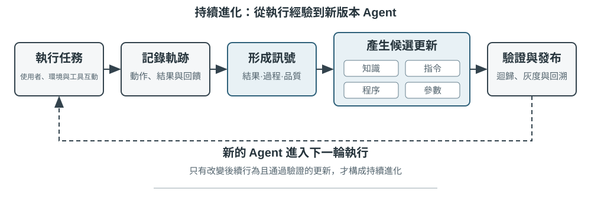

# 多模態與即時互動

前面的章節探討了 Agent 在文字世界中的設計——透過上下文、工具和程式碼與數字系統互動。然而，Agent 的互動物件不僅僅是文字和 API。當 Agent 需要聽懂使用者的語音指令、在螢幕上找到並點選正確的按鈕、或控制機械臂精確抓取物體時，它進入了一個全新的領域：**多模態即時互動**——從純文字輸入輸出擴充套件到**多模態感知與即時響應**，這是 Agent 跳出「對話方塊」的關鍵一步。所謂「多模態」，就是同時處理多種資訊形式——文字、語音、影象、影片、動作——而不只是文字。

先劃定本章的邊界。靜態的影象與文件理解——看一張截圖、讀一幅圖表、解析一份 PDF——已經作為感知工具自然融入了前面各章的 Agent 實踐：對今天的多模態大模型來說，這類「一次輸入、一次理解」的任務已相對成熟，不需要專門的架構設計。本章聚焦的是另一類問題：**即時性把多模態問題變難**的三個場景——語音對話、GUI 操作、機器人控制。在這些場景中，輸入是持續流動的、輸出必須在嚴格的時間預算內給出，架構設計因此發生質變。至於連續視覺流（影片）的即時理解，截至寫作時對 Agent 而言仍是開放問題——本章 Computer Use 部分討論的逐幀截圖侷限和章末思考題會再回到這個話題。還要劃清另一條邊界：多模態**生成**（生圖、生影片）在本書框架中只是普通的工具呼叫（第五章多媒體生成已涉及），Agent 把它當作一個外部工具來使喚即可，並不涉及本章要解決的即時互動難題，因此不在本章主線之內。

語音互動、Computer Use 和機器人操作看上去跨越三個完全不同的領域，但做起來會發現卡住的地方高度相似：都要同時處理多種模態的資訊，都對延遲極度敏感。語音停頓超過兩秒就讓人焦躁，機器人控制的毫秒級抖動可能導致碰撞。這兩個約束共同把三個場景推向同一個架構方向：從**序列流水線**（像工廠流水線一樣，一個環節做完才能交給下一個）走向**端到端模型**（一個統一的模型直接從輸入到輸出，省去中間的交接環節）。

本章按以下脈絡展開：

1. 先用「語音架構的三種正規化」搭起座標系——級聯（VAD-ASR-LLM-TTS 流水線）、端到端全模態（Omni，單模型但仍輪流說話）、全雙工（Moshi、GPT-Live，邊聽邊說），並沿「如何擺脫 VAD 的輪次假設」這條軸依次拆解每一環的延遲與取捨；其中級聯一節還會講如何用流式語音感知替代 VAD + ASR。
2. 再看思考架構如何調和「即時響應」與「深度思考」的矛盾：從快慢簡單並行，到後臺推理模型當「軍師」的解耦路線（GPT-Live 委派、Pine AI 等），再到 Step-Audio R1 把思考「內化」進單一模型的「邊想邊說」。
3. 然後討論更像人的語音合成對執行層的最佳化。
4. 最後把視角擴充套件到 Computer Use（讓 AI 像人一樣操作電腦螢幕）和機器人操作，看同樣的延遲與多模態問題在這兩個場景中如何表現。

其中要特別提示兩處偏理論、可跨場景遷移的重點：**思考架構**（快、慢兩套思考如何協作）以及由它衍生出的**快慢介面**（Latent Bridge，快慢模型之間除了文字還能傳什麼）。它們雖然從語音場景講起，卻不只服務於語音——後面的 Computer Use 與機器人同樣會遇到「何時該請一個慢軍師」的問題，值得讀者格外留意。

## 語音：最自然的人機介面

語音的價值不只是把文字換成聲音。正常說話的速度約為打字的四倍，而且不占用雙手與視線，因此很適合把 Agent 放進持續運作、隨時可能被打斷的輸入輸出迴路。語音輸入法把口述轉成文字；語音 Agent 則讓使用者直接與 Agent 協作。兩者都能支援前言提到的 whisper coding。

本節同時討論兩個方向：使用者對 Agent 說話，以及 Agent 代替使用者對外部世界說話。語音模型決定「能回答什麼」，互動架構決定「能否聽清楚、及時回應、自然交接發言，並在通話中完成確認與工具呼叫」。以下先討論互動時序，再討論認知時序與表達品質。

### 互動時序：從級聯到全雙工

OpenAI 在 GPT-Live 介紹中把語音互動概括為級聯、輪次式與全雙工三種範式[^ch9-12]。它們不是單純的新舊替代，而是在延遲、成本與可觀測性之間做不同取捨：

| 範式 | 核心結構 | 主要優勢 | 主要限制 |
| --- | --- | --- | --- |
| 級聯 | VAD → ASR → LLM → TTS | 模組清楚、容易替換與除錯 | 延遲累積，副語言資訊在介面處遺失 |
| 端到端 Omni | 一個模型聽、想、說 | 延遲較低，能保留語氣、情緒與環境聲 | 仍依賴輪次，訓練與除錯成本較高 |
| 全雙工 | 持續聽、持續說、持續決策 | 支援重疊說話、自然打斷與連續串流 | 模型訓練、控制與評估更複雜 |

三種範式的共同主線，是擺脫「必須輪流說話」的假設，以及 VAD 對發言權的猜測。級聯與 Omni 仍要劃分輪次；全雙工則把「誰該說話」變成模型持續做出的決策。

[^ch9-12]: OpenAI. *Introducing GPT-Live.* 2026-07-08. https://openai.com/index/introducing-gpt-live/。本節的「級聯／輪次式／全雙工」分類出自該文對 ChatGPT 語音三代演進的總結；文中的「端到端全模態（Omni）」對應「turn-based voice models」類別。

### 範式一 · 級聯流水線（Cascading）

大多數商用語音助理仍使用串行流水線（圖 9-1）：VAD 判斷使用者何時說完，ASR 把音訊轉成文字，LLM 理解並生成回覆，TTS 再把文字說出來。模組化讓每個元件可以獨立優化，但每個邊界都可能增加等待時間。



| 模組 | 作用 | 常見瓶頸 |
| --- | --- | --- |
| VAD | 判斷是否說完 | 靜音閾值造成等待與誤切分 |
| ASR | 音訊轉文字 | 識別延遲與上下文遺失 |
| LLM | 理解、思考與生成 | 首 token 延遲；啟用 reasoning 後等待更久 |
| TTS | 文字轉語音 | 首包合成與播放緩衝 |

對於未啟用 reasoning 的短回覆，VAD、ASR、LLM 與 TTS 的等待會串行累積（圖 9-2）。真實數值取決於輸入長度、模型、硬體、網路與負載。生產環境的排隊還會進一步放大空載延遲（圖 9-3）。


> **實驗 9-1 ★：建立傳統語音 Agent**
>
> 透過 WebSocket 串起麥克風、Silero VAD、本地 Whisper、串流 LLM 與 Fish S1 TTS，建立級聯基線。保留的真實單輪證據證明媒體與模型鏈路確實端到端運作；它不是並發或生產負載 benchmark。程式碼與驗收記錄見 [chapter9/live-audio](../chapter9/live-audio/)。

> **附加專案：使用 WebRTC 建立「呼叫使用者」的語音 Agent**
>
> 電話 Agent 不一定需要 PSTN。瀏覽器 WebRTC 就能重現建立會話、詢問缺失資訊、複述確認並保存結構化結果的閉環；若要聯絡外部機構，再把同一工具契約替換為合規的 PSTN/SIP 供應商。完整媒體鏈路、直接/ReAct 對照與驗收證據見 [chapter9/phone-agent](../chapter9/phone-agent/)。此專案保留歷史上的 \`exp9-2\` 執行識別，但不再占用正文實驗編號。

#### 從串行到串流感知

生產系統可保留模組分工，同時讓各階段儘早產出增量結果：ASR 在使用者說話時產生暫時轉錄，LLM 把第一段可播報文字立即交給 TTS，TTS 則持續返回音訊區塊。「每一級都串流」不代表三個模型從頭到尾完全並行；若依部分轉錄搶跑 LLM，後續文字改變時就必須取消、重啟或修正生成。

一般串流仍無法消除 VAD 的靜音等待。傳統 VAD + ASR 前端有三個問題：等待靜音造成**延遲累積**；有聲/無聲二值訊號造成**資訊遺失**；電子郵件、人名與專有名詞被分片則造成**上下文斷裂**。

真正的串流模型需要因果或分塊編碼器與增量解碼。Whisper 的解碼器雖然是自回歸的，但編碼器需要完整音訊片段，因此不能直接稱為因果串流模型。LLM 型串流聽覺模型可從連續音訊輸出文字與語義事件，保留對話上下文並利用世界知識；模擬分塊的耗時仍不能當成真正因果模型的效能承諾。

若只想判斷使用者是否說完，也可把端點判斷做進串流識別器。訓練標籤只能使用決策時刻可見的資訊，否則「上帝視角」會產生線上無法重現的判斷[^ch9-11]。模型除了文字，也能輸出 speak_start/end、interrupt、emotion、laugh、sigh 與 noise 等聲學事件標記。

[^ch9-11]: 關於把輪次判斷嵌入識別器，以及「標籤的上帝視角」問題，見 Li, Bojie and Noah Shi. *The Trade-off Was in the Labels: Causal Supervision for Turn-Aware Streaming ASR.* 2026（待發表）。

> **實驗 9-2 ★：使用 Qwen2-Audio 模擬串流語音感知**
>
> Qwen2-Audio 本身不是串流模型。本實驗以遞增音訊前綴模擬連續感知，並與 600 ms VAD + Whisper 對照。每個前綴都會重新編碼先前音訊，因此實測時間不能視為因果串流模型的效能承諾。
>
> canonical run 通過全部執行與溯源門禁，但只重現 2/6 項預期行為：遞增前綴呼叫實測 8.4–11.3 秒，pause 樣本漏報 \`silence\`，noise 樣本仍誤判為 \`cough/laughter\`。這個負結果適合檢查機制與失敗方式，不能支持「100–200 毫秒真串流感知」的主張。完整記錄見 [chapter9/streaming-speech](../chapter9/streaming-speech/)。

### 範式二 · 端到端全模態模型（Omni）

即使採用串流感知，級聯仍透過離散介面交接聽、想、說；音訊轉成純文字時，情緒、語調與環境聲可能遺失。Omni 用同一模型聽音訊、生成回覆並說出來，有機會保留這些訊號，但訓練、除錯與替換元件的成本更高（圖 9-4）。

端到端的優勢主要在延遲與非文字資訊，不必然帶來更高準確率。自級聯先用同一模型轉錄，再根據轉錄回答：當文字足以承載任務資訊時，它可能修正感知錯誤；當答案依賴語速、情緒或環境聲時，文字瓶頸會不可逆地遺失證據。關鍵不在於是否存在中間表示，而在於中間表示承載什麼資訊[^ch9-13]。Omni 仍假設輪流說話；串流感知只能改善端點判斷，無法取消輪次本身。

[^ch9-13]: 關於級聯與端到端準確率優勢何時逆轉，以及如何根據任務性質預測方向，見 Li, Bojie and Noah Shi. *The Cascade Gap: When and Why Self-Cascades Help Multimodal Agents.* 2026（待發表）。


即時語音 API 通常處於級聯與 Omni 之間：模型原生處理音訊，但互動控制仍依賴 VAD，並透過打斷與非同步工具呼叫改善體驗。值得比較的不是模型榜單，而是端到端與自級聯在不同任務上的失敗方式。

> **實驗 9-3 ★★：本地執行 MiniCPM-o 4.5——端到端與自級聯**
>
> 固定一個本地 MiniCPM-o 4.5 revision，關閉 thinking mode，比較直接從音訊回答與同模型自級聯（先轉錄、再回答）。這測量的是音訊資訊是否保留，**不是**後文的「邊想邊說」能力。
>
> | 任務類型 | 端到端 | 自級聯 | 觀察 |
> | --- | ---: | ---: | --- |
> | 語義算術（2） | 1/2 | 2/2 | 自級聯修正了一個轉錄錯誤 |
> | 副語言語速（2） | 2/2 | 1/2 | 純文字轉錄抹掉了快慢差異 |
> | 合計 | 3/4 | 3/4 | 總分相同，失敗位置互補 |
>
> 樣本很小，不能據此判定哪條路徑整體更準確或更快。完整硬體、版本、原始輸出與真實 audio-to-audio 證據見 [chapter9/end-to-end-speech](../chapter9/end-to-end-speech/)。

Step-Audio 2 展示了直接處理原始音訊、同時輸出文字與語音的端到端路徑；Step-Audio R1 進一步把思考能力內化到音訊模型中。

### 範式三 · 全雙工互動模型

Omni 仍把對話分成「使用者說」與「模型說」，但同聲傳譯等任務要求兩者重疊。全雙工模型不預設輪次，而是持續聆聽、持續說話，反覆決定繼續、停頓、打斷或呼叫工具。

Kyutai 的 **Moshi**（2024）是早期研究案例。Thinking Machines Lab 將這條路線稱為**互動模型（Interaction Model）**[^ch9-14]：互動性內建於模型，不再由 VAD 等外部 harness 拼接。微輪次機制以短音訊區塊推進，讓靜音、重疊與打斷保留在連續上下文中；它也能把完整對話委派給背景推理模型，同時維持話頭。

[^ch9-14]: Thinking Machines Lab, “Interaction Models: A Scalable Approach to Human-AI Collaboration,” 2026-05. https://thinkingmachines.ai/blog/interaction-models/

OpenAI 的 GPT-Live 將全雙工帶到生產規模：模型持續處理輸入並生成輸出，能等待、附和、被打斷，也能處理即時翻譯。這條演進線是：級聯靠靜音閾值猜測輪次，串流感知把判斷提升到語義層，全雙工則把切換本身變成持續決策。

### 認知時序：即時互動與深度思考

互動品質與智能上限是不同維度。前台模型要在使用者仍在線時回應；背景模型可花更長時間思考。以下三種設計是取捨，不是線性演進：

| 設計 | 前台 | 背景 | 主要風險 |
| --- | --- | --- | --- |
| 快速應付、慢速修正 | 先給即時答案 | 重新思考並補充 | 前後矛盾 |
| 快速互動、慢速建議 | 維持對話並決定措辭 | 提供建議或工具結果 | 介面受限 |
| 思考與表達統一 | 邊思考邊說 | 與表達共享模型狀態 | 訓練與替換成本高 |

#### 方案一：快思考應付，慢思考回答

快思考可在幾百毫秒內先給出應付回覆，慢思考在背景完成更深推導。簡單問題可能被處理兩次；複雜問題則可能前後矛盾，因為兩個實例各自獨立思考。


#### 方案二：快思考互動，慢思考建議

背景模型可透過狀態欄或專用介面傳送建議，前台模型維持對話並決定如何表達。通信仍是間接的：前台可能誤解建議，也看不到背景的中間思考，因此它能自然等待結果，卻不能真正邊想邊說。

#### 方案三：端到端統一思考與表達（以 Step-Audio R1 為例）

Step-Audio R1 的**模態錨定思考蒸餾（MGRD）**讓模型根據聲學特徵思考，**MPS 雙腦架構**則讓構思與表達並行。MPS 讓構思腦持續產出思考片段，表達腦把片段與已有回覆結合後立即生成語音，因此不必等待完整思考結束（圖 9-6）。


統一模型最直接地實現「邊想邊說」，但思考與即時表達必須一起重訓；解耦設計更容易替換背景大腦。兩者是取捨，不是簡單替代。

### 更像人的語音合成

傳統 TTS 過於流暢、幾乎沒有停頓，反而容易暴露機器身分。停頓、填充詞與偶爾重複，是人類表達不確定性與思考狀態的訊號。

主 LLM 除了文字也可輸出 **THINKING**、**EMO:happy**、**SPEED:0.8x** 等控制標記，由 TTS 映射為停頓、韻律、語速、笑聲與嘆氣。實作上可自研支援控制標記的 TTS，也可用 voice cloning 準備不同情緒與風格的參考音訊。

> **實驗 9-4 ★★：使用 Fish Audio 的控制標記驅動 TTS**
>
> 使用 Fish Audio S1 建立多參考音訊庫，比較無控制標記、單一參考音與多參考音三種設定。執行層根據標記選擇匹配的情緒、語速與風格。
>
> 多參考音設定在三次位置平衡的盲聽中得分最高（真人客服感 4.67/5），但完整預設排序沒有重現，因為無標記組高於單一參考音組。這表示表達控制有幫助，但不能把小型聽感研究當成普遍音質結論。完整的 24 條參考音訊、A/B/C 媒體與驗收記錄見 [chapter9/controllable-tts](../chapter9/controllable-tts/)。

## Computer Use：GUI 自動化 Agent

讀到這裡也許會注意到，本章給語音的篇幅明顯多於後兩個場景——這是有意為之。在即時多模態這條演進線上，語音是走得最完整、最值得當作參考系的一個：從「序列流水線延遲太高」這個問題出發，經過端到端、全雙工、邊想邊說等一系列方案，一直走到今天相對成型的終局，問題→方案→終局的全程都已經跑通。因此我們把它講透，接下來的 Computer Use 和機器人兩個場景，都可以對照語音這條脈絡來看——它們各自走到了這條演進線的哪一段、卡在了哪裡。

這三個場景看似不同，卻面臨相同的核心挑戰：即時感知、低延遲決策、持續互動。接下來看這些技術主題如何在視覺互動（Computer Use）和物理互動（機器人）中重現——首先把視角從聽覺模態擴充套件到視覺模態：如果 Agent 不僅能理解語音，還能「看懂」螢幕並操作圖形介面呢？

Computer Use（也稱 GUI 自動化 Agent）讓 AI 像人類一樣透過觀察螢幕、操作滑鼠鍵盤來使用軟體——比如開啟瀏覽器搜尋資訊、在表格軟體中填寫資料、或在系統設定中調整配置。其核心是**感知～思考～行動**的迴圈（圖 9-6）：

1. Agent 對當前螢幕截圖
2. 多模態模型接收截圖和任務指令，輸出一段思考和一個具體動作
3. 執行層在真實環境中執行該動作（移動滑鼠、點選、輸入文字等）
4. 等待介面響應後再次截圖，進入下一輪迴圈


這個迴圈中有三個關鍵設計維度：**動作空間**（Agent 能執行哪些操作）、**視覺定位**（如何在截圖中找到目標元素）、以及**模型架構**（如何從截圖生成正確動作）。

### 動作空間設計

Anthropic 定義三類工具構成完整的互動能力（圖 9-7）：


**GUI 操作工具**（computer tool）：滑鼠操作包括移動（mouse_move）、左/右/中鍵點選、雙擊/三擊、拖拽（left_click_drag），以及更精細的按下/鬆開（left_mouse_down/up）。滾動（scroll）支援四個方向並可配合修飾鍵。鍵盤操作包括逐字輸入（type，每個字元間隔 12ms 模擬真實打字）、組合鍵（key，如 Ctrl+C）、長按（hold_key）。感知動作：截圖（screenshot）、獲取游標位置（cursor_position）、等待（wait）。

**命令執行工具**（bash tool）：提供長久的 bash 終端機會話，120 秒超時，透過哨兵字串偵測命令是否執行完畢，多次呼叫之間保持環境狀態（比如 cd 到某個目錄後下次呼叫還在那個目錄）。

**檔案編輯工具**（str_replace_editor）：透過字串匹配實現安全編輯，支援檢視、建立、替換、插入和撤銷操作，比直接覆蓋整個檔案更精確，不容易誤改其他內容。

> **實驗 9-5 ★：執行 Computer Use（Anthropic 參考路徑或開放模型路徑）**
>
> 路徑 A 使用 Anthropic Computer Use Demo：容器打包完整的 Ubuntu 桌面環境（含瀏覽器、終端機等常用工具），前端接收任務，後端把指令與截圖傳送給 Claude，再執行模型返回的滑鼠、鍵盤、終端機或編輯動作。這條路徑用於理解原生 `computer` 工具協定，不要求所有讀者擁有 Anthropic API。
>
> 路徑 B 使用本書的 [`chapter9/computer-use-open-model`](../chapter9/computer-use-open-model/) companion：預設以開放權重的 Qwen3-VL 32B Instruct 驅動 browser-use，可透過 OpenRouter 託管 API，也可把 `OPEN_MODEL_BASE_URL` 指向自託管 vLLM/SGLang 或其他相容端點。端點必須接收截圖，並支援原生 JSON Schema；若只支援普通 JSON，可明確啟用 schema-in-prompt 相容模式。
>
> 兩條路徑使用同一唯讀任務和同一驗收契約：最多 25 步，每步只執行一個動作，保留模型/端點身分、原始供應商回應、逐步截圖、動作序列、最終答案和停止原因。模型不同就必須作為不同實驗臂分別報告，不能把開放模型的結果冒充 Claude 重現，也不能把「容器啟動成功」當成任務完成。動作間隔和規劃品質是實測結果，不預設為 2–5 秒或必然優於其他模型。
>

### 視覺定位（Grounding）

在迴圈的每一輪中，模型需要在截圖中準確定位目標元素——「搜尋框在哪裡？」「提交按鈕的座標是什麼？」這就是視覺定位（Grounding）問題。當前主要有**兩大思路**：一是把定位變成**選擇題**——先把介面元素標註好編號，模型只需從中選一個；二是**純座標預測**——讓模型像人一樣直接「看」著截圖報出座標。其中選擇題思路又有兩種實現方式：**純視覺標註**（原始的 Set-of-Mark，用分割模型在畫素上切出候選區域）和**結構化元素索引**（DOM/Accessibility Tree，直接讀取介面自帶的結構）。選擇題思路的共同優勢，是把開放式的「在截圖中找到按鈕並預測座標」轉化為封閉式的「從已標註好的元素中選一個」——就像考試中選擇題比填空題更容易答對一樣，模型只需說「點選 [123]」而不是「點選螢幕左上角偏右大約 200 畫素處的藍色按鈕」。

**Set-of-Mark：視覺標註法。**

原始的 Set-of-Mark（SoM）由微軟研究院於 2023 年提出，最初是為了釋放 GPT-4V 的視覺定位能力。它是**純視覺**方法：用影象分割模型（SAM、SEEM 等）在截圖上自動切出候選區域，為每個區域疊加編號標記，模型看到的是一張帶編號的圖，只需報出編號，由系統換算成對應區域的中心座標。整個過程不需要 DOM，也不需要任何介面內部結構，因此原生桌面軟體、遊戲介面同樣適用——只要分割模型能把候選區域切出來。

**結構化元素索引：SoM 思想在 Web 上的結構化實現。**

當介面本身能提供結構化資訊時，標註可以做得更精確。現代網頁在渲染之前就已經定義了完整的元素結構（DOM 樹）和語義角色（哪個是按鈕、哪個是輸入框），無障礙介面（Accessibility Tree）為許多桌面應用提供了類似的資訊。與其讓分割模型在畫素裡猜「哪個區域是按鈕」，不如直接問介面本身「你有哪些可以點選的元素？」。以 browser-use 專案為代表的 Web Agent 方案正是這樣做的：從 DOM 中列舉可互動元素並編號，可以看作 SoM 思想在 Web 上的結構化實現（圖 9-8）。流程分四步：

1. 透過瀏覽器除錯介面（CDP，Chrome DevTools Protocol）獲取網頁的結構化表示（DOM 樹）和無障礙資訊
2. 自動偵測哪些元素可以互動（按鈕、輸入框、連結等）
3. 為每個可互動元素標註唯一 ID 並在截圖上繪製邊界框
4. 同時生成文字列表描述每個 ID 對應的元素

```
Screenshot: [圖片中關鍵元素標註了 [1]、[2]、[3]、[4] 等 ID]

Elements:
[1] <input type="text" placeholder="Search" aria-label="Search" />
[2] <button id="submit-btn" aria-label="Submit form" />
[3] <input type="text" placeholder="Enter your name" value="" />
[4] <a href="/docs" aria-label="Documentation" />
```

模型只需要輸出一個 ID 號就行，系統自動用該元素的中心座標執行點選。這類方案不省 token（因為要把所有標註資訊都發給模型），但定位準確穩定，還免去了分割模型可能引入的漏檢和誤檢。


**純座標預測。**

第三條路線不做任何標註，直接讓模型輸出座標。以 **SeeClick** 和 Claude 的 computer use 為代表：在海量 GUI 截圖和元素位置的配對資料上訓練視覺模型，讓它學會將自然語言描述（如「點選提交按鈕」）直接對映到截圖中的精確座標——就像人類使用者一樣，純粹靠「看」來找到要點選的位置。

在座標預測方案中，模型對座標的理解高度依賴訓練時使用的解析度（圖 9-9）。Claude 訓練使用 XGA（1024x768）、WXGA（1280x800）、FWXGA（1366x768），如果輸入的截圖解析度不匹配，模型預測的座標就會系統性地偏移——就像在小地圖上量距離然後直接用到大地圖上一樣。因此，需要在工具層實現雙向座標縮放機制，而且要**按寬高比選目標解析度**，避免非等比拉伸把畫面壓變形、連帶把座標判斷也帶偏。例如，真實螢幕解析度為 2560×1440（16:9），就該在 Claude 支援的三檔裡挑一個寬高比同樣接近 16:9 的目標——FWXGA（1366×768）最匹配。截圖時把螢幕等比縮放到 1366×768 送入模型；模型輸出點選座標 (683, 384) 後，反向對映為真實座標 (683×2560/1366, 384×1440/768) ≈ (1280, 720)。反過來，若硬把 16:9 拉伸進 4:3 的 1024×768，畫面會被橫向壓扁，模型預測的座標就會系統性偏移。


三條路線的選擇邏輯可以概括為：**結構化資訊可得時，優先用 DOM/Accessibility Tree 索引**，定位最精確穩定；**不可得時**（原生桌面軟體如 Photoshop、Canvas/WebGL 渲染的介面、遊戲），**既可以用視覺標註（原始 SoM 路線），也可以用座標預測**。視覺標註把定位變成選擇題，對未經專門訓練的通用模型更友好；座標預測省去標註步驟，對做過 GUI 定位訓練的模型更直接。兩者在小元素和密集介面上的精度都仍有差距。

> **實驗 9-6 ★：使用 browser-use 實現自動瀏覽器操作**
>
> 基於 Playwright 瀏覽器自動化框架（一個用程式碼控制瀏覽器的工具庫），結合多模態大模型實現自然語言驅動的瀏覽器操作。啟用 SoM 視覺化模式，每次決策前儲存帶標註框的截圖。模型介面不限定為 OpenAI 或 Anthropic；本書提供 Qwen3-VL 開放模型 API 設定，並保留通用 OpenAI-compatible base URL 供其他託管服務或自託管推論使用。
>
> 測試任務「開啟 Google 查詢舊金山天氣」：系統啟動後截圖顯示 Google 搜尋頁面，互動元素被編號，模型選擇搜尋框、輸入「San Francisco weather today」、提交搜尋，再從結果頁提取溫度和天氣狀況。驗收時獨立核對答案與軌跡，並如實記錄實際步數和耗時；「5 步、約 20 秒」只能是某次執行的觀測值，不能在沒有回執時當成固定結果。
>
> 本書儲存的開放模型正式執行使用 OpenRouter 上的 `qwen/qwen3-vl-32b-instruct`。模型在 Google 搜尋第 4 步遇到 CAPTCHA 後沒有聲稱成功，而是轉到 weather.com，最終在第 16 步從 San Francisco 的 Today 頁面讀取 64°F、Sunny、體感 62°F、高 74°F、低 55°F。16/16 個 API 回應均報告請求的 Qwen3-VL 模型，15 張有效步驟截圖與唯讀動作軌跡通過獨立確定性驗收。這個結果證明開放模型 API 路徑可執行；它不等於 Anthropic 原生 `computer` 工具臂已經重現。

### 能看動畫、能聽聲音的 Computer Use Agent

到目前為止，Computer Use 的感知都建立在一個隱含假設上：**螢幕是靜止的**——截一張圖、想一步、點一下，再截下一張圖。可現實裡的螢幕會放影片、會彈出轉瞬即逝的通知、會播放會議裡的人聲。一個每 3–5 秒才睜一次眼、而且完全沒有耳朵的 Agent，對這些「兩幀之間發生的事」既看不見也聽不到。看錄屏、跟會議、聽語音提示、應付一閃而過的對話方塊——這一整類日常電腦操作，對今天的 Computer Use Agent 幾乎是禁區。

這裡真正該被重新設計的，不是「動作介面」，而是「**觀察介面**”[^ch9-9]。核心思想是把**觀察**（連續、適應性、多模態）從**動作**（離散）裡解耦出來，做成一層插在環境和任意現成 Computer Use 模型之間、無需重訓的感知中介軟體（可稱之為 Agent–電腦觀察介面，AOI）。它有三個」按需開閘「的部件：其一，**幀間關鍵幀捕獲**——先用一個極廉價的畫素門跳過幾乎沒變的畫面，再用一個小模型判斷畫面是否發生了有意義的變化，只在變化時才截一幀，靜止畫面下幾乎零成本；其二，**音量門控的語音轉寫**——有聲音時才呼叫語音識別，讓 Agent 第一次」長出耳朵「；其三，也是最關鍵的，**把畫面敘述成長久的文字**——讓模型把捕獲到的幀描述成一句話（」剛彈出的提示說釋出日期改到了 4 月 28 號「），並且**即使原圖之後被清理出上下文，這句文字仍留在記憶裡**，把動態資訊以文字形式帶著往下走。

一個反直覺的發現是：真正起作用的不是「選哪幾幀」，而是「**把幀敘述成能長期留存的文字**”——文字才是 LLM Agent 最擅長處理的模態。在從 7B 到前沿規模的八個模型上，這層中介軟體無需任何重訓就帶來 +17 到 +48 個百分點的提升，其中語音類任務的差距最懸殊：加了這層感知，Agent 能把原本」聽得見卻動不了「的語音任務都做出來。但它也不是一套包打天下的固定配置——在某些更新的模型上，塞太多影象 token 反而會擠佔推理、拖累表現，所以這些部件要**按模型逐個挑選**，而非一股腦全開。這與前面 Set-of-Mark 和座標預測的取捨是同一個道理：感知方案沒有銀彈，要順著模型的脾氣來配。

[^ch9-9]: 門控關鍵幀、按需轉寫、把幀敘述成持久文字這三個部件，完整機制與逐模型消融見 Li, Bojie and Noah Shi. *Agent-Computer Observation Interfaces Enable Dynamic Computer Use.* arXiv:2606.29472, 2026.

### 移動端：生態壁壘比技術更難

Computer Use 也在向移動端擴充套件。移動端與桌面在技術上確有差異：動作空間通常不再是「滑鼠座標 + 鍵盤」，而是接入系統的無障礙服務 API（如 Android 的 AccessibilityService）來讀取介面元素、下發點選與文字輸入；互動方式也從滑鼠指標變成觸控手勢，座標的語義隨之改變——同一個 (x, y) 到底是手指的單擊、長按，還是滑動手勢的起點，需要額外的手勢型別來界定。第六章介紹的 AndroidWorld 等移動端基準，正是在這樣的動作空間上評測 Agent 完成真實 App 任務的能力。

但真正卡住移動端的，往往不是這些技術差異，而是生態壁壘。曾有手機廠商嘗試在消費級手機中整合 AI 助手，讓它自動操作微信、淘寶、支付寶等日常應用，但很快遭遇平臺限制。

這揭示了 Computer Use 面臨的一個獨特挑戰：**生態壁壘**。封殺背後的根本原因是商業模式衝突。傳統網際網路應用的核心變現邏輯是**流量與注意力**：使用者刷資訊流時看到廣告，搜尋商品時追蹤推薦演算法的引導，瀏覽頁面時產生衝動消費。而當 Agent 代替使用者操作時，這條變現鏈路被徹底繞過：AI 不會關注廣告，也不會衝動消費，直奔目標完成任務就走。對於靠廣告和流量變現的平臺來說，Agent 的每一次操作都在侵蝕其商業模式的根基。

這意味著 Computer Use 面對的不僅是 CAPTCHA（驗證碼）等技術層面的對抗，更是**結構性的利益衝突**。這一矛盾在短期內難以調和，也讓 Computer Use 在消費級場景中的落地面臨比純技術問題更棘手的挑戰。

### 即時性：尚未解決的核心挑戰

**OSWorld**（第六章詳細介紹了其評估方法）是廣泛使用的 Computer Use 評估基準，在真實 Ubuntu/Windows/macOS 環境中測試 Agent 完成跨應用任務的能力。早期通用模型在該基準上的成功率只有兩成左右，後續專用模型和更強通用模型持續把準確率推高，截至寫作時已逐步接近人類水平。但準確率遠非終點——真正的瓶頸已經從「能不能做對」轉向了「能不能做快」。

**OSWorld-Human** 效率研究揭示了一個扎心的事實：即使任務最終成功，Agent 完成同樣任務需要的操作步驟仍明顯多於人類，而且每一步的推理延遲會隨著任務推進持續增長——上下文越長，模型決策越慢，後期步驟的耗時往往遠超前期。一個人類幾十秒就能完成的文件格式調整，Agent 可能要磨蹭數分鐘才能搞定。**準確率達到人類水平不等於實用——效率才是真正的瓶頸。**

效率問題的根源與語音場景類似：序列的「截圖～思考～點選」迴圈中，即使每個環節都最佳化到極致，一步步累積的延遲仍然難以接受。更深層的問題是：目前的 Computer Use 完全不會「提前想」。如果 Agent 能在執行當前動作的同時預測下一步該做什麼——比如在等頁面載入時就想好接下來要點哪裡——就可以把思考和執行的時間重疊起來，大幅降低總延遲（這正是本章前面語音場景裡「邊想邊說」、以及第四章「持續思考」式非同步 Agent 的同一訴求，只是這裡換成了「邊想邊操作」）。

與語音領域不同的是，Computer Use 自身的即時性——把「截圖～思考～點選」這個迴圈本身變快——目前還沒有系統性的解決方案，它仍停留在逐幀截圖的離散迴圈中。但有一條繞過它的思路已經跑通，用的正是本章反覆出現的快慢解耦：既然讓慢的電腦操作 Agent 變快很難，那就**別讓使用者去幹等它**。把「說話」和「操作電腦」拆成快慢兩套模型並行執行[^ch9-10]——一個小模型（快）負責即時語音對話，一個前沿 VLM（慢）在瀏覽器裡一步步操作，兩者之間只靠一份極簡的「純文字契約」溝通：慢 Agent 每次操作都附帶一句滾動更新的狀態摘要（「正在填表單，還需要你的出生日期」），快 Agent 據此即時回答使用者、並把使用者口頭給出的新資訊轉達給慢 Agent，而且**在狀態摘要確認完成之前，快 Agent 絕不許說「辦好了」**。這正是「一邊打電話說話、一邊讓電腦自己操作」的場景。實驗裡，這套解耦讓語音回應比「單模型邊操作邊說話」快了約 15 倍（中位延遲 0.58 秒 vs 8.64 秒），而任務成功率不降；一旦抽掉那條快慢之間的文字通道，成功率立刻塌到 0——因為使用者口頭給的關鍵資訊再也傳不到瀏覽器裡了。這和前面 Latent Bridge、以及語音場景裡「邊想邊說」是同一套思路：當一個環節天生慢，就讓另一個快的環節把使用者的等待填滿——只不過那份「純文字契約」，本質上就是本書從第二章講到現在的 Agent 狀態列。Computer Use 迴圈本身的提速或許仍是下一個重要的研究方向，但「用快慢解耦把『慢』藏起來」已經是可用的答案。

[^ch9-10]: 語音～操作快慢解耦與「純文字契約」的完整設計見 Li, Bojie and Noah Shi. *Talking While Acting: Real-Time Voice for Slow Computer-Use Agents.* 2026（待發表）。

## 機器人操作：從即時控制到訓練與泛化

> **本節五個實驗始終使用同一個任務：把紅色杯子放進托盤，把黃色廢紙放進垃圾盒，最後重新觀察並確認桌面狀態。真機與模擬分開報告，但動作語義和成功條件完全一致。**
>
語音 Agent 在聽覺模態中面對延遲，Computer Use 在視覺模態中面對延遲，而當 Agent 需要控制物理世界的機器人時，延遲和多模態的挑戰被進一步放大——動作的後果是不可逆的，一次碰撞就可能損壞物體或機器人本身。本節先看機器人如何用雙層架構和動作分塊把即時控制問題壓下去，再順勢轉到它當下更硬的骨頭——訓練與泛化：資料怎麼來、模型怎樣跨任務跨平臺遷移。

### 硬體不是瓶頸，演算法才是

機器人在通用開放場景中還沒有得到廣泛應用，瓶頸到底在硬體還是演算法？XLeRobot 專案給出了一個有力的反證：成本不到 1000 美元的雙臂輪式機器人，在人類透過 VR 頭顯遠端操控（遙操作）時，已經能流暢完成大量家庭任務。更復雜的、需要靈巧手的家庭任務，宇樹的機器人在人類遙操作下也能流暢完成。遙操作延遲大約 100-200ms，已接近物理互動的響應要求。感測器解析度、執行器精度、控制頻率（機器人每秒更新動作指令的次數，頻率越低運動越不流暢、越容易出現抖動或偏離目標軌跡）在當前的低成本平臺上已經足以支撐實用任務。

需要給這個論斷劃清邊界：遙操作反證真正能說明的，是「現有低成本硬體加上人類的智慧，足以完成**這類以視覺回饋為主的家庭操作任務**」。它並不意味著硬體在所有維度都過關——觸覺感測的缺失、靈巧手的可靠性與成本，至今仍是公認的硬體短板；一旦任務重度依賴精細的力控與觸覺回饋，硬體就未必不是瓶頸。因此下面說的「硬體不是瓶頸」，都限定在本節討論的這類任務範圍內。

就這類任務而言，真正的鴻溝在演算法層，下面兩個小節分別展開。

> **實驗 9-7 ★：以 XLeRobot 遙操作整理桌面**
>
> **目的:** 在真實 XLeRobot 上由人類遙操作，完成同一個多步驟桌面整理任務並確認狀態。
>
> **原則:** 幾百美元級的機械臂透過人類遙操作就能完成這項任務；對這個任務而言，硬體本體不是瓶頸，差距在感知、規劃、閉環控制和失敗恢復。
>
### 雙層架構：規劃與控制的分離

機器人完成複雜家庭任務需要在兩個不同的時間尺度上做決策。第一層是較慢的**長程規劃**（long-horizon planning）：把「把桌面打掃乾淨」這樣的高層指令拆解為子目標序列（清理檯面、裝載洗碗機、擦拭表面），需要理解環境語義、推理任務依賴、規劃多步行動方案——就像人在動手之前先想想「先幹什麼後幹什麼」。第二層是較快的 **VLA 控制**（Vision-Language-Action，視覺～語言～動作模型）：執行每個具體操作（「走到水槽前」「拿起抹布」「擦拭檯面」），根據當前看到的畫面和語言指令持續輸出控制訊號，讓機器人的動作流暢連貫。

這種雙層架構將複雜度有效分離：長程規劃負責「做什麼」，VLA 控制負責「怎麼做」。這種「高層慢決策 + 底層快執行」的雙層架構，與前文語音場景中的「快慢思考」在結構上高度相似——都是將複雜思考與即時響應解耦到不同模組中。需要提醒的是，這裡的「規劃 / 控制」對應的是快慢思考裡「慢的深度思考 / 快的即時響應」這一維度的解耦，而不是方案三 MPS「構思腦 / 表達腦」那種「思考 / 表達」的解耦——後者拆的是「想」與「說」，前者拆的是「謀劃全域性」與「即時執行」，兩種「雙 X 架構」切分的維度並不相同。

不過即時性並沒有憑空消失，而是被下推到 VLA 控制層，靠**動作分塊**（Action Chunking，見下文「VLA 控制」一節）來攤薄：模型一次推理生成未來一小段動作序列，控制執行緒高頻重播，把單次推理的延遲攤進整段動作的執行時間裡。但這裡有個繞不開的權衡——分塊是拿反應性換平滑性：塊越長，每次推理的延遲被攤得越薄、運動越連貫，可模型在這段時間裡「看不到」新畫面，對突發變化（物體被挪走、有人伸手擋住）也就越遲鈍。即時性與平滑性之間的這道取捨，是雙層架構沒有消除、只是轉移了的部分。

這裡也需要交代本章主線的一個轉向：在機器人場景中，即時性矛盾已經被雙層解耦和動作分塊部分緩解，當前的主要矛盾轉移到了**訓練與泛化**——如何獲得足夠的演示資料、如何讓模型跨任務跨平臺泛化。接下來幾個小節正是圍繞這條新矛盾展開的，這也是第六章模擬環境與第七章強化學習的主題在物理世界的延伸。

而這條新矛盾主要壓在 VLA 控制層上。可以把 VLA 看作 「VLM + 動作輸出」：**VLM**（Vision-Language Model，視覺～語言模型——能同時理解影象與文字的大模型）負責「看懂」和「想清楚」，VLA 在此基礎上還要「動手」，真正的挑戰正在於「動手」這一層。當前 VLA 控制層主要透過模仿學習（行為複製）訓練——直接從大量人類演示中學習「看到什麼就做什麼」（OpenVLA、RT-2、π₀ 等均屬此類）；強化學習則是近年來在其之上的補充手段。用強化學習訓練的 VLA 雖然能在單個任務上表現很好，但往往泛化能力不足：即使如第七章 SimpleVLA-RL 在 LIBERO 上報告了很高的單任務結果，也是針對每個任務分別做 RL 訓練的，而非一個統一模型零樣本泛化到所有任務。這種「一個任務訓練一次」的模式意味著每遇到新任務，還得重新收集資料、重新訓練。

以下兩節分別深入討論長程規劃和 VLA 控制的具體技術方案。

### 長程規劃：從 VLM 到專用具身思考模型

通用 VLM 已經具備不錯的具身思考能力。Google DeepMind 的 **Gemini Robotics-ER 1.5** 專門針對具身思考（Embodied Reasoning，即理解物理世界中物體的位置、運動和因果關係）做了最佳化，在 15 個學術基準（Point-Bench、RefSpatial、RoboSpatial、BLINK 等）上平均 62.8%，超過 GPT-4o（60.6%）和 Gemini 2.5 Pro（59.3%）。核心優勢包括：高階空間理解與物體定位、時序推理（預測「如果推倒這個杯子會怎樣」這類動作因果）、任務編排（把高層指令分解為小步驟），並原生支援思考（thinking）機制和工具呼叫。[^ch9-2]

[^ch9-2]: Google DeepMind, “Gemini Robotics-ER 1.5” . https://deepmind.google/models/gemini-robotics/gemini-robotics-er/

> **實驗 9-8 ★：在模擬器測量同一任務的理想控制上限**
>
> **目的:** 用不會在感知或動作選擇上出錯的理想控制器執行同一任務，建立可重複的上限。
>
> **原則:** 這是決策永遠正確時的參考線，不代表真機已經執行。
>

> **實驗 9-9 ★★：以 Gemini Robotics-ER 1.5 自主控制真實 XLeRobot**
>
> **目的:** 讓 Agent 取代人類，觀察桌面並呼叫受限的 pick、place、verify 技能，同時維持 9-7 的真機、任務和成功條件。
>
> **原則:** 直接比較揭示的是感知、規劃、時機、閉環控制與失敗恢復的差距，而不是新的機械限制。
>

### VLA 控制：從演示資料到跨具身泛化

在雙層架構的執行層，RT-2、OpenVLA、π₀ 三個代表性模型都專注於 VLA 控制——即根據攝影機畫面和語言指令即時輸出機器人的動作（圖 9-10）。它們在動作表示上分屬兩條路線：離散動作 token 與連續軌跡生成。


**RT-2 與 OpenVLA：離散動作 token 路線。**

**RT-2** 開創了這條路線：直接在大規模視覺～語言模型上微調，把機器人的連續動作離散化為 token，像生成文字一樣逐個自迴歸輸出，藉助預訓練模型的泛化能力提升對新物體和新指令的零樣本遷移效果。**OpenVLA** 沿襲了 RT-2 的動作表示方案，將語言模型和視覺編碼器統一在一個架構中，輸入影象和文字指令，輸出動作 token。訓練分兩階段：先在大規模跨平臺資料集 Open X-Embodiment（涵蓋 20 多種機器人平臺的真實操作演示）上做預訓練，學習通用的操作知識（「抓取」「放置」等動作模式在不同機器人之間是相通的），再針對特定平臺用少量資料微調。既然動作表示本質相同，兩者的真正差異就在開放性與工程選擇上：RT-2 及其訓練資料是 Google 內部的，OpenVLA 則完全開源——開源骨幹模型（Llama 2 加視覺編碼器）配公開資料集，讓整個社群第一次可以在其基礎上覆現和改進。

**動作分塊：VLA 領域通用的頻率補償技術。**

由於 LLM 推理有延遲，VLA 的控制頻率遠低於傳統機器人控制的要求（傳統機器人控制通常要求 50-1000Hz 的控制頻率，而 VLA 單次推理只有約 1-10Hz——差距可達兩個數量級）。原版 OpenVLA 正是這個問題的典型代表：它每次推理只輸出一個動作（約 6Hz 的單步自迴歸預測），動作卡頓恰恰是它被詬病的主要短板。**動作分塊**（Action Chunking）就是為彌補這個差距而生的通用技術——最早由 ACT（Zhao et al., 2023）提出，後被 π₀、OpenVLA-OFT 等廣泛採用：模型每次推理不是隻輸出一個動作，而是一口氣生成未來一小段時間的動作序列（以 π₀ 的典型配置為例，一次生成約 0.5-1 秒的動作塊，在 50Hz 控制頻率下即 25-50 個動作），控制執行緒按高頻依次執行，同時模型在後臺非同步生成下一批。只要模型的推理時間小於這批動作的執行時間，機器人就能保持連續流暢的運動——就像影片緩衝一樣，提前載入好後面的內容，播放就不會卡頓。

**π₀：連續軌跡生成路線。**

動作表示的真正分野，不在 RT-2 與 OpenVLA 之間，而在**離散 token 與連續軌跡生成**之間。**π₀** 代表後一條路線：不再逐個預測離散動作 token，而是用 flow matching（流匹配，一種與擴散模型同源的連續生成方法）從隨機噪聲出發、經多步迭代「去噪」，直接生成一段平滑連續的動作軌跡。這種表示天然與動作分塊結合，在靈巧操作等對動作精度和流暢度要求高的任務上表現更好。打個比方：離散 token 路線像從選單中逐步選擇「向左 5 度」「向前 3 釐米」，連續軌跡路線像畫家先勾出整條曲線、再逐筆修正成型。

### Sim2Real Transfer：從模擬到現實的鴻溝

第六章的模擬環境一節已經講清 sim-to-real gap（現實差距）的來源，以及領域隨機化（domain randomization）應對它的原理，這裡不再重複——一句話概括：模擬無法完全還原真實的物理、視覺與硬體特性，訓練時便把這些引數大範圍隨機打亂，逼策略學出一套對各種變化都穩的通用表徵（圖 9-11）。下面只看這套原理在真實機械臂上如何落地。


這條路線已有不少成功案例：OpenAI 的機械手靈巧操作（Dactyl 專案實現手內方塊重新導向，其後續工作又藉助自動域隨機化 ADR 實現了單手解魔方）和 ETH Zurich 的 ANYmal（四足機器人在雪地、碎石等複雜野外地形上魯棒行走）都屬此列。

本章真正要補的，是把領域隨機化落到真機時繞不開的兩個工程環節。其一是**隨機化範圍的標定**：範圍不能拍腦袋定，太窄覆蓋不了真實變化，太寬又會增大訓練難度、學出「什麼都能應付但什麼都不精」的次優策略。實踐中通常先從真實環境資料裡**實測標定**關鍵引數的分佈（如摩擦係數、電機響應延遲的真實分佈），在該範圍內取樣；若模擬訓練的策略在真機上明顯掉點，再逐步擴大隨機化範圍，直到 sim-to-real gap 收斂到可接受。其二是**視覺對齊**：精確校準模擬與真實的攝影機位姿（環境對齊），並把真實拍攝的背景隨機替換進模擬渲染（greenscreen 背景替換），讓模擬畫面儘量貼近真機所見——這兩步實驗 9-9 會具體演示。

> **實驗 9-10 ★★：在模擬器比較三種自主閉環**
>
> **目的:** 保持任務和工具一致，比較開環執行、逐步檢查，以及使用短期預測的策略。
>
> **原則:** 逐步檢查能從局部失敗恢復；世界模型在預測符合現實時繼續，偏離時重新規劃。最終狀態一律由新的觀察確認。
>

> **實驗 9-11 ★★★：同一任務的 RGB 跨環境測試**
>
> **目的:** 改變背景、物體外觀、光照和視覺雜訊，檢驗模擬中學到的視覺策略能否適應新畫面。
>
> **原則:** 增加視覺多樣性有助於提升跨環境穩健性，但不能取代真機校準和完整安全閉環。
>

+## 2026 更新：串流規劃與世界模型

機器人部分不應只停在「VLM 寫出計畫、VLA 執行計畫」。以**整理桌面**為例，長程規劃器先建立狀態清單：半杯水、廢紙、三本書、打開的筆電、垃圾桶與收納盒，再輸出帶有前置條件和完成檢查的命令：

1.「移動到桌前，在距離桌沿 30 公分處停下。」
2.「把兩張廢紙放入垃圾桶，確認桌面沒有剩餘紙屑。」
3.「保持杯子直立並放到托盤；如果液體晃動就降低速度。」
4.「合上筆電並移到左後方，不要拉扯電源線。」
5.「按大小疊好書本，把筆放入收納盒。」
6.「確認易碎物和通電設備都已移開後，再擦拭桌面。」
7.「後退一步重新觀察，核對最後狀態。」

這是一張依賴圖，而不是一段散文。如果使用者說「先把筆電收起來」，系統更新目標優先級。如果杯子倒了，機器人在安全點停止，記錄 cup.orientation=fallen、laptop.at_risk=true，使失效的計畫後綴作廢，再重新規劃：保護筆電、控制液體、重新觀察，只恢復未受影響的任務。已驗證的動作不會重複；緊急事件取消目前的 action chunk，一般更新則等待下一個安全點。

### 串流執行

規劃與執行可以重疊。安全前綴確認後，規劃器一邊繼續產生後綴，一邊把完整 command 串流給執行器：

~~~json
{"type":"command.commit","seq":12,"command_id":"desk-02","command":"put paper in bin","preconditions":["paper.visible","bin.reachable"],"success":"paper_count=0","cancel_at":"before_grasp"}
~~~

執行器回傳 started、succeeded、cancelled 或 failed；規劃器以這些觀察更新依賴，當佇列過滿或命令已過時時施加 backpressure。串流執行縮短的是第一個安全動作的等待，不代表可以執行不完整 JSON 或未驗證的模型思考。

### 為什麼目前 VLA 的泛化有限

OpenVLA 並非只更新 projector；原始研究也比較了完整微調、凍結視覺編碼器、只訓練最後一層及 LoRA。真正的結構性問題仍存在：龐大的文字／影像預訓練資料，透過狹窄的適配通道連接到少量機器人資料；低成本適配時，新增行為常被集中到 projector、LoRA 模組或 action head。行為克隆學到的是「觀察 + 指令 → action chunk」，而不是反事實的物理後果。具身專屬動作空間與過時的動作分塊也限制了跨機器人遷移。

### 世界模型

世界模型學習可行動的狀態轉移：狀態 + 候選動作 → 預測的未來狀態 → 選擇並驗證動作。它不只是 V-JEPA：還包括潛表示預測模型（V-JEPA 2）、互動式生成模型（Genie 3、Cosmos）、World-Action Model（GeniWorld、Robust-WAM）、從無標註影片學習潛在動作（LAWM-3D），以及模型式強化學習（Dreamer、MuZero）。它讓系統能從大規模觀察學習，在執行前比較反事實動作，將共享動力學與具身專屬控制分離，並在預測與現實不一致時重新規劃。

2026 年預印本正研究共享動力學先驗與具身專屬 action head（DyPES-VLA）、分布外閉環操作的視覺動作表示（GeniWorld）、從人類影片學習 3D 潛在動作（LAWM-3D）、語義未來對齊（Robust-WAM）及即時非同步部署。這些是值得追蹤的研究結果，並非已經解決泛化。

## 本章小結

三個場景表面差異懸殊，但延遲和多模態這兩道坎始終如影隨形。語音已走出了一條從序列流水線到端和全雙工、從分離的快慢思考到「邊想邊說」的演進路徑；Computer Use 在 OSWorld 等基準上的準確率已接近人類水平，但操作步驟明顯多於人類、步驟耗時隨任務推進不斷增長的效率差距還沒有系統性的解法；機器人在以視覺回饋為主的操作任務上，瓶頸已從硬體轉到 VLA 控制層的跨任務泛化能力（觸覺、靈巧手等仍是尚未攻克的硬體短板）。下一章會把視角拉到多個 Agent 之間的協作，那是另一個維度的挑戰。

## 思考題

1. ★★ 語音 Agent 的端到端模型將 ASR-LLM-TTS 合併為單一模型，降低了延遲卻失去了模組化。如果端到端模型在某個環節（如語音識別）出錯，除錯和修復比序列管道困難得多。你會如何設計端到端語音 Agent 的可觀測性（observability）系統？
2. ★ Step-Audio R1 透過 MPS 雙腦架構實現「邊想邊說」。但人類在「邊想邊說」時經常會說出未經深思熟慮的話、自我糾正、或使用填充詞。Agent 的「邊想邊說」應該模仿人類的這些特徵嗎？
3. ★★ SoM（Set-of-Mark）及其結構化變體（DOM 元素索引）將 Computer Use 的視覺定位從開放座標預測轉為封閉 ID 選擇，但都需要先偵測和標註介面元素——無論靠分割模型還是靠 DOM。如果介面包含非標準控制元件或動態變化的元素，標註就可能不完整或不準確。這種情況下應該回退到座標預測嗎？
4. ★★ XLeRobot 等千美元級機器人平臺讓遙運算元據收集變得廉價。但遙運算元據的質量高度依賴操作者的技能。一個不熟練的操作者提供的資料會如何影響 VLA 模型的訓練？如何在資料收集階段自動篩選低質量資料？
5. ★★★ 本章覆蓋了語音、Computer Use 和機器人三種互動形態。這三種形態的共同趨勢是從序列管道向端到端模型演進。如果這種趨勢繼續，五年後的 Agent 互動層會是什麼樣的？
6. ★★★ 當前 Computer Use 以「截圖 → 動作 → 截圖」的離散迴圈運作，每次觀察都是一張靜態幀。但人類對螢幕的感知是連續的——我們能看到動畫播放、觀察載入進度、理解影片內容。這意味著今天的 Computer Use 根本無法處理需要時序視覺理解的任務。如何重新設計感知層以支援連續的視覺流理解？
7. ★★ DOM/Accessibility Tree 元素索引在標準 Web 應用上效果顯著，但越來越多的軟體介面（Canvas/WebGL 渲染、跨平臺自繪控制元件）不提供可訪問的結構化資訊，只能依靠視覺標註或座標預測。你認為 Computer Use 應該押注純視覺路線，還是同時維護結構化和視覺兩條路徑？維護兩條路徑的成本和收益分別是什麼？
8. ★★ VLA 模型採用動作分塊（action chunking）——如正文所述，π₀ 的典型配置是一次生成 50Hz 頻率下 25-50 個未來動作——將推理延遲隱藏在執行時間裡。但如果執行過程中環境突變（如物體被移走），預生成的動作序列就會失效。如何在動作分塊的效率優勢和環境變化的響應速度之間取得平衡？
9. ★★★ 本章的三個場景（語音、Computer Use、機器人）都面臨「感知～思考～行動」迴圈的延遲問題，都朝著快慢思考並行化的方向演進。在語音場景中，這表現為「說錯了再糾正」；在 Computer Use 場景中，這表現為「先點再看」；在機器人場景中，這表現為「走一步看一步」。如何保證這些基於快思考的行動不會導致無法挽回的後果？
